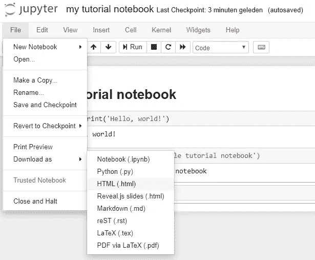
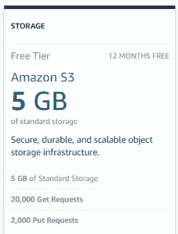

# 如何在线发布 Jupyter 笔记本——10 分钟内使用 AWS！

> 原文：<https://towardsdatascience.com/how-to-publish-a-jupyter-notebook-online-using-aws-in-10-minutes-7f87f2b0cc50?source=collection_archive---------15----------------------->

无论您是在构建您的数据科学组合，还是需要与同事或朋友共享资源，了解如何在 AWS 上在线发布 Jupyter 笔记本都非常重要。

## 期待结果

在本文结束时，您将拥有一个可以通过互联网访问的 Jupyter 笔记本，网址如下:

Example result of this tutorial

# 步骤 0:创建 AWS 帐户

首先，你需要一个 AWS 账户。在这里设置[非常容易。拥有一个账户是免费的，因为你为你使用的服务付费。](https://aws.amazon.com/)

对于新帐户，AWS 在第一年给予巨大的折扣，称为免费层，本文中介绍的所有内容都是免费的。如果你是一个有经验的 AWS 用户(没有免费层)，你将为你的笔记本支付少量的流量。详见本文下面的免责声明。

对了，我和 AWS 没有隶属关系:我就是喜欢这种做法，所以想在这篇文章里和大家分享一下。

# 步骤 1:将 Jupyter 笔记本另存为。html 文件

为了使您的笔记本可以在线访问，您需要将其导出为 HTML 文件。HTML 是静态网站的语言，它将被 AWS 认可。

> 为了使您的笔记本可以在线访问，您需要将其导出为 HTML 文件。

*   在 Jupyter 笔记本上，当你的笔记本准备发布时，进入*‘文件’→‘下载为’→‘HTML(。html)'*

Save your Jupyter Notebook as HTML

*   使用网站 URL 可接受的名称(避免空格和某些字符)将 HTML 文件保存在您记得的位置。

# 步骤 2:创建一个 S3 存储桶

在 AWS 中，我们将使用 S3 服务。S3 是 AWS 服务，允许文件存储和建立静态网站。我们使用它是因为它很便宜并且很容易安装。

> S3 是 AWS 服务，允许文件存储和建立静态网站。

S3 的所有东西都用所谓的水桶。存储桶就像一个文件夹，你可以把你的文件放在里面。要与 S3 合作，你必须做一个桶，让我们开始吧:

*   转到 aws.amazon.com 并登录 AWS 管理控制台。
*   在“服务”下拉菜单中，单击 S3

Navigate to S3

*   在 S3 菜单中，点击“创建铲斗”,将出现以下菜单:

Create an S3 bucket

*   作为一个桶名，注意使用一些适当的东西，因为它将是你的 URL 的一部分！作为一个地区，采取一些接近你的网站访问者会在哪里(虽然这并不重要)。然后单击下一步。
*   现在，他们会询问您的访问偏好。我们希望给予每个人访问权限，因为每个人都应该能够通过互联网访问您的笔记本。

Give everyone access to your website

*   在下一个屏幕中，单击 next 并创建 bucket。

# 步骤 3:将您的 bucket 配置为静态网站

S3 服务可用于制作静态网站，但也经常用作文件存储。

就访问权限而言，文件存储和网站托管并不完全相同:在网站上，你希望每个人都可以访问，而对于文件存储，你可能希望将访问权限限制在选定的一组人。

在本例中，我们希望托管一个静态网站，因此有必要按如下方式指定此 S3 存储桶的属性:

*   你的。html 笔记本实际上是所谓的静态网站，我们需要通过“属性”→静态网站托管来指定

AWS S3 Console

*   在*“静态网站托管菜单”*中，将*“索引文档”*设置为您的 HTML-notebook 文件的确切名称。

S3 Static Website Hosting

*   在这个菜单的顶部，你可以看到“端点”，这是你可以访问你的网站的终点。所以你最后会需要它。点击*‘保存’*继续。

# 步骤 4:上传您的笔记本

最后一步是将你的 HTML 笔记本上传到你的桶中。这样做很容易:

*   在*“概览”*菜单中，点击*“上传”*，然后拖放您的。步骤 1 中的 html 文件。
*   在*‘设置权限选项卡’*中选择*‘授予公共读取权限’*

AWS S3 access permissions

*   保留其他设置，单击下一步，然后发布。

# 仅此而已！您现在可以分享了！

只需在任何浏览器中使用步骤 3 中的 URL 即可查看您的笔记本。

Our Jupyter notebook is online!

**祝贺您，现在全世界都可以访问您的文件了！**

免责声明:
除非你有很大的流量，否则这种方法是免费的，如果你在 AWS 免费层(你的 AWS 帐户的第一年)，并且在第一年后有一个非常小的月费。我与你分享这种方法，因为我喜欢它。我和 AWS 没有任何关系，有很好的替代品，例如 GitHub pages 或 GitHub Gists，或者任何其他云提供商。无论使用这种方法还是其他方法，我都不接受 AWS 上发生的任何费用的任何责任或义务。

AWS source of billing information

非常感谢您的阅读，敬请关注更多精彩的数据科学文章！