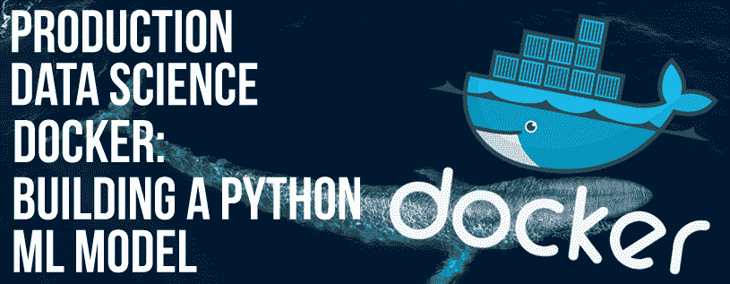

# 如何将你的机器学习放入 Docker

> 原文：<https://towardsdatascience.com/how-to-put-your-machine-learning-in-a-docker-6b372849fa93?source=collection_archive---------15----------------------->



你是一名数据科学家，你了解业务问题，你收集数据，执行一些功能工程，并提出了一个惊人的机器学习模型，可以在本地 IDE 上很好地预测东西。

但是接下来呢？

换句话说，如何将您的模型部署到生产环境中，或者轻松地与其他人共享，以便他们可以在本地 PC 上运行和评估它，并在**看不见的数据上运行，**无需安装任何库、依赖项、图形界面(IUPython、Jupyter Notebook..)，或者查看您的代码。

Docker 是这个问题的答案之一，因此，我们将在接下来的段落中看到如何将你的模型包含在一个 **Docker** 中，并将其分发给其他人。

在这个例子中，我们将使用一个简单的**线性回归模型**。

让我们从启动我们的库开始:

```
import warnings
warnings.filterwarnings(**"ignore"**, category=FutureWarning)

import sys
import pandas as pd
from sklearn.linear_model import LinearRegression
```

之后，我们将需要导入数据:
**训练数据:**我们的模型将从中学习的数据。
**测试数据:**将由任何需要根据**看不见的数据评估你的模型的人引入。**

测试数据和训练数据应该有，很明显，与**外形相同的**。

```
TestData = sys.argv[1]
# Read the data that will serve for training and the test data
X_full = pd.read_csv(**"TrainingData.csv"**, index_col=**'x001'**)
# Read the data that will serve for testing
X_test = pd.read_csv(**TestData**, index_col=**'x001'**)
```

我们将把目标数据从整体数据中分离出来:

```
#separate target from predictors in both training and test data
y = X_full.y
y_test=X_test.y

X_full.drop([**'y'**], axis=1, inplace=True)
X_test.drop([**'y'**], axis=1, inplace=True)
```

然后，我们将应用我们的模型:

```
 model=LinearRegression()
model.fit(X_full,y)
preds = model.predict(X_test)
```

接下来，我们将把预测输出结果保存在文件 **outputTest.txt.** 中

```
# Save test predictions to file
output = pd.DataFrame({**'Id'**: X_test.index,**'Y Original'**: y_test, **'Y predicted'**:preds})
output.to_csv(**'/data/outputTest.txt'**, index=False)
```

现在我们已经有了基本模型，我们将试着把它放到一个 docker 上。
为此，我们首先需要创建 docker 映像创建所需的文件，即 **Dockerfile** 和 **requirement.txt**

#DockerFile:

```
FROM python:3
COPY Your_python_code.py./
COPY requirements.txt ./
COPY **TrainingData.csv** ./

RUN pip install -r requirements.txt
CMD ["python", "wallet.py", "/data/**testData.csv**"]
```

#requirements.txt(不需要下载数学库，因为它会自动添加 python3)。

```
pandas
sklearn
```

然后，我们将 **TrainingData.csv、Your_python_code.py DockerFile 和 requirements.txt** 放在同一个文件夹中，打开一个终端，转到该文件夹，启动以下程序:

```
docker build -t <your_docker_image_name> .
# dont forget the . at the end.
```

然后，我们将图像推送到我们在 DockerHub 中的帐户(我们假设您在 docker hub 上有一个帐户，如果没有，您可以免费创建一个，然后在您的 PC/MAC 上启动 docker 应用程序) :

```
docker push <your_docker_image_name>
```

现在你的模型在 Docker hub 中，你可以**与你的朋友分享**它。你可以要求他们做以下事情:

1-从 Docker Hub 获取图像:

```
docker pull <your_docker_image_name>
```

2-运行容器:

```
docker run -v <path>:/data/ <your_docker_image_name>
```

其中<path>是您的训练数据的本地路径**testdata . CSV .**
*在这个例子中，您的文件应该按照 requirements.txt* 命名为***testdata . CSV***</path>

***示例** :
如果您的 **testData.csv** 在/var/files/中，那么您应该运行:*

```
*docker run -v /var/files/:/data/ <your_docker_image_name>*
```

***输出** :
将创建一个输出文本文件 **outputTest.txt** ，包含 3 列:
ID、Y 的实际值和 Y 的预测值。
输出将保存在 **<路径>** 目录中，在上面的示例
中，输出将保存在 **/var/files/** 中，并命名为
**outputTest.txt***

*请在这个[要点](https://gist.github.com/abdel1979/a8286b7888c173a0e27f60f991c3fe98)上找到完整的代码。*

*一如既往，希望你学到了新东西:)*

*萨拉姆。*