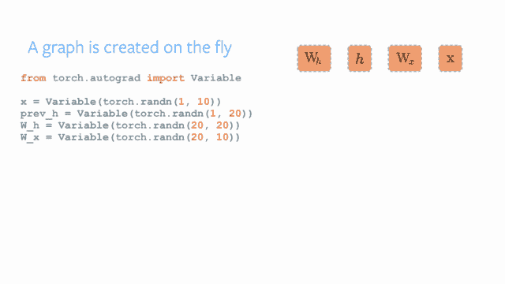

# 如何生产 PyTorch

> 原文：<https://towardsdatascience.com/how-to-pytorch-in-production-743cb6aac9d4?source=collection_archive---------8----------------------->

Photo by [Sharon McCutcheon](https://unsplash.com/photos/3gnf1rhy2fE?utm_source=unsplash&utm_medium=referral&utm_content=creditCopyText) on [Unsplash](https://unsplash.com/?utm_source=unsplash&utm_medium=referral&utm_content=creditCopyText)

ML 好玩，ML 流行，ML 无处不在。大多数公司使用 TensorFlow 或 PyTorch。例如，有些老同性恋更喜欢咖啡。大部分都是关于谷歌和脸书之战。

我的大部分经验都去了 PyTorch，即使大部分教程和在线教程都用 TensofFlow(或者希望是 bare numpy)。目前，在 Lalafo(人工智能驱动的分类)，我们正在与 PyTorch 玩得开心。不，真的，我们试过 caffe，它太棒了，除非你还没有花几天时间安装它。更好的是，PyTorch 现在是 1.0，我们从 0.3 开始使用它，它非常简单和健壮。啊啊..也许这里稍微调整一下，那里稍微调整一下。大多数问题都很容易解决，没有给我们带来任何问题。在公园散步，真的。

在这里，我想分享在生产中使用 PyTorch 最常见的 5 个错误。考虑用 CPU？多线程？使用更多的 GPU 内存？我们已经经历过了。现在让我也来引导你。

# 错误# 1——在推理模式下存储动态图

如果您以前使用过 TensorFlow，您可能会意识到 TF 和 PT 之间的关键区别——静态图和动态图。由于每次模型改变时都要重建图形，所以调试 TFlow 非常困难。这需要时间、努力和你的希望。当然现在 TensorFlow 更好。

总的来说，为了使调试更容易，ML 框架使用了与 PyTorch 中所谓的`Variables`相关的动态图。您使用的每个变量都链接到前一个变量，为反向传播建立关系。

下面是它在实践中的样子:

在大多数情况下，您希望在模型定型后优化所有计算。如果你看火炬界面，有很多选项，特别是在优化方面。`eval`模式、`detach`和`no_grad`方法造成的很多混乱。让我解释一下它们是如何工作的。在模型被训练和部署后，这里是你关心的事情:速度，速度和 CUDA 内存不足异常。

为了加速 pytorch 模式，你需要将它切换到`eval`模式。它通知所有层在推理模式下使用 batchnorm 和 dropout 层(简单说就是停用 dropout)。现在，有一种`detach`方法，它从计算图中删除变量。当你从零开始构建模型时，它是有用的，但是当你想要重用最先进的模型时，它就不那么有用了。一个更全局的解决方案是在`torch.no_grad`上下文中向前回绕，通过不在结果中存储图形链接来减少内存消耗。它节省了内存，简化了计算，从而提高了速度，减少了内存的使用。答对了。

# 错误 2——没有启用 cudnn 优化算法

在 nn 中有很多布尔标志可以设置。模块，你必须知道的存储在 cudnn 命名空间。使用`cudnn.benchmark = True`启用 cudnn 优化。为了确保 cudnn 寻找最优算法，通过设置`cudnn.enabled = True`启用它。NVIDIA 在优化方面给你带来了很多好处。

请注意，您的数据必须在 GPU 上，模型输入大小不应变化。数据的形式越多样化，可以进行的优化就越少。例如，为了标准化数据，可以对图像进行预处理。总的来说，要有创意，但不要太多。

# 错误 3——重用 JIT 编译

PyTorch 提供了一种简单的方法来优化和重用来自不同语言的模型(阅读 Python-To-Cpp)。如果你足够勇敢，你可能会更有创造力，用其他语言注入你的模型(我不是，`CUDA: Out of memory`是我的座右铭)

如果输入的形状不变，JIT 编译允许优化计算图形。这意味着如果你的数据没有太大的变化(见错误 2 ), JIT 是一个不错的选择。老实说，与上面提到的`no_grad`和`cudnn`相比，这并没有太大的不同，但是可能会。这只是第一个版本，潜力巨大。

请注意，如果您的模型中有`conditions`，它将不起作用，这在 RNNs 中是常见的情况。

完整文档可在 pytorch.org/docs/stable/jit[网站](https://pytorch.org/docs/stable/jit.html)上找到

# 错误#4 —试图使用 CPU 实例进行扩展

作为云中的虚拟机，GPU 非常昂贵。即使你查 AWS 一个实例也要 100 $/天左右(最低价 0.7$/h)参考:[aws.amazon.com/ec2/pricing/on-demand/](https://aws.amazon.com/ec2/pricing/on-demand/)。我使用的另一个有用的备忘单是 [www.ec2instances.info](https://www.ec2instances.info/) 每个从 3d 年级毕业的人都会想:“好吧，如果我买 5 个 CPU 实例而不是 1 个 GPU 会怎么样”。试过在 CPU 上运行 NN 模型的人都知道这是个死胡同。是的，你可以为 CPU 优化一个模型，但是最终它还是会比 GPU 慢。我强烈建议放松一下，忘掉这个想法，相信我。

# 错误 5——处理向量而不是矩阵

*   `cudnn` -检查
*   `no_grad` -检查
*   `GPU with correct version of CUDA` -检查
*   `JIT-compilation` -检查

万事俱备，还能做什么？

现在是时候运用一点数学知识了。如果你记得大多数神经网络是如何使用所谓的张量来训练的。张量从数学上讲是一个 N 维数组或者多线性几何向量。你可以做的是将输入分组(如果你愿意的话)到张量或矩阵中，并输入到你的模型中。例如，使用图像数组作为发送到 PyTorch 的矩阵。性能增益等于同时传递的对象数量。

这是一个显而易见的解决方案，但很少有人真正使用它，因为大多数时候对象是一个接一个处理的，从架构上建立这样的流程可能有点困难。别担心，你会成功的！

# 下一步是什么？

关于如何在 PyTorch 中优化模型，肯定有更多的技巧。我会继续张贴我们在野外使用脸书小子的经验。你呢，你有什么技巧可以在推理上取得更好的表现？

*原载于 2019 年 2 月 18 日*[*【tarasmatsyk.com】*](https://tarasmatsyk.com/posts/4-how-to-pytorch-in-production/)*。*