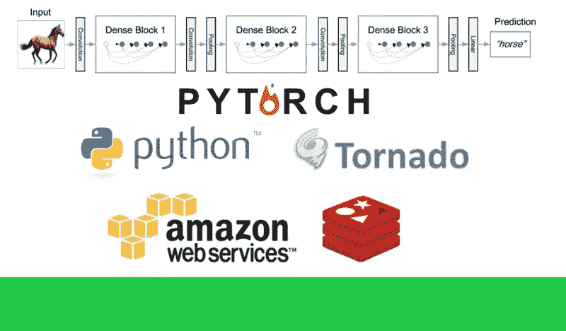
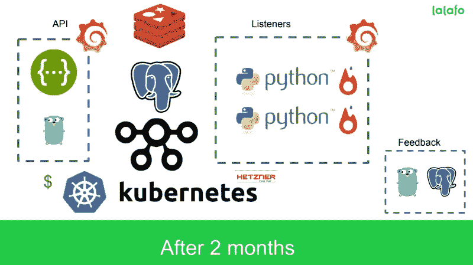
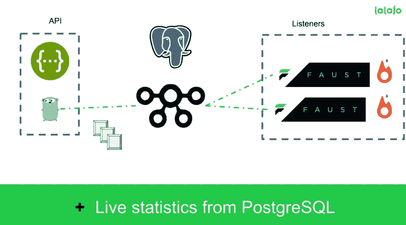
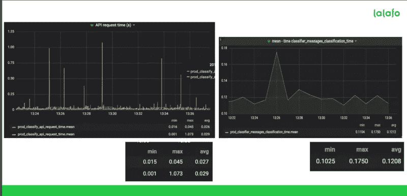

# 如何在生产中 Pytorch:第 2 部分。体系结构

> 原文：<https://towardsdatascience.com/how-to-pytorch-in-production-part-2-architecture-20fc9a423617?source=collection_archive---------16----------------------->

Photo by [Isaac Smith](https://unsplash.com/photos/6EnTPvPPL6I?utm_source=unsplash&utm_medium=referral&utm_content=creditCopyText) on [Unsplash](https://unsplash.com/search/photos/system?utm_source=unsplash&utm_medium=referral&utm_content=creditCopyText)

最近我做了一个关于将 PyTorch 模型部署到产品中的演讲。你可以在这里找到幻灯片[事件驱动 ML](https://pyconodessa.com/public/docs/slideshare/taras_matsyk_-_event_driven_ml.pdf) 。简而言之，我们从一个简单的原型开始，到一个生产就绪的可扩展解决方案。在这篇文章中，我想分享我们的发现。

# 我们是谁，我们做什么

基本上，Lalafo 是一个分类器。如果你想卖旧手机，你可以找我们。这就是现代纸质广告。然而，这里的商业模式非常简单，我们真正想做的是把它带到下一个层次。到目前为止，常规发布时间大约需要 2 分钟。我们的目标是将这个时间减少到几秒钟。我不是在开玩笑。为了实现这一目标，我们需要变得更加技术化。我们的一个助手是 AI，它用于填充价格，描述，照片分类和我们关于用户和类似项目的数据。最终目标是这样的(简而言之:你拍一张照片，剩下的我们来做):

到目前为止，我们正在整合下一个版本的移动应用程序的所有内容，并进行用户测试，以确保它是一个爆炸。

# 这一切是如何开始的？

或者说，如何在一天内造出一个原型。

说实话，每当一个商业人士来找你说:“我想造一辆自动驾驶汽车，你能做到吗？”。当然，作为软件工程师，我们有解决方案。

我们该怎么办？就我个人而言，我会去谷歌上输入“stack overflow how to a self-driven car”->回车。第一个答案会告诉您使用 JQuery，第二个会提示您从哪里开始。这就是我们应对图像识别挑战的方式，开始非常简单，这里是我们选择的一组技术:

我打赌这对你来说是显而易见的，以下是你得到的结果:

*   用于 PyTorch 模型的带 GPU 的 AWS
*   龙卷风在它上面处理 10K 问题
*   用于缓存预测的 Redis

老实说，这样的设置每分钟可以分类大约 200 张图像，如果我被要求为另一个模型提供 PoC，任何基于 AWS 的 Redis 的 python 异步框架都可以胜任。

## 200 这个数字是怎么来的？

这完全取决于度量，这里是我们定义的成功的图像处理。我们的分类流程如下:

*   你给我们发送一张带有`POST`请求的图片，
*   然后您使用`GET`来接收结果。
*   如果结果已准备好—图像处理速度足够快。

通常，需要 1 到 2 秒钟。考虑到这一需求，在线程池中运行 PyTorch 的 Tornado 每分钟可以处理 200 张图像。为什么选择 ThreadPool？等一下，我会解释的。

值得一提的是，我们有 8Gb 的 GPU 内存和大约 20Gb 的 RAM，其中 5Gb 由服务器消耗，原因是线程池和缓存队列。如果你想知道我们为什么不使用 ProcessPoolExecutor——那是因为 PyTorch，它不能很好地处理 python 并发，现在也不能。考虑到您必须考虑内存共享，线程池是一个非常简单的选择。我们幸福吗？没有。我们找到更好的方法了吗？我对此不太确定，不过，还有一种选择。

## 那又怎样？目前的方法有问题吗？

嗯，退一步说，AWS 很贵，线程化不是并行，Tornado 监控很难，伸缩性也不是那么明显(只是在 N 个 workers 服务器上面放上负载平衡器，我们称之为 python 方式)，ML 结果不持久等等。这就是我们开始考虑构建一个可扩展的分布式系统的地方。最初的计划是这样的:

我们有几个目标要实现:

1.  监控。(将数据点发送到流入液中，并使用 Grafana 进行监控)
2.  节省一些美元。(我们有机会采用 K8s，并选择 Hetzner 作为 it 提供商的 Linux 裸机)
3.  能够根据要求进行扩展
4.  玩得开心(我们决定采用 Go 进行数据处理和 API)
5.  持久性(选择 PSQL 来存储分类结果，以便我们可以构建报告和分析历史)
6.  可扩展(如果我们决定要添加更多的 ML，我们应该能够在最短的时间内完成)
7.  SDK 友好的(API 用户应该也很高兴)

# 我们最后去了哪里？让我们回顾一下组件

这是我们最后得到的结果:

让我们逐一回顾一下差异和组件

## API 与 ML

主要决定是将与客户端和数据处理层的交互分开。最后，我们有了 Go+Swagger+PostreSQL API，它消耗大约 20Mb 或 RAM，工作非常好，可以扩展 10 倍，而无需考虑新服务器(是的，我们的数据中心容量有限，但是，K8s 通过增加额外的容量来解决它)。

问题是在这两者之间放什么呢？我们有不同的选择，从 Redis、RabbitMQ、HTTP/gRPC 开始，到 Kafka 结束。主要的两个优点是:易于扩展分区和消息缓冲。主要缺点是再平衡。如果您以前使用过它—您知道它，否则请在实现您自己的消息总线之前测试 Redis 或 RabbitMQ。

## 监视

因为我们有一个可用的流入服务器，所以发送一些数据点并使用 Grafana 监控它们是一个非常合理的选择。这是一个活系统看起来像 atm 的样子:

如果我们必须选择的话，我们可能会选择哨兵或者麋鹿栈，在它上面使用 [APM](https://www.elastic.co/solutions/apm) 。

## 节省一些美元

AWS 的成本比其他产品高得多，甚至更贵。我们订购了几台 GeForce GTX-1080，在 [Hetzner](https://www.hetzner.com/) 上使用 8Gb GPU，节省了 10 倍美元。对欧洲非常有效。此外，我不会说它是超级可靠的，但是，如果你把两个集群和一个负载均衡器放在它们之间——一切都工作得很好。无论如何，即使是 5 个集群也比 AWS 便宜 2 倍，高效 5 倍，对不起 Jeff。

## 能够根据要求进行扩展

如果你曾经在 K8s 或 infrastructure 中尝试过 helm 作为代码，你应该知道这里的伸缩只是一行代码的变化。一旦你进入 K8s，你就很容易升级一个 pod。另一个问题是去那里有多难，但我们很幸运地在另一方面获得了一些专业知识。

## 开心

Go 很有趣，它是一种静态类型的编译语言，被宣称为框架本身。goroutine 不仅有名，如果您在生产或生活中有任何问题，只需添加 go routine，它就会得到解决。

虽然我们确实玩得很开心，而且 go 确实是一种设计良好的语言，但它仍然给我们带来了一些痛苦。如果你来自一个有 25 年历史的语言，它有很多很多库，看起来 Go 没有很多，这是真的。需要数据库？编写普通的 SQL。需要一个 API 服务器？编写自己的中间件和请求解析器。需要文档吗？幸运的是它在那里。当然，如果我们谈论大摇大摆，也不完全完整。

一方面，它节省了我们一些时间，减少了打字带来的痛苦，另一方面，它还不太成熟，即使是 10 年前的语言，你也需要回馈社区。没有人们告诉你的那么糟糕，也没有那么甜蜜。对此半信半疑。无论如何，它工作得很好，我们将在小服务中坚持使用它。

## 坚持

第一个里程碑是 Redis，因为它很简单。你把 json 放到内存里，它活的好好的。直到..你没有内存了。多加点内存就行了。正确。然而，如果你有处理内存结束相当快。对我们来说，15 分钟的工作大约需要 1Gb。让我们把它增加到 1 小时，你得到 4Gb。RAM 绝对是一种便宜的资源，但是，你知道什么更便宜吗？磁盘空间和在 2k19 SSD 便宜得要命，快得像兔子。

所以我们决定使用关系数据库，将数据反规范化并存储在 PostgreSQL 中。工作得很好，我们不会离开它，除非我们厌倦了数据方案的维护，并希望使用 NoSQL。如果我们能以正确的方式去做。我们试图使用 MongoDB 作为 NoSQL 数据库来存储历史数据，因为你知道吗，每个大数据初创公司都应该使用 MongoDB——最终，我们花了更多时间来优化它，并编写代码来处理非结构化数据。下次我会再试一次。

## 可展开的

让我们再来看这幅画。

看到右边的容器了吗？每个 ML 任务都存在于自己的容器中，并且只做一件事。这要么是欧几里得距离的指数，要么是分类任务或回归——我们把它放在单独的盒子里。这允许我们在任何时候扩展瓶颈位置，而不需要调整系统的其余部分。如果分类很慢——添加更多的分类器，太多的 API 请求——再添加一个 API 服务器。每个盒子只负责一件事，而且做得很好。如果我们决定从 PyTorch 迁移到 Keras 或 tensor flow——我们可以迁移一个容器，然后看看情况如何。如果成功了——在整个系统中推广。听起来像个计划吗？

## SDK 友好的

作为一名工程师，我真的很讨厌那些可以工作，但是要么不能工作，要么文档非常糟糕的系统。你所能做的就是玩玩它，猜猜看，谁知道当你上线的时候会有什么在等着你。我可能集成了 2017 年之前推出的所有第三方系统，记录不良的服务数量惊人。我们希望我们的用户有一个愉快的体验，我们为此而努力。

一个很好的起点是 swagger 文档，我们打算用它来自动生成 SDK 客户端。这基本上是亚马逊做的，一切都很好。然而，每个 AWS 客户端看起来都像是你在写 Java，不管你用的是什么语言。因此，在我们交付定义良好的 API 之后，下一个里程碑将是原生 SDK 客户端和..击鼓..如何使用它们的例子。真的，这么多 API 至少缺少例子，我甚至没有说文档可能会误导。

最后，我们在发布新的架构和试验更多可以作为特性添加的东西上已经进行了一半。在我们确保它功能丰富之后，我们将把它公之于众，让开发人员容易使用，并不断尝试扩展和性能调整，因为这很有趣。如果你想知道我们决定在 API 中做什么，让它可以扩展新的特性，请告诉我。

*原载于 2019 年 3 月 26 日*[*【tarasmatsyk.com】*](https://tarasmatsyk.com/posts/5-how-to-pytorch-in-production-2/)*。*