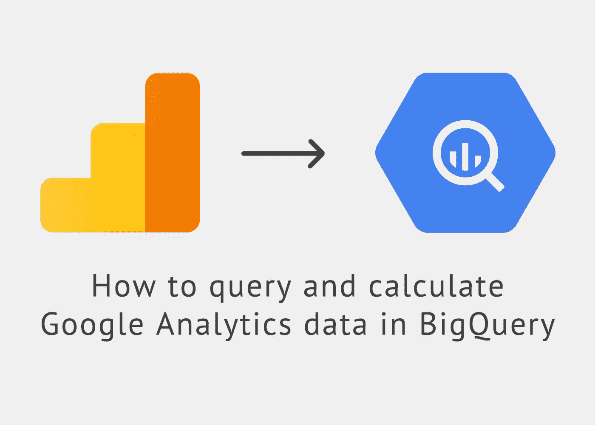
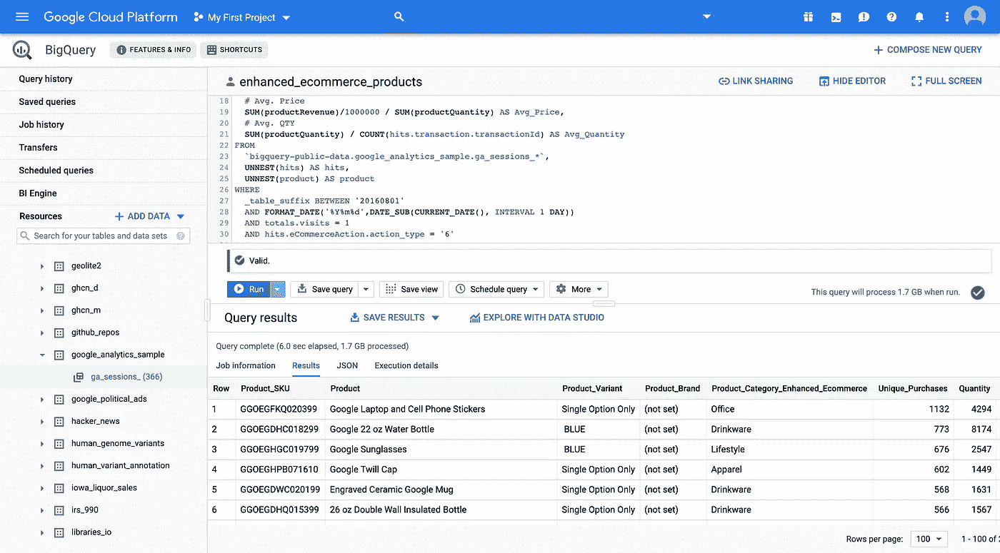
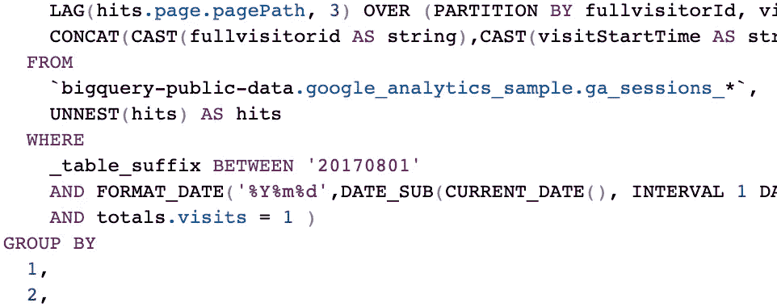
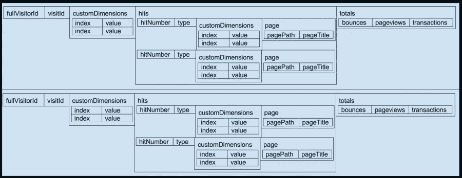
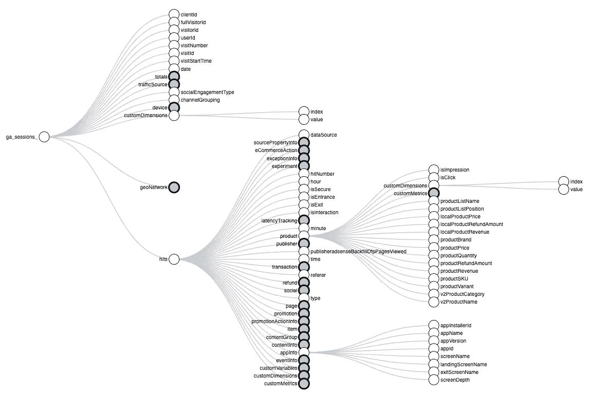
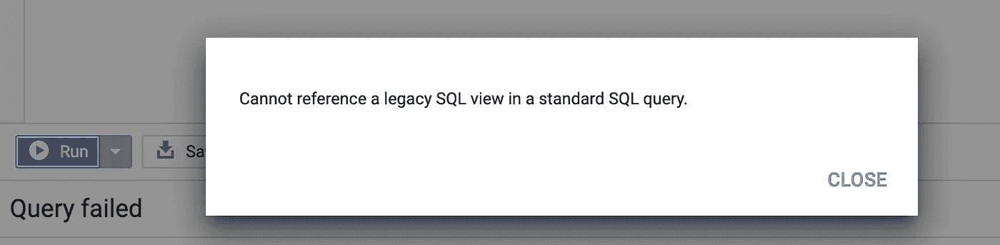

# 如何在 BigQuery 中查询和计算 Google Universal Analytics 数据

> 原文：<https://towardsdatascience.com/how-to-query-and-calculate-google-analytics-data-in-bigquery-cab8fc4f396?source=collection_archive---------0----------------------->

## 带有示例查询的标准 SQL 指南

W 当我第一次开始在 BigQuery 中查询谷歌分析数据时，我很难解释隐藏在`ga_sessions_`导出表中的“原始”点击级数据。因为我找不到关于如何在 BigQuery 中计算 Google Analytics 指标的可靠指南，所以我决定自己写一个。我提供了许多示例查询，因此您不必重新发明轮子，希望您可以节省一些宝贵的时间。

*更新:你喜欢这篇文章吗？那么你也会喜欢我的新网站*[*【GA4BigQuery.com】*](https://www.ga4bigquery.com?utm_campaign=medium_ua)*:这是一个关于如何在 big query&rock your digital marketing Analytics 中查询谷歌分析数据的技巧、想法、示例查询和教程的数字指南。*

*我已经将本文中的大多数示例查询迁移到新网站，因为在一个地方维护所有内容更容易。这篇文章将留在网上，让你找到正确的地方。*

*我也在 BigQuery* *中发表了一篇关于* [*查询 Google Analytics 4(之前为 App + Web)事件数据的文章。此内容将被迁移到*【GA4BigQuery.com】](/how-to-query-and-calculate-ga-app-web-event-data-in-bigquery-a77931176d3)**中。**

**

*Image by [Berber Bijlsma](https://medium.com/u/7bf0b2ba1c23?source=post_page-----cab8fc4f396--------------------------------)*

## *目录*

*–[Google Analytics 数据简介 big query](#fb2b)
–[多表](#3565)
–[用户](#4ad8)–
–[会话](#9c55)
–[时间](#fa32)
–[流量来源](#b4b4)
–[地理网络](#b5d4)
–[平台或设备](#473b)
–[页面追踪](#4f50)
–[](#3be4)
–[增强型电子商务(产品)](#79ef)
–[自定义维度&自定义指标](#8344)
–[自定义渠道分组](#828a)
–[日内表格](#67cb)
–[实时表格&查看](#26a4)*

# *BigQuery 中的 Google 分析数据简介*

**

*The BigQuery User Interface*

## *为什么是 BigQuery？*

*对于那些想知道为什么应该使用 BigQuery 来分析谷歌分析数据的人，请阅读[这篇优秀的文章](https://www.bounteous.com/insights/2017/05/17/value-google-bigquery-and-google-analytics-360/)。一些大优势:*

*   *不再取样。永远不会。*
*   *无限数量的维度*
*   *将[不同的范围](https://www.optimizesmart.com/complete-guide-to-dimensions-and-metrics-in-google-analytics/)合并在一份报告中(不适合胆小的人！)*
*   *计算目标完成情况，建立您自己的渠道分组并纠正数据错误，所有这些都基于过去的数据*
*   *将谷歌分析数据与第三方数据源相结合*

## *陡峭的学习曲线*

*但是我们不要太激动。事实是，一旦你发现很多你习惯的谷歌分析指标无处可寻，钻研 BigQuery 可能会相当令人沮丧。*

> *Google Analytics 用户，特别是高级用户对 BigQuery 感兴趣的原因是，Google 可以每天将原始的 Google Analytics 数据转储到 BigQuery 中。虽然这使得许多类型的分析无法在 Google Analytics 界面中执行，但它也没有提供任何基本的指标，例如，*跳出率。([来源](https://www.bounteous.com/insights/2016/02/11/querying-google-analytics-data-bigquery/?ns=l)**

*这有两个方面:困难的部分是我必须计算我的查询中每一个“缺失”的谷歌分析指标。积极的影响:我在概念层面上对度量标准的理解有了很大的提高。*

**

*[*Source*](https://yuhuisdatascienceblog.blogspot.com/2017/07/querying-google-analytics-data-as-flat.html)*

## *另一个障碍*

*[的 BigQuery 食谱](https://support.google.com/analytics/answer/4419694?hl=en)在某些情况下帮助了我，但有时也显得不完整和过时。因为[标准 SQL 语法](https://cloud.google.com/bigquery/docs/reference/standard-sql/)是当今首选的 BigQuery 语言，并且许多旧的 [Stackoverflow](https://stackoverflow.com/questions/tagged/google-bigquery+google-analytics) 条目正在使用(很快将被弃用？)[遗留的 SQL 语法](https://cloud.google.com/bigquery/docs/reference/legacy-sql)，我花了很多时间来思考我必须编写的 SQL 查询，以获得我想要的报告。除了我需要注意的计算度量之外，还有另一个障碍需要跨越:嵌套和重复的字段。*

> *Google Analytics BigQuery 转储中的每一行都代表一个会话，并包含许多字段，其中一些字段可以是*重复的*和*嵌套的*，例如 hits，它包含一组重复的字段，代表会话期间的页面视图和事件，以及 custom dimensions，它是一个单独的重复字段。这是 BigQuery 和普通数据库的主要区别之一。([来源](https://www.bounteous.com/insights/2016/02/11/querying-google-analytics-data-bigquery/?ns=l))*

## *我的目标*

*有了这篇文章，我希望能为你省去一些麻烦。我将向您展示如何创建会话和用户级别的基本报告，稍后我将展示一些更高级查询的示例，这些查询涉及点击级别的数据(事件、页面浏览量)、结合不同范围的多个自定义维度、处理(增强的)电子商务数据以及将历史数据与实时或当天数据结合起来。*

## *在家试试这个*

*没有谷歌云计费账户？进入 [BigQuery 沙箱](https://cloud.google.com/bigquery/docs/sandbox)，它允许你使用 [BigQuery web UI](https://console.cloud.google.com/bigquery) 而无需启用计费账户。要设置 Google Analytics to big query export，您需要 Google Analytics 360(Google 营销平台的一部分)。*

**

*Standard SQL in BigQuery*

*我假设您对作为查询语言的 SQL 和作为数据库工具的 BigQuery 有基本的了解。如果没有，我建议您先学习 SQL 入门课程，因为我不会详细介绍 SQL 语法，而是将重点放在如何从 BigQuery 中获取您的(自定义)Google Analytics 报告以供分析。所有查询示例都使用标准 SQL。*

*在本文中，我们将为 BigQuery 使用 [Google Analytics 样本数据集，它包含来自](https://support.google.com/analytics/answer/7586738?hl=en&ref_topic=3416089) [Google 商品商店](https://www.googlemerchandisestore.com/)的分析数据。*

**

*Google Merchandise Store*

*然而，如果你想用 Google Analytics 比较你的查询结果，我建议你使用你自己的 Google Analytics 数据集，因为我已经注意到 Google Analytics 中的 Google 商品商店数据和样本 BigQuery 数据集之间的差异。我在其他谷歌分析账户上测试了这些查询，它们匹配得相当好。*

## *导出模式*

*为了更好地理解 BigQuery 中的`ga_sessions_`表，让我们看看 [BigQuery 导出模式](https://support.google.com/analytics/answer/3437719?hl=en)，它让我们了解了 BigQuery 中可用的原始 Google Analytics 数据字段。*

*尽管您可能会从 Google Analytics UI 中识别出许多维度和指标，但我知道这种模式可能有点令人不知所措。为了更好地理解我们的数据集，我们必须知道(嵌套)字段的结构。下一张图片代表来自`ga_sessions_`表的两行(= 2 个会话)。*

**

*[Source](https://www.bounteous.com/insights/2016/06/23/whats-missing-google-analytics-bigquery-export-schema/)*

## *嵌套示例*

*如你所见，如果你需要自定义维度、自定义指标或任何点击量数据，即事件、页面浏览量或产品数据，我们的麻烦就来了。让我们查询我们的嵌套样本集:*

```
*SELECT
  *
FROM
  `bigquery-public-data.google_analytics_sample.ga_sessions_20170801`
LIMIT
  2*
```

*这给了我们 2 行，表示为平面表，如下所示:*

*记住，在这个例子中，只有第 2 行和第 14 行是我们表中真正的行。其他“行”实际上是嵌套字段，大多数情况下是`NULL`值。只有`hits.product`列填充了值。*

*为了处理这些字段，并能够查询我们的表以满足我们的需求，我们需要`UNNEST`函数。*

> *这里的问题是它本质上是一个数组(实际上在 BigQuery 中它是一个“重复的记录”，但是你可以把它看作一个数组)。(…)这就是`UNNEST`函数的用武之地。它基本上允许你在一个数组中获取元素，然后展开每一个单独的元素。然后，可以将原始行与每个未嵌套的元素连接起来，将它们添加到表中。([来源](https://medium.com/firebase-developers/using-the-unnest-function-in-bigquery-to-analyze-event-parameters-in-analytics-fb828f890b42))*

*我强烈推荐阅读[这篇文章](https://medium.com/firebase-developers/using-the-unnest-function-in-bigquery-to-analyze-event-parameters-in-analytics-fb828f890b42)，它以 Firebase Analytics 样本数据集为例详细解释了`UNNEST`概念。*

*您只需`UNNEST`包含“重复字段”的记录。对于我们的谷歌分析数据集，这些可能涉及:*

## *用户/会话范围*

*   *自定义维度*

## *命中范围*

*   *打击*
*   *hits.customDimensions*
*   *hits.customMetrics*

## *产品范围*

*   *hits.product*
*   *hits.product.customDimensions*
*   *hits.product .自定义度量*

*为了确保您理解 BigQuery 导出模式的结构，我鼓励您看一看[这个交互式可视化表示](https://storage.googleapis.com/e-nor/visualizations/bigquery/ga360-schema.html#section-collapsible-tree)。*

**

*[Source](https://storage.googleapis.com/e-nor/visualizations/bigquery/ga360-schema.html#section-collapsible-tree)*

*好的。理论废话够多了。准备好行动了吗？我们来查询一下！*

*[返回目录](#8272)*

# *多个表格*

*BigQuery 中的 Google Analytics 数据每天存储在一个表中。如果您只需要某一天的数据，查询中的`FROM`子句将如下所示:*

```
*SELECT
  *
FROM
  `bigquery-public-data.google_analytics_sample.ga_sessions_20160801`*
```

*在大多数情况下，您需要查询更长的时间段。输入`_table_suffix`。更多细节[在这里](https://cloud.google.com/bigquery/docs/querying-wildcard-tables#filtering_selected_tables_using_table_suffix)，但是要查询谷歌分析数据的多个表格，你只需要这些例子。请注意，您可以将静态日期和动态日期结合使用，或者在最近 90 天左右的滚动期内只使用静态日期或动态日期。也可以在您的查询中包含[日内表](#67cb)。*

## *静态日期范围*

*当您对静态数据范围执行分析时，您应该使用固定的开始和结束日期。在本例中，我们选择 2016 年 8 月 1 日至 2017 年 8 月 1 日。*

```
*SELECT
  *
FROM
  `bigquery-public-data.google_analytics_sample.ga_sessions_*`
WHERE
  _table_suffix BETWEEN '20160801'
  AND '20170801'*
```

## *动态日期范围*

*在本例中，我们选择“今天”——到昨天为止的 30 天。*

```
*SELECT
  *
FROM
  `bigquery-public-data.google_analytics_sample.ga_sessions_*`
WHERE
  _table_suffix BETWEEN FORMAT_DATE('%Y%m%d',DATE_SUB(CURRENT_DATE(), INTERVAL 30 DAY))
  AND FORMAT_DATE('%Y%m%d',DATE_SUB(CURRENT_DATE(), INTERVAL 1 DAY))*
```

## *静态和动态日期的组合*

*我们知道我们的数据集中有 366 个日表，所以我们可以在这里使用固定的结束日期(`20170801`)，但是通常我更喜欢固定开始日期和动态结束日期的组合(在本例中:今天减一)。如果新数据被添加到我们的数据集中，它会自动包含在我们的查询中。在本例中，我们选择 2016 年 8 月 1 日至昨天。*

```
*SELECT
  *
FROM
  `bigquery-public-data.google_analytics_sample.ga_sessions_*`
WHERE
  _table_suffix BETWEEN '20160801'
  AND FORMAT_DATE('%Y%m%d',DATE_SUB(CURRENT_DATE(), INTERVAL 1 DAY))*
```

*[返回目录](#8272)*

# *用户*

*该示例查询包含以下所有 Google Analytics 维度和指标。如果您只需要一个维度或度量，查看示例查询中的`-- comments`,并从`SELECT`子句中复制您需要的部分。确保您还添加了正确计算结果所需的任何附加条件(在`FROM`、`WHERE`、`GROUP BY`和`ORDER BY`中)。*

## *用户维度*

*用户类型
会话计数*

## *用户指标*

*用户
新用户
%新会话
每个用户的会话数量
点击*

## *示例查询*

*[](https://www.ga4bigquery.com/user-dimension-metrics-ua/) [## 用户:维度和指标(UA)

### 此示例查询包含以下所有 Google Analytics 用户维度和指标。如果你只需要一个维度…

www.ga4bigquery.com](https://www.ga4bigquery.com/user-dimension-metrics-ua/) 

[返回目录](#8272)* 

# *会议*

*该示例查询包含以下所有 Google Analytics 维度和指标。如果您只需要一个维度或度量，查看示例查询中的`# comments`，并从`SELECT`子句中复制您需要的部分。确保您还添加了正确计算结果所需的任何附加条件(在`FROM`、`WHERE`、`GROUP BY`和`ORDER BY`中)。*

## *会话维度*

*-*

## *会话指标*

*会话
跳出率
跳出率
平均值。会话持续时间*

## *示例查询*

*[](https://www.ga4bigquery.com/session-dimensions-metrics-ua/) [## 会议:维度和指标(UA)

### 此示例查询包含以下所有 Google Analytics 会话维度和指标。如果你只需要一个…

www.ga4bigquery.com](https://www.ga4bigquery.com/session-dimensions-metrics-ua/) 

[返回目录](#8272)* 

# *时间*

*该示例查询包含以下所有 Google Analytics 维度和指标。如果您只需要一个维度或度量，查看示例查询中的`-- comments`，并从`SELECT`子句中复制您需要的部分。确保您还添加了正确计算结果所需的任何附加条件(在`FROM`、`WHERE`、`GROUP BY`和`ORDER BY`)。*

## *时间维度*

*日期
年份
ISO 年份
年份月份
年份月份
年份星期
年份星期
ISO 年份星期
ISO 年份星期
月份日期
星期日期
星期名称
小时
分钟
日期小时和分钟*

## *时间度量*

*-*

## *示例查询*

*[](https://www.ga4bigquery.com/date-time-dimensions-metrics-ua/) [## 日期和时间:维度和指标(UA)

### 此示例查询包含以下所有 Google Analytics 日期和时间维度和指标。如果你只需要一个…

www.ga4bigquery.com](https://www.ga4bigquery.com/date-time-dimensions-metrics-ua/) 

[返回目录](#8272)* 

# *流量来源*

*该示例查询包含以下所有 Google Analytics 维度和指标。如果您只需要一个维度或指标，查看示例查询中的`-- comments`,并从`SELECT`子句中复制您需要的部分。确保您还添加了正确计算结果所需的任何附加条件(在`FROM`、`WHERE`、`GROUP BY`和`ORDER BY`中)。*

## *交通来源维度*

*推荐路径
完整推荐人
默认频道分组
活动
来源
媒介
来源/媒介
关键词
广告内容
社交网络
社交来源推荐
活动代码*

## *流量来源指标*

*-*

## *示例查询*

*[](https://www.ga4bigquery.com/traffic-sources-dimensions-metrics-ua/) [## 流量来源:维度和指标(UA)

### 此示例查询包含以下所有 Google Analytics 流量来源维度和指标。如果你只需要一个…

www.ga4bigquery.com](https://www.ga4bigquery.com/traffic-sources-dimensions-metrics-ua/) 

[返回目录](#8272)* 

# *地理网络*

*该示例查询包含以下所有 Google Analytics 维度和指标。如果您只需要一个维度或度量，查看示例查询中的`-- comments`,并从`SELECT`子句中复制您需要的部分。确保您还添加了正确计算结果所需的任何附加条件(在`FROM`、`WHERE`、`GROUP BY`和`ORDER BY`)。*

## *地理网络维度*

*洲
亚洲
国家
地区
地铁
城市
纬度
经度
网络域
服务提供商
城市 ID*

## *地理网络度量*

*-*

## *示例查询*

*[](https://www.ga4bigquery.com/geo-network-dimensions-metrics-ua/) [## 地理网络:维度和指标(UA)

### 此示例查询包含以下所有 Google Analytics 地理网络维度和指标。如果你只需要一个…

www.ga4bigquery.com](https://www.ga4bigquery.com/geo-network-dimensions-metrics-ua/) 

[返回目录](#8272)* 

# *平台或设备*

*该示例查询包含以下所有 Google Analytics 维度和指标。如果您只需要一个维度或度量，查看示例查询中的`-- comments`，并从`SELECT`子句中复制您需要的部分。确保您还添加了正确计算结果所需的任何附加条件(在`FROM`、`WHERE`、`GROUP BY`和`ORDER BY`)。*

## *平台或设备尺寸*

*浏览器
浏览器版本
操作系统
操作系统版本
移动设备品牌
移动设备型号
移动输入选择器
移动设备信息
移动设备营销名称
设备类别
浏览器大小
数据源*

## *平台或设备指标*

*-*

## *示例查询*

*[](https://www.ga4bigquery.com/platform-and-device-dimensions-metrics-ua/) [## 平台和设备:维度和指标(UA)

### 此示例查询包含以下所有 Google 分析平台和设备维度和指标。如果你只需要…

www.ga4bigquery.com](https://www.ga4bigquery.com/platform-and-device-dimensions-metrics-ua/) 

[返回目录](#8272)* 

# *页面跟踪*

*该示例查询包含以下所有 Google Analytics 维度和指标。如果您只需要一个维度或指标，查看示例查询中的`-- comments`,并从`SELECT`子句中复制您需要的部分。确保您还添加了正确计算结果所需的任何附加条件(在`FROM`、`WHERE`、`GROUP BY`和`ORDER BY`中)。*

## *页面跟踪尺寸*

*主机名
页面
上一页路径
页面路径一级
页面路径二级
页面路径三级
页面路径四级
页面标题
登陆页面
第二页
退出页面*

## *页面跟踪指标*

*入口
浏览量
独特浏览量
页面/会话
出口
%出口
平均。页面上的时间*

## *示例查询*

*[](https://www.ga4bigquery.com/page-tracking-dimensions-metrics-ua/) [## 页面跟踪:维度和度量(UA)

### 此示例查询包含以下所有 Google Analytics 页面跟踪维度和指标。如果你只需要一个…

www.ga4bigquery.com](https://www.ga4bigquery.com/page-tracking-dimensions-metrics-ua/) 

[返回目录](#8272)* 

# *事件跟踪*

*该示例查询包含以下所有 Google Analytics 维度和指标。如果您只需要一个维度或度量，查看示例查询中的`-- comments`，并从`SELECT`子句中复制您需要的部分。确保您还添加了正确计算结果所需的任何附加条件(在`FROM`、`WHERE`、`GROUP BY`和`ORDER BY`)。*

## *事件跟踪维度*

*事件类别
事件动作
事件标签*

## *事件跟踪指标*

*总事件数
唯一事件数
事件值
平均值。值
带事件的会话
事件/带事件的会话*

## *示例查询*

*[](https://www.ga4bigquery.com/event-tracking-dimensions-metrics-ua/) [## 事件跟踪:维度和指标(UA)

### 此示例查询包含以下所有 Google Analytics 事件跟踪维度和指标。如果你只需要一个…

www.ga4bigquery.com](https://www.ga4bigquery.com/event-tracking-dimensions-metrics-ua/) 

[返回目录](#8272)* 

# *目标转换*

*该示例查询包含以下所有 Google Analytics 维度和指标。如果您只需要一个维度或指标，查看示例查询中的`-- comments`,并从`SELECT`子句中复制您需要的部分。确保您还添加了正确计算结果所需的任何附加条件(在`FROM`、`WHERE`、`GROUP BY`和`ORDER BY`中)。*

## *目标转换维度*

*目标完成位置
目标上一步-1
目标上一步-2
目标上一步-3*

## *目标转化指标*

*目标 XX 完成情况*

## *示例查询*

*[](https://www.ga4bigquery.com/goal-conversions-dimensions-metrics-ua/) [## 目标转换:维度和指标(UA)

### 此示例查询包含以下所有 Google Analytics 目标转换维度和指标。如果你只需要…

www.ga4bigquery.com](https://www.ga4bigquery.com/goal-conversions-dimensions-metrics-ua/) 

[返回目录](#8272)* 

# *(增强型)电子商务(交易)*

*该示例查询包含以下所有 Google Analytics 维度和指标。如果您只需要一个维度或度量，查看示例查询中的`-- comments`,并从`SELECT`子句中复制您需要的部分。确保您还添加了正确计算结果所需的任何附加条件(在`FROM`、`WHERE`、`GROUP BY`和`ORDER BY`)。*

## *(增强的)电子商务维度*

*交易 ID*

## *(增强的)电子商务指标*

*交易
电子商务转换率
收入
平均。订单价值
每会话价值
运费
税
每用户收入
每用户交易*

## *示例查询*

*[](https://www.ga4bigquery.com/enhanced-ecommerce-transactions-dimensions-metrics-ua/) [## (增强)电子商务交易:维度和指标(UA)

### 此示例查询包含以下所有谷歌分析电子商务交易的维度和指标。如果你只是…

www.ga4bigquery.com](https://www.ga4bigquery.com/enhanced-ecommerce-transactions-dimensions-metrics-ua/) 

[返回目录](#8272)* 

# *电子商务(产品)*

*当输入产品范围时，您必须验证[增强型电子商务](#79ef)是否在谷歌分析中启用。如果是这样，您可以安全地使用 hits.product 字段。如果只测量“标准”电子商务:使用 hits.item 字段。*

*该示例查询包含以下所有 Google Analytics 维度和指标。如果您只需要一个维度或度量，查看示例查询中的`-- comments`，并从`SELECT`子句中复制您需要的部分。确保您还添加了正确计算结果所需的任何附加条件(在`FROM`、`WHERE`、`GROUP BY`和`ORDER BY`)。*

## *电子商务维度*

*产品 SKU
产品
产品类别*

## *电子商务指标*

*数量
唯一采购
平均。价格
产品收入
平均。数量*

## *示例查询*

*[](https://www.ga4bigquery.com/ecommerce-products-dimensions-metrics-ua/) [## 电子商务产品:维度和指标(UA)

### 当进入产品范围时，您必须验证谷歌分析中是否启用了增强型电子商务。如果是这样，你就…

www.ga4bigquery.com](https://www.ga4bigquery.com/ecommerce-products-dimensions-metrics-ua/) 

[返回目录](#8272)* 

# *增强型电子商务(产品)*

*当进入产品范围时，您必须验证谷歌分析中是否启用了增强型电子商务。如果是这样，您可以安全地使用 hits.product 字段。如果只测量了[“标准”电子商务](#f2c8):使用 hits.item 字段。*

*该示例查询包含以下所有 Google Analytics 维度和指标。如果您只需要一个维度或指标，查看示例查询中的`-- comments`,并从`SELECT`子句中复制您需要的部分。确保您还添加了正确计算结果所需的任何附加条件(在`FROM`、`WHERE`、`GROUP BY`和`ORDER BY`中)。*

## *增强的电子商务维度*

*产品 SKU
产品
产品类别(增强型电子商务)
产品品牌
产品变型*

## *增强的电子商务指标*

*数量
唯一购买量
产品收入
平均值。价格
平均值。数量
购买到明细比率
购物车到明细比率
产品添加到购物车
产品结账
产品明细视图
产品退款
产品从购物车中移除
退款金额*

## *示例查询*

*[](https://www.ga4bigquery.com/enhanced-ecommerce-products-dimensions-metrics-ua/) [## 增强型电子商务产品:维度和指标(UA)

### 当进入产品范围时，您必须验证谷歌分析中是否启用了增强型电子商务。如果是这样，你就…

www.ga4bigquery.com](https://www.ga4bigquery.com/enhanced-ecommerce-products-dimensions-metrics-ua/) 

[返回目录](#8272)* 

# *自定义维度和自定义指标*

*该示例查询包含以下所有 Google Analytics 维度和指标。如果您只需要一个维度或度量，查看示例查询中的`# comments`，并从`SELECT`子句中复制您需要的部分。确保您还添加了正确计算结果所需的任何附加条件(在`FROM`、`WHERE`、`GROUP BY`和`ORDER BY`)。*

## *自定义维度*

*自定义维度 XX(用户)
自定义维度 XX(会话)
自定义维度 XX(点击)
自定义维度 XX(产品)*

## *自定义指标*

*【自定义指标 XX 值(命中)】T23【自定义指标 XX 值(产品)*

## *示例查询*

*[](https://www.ga4bigquery.com/custom-dimensions-metrics-ua/) [## 自定义维度和指标(UA)

### 此示例查询包含以下所有 Google Analytics 自定义维度和指标。如果你只需要一个…

www.ga4bigquery.com](https://www.ga4bigquery.com/custom-dimensions-metrics-ua/) 

[返回目录](#8272)* 

# *自定义频道分组*

*如果需要默认通道分组，只需使用[通道分组](#b4b4)尺寸即可。但是，建立自己的频道分组可能有各种原因。例如，当您使用当天数据时，因为通道分组维度不可用。或者当您需要“修复”历史数据的数据质量问题时，因为这对于 Google Analytics UI 中的默认频道分组维度是不可能的。*

*我将向您展示如何镜像 BigQuery 中默认频道分组的标准 Google Analytics [定义](https://support.google.com/analytics/answer/3297892?hl=en&ref_topic=6010089)。如果您使用这个查询作为起点，那么创建您自己的定制或默认频道分组就不再那么困难了。*

## *示例查询*

*[](https://www.ga4bigquery.com/tutorial-how-to-create-your-own-custom-channel-grouping/) [## 教程:如何创建自己的自定义频道分组(UA)

### 如果需要默认的渠道分组，就使用渠道分组维度。然而，可以有各种…

www.ga4bigquery.com](https://www.ga4bigquery.com/tutorial-how-to-create-your-own-custom-channel-grouping/) 

[返回目录](#8272)* 

# *当天表格*

*对于每个导出到 BigQuery 的 Google Analytics 视图，一个`ga_sessions_intraday_`表也将在一天内被导出多次。让我们看看这是如何工作的:*

> *在每个数据集中，为每天的导出导入一个表。每日表格的格式为“ga_sessions_YYYYMMDD”。*
> 
> *日内数据大约每天导入三次。日内表格的格式为“ga_sessions_intraday_YYYYMMDD”。在同一天，当天数据的每次导入都会覆盖同一表中的前一次导入。*
> 
> *每日导入完成后，前一天的日内表将被删除。对于当天，直到第一次日内导入，没有日内表。如果日内表写入失败，则保留前一天的日内表。*
> 
> *在每日导入完成之前，当天的数据不是最终数据。您可能会注意到日内和每日数据之间的差异，这是基于跨越上次日内导入时间界限的活动用户会话。([来源](https://support.google.com/analytics/answer/3437719?hl=en&ref_topic=3416089))*

*在查询中包含当天数据和历史数据的最简单方法是将通配符与更宽的`_table_suffix`过滤器结合使用。在这个条件下，它将包括数据集中任何以`ga_sessions_`开始并包含格式为`YYYYMMDD`的日期的表。*

**注意:确保你的数据集不包含任何标题以* `ga_sessions_` *开头的表格！**

## *示例查询*

*[](https://www.ga4bigquery.com/how-to-query-an-intraday-table-and-combine-it-with-daily-tables-ua/) [## 如何查询日内表(并将其与日历表结合)- UA

### 对于每个导出到 BigQuery 的 Google Analytics 视图，ga_sessions_intraday_ table 将被导出多个…

www.ga4bigquery.com](https://www.ga4bigquery.com/how-to-query-an-intraday-table-and-combine-it-with-daily-tables-ua/) 

[返回目录](#8272)* 

# *实时表格和视图*

*如果您没有看到当天的表格，而是看到实时表格和视图，则您的 Google Analytics 视图启用了流导出。要查询这些数据并将其与来自`ga_sessions_`表的历史数据相结合，需要另一种方法。*

> *每天,“流式导出”创建 1 个新表和该表的 1 个(BigQuery)视图:*
> 
> *table:ga _ real time _ sessions _ YYYYMMDD 是一个内部的 *staging* 表，它包括一天中发生的所有活动的所有会话记录。大约每 15 分钟连续导出一次数据。当会话跨越多个导出操作时，此表中包含会话的多条记录。*
> 
> *ga_realtime_sessions_YYYYMMDD 表不应用于查询(并且不受 Google Analytics 技术支持的支持)。对这些表的查询可能会产生意外的结果，因为它们可能包含某些会话的重复记录。请改为查询 ga _ real time _ sessions _ view _ YYYYMMDD 视图。*
> 
> *view:ga _ real time _ sessions _ view _ YYYYMMDD 位于导出的表的顶部，用于对跨导出边界存在的重复会话的多个记录进行重复数据删除。在此表中查询已消除重复的流数据。([来源](https://support.google.com/analytics/answer/7430726?hl=en))*

*在撰写本文时，这个每日生成的实时视图只能用遗留 SQL 查询。任何标准的 SQL 查询都会导致以下错误:*

**

*为了能够使用标准 SQL，我们必须创建自己的实时视图。*

## *示例查询*

*[](https://www.ga4bigquery.com/how-to-query-realtime-tables-and-views-and-combine-it-with-daily-tables-ua/) [## 如何查询实时表和视图(并将其与每日表相结合)

### 如果您没有看到当天的表格，但看到了实时表格和视图，您的 Google Analytics 已启用流导出…

www.ga4bigquery.com](https://www.ga4bigquery.com/how-to-query-realtime-tables-and-views-and-combine-it-with-daily-tables-ua/) 

[返回目录](#8272)*