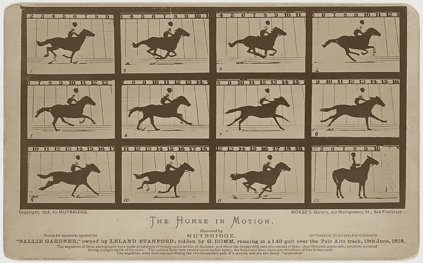
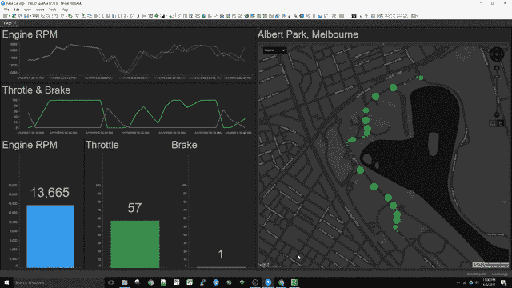
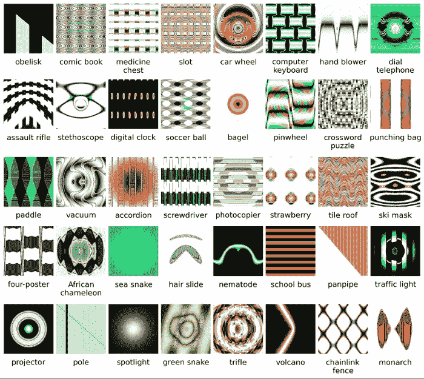

# 引入流式商业智能

> 原文：<https://towardsdatascience.com/how-to-query-the-future-a4a5e951d23e?source=collection_archive---------14----------------------->

New capabilities in business intelligence help anticipate what lies ahead

## 一种新形式的自助服务分析有助于业务用户了解运营情况

十多年来，商业智能在观点上一直没有突破。

Tableau、QlikView 和 PowerBI 等自助式商业智能工具有助于人们更轻松地理解他们的数据。但是那些工具只分析已经发生的事情。分析历史数据假设过去观察到的模式、异常和机制将在未来发生。

现在，商业智能正在发生变化。通过结合流分析和自助式可视化探索，业务分析师可以询问和回答有关未来的问题。就像《少数派报告》中的预防犯罪部门一样，这种新型的商业智能可以帮助商业分析师预测未来的情况，实时检测它们，并在为时过晚之前采取行动。

[The snapshot images](https://en.wikipedia.org/wiki/Sallie_Gardner_at_a_Gallop) that proved that horses do leave the ground, and sparked the invention of the motion picture camera.

## 导致电影诞生的赌注

流式 BI 的创建类似于 19 世纪后期电影的发明。

1872 年，[利兰·斯坦福](https://en.wikipedia.org/wiki/Leland_Stanford)雇佣摄影师[爱德华·迈布里奇](https://en.wikipedia.org/wiki/Eadweard_Muybridge)帮助他解决一个赌局，即马匹在奔跑时离开地面。这花了几年时间，但迈布里奇完善了一种方法，从多台相机拍摄一系列快照，这些快照被马折断的细线绊倒。

他的快照揭示了人眼看不到的东西:马奔跑时离开地面。幻灯片二和三展示了这一事实的快照。斯坦福赢了他的赌注。

但更重要的是，迈布里奇的技术捕捉到了运动感。受他的工作影响，第一部电影摄影机于 1892 年问世。

像 19 世纪 80 年代的相机一样，现有的 BI 工具也是为快照而构建的。它们显示已经发生的事情，就像一张静止的照片。就像斯坦福的赌注一样，对华尔街的押注开启了一种思考商业智能的新方式。

## 流式商业智能的诞生

五年前，“闪电崩盘”在华尔街非常普遍。当交易算法对新闻事件等刺激反应过度时，就会发生闪电崩盘。例如，2012 年，一家公司[在 45 分钟内损失了 4 . 4 亿美元](https://en.wikipedia.org/wiki/Knight_Capital_Group)。

银行需要一种新的方法来检测和阻止闪电崩盘。正如一位交易主管所说—

> “我需要一个实时的数据仓库，在那里我可以询问数百个关于未来的问题，并在这些情况即将发生时得到实时通知，以便我可以在为时已晚之前采取行动。”—电子交易副总裁

这个请求就像斯坦福大学的赌注，但对于商业智能和数据仓库。来自麻省理工学院和剑桥大学的技术专家着手回答华尔街的“询问未来”挑战。

解决方案是连续查询处理(CQP)，这是一种结合了流分析和基于推送的查询模型的技术。CQP 允许商业智能用户向数据流中注入问题。对数据流中的每一个数据更改都评估查询。当查询的结果集发生变化时，BI 可视化会自动更新。或者，如果用户没有盯着屏幕，就会发出警报，提醒他们注意当前的情况。

流式 BI 就像一个可查询的业务数据监控摄像头。它有助于用算法增强人类的智能。

## 流动商业智能在行动

让我们来看看 BI 流的一天。下面的短片展示了 BI 分析来自一级方程式赛车中嵌入的传感器的物联网数据流。

业务分析师可以通过要求系统连续绘制汽车的位置来实时监控汽车的位置。这里显示了对油门、转速和制动压力的实时分析，但也可以考虑数百个因素。流动 BI 揭示了静态快照永远无法展示的东西:运动、方向、关系、动量。

Streaming BI at work: Query the future.

但是流式 BI 如何查询未来？

在这个例子中，用户为汽车的位置创建了一个地图。BI 工具记录这种连续查询:

> 从物联网流中选择连续*[位置、转速、油门、刹车]

CQP 记录这个问题并评估数据流上的每一个滴答。车动了，数据就变了，地图也变了。你只要设置好，然后忘记它。计算会改变。关系会变。视觉元素会改变。

这是未来查询的最简单的例子:“当汽车移动时，告诉我它在哪里。”但是可以登记成千上万的这种连续的问题:告诉我司机什么时候走了一条次优的路径进入发夹弯；告诉我轮胎磨损何时降低；告诉我天气预报什么时候变化。

与传统商务智能一样，流式商务智能也是自助服务。因此，查询未来就像查询 Excel 电子表格一样简单:您只需打开一个到流数据的连接，创建一些图表，然后进行探索。

AI can’t apply human judgment and reason. [Image from the University of Wyoming](http://www.evolvingai.org/fooling).

## 流式商业智能通过算法意识增强了人类的判断能力

在[下注思考](https://www.amazon.com/gp/product/0735216355/ref=as_li_qf_asin_il_tl?tag=louischew05-20&ie=UTF8&linkId=76fbf026221536cee45b8a441faf843c)中，世界扑克锦标赛冠军[安妮·杜克](https://medium.com/u/d3a7cb4ec992?source=post_page-----a4a5e951d23e--------------------------------)解释了计算机和人类为什么是不同种类的决策。当需要上下文、判断和直觉时，人类表现出色。算法更擅长关联海量数据。

例如，算法通常会将顶部涂有鲜奶油的乌龟图像误认为卡布奇诺，正如[加里·马库斯](https://medium.com/u/d7e74ac84d28?source=post_page-----a4a5e951d23e--------------------------------)在[重启人工智能:建立我们可以信任的人工智能](https://www.amazon.com/Rebooting-AI-Building-Artificial-Intelligence/dp/1524748250/ref=sr_1_7_nodl?keywords=gary+marcus&qid=1553219275&s=gateway&sr=8-7)中所描述的那样。自己看看算法是如何猜测上图中的 40 张图片的。

另一方面，人类无法关联海量数据。如果我在一分钟内向你闪现一百万个图像，你就没用了。但是电脑可以做出很好的猜测。

流式 BI 平衡了这些决策优势:来自计算机的算法洞察力和来自上下文的人类判断。

连续查询不仅仅针对原始数据；您可以将算法注入到查询中。例如，“告诉我我的车什么时候可以通过”检测一个算法条件:“可以通过”可以是，例如，用 r 编写的预测模型。

方法的另一个变化是流式 BI 的用户体验是基于推送的，而不是基于请求-响应的。CQP 不断评估流数据；当查询结果改变时，新的信息被*推*到可视化。或者，分析师可以通过文本消息、电子邮件或警报请求获得特别重要查询的提醒。基于推送的 BI 使分析比以往任何时候都更具沉浸感。

通过这种方式，流式 BI 平衡了人类的理解和算法洞察力。

## 改变你的想法

对未来的质疑是如此新鲜，以至于我经常被问到，“我该拿它做什么？”以下是如何思考它帮助解决的问题。

首先，想想你拥有的经常变化的数据:销售线索、交易、联网汽车、移动应用、可穿戴设备、社交媒体更新、客户电话、机器人、信息亭、社交媒体活动、网站、客户订单、聊天消息、供应链更新、文件交换。

接下来，想想以“*告诉我什么时候*”开头的问题这些问题可以包含数学、规则，甚至是用 Python 编写的[数据科学模型](/why-you-should-learn-about-streaming-data-science-2f603ad24aea)，每天可以被回答数百万或数十亿次。

> 流式商业智能问题以“告诉我什么时候”开始

这些问题是[在你不看的时候回答的](/blindfold-yourself-for-better-business-intelligence-a87ee02e71b0?source=friends_link&sk=d30f0444ec91c078646d47cfde1a5e4f)。串流 BI *会通知你*问题已回答；你不必坐以待毙。去喝咖啡吧。

流 BI 问题是关于未来的问题:*告诉我* *当*一个高价值客户走进我的店。*告诉我什么时候*一件设备出现故障迹象。*告诉我* *当*一架载有高优先级乘客的飞机即将着陆时，乘客可能会错过转机。

## 流式商务智能就像一个算法监控摄像头

流式 BI 就像是数字业务的算法感知监控摄像头。这里有一些公司已经使用它的例子。

[罗马](https://www.tibco.com/customers/aeroporti-di-roma)和[墨尔本](https://www.tibco.com/customers/melbourne-airport)的机场从预订、登记、安全摄像头、自动驾驶汽车、飞机和维护设备中获取流数据。他们的分析师可以问:告诉我一架没有登机口的飞机什么时候着陆；告诉我什么时候有一个行李被卡住了，威尔可能会错过航班，或者告诉我们什么时候在任何安检线等待超过 5 分钟。这种算法意识有助于机场运营人员在问题失控之前做出反应并解决问题。

这些算法有助于判断问题的紧迫性，因此人类可以决定该做什么。

> 流 BI 有助于将信息针从流干草堆中分离出来。

银行风险管理人员可以监控交易、订单、市场数据、客户活动、账户活动和风险指标，以发现可疑交易。算法可以根据风险评估算法，人类可以判断那个风险是否可以接受。

供应链、物流和运输公司可以实时分析数以千计的互联车辆、集装箱和人员。串流商务智能通过识别最具影响力的路线问题，帮助分析师优化交付。

智能城市分析师可以监控紧急车辆的 GPS 数据流、交通数据和警方报告数据，以帮助他们对紧急情况做出快速反应。

像 Anadarko [这样的能源公司监控物联网工业设备](https://www.tibco.com/resources/success-story/anadarko-success-story)以避免石油生产问题发生，并预测何时对设备进行维护。康菲石油公司说这些系统可以[导致“数十亿美元”的节约。](https://www.reuters.com/article/us-usa-oil-bigdata/big-oil-turns-to-big-data-to-save-big-money-on-drilling-idUSKBN19E0DJ)

华尔街的闪电崩盘呢？它们不再经常发生了。

## 快照不会死。它们只是旧闻了

快照 BI 没有死。像静态照片一样，它们对于报告、预测和月度报表来说仍然是必不可少的。但是，流式商业智能可以将你的观点转移到未来，并在算法洞察力和人类判断之间取得平衡。

每一份移动数据都成为改变业务方式的机会。与其等待环境来控制你，不如你自己掌握控制权。你预料到了。你表演。

流式商业智能是数字商业 BI 的未来，未来就在眼前。

## *了解更多*

*更多，请查看这个 3 分钟* [*如何查询未来中序列*](https://link.medium.com/VsxTFbuAXV) *。有关如何在流式 BI 中应用数据科学模型的更多信息，请阅读* [*为什么您应该了解流式数据科学*](/why-you-should-learn-about-streaming-data-science-2f603ad24aea?source=friends_link&sk=a07a70b9fb9c6037261b44afa8b1aa2d) *。*

## *关于作者*

马克·帕尔默是 TIBCO software 公司分析部的 SVP。作为 StreamBase 的 CEO，他被《时代》杂志评为将改变你生活的 [*科技先锋之一*](https://about.me/mark.palmer) *。*

*图片署名为头条文章:* [*杰西布瑟*](https://unsplash.com/photos/c0I4ahyGIkA?utm_source=unsplash&utm_medium=referral&utm_content=creditCopyText) *上*[*un splash*](https://unsplash.com/search/photos/future?utm_source=unsplash&utm_medium=referral&utm_content=creditCopyText)*。谢谢大家！*