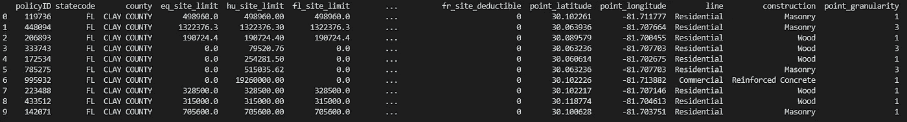

# 如何快速比较数据集

> 原文：<https://towardsdatascience.com/how-to-quickly-compare-data-sets-76a694f6868a?source=collection_archive---------5----------------------->

## 如何快速总结两个数据集之间的差异


Photo by [Joshua Sortino](https://unsplash.com/@sortino?utm_source=medium&utm_medium=referral) on [Unsplash](https://unsplash.com?utm_source=medium&utm_medium=referral)

时不时地，你会需要比较两个数据集；要么证明没有区别，要么强调它们之间的确切区别。根据数据的大小，您可能有许多选择。

在我的上一篇文章中，*用 Python 比较数据的 3 种快速方法，*我们讨论了许多比较数据的方法。然而，我们讨论的选项都不能给你一个快速、详细的摘要，或者让你适应数据集之间的微小差异。

[](https://medium.com/financeexplained/3-quick-ways-to-compare-data-in-python-65201be10b6) [## 在 Python 中比较数据的 3 种快速方法

### 对于任何从事分析工作的人来说，收到比较数据的请求都太熟悉了。不管那是…

medium.com](https://medium.com/financeexplained/3-quick-ways-to-compare-data-in-python-65201be10b6) 

在这篇文章中，我想给你提供另一种选择；我相信这将会非常有帮助。这一次，我想让您注意 DataComPy python 库。

# 什么是 DataComPy 库？

正如他们的 GitHub 页面上所强调的，DataComPy 库是一个用来比较两个熊猫数据帧并提供描述差异的人类可读输出的包。

示例输出如下所示:

```
DataComPy Comparison
--------------------DataFrame Summary
-----------------DataFrame  Columns   Rows
0  Original       18  36634
1       New       18  36634Column Summary
--------------Number of columns in common: 18
Number of columns in Original but not in New: 0
Number of columns in New but not in Original: 0Row Summary
-----------Matched on: policyid
Any duplicates on match values: No
Absolute Tolerance: 0
Relative Tolerance: 0
Number of rows in common: 36,634
Number of rows in Original but not in New: 0
Number of rows in New but not in Original: 0Number of rows with some compared columns unequal: 2
Number of rows with all compared columns equal: 36,632Column Comparison
-----------------Number of columns compared with some values unequal: 2
Number of columns compared with all values equal: 16
Total number of values which compare unequal: 2Columns with Unequal Values or Types
------------------------------------Column Original dtype New dtype  # Unequal   Max Diff  # Null Diff
0  eq_site_limit        float64   float64          1  190601.40            0
1  hu_site_limit        float64   float64          1   79375.76            0Sample Rows with Unequal Values
-------------------------------policyid  eq_site_limit (Original)  eq_site_limit (New)
2    206893                  190724.4                123.0policyid  hu_site_limit (Original)  hu_site_limit (New)
3    333743                  79520.76                145.0
```


Photo by [Franki Chamaki](https://unsplash.com/@franki?utm_source=medium&utm_medium=referral) on [Unsplash](https://unsplash.com?utm_source=medium&utm_medium=referral)

## 它是如何工作的？

DataCompPy 要求您提供一列(可以只有一列)作为连接的键。您还可以设置它，使它基于索引工作。如果库在连接键上检测到重复项，那么它将对剩余的字段进行排序，并根据该行号进行连接。

# 算出例子

让我们探索一些用例，并确保我们知道如何将其付诸实践。我们需要做的第一件事是安装库。打开命令行窗口，键入以下内容:

```
pip install datacompy
```

然后，我们可以继续在 Python 脚本中导入库。在示例中，我将使用一些本地样本数据集:

```
import datacompy, pandas as pddf1 = pd.read_csv('FL_insurance_sample.csv')df2 = pd.read_csv('FL_insurance_sample - Copy.csv')print(df1.head(10))
```

返回:



## 如何使用 DataComPy

要使用该库，您只需要以下脚本框架:

```
import datacompyimport pandas as pddf1 = pd.read_csv('FL_insurance_sample.csv')df2 = pd.read_csv('FL_insurance_sample - Copy.csv')compare = datacompy.Compare(df1,df2,join_columns='policyID',  #You can also specify a list of columns eg ['policyID','statecode']abs_tol=0, #Optional, defaults to 0rel_tol=0, #Optional, defaults to 0df1_name='Original', #Optional, defaults to 'df1'df2_name='New' #Optional, defaults to 'df2')print(compare.report())
```

要根据您的喜好调整上面的脚本，您需要注意以下几点:

*   *abs_tol* 和 *rel_tol* 分别代表*绝对公差*和*相对公差*。它们允许您指定数值之间的偏差公差。
*   您可以将 *join_columns* 替换为 *on_index=True* 来连接索引。
*   如果你想要两个数据集之间的交集，你可以使用*compare . intersect _ columns()*

查看 [*他们的文档*](https://github.com/capitalone/datacompy) 以了解特性的全部细节。

我希望你觉得这是有用的。

如果您觉得这篇文章有用，您可能还会对以下内容感兴趣:

[](/how-to-compare-large-files-f58982eccd3a) [## 如何比较大文件

### 了解如何使用 Python 比较大文件

towardsdatascience.com](/how-to-compare-large-files-f58982eccd3a) [](/building-a-python-ui-for-comparing-data-13c10693d9e4) [## 构建用于比较数据的 Python UI

### 如何快速让您的非技术团队能够比较数据

towardsdatascience.com](/building-a-python-ui-for-comparing-data-13c10693d9e4) [](https://medium.com/financeexplained/3-quick-ways-to-compare-data-in-python-65201be10b6) [## 在 Python 中比较数据的 3 种快速方法

### 对于任何从事分析工作的人来说，收到比较数据的请求都太熟悉了。不管那是…

medium.com](https://medium.com/financeexplained/3-quick-ways-to-compare-data-in-python-65201be10b6)