# 使用 PyTorch Lighting 简化和扩展您的 PyTorch 代码

> 原文：<https://towardsdatascience.com/how-to-refactor-your-pytorch-code-to-get-these-42-benefits-of-pytorch-lighting-6fdd0dc97538?source=collection_archive---------13----------------------->

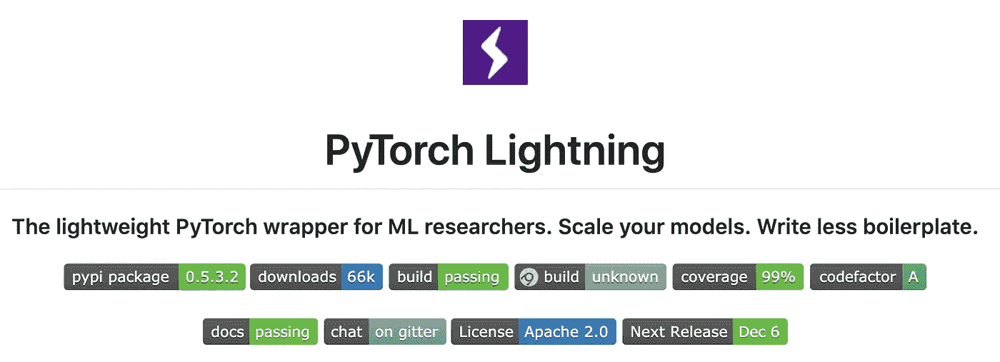

如果你没有听说过，现在有一个非常简单的方法可以使用 PyTorch，并免费获得非常先进的功能！

PyTorch Lightning 是 PyTorch 上的一个非常轻量级的包装器，它更像一个编码标准，而不是一个框架。如果您将 PyTorch 代码重构为 Lightning 格式，您将获得顶级研究团队的附加功能，而无需所有工作。这种格式可以让您摆脱大量的样板代码，并使其具有高度的可重复性。

酷吧。让我们从 PyTorch 库中获取[快速风格转换教程，并将其转换为 Lightning 格式。](https://github.com/pytorch/examples/tree/master/fast_neural_style/neural_style)

# 图像加载

首先，让我们定义一些工具来帮助我们操作图像

# 变压器

接下来，我们将定义变压器网络来处理输入(不是 BERT 使用的类型)。

# VGG 网

接下来，我们定义我们想要用于特征提取的 VGG 网

# 培训代码

前面的文件是独立的文件，我们通常希望它们与我们的主训练脚本分开。这不是闪电的事情，只是一般的软件工程最佳实践。

在本节中，我们定义了大部分培训逻辑。每个项目都有不同的做法。在最乐观的情况下，所有代码都在一个单独的(很长的)文件中，其中包含了您需要训练的所有要素。在正常情况下，该代码分布在多个文件中，这使得无法看到该方法的高级视图。

这是 PyTorch 回购的版本。

根据存储库的说明，您可以运行这个文件，它应该可以工作。

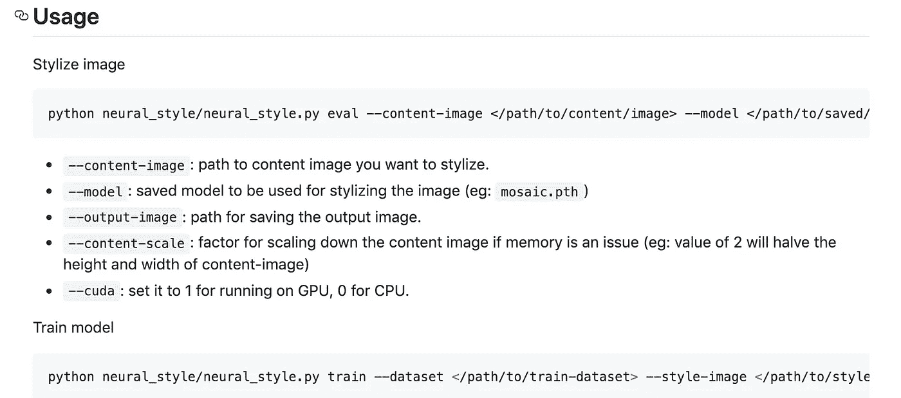

Running instructions

然而，这远非最佳。例如，如果您想使用 16 位精度呢？还是在多个 GPU 上训练？还是多机？还是加梯度积累？还是加早停？还是 tensorboard 测井？或者，或者，或者……—你明白了。这段代码会迅速膨胀，变得非常复杂。

这就是 PyTorch 闪电出现的地方。

# 步骤 1:设计照明模块

为了开始重构，我们需要浏览冗长的主文件，提取出我们将添加到 LightningModule 中的真正重要的内容。

**照明模块**

我们创建了一个名为 *FastStyleTransfer* 的类，它将样式传输的主要成分包含在一个 lightning 模块中:

现在我们寻找闪电模块的主要成分:

1.  优化器，学习率调度程序
2.  培训、验证和测试数据
3.  训练循环中会发生什么
4.  验证循环中发生了什么
5.  模块执行什么计算(转发)

**模型计算**

首先，让我们找到这个模型的核心计算。这很难，因为这些总是分散在代码中，这使得核心科学贡献很难精确定位。

首先，看起来我们需要这个变压器:

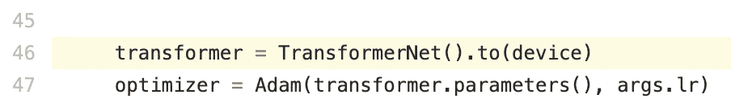

看起来我们也需要这张 VGG 网:

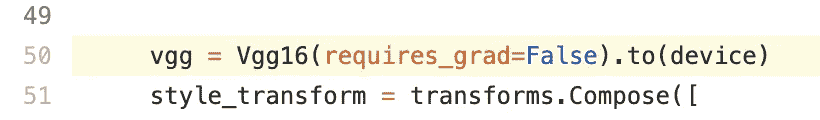

看起来我们在这里也做了一些预训练循环缓存:

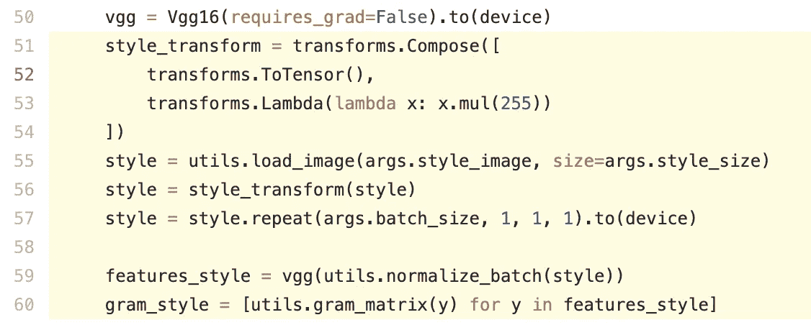

因为我没有读过这篇特别的论文，但是我熟悉风格转换，看起来他们在预先计算 gram_matrix。像这样的任何类型的缓存操作都是 __init__ 函数的很好的候选，这个函数在 Lightning 中只被调用一次。

看起来这是核心的计算部分。在 lightning 中，我们将这些整合到一个功能中

注意一些事情:

1.  现在很清楚这篇论文的主要计算单位是什么了。
2.  我将一组超参数(hparams)传递给构造函数。这是可选的，但几乎是标准的做法。这通常是一个 Argparse 对象。
3.  注意我们去掉了对 GPU 的任何调用(例如:没有。todevice()或。cuda())…闪电会帮你处理的。

现在，如果你想理解这篇论文的代码，你可以看看 init，知道这篇论文需要一个 VGG 网，一个 gram_style 矩阵和一个 convnet(他们称之为 transformer)。记住，这不是 BERT 中使用的变压器网络。

**训练循环**

接下来我们看看计算是如何应用的。通常这是在内部循环中(所有的东西在批处理之后和之前。向后)

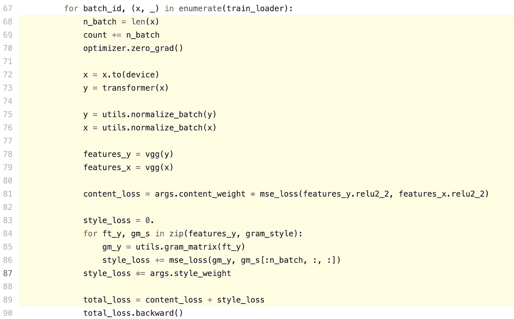

注意这段代码非常混乱。有大量调用将内存转移到 gpu(。到(设备))。有管理计数器(coung+= n_batch)等…

这是深度学习项目 80%的复杂性所在。让我们把这个移到我们的照明模块。

内部训练循环(上面黄色的东西)进入 training_step。training_step 实际上只是在黄色代码所在的位置被调用:

注意关于 training_loop 的一些事情:

1.  现在发生的事情非常清楚。对于快速风格转换，使用 convnet(变压器)对输入进行编码，归一化，通过 vgg 运行每个输入，然后计算一些损耗。
2.  没有提到 optimizer 或 zero_grad 或任何有关培训的内容。
3.  没有对的调用。cuda 或 gpu 内存管理。
4.  forward 中的东西不需要在 forward 函数中。可以在 training_step。但是如果你想在产品中使用这个模型，或者在一个 API 后面，或者与其他 PyTorch 代码一起使用，你通常想把核心计算的东西放在前面。

这里要传达的信息是，要理解一篇论文在做什么，你所要做的就是看看 lightning 模块的 training_step！

**优化器**

我们需要做的最后一件事是告诉 Lightning 使用什么优化器。我们在第 47 行找到了优化器:

我们将把这个优化器添加到这个 lightning 模块函数中:

如果我们在训练更复杂的东西(比如 GAN)，我们可以在这里返回多个优化器。对于您返回的每个优化器，您还可以添加一个学习率调度器。

然而，这项工作只使用了一个优化器。

**数据加载器**

接下来，我们寻找培训、验证和测试数据加载器。如果他们不使用数据加载器，你必须转换他们的代码来使用数据加载器

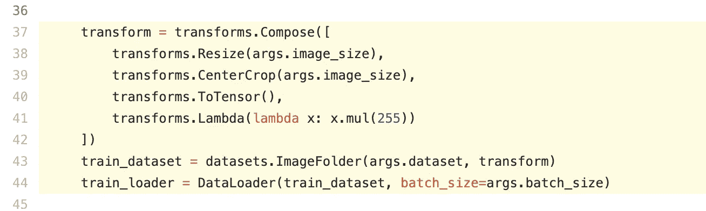

幸运的是，我们找到了这个数据加载器代码。现在我们把它变成闪电。

Lightning 还允许您为验证和测试定义不同的数据加载器。这是同一个想法:

装饰器 data_loader 确保您的数据只被调用一次。但是，如果您需要重新加载每个纪元或做一些更深奥的事情，可以选择禁用它。

就是这样！现在我们有了完整的照明模块:

在底部，我们做了一个小小的添加。每个项目都有一组通常通过 ArgumentParser 传递的参数。然而，这些论点中有些是针对整个项目的，有些只适用于这个特定的 LightningModule。最好在 LightningModule 中耦合这些参数，这样就可以很容易地看到参数是从哪里传入的。

**训练**

就是这样！我们只是将所有需要的相关代码提取到一个 LightningModule 模块中。现在我们创建一个培训脚本，它将为我们运行培训。如果我们有其他项目或不同的风格转换方式，我们可以使用同一个教练来运行它们，只要它们是照明模块。

就是这样！教练将自动运行你的照明模块，并处理所有复杂的训练。有了上面这三行，你就获得了训练循环所需的一切:

1.  自动后退，步进
2.  自动验证检查
3.  自动张量板
4.  自动提前停止
5.  自动检查点
6.  …大约 100 种其他免费的东西。

如果你想在几个图形处理器上运行？

如果您想要在 32 个节点上运行，每个节点有 8 个 GPU？

您可以使用这样的 SLURM 脚本提交这个任务:

这就是事情的全部。

# 展开性

但是等等，你会说…这对于你的用例来说太简单了？别担心，闪电是由我设计的(我的研究都是在 NYU 和费尔进行的)，对研究人员来说是尽可能灵活的。以下是一些例子:

需要自己的后传？覆盖此挂钩:

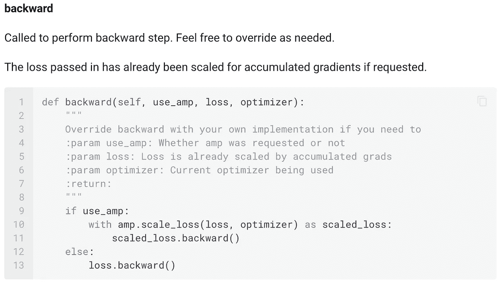

需要自己的放大器初始化吗？覆盖此挂钩:

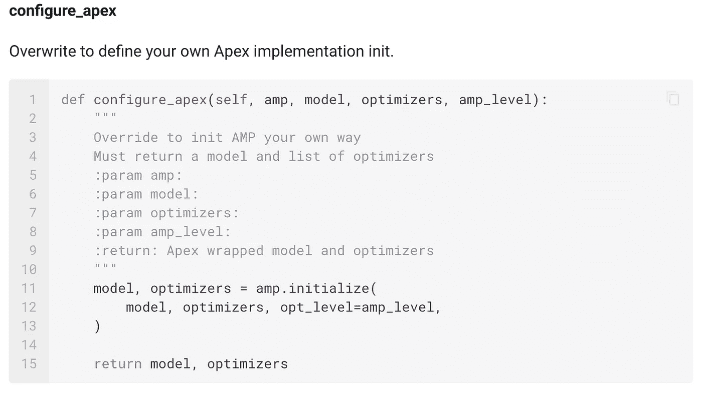

想深入到添加自己的 DDP 实现吗？覆盖这两个挂钩:

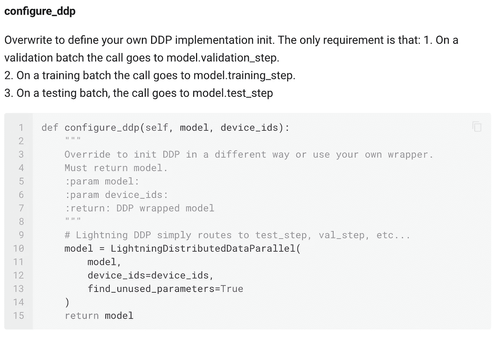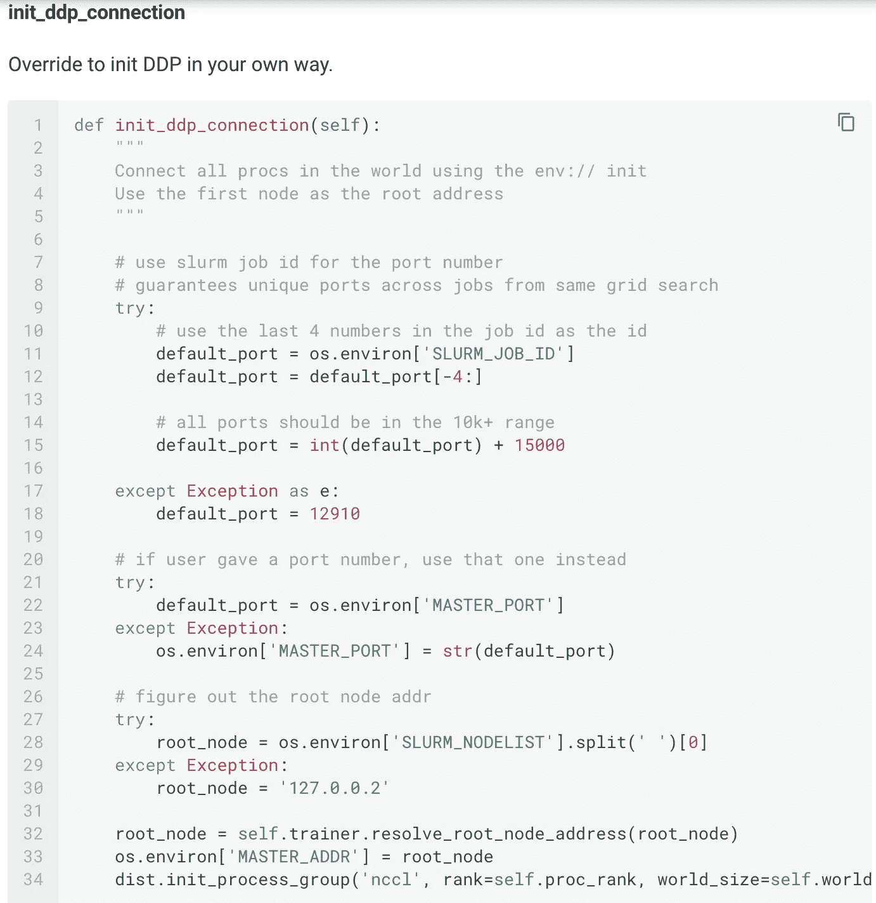

像这样的钩子有 10 个，我们会根据研究人员的要求增加更多。

底线是，对于一个新用户来说，Lightning 使用起来很简单，如果你是一名从事前沿人工智能研究的研究人员或生产团队，它可以无限扩展。

# 项目健康

还记得那些你不必写的代码吗？闪电[测试](https://travis-ci.org/williamFalcon/pytorch-lightning)它和[文件](https://pytorch-lightning.readthedocs.io/en/latest)它超级适合你。此外，我们有超过 [**53**](https://github.com/williamFalcon/pytorch-lightning/graphs/contributors) 的贡献者——许多来自世界顶级人工智能实验室，每天都在添加新功能。

最后，我们有非常清晰的[贡献者指南、核心价值观](https://github.com/williamFalcon/pytorch-lightning/blob/master/.github/CONTRIBUTING.md)和极高的代码质量标准。我们使用持续集成进行测试，通常使用闪电标志的各种排列来训练完整的模型。

# **全部功能**

Lighting 有超过 42 个功能，通过标志或挂钩实现，让您对研究/生产过程的每个部分进行无限控制。

今天试试[闪电](https://github.com/williamFalcon/pytorch-lightning)！