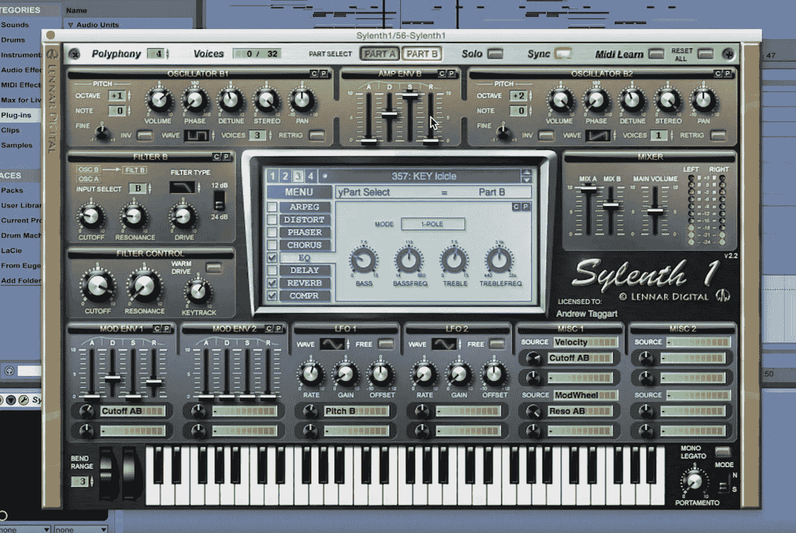
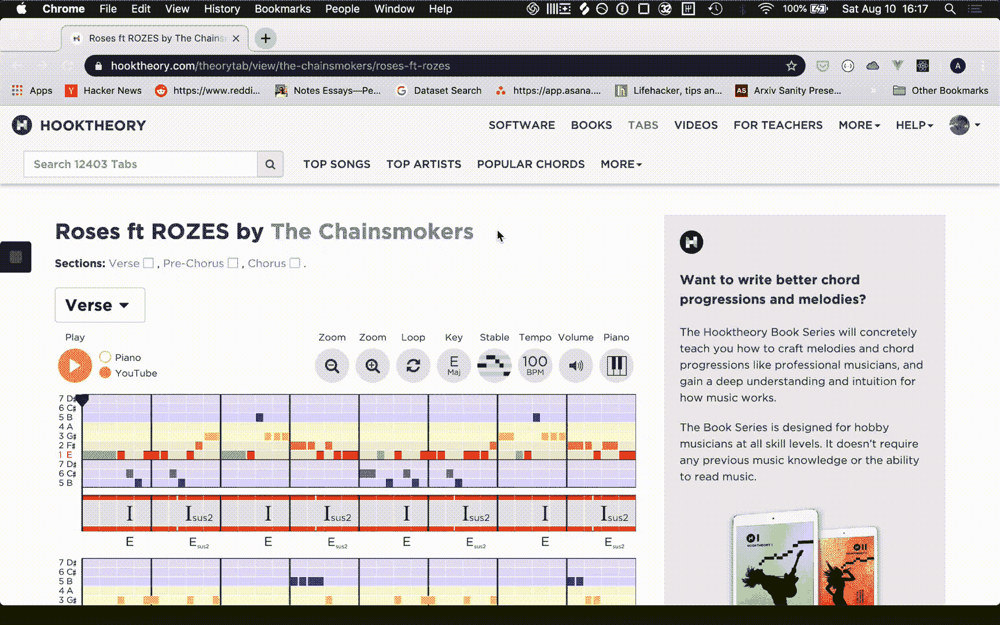
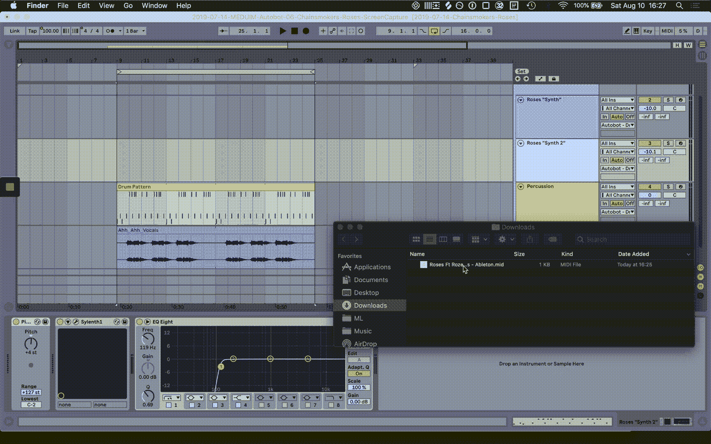
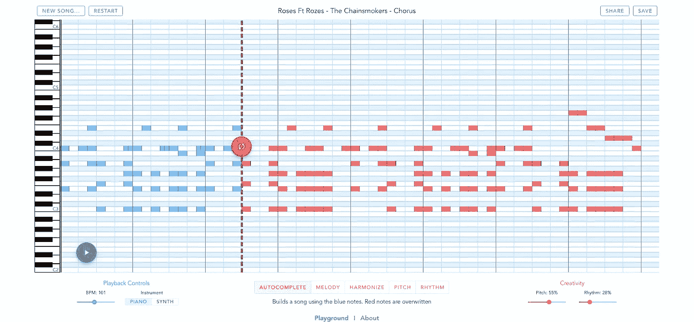
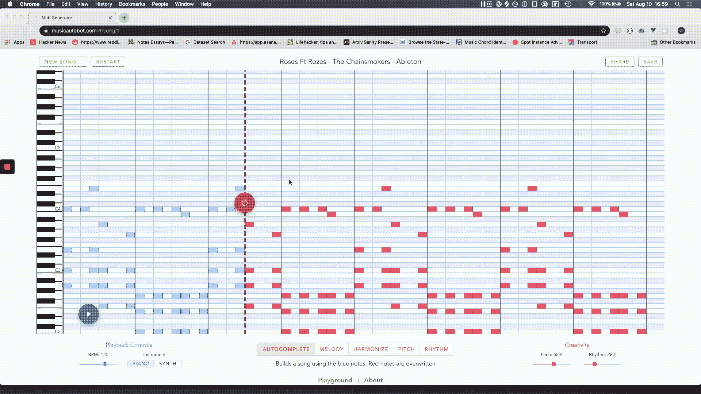
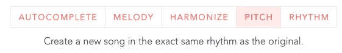
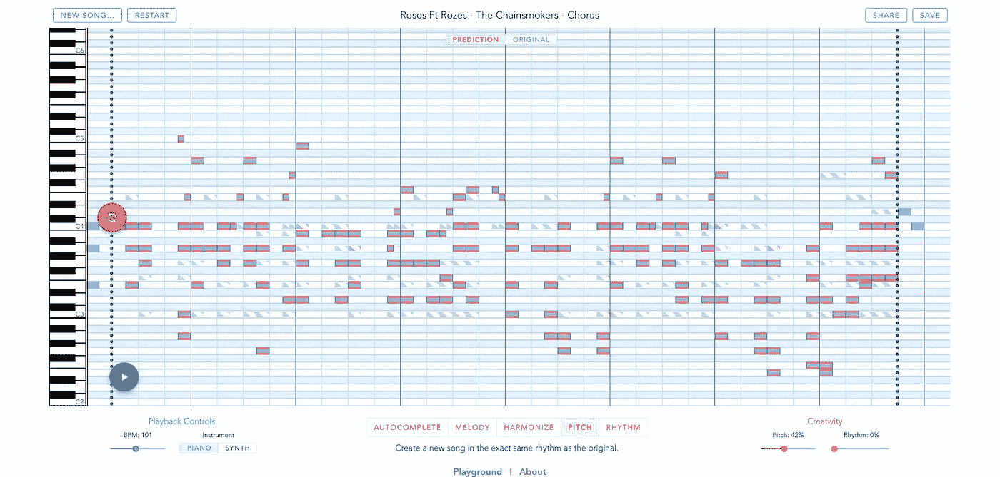
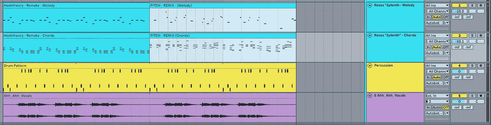
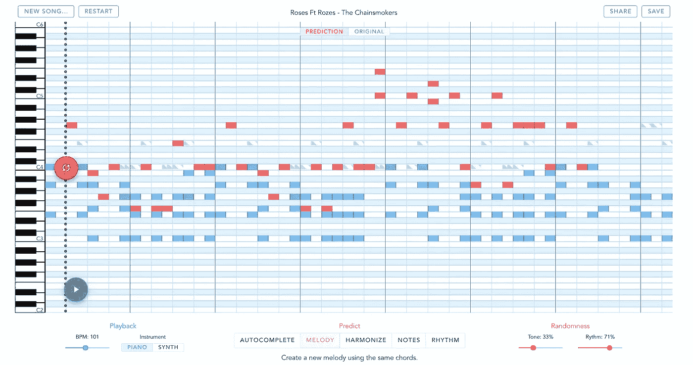

# 用人工智能制作烟鬼混音。

> 原文：<https://towardsdatascience.com/how-to-remix-the-chainsmokers-with-a-music-bot-6b920359248c?source=collection_archive---------11----------------------->

这是“建造人工智能音乐发生器”系列的第四部分(也是最后一部分)。我们将使用我们的多任务音乐模型来混音一首 EDM 歌曲。它将专注于音乐制作，仅用于娱乐目的。

*以防你错过:* [*第一部*](https://medium.com/@andrew.t.shaw/creating-a-pop-music-generator-with-the-transformer-5867511b382a) *，* [*第二部*](https://medium.com/@andrew.t.shaw/practical-tips-for-training-a-music-model-755c62560ec2) *，* [*第三部*](https://medium.com/@andrew.t.shaw/a-multitask-music-model-with-bert-transformer-xl-and-seq2seq-3d80bd2ea08e) *。*

在本帖中，我们将重新混音排行榜冠军歌曲——烟鬼乐队的《玫瑰》。首先，我们将使用 Ableton 和 HookTheory 重新创建合唱。然后，我们将使用我们的 MusicTransformer 模型来生成新的旋律。

这是它听起来的一个小秘密:

# **背景**

之前，我们向您展示了如何构建和训练音乐模型。结果很酷，但似乎缺少了些什么…

> 更多的生产！！！

大家都知道，想要你的歌有更大的冲击力，就需要层层叠叠的声音。

我不知道怎么做到的，但是*烟鬼* ***做到了*** 。

所以让我们从他们的歌曲《玫瑰》的副歌部分借用一些声音。
如果你不知道，这里是 drop(又名合唱):

# 第一部分。在阿伯顿重建合唱团

我们的第一步是将歌曲分解成各个部分——乐器、音符、鼓和人声。这样我们就可以在混音时重复使用这些元素。

## 构建那个引导音

“烟鬼”在“玫瑰”上做了一个非常酷的大师课，他们解释了他们是如何创造出这些听起来很棒的合成器的。

事实证明，这些乐器中的很多都受到了 Sylenth 预设的极大启发。如果你不知道 Sylenth，它是一个虚拟合成器，带有许多开箱即用的优秀乐器(预设)。

以下是他们在合唱中的领唱:



我们所需要做的就是加载相同的预设，并修改与他们相同的参数。现在我们有了领先的合成器！

## 抄写这首歌

[HookTheory](https://www.hooktheory.com/theorytab/view/the-chainsmokers/roses-ft-rozes) 恰好有这首歌的确切音符和和弦。



让我们将 MIDI 导出并导入到 Ableton！

## 制作其他层

鼓:我用我所有的样本用耳朵重现了节拍。

人声:谢天谢地，人声样本可以在网上找到。烟鬼们举办了一场混音比赛，他们在比赛中发布了录音。

## 把这一切都投入到艾伯顿



以下是我们的盗版翻拍听起来像:

够好了。现在让我们重新混合一下。

# 第二部分。REEEE-MIX！！

是时候使用[上一篇](https://medium.com/@andrew.t.shaw/3d80bd2ea08e)的多任务音乐模式了。

让我们把之前下载的原始 MIDI 音符作为我们模型混音的基础。

这是音乐机器人:

[](https://musicautobot.com/#/song/3cc8e692016fb1d8c8f097e259ea1ea5)

You can play the original song [here](https://musicautobot.com/#/song/3cc8e692016fb1d8c8f097e259ea1ea5).

现在我们都准备好开始生成了。

我将向你展示两种不同的混音方式，但这是从开始到结束的一般流程:



## 我们的第一次令牌屏蔽混音

为了创作我们的第一首混音，我们要预测歌曲的“音高”。换句话说，我们将删除一些音符(仅音高)，并让模型填充空白。

**输入:**音符音高被擦除/屏蔽。音符长度保持不变。

**预测语境**:概念上，模型知道原曲的节奏，但不知道听起来是什么样的(歌曲音高被屏蔽)。

**输出:**期望得到一首音符完全不同，但节奏相同的歌。

## 我们开始吧。

1.  将预测类型切换到“音高”。



2.按下那个神奇的按钮，我们就会得到:

[](https://musicautobot.com/#/predict/60f8c1b517b0a658d7e4cca1dfb29a4c)

Link to remix [here](https://musicautobot.com/#/predict/60f8c1b517b0a658d7e4cca1dfb29a4c)

```
**Red/Blue** notes are the predictions. 
**Green/white-striped** notes are from the original melody
```

*观察*:

*   所有的音符都改变了音高，但保持相同的位置和持续时间。这正是我们所希望的。请记住，只有音符音高被抹掉。
*   序列最末端的蓝色音符完全没有遮盖。它有助于保持几个完整的笔记作为模型的指南。

3.保存预测输出，并将其拖到我们的 Ableton 项目中:



4.这是我们的创作！

大约需要 5 次尝试才能产生听起来合理的东西。你可以通过向下拨动右下角的“创造力”控制键来选择更高的稳定性。

# 创作新的旋律

重新混合“音高”产生了完全不同的声音和风格。这一次，我们将保留更多的原始特征，并保持和弦进行不变。

**输入**:歌曲的原和弦进行。旋律被完全抹去。

**预测上下文**:seq 2 seq 模型将使用和弦并将它们“翻译”成新的旋律。

**输出:**与原和弦配合良好的新旋律。

## 同样的步骤，不同的开关。

1.  切换“旋律”开关并按下红色按钮:

[](https://musicautobot.com/#/predict/b706f787822bc69912648aee491fc157)

Link to remix [here](https://musicautobot.com/#/predict/b706f787822bc69912648aee491fc157)

```
**Red notes** are the predictions. 
**Blue notes** are the chords (used by the model to predict the melody). 
**Green/white-striped notes** are the original melody
```

2.将预测导入到 Ableton 中，我们可以得到:

嗯，还不错！

## 自己试试吧！

如果你拥有 Ableton，你可以在这里下载整个项目[。](https://drive.google.com/open?id=1JN8A8k5KAekhWGYOGpohvtU08ZeSbxOr)

# 关于音乐一代人工智能的结束语

我想我们都同意这个人工智能远没有达到人类的水平。

我使用了链锯“drop ”,因为一只带键盘的猴子可以产生 MIDI 音符，用那些原始的合成器和人声听起来很棒。制作和编曲一首完整的歌曲更是一项艰巨的任务。

然而，人工智能在音乐中仍然有很多价值。虽然这种模式不会马上创造出惊人的成功……但更多地把它看作是制片人/作曲家激发新想法的另一种工具。

就像烟鬼们把 Sylenth 中的一个预设变成了一个令人敬畏的主音一样，我认为 [MusicAutobot](https://musicautobot.com) 也可以以同样的方式充当灵感启动器。

# 感谢你大老远跑来。

构建和分享这个个人项目对我来说是一大乐趣，我希望它对你来说也是一点娱乐。

我将很快发布另一个系列，介绍如何在网络上部署深度学习模型——使用 Flask、Vue 和 Github 页面。你可以[在媒体上关注](https://medium.com/@andrew.t.shaw)我来了解这方面的更新。

我也很乐意听到你的反馈或者关于你已经建立或创造的任何东西！在[推特](https://twitter.com/bearpelican)上联系我。

> 向了不起的人大声喊出来[胡克理论](https://www.hooktheory.com)让这一切成为可能[耶鲁安](https://www.thehim.com)给灵感