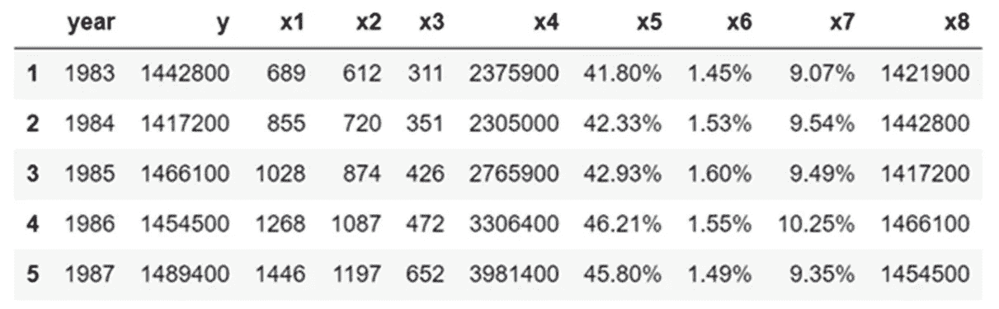
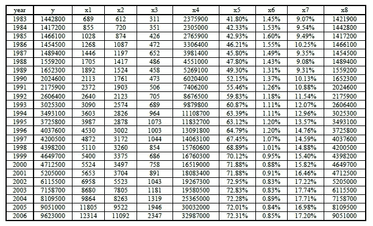
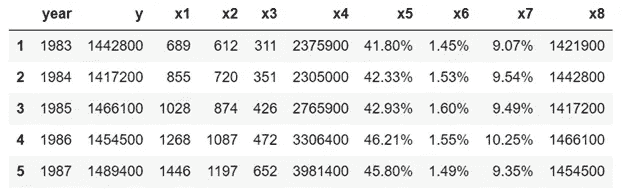
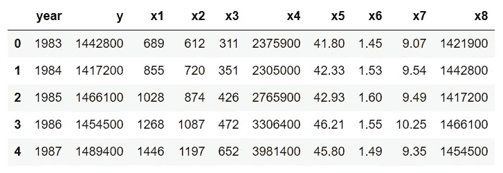

# 如何从数据表中删除%符号

> 原文：<https://towardsdatascience.com/how-to-remove-sign-from-data-table-baa37598982a?source=collection_archive---------18----------------------->

## 将包含%符号的列从字符串转换为数字类型



**Columns x5, x6, and x7 contain the % sign, and hence are treated as string type so they can’t be used for numerical calculations.**

数据争论是将原始的非结构化数据转换为可用于进一步分析(如数据可视化或建模)的形式的过程。有时，在讨论完数据后，您可能会注意到一些列可能包含符号，如美元符号($)、加号(+)、减号(-)或百分号(%)。任何包含这些符号之一的数据列都被视为字符串类型，因此不能用于数值计算。

在本文中，我将展示如何从数据列中删除百分号(%)。然后，一旦%符号被删除，我们将把列从字符串转换为数字类型，使其适合数字操作和计算。可以使用类似的方法来删除不需要的符号，如加号(+)、减号(-)等。

我将用一个从 pdf 文件中提取的数据集来说明这个例子，如下所示:



**Data table originally in a pdf file**. **Source of original file:** [**http://www.ijastnet.com/**](http://www.ijastnet.com/)**.**

**a)将表格复制并粘贴到 Excel 中，并将文件保存为 table_1_raw.csv**

数据以一维格式存储，必须进行整形、清理和转换。

**b)导入必要的库**

```
import pandas as pdimport numpy as np
```

**c)导入原始数据并重塑数据**

```
df = pd.read_csv("table_1_raw.csv", header=None)df2 = pd.DataFrame(df.values.reshape(25,10))column_names = df2[0:1].values[0]df3 = df2[1:]df3.columns = df2[0:1].values[0]df3.head()
```



**d)使用字符串处理工具执行数据辩论**

我们从上表中注意到，列 **x5** 、 **x6** 和 **x7** 是用百分比表示的，因此我们需要去掉百分比(%)符号:

```
df4['x5'] = list(map(lambda x: x[:-1], df4['x5'].values))df4['x6'] = list(map(lambda x: x[:-1], df4['x6'].values))df4['x7'] = list(map(lambda x: x[:-1], df4['x7'].values))
```

**e)将数据转换成数字形式**

我们注意到列 **x5** 、 **x6** 和 **x7** 的列值具有字符串数据类型(即使在删除了%符号之后)，因此我们需要将它们转换为数字数据，如下所示:

```
df4['x5'] = [float(x) for x in df4['x5'].values]df4['x6'] = [float(x) for x in df4['x6'].values]df4['x7'] = [float(x) for x in df4['x7'].values]
```

**f)查看转换数据的最终形式**

```
df4.head(n = 5)
```



**g)将最终数据导出至 csv 文件**

```
df4.to_csv('table_1_final.csv',index = False)
```

总之，我们已经展示了如何从数据列中删除百分号(%)，以及如何将该列转换为数字类型以使其适合数字计算。可以使用类似的方法来删除不需要的符号，如加号(+)、减号(-)等。