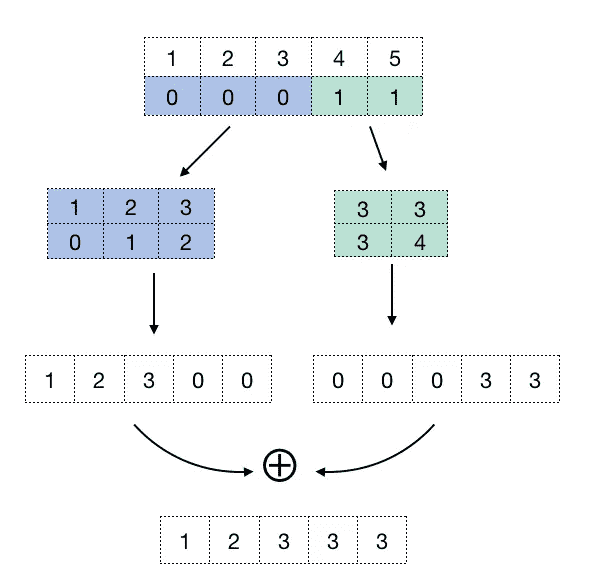

# 如何用 TensorFlow-2.0 替换张量中的索引值

> 原文：<https://towardsdatascience.com/how-to-replace-values-by-index-in-a-tensor-with-tensorflow-2-0-510994fe6c5f?source=collection_archive---------6----------------------->

## NumPy 中一个看似简单的操作如何在一些不幸的情况下变成 TensorFlow 的噩梦


你有没有尝试过根据数组的索引只替换数组的某些值？

```
>>> import numpy as np
>>> a = np.array( [1,2,3,4,5] )
>>> print(a)[1 2 3 4 5]>>> i = [ 0, 1, 3 ]
>>> a[i] = -1
>>> print(a)[-1 -1  3 -1  5]
```

一个更复杂的用例可能是，例如，将某个阈值以上的所有值削波到最大值:

```
>>> import numpy as np
>>> a = np.array( [1,2,3,4,5] )
>>> print(a)[1 2 3 4 5]>>> a_max = 3
>>> i = np.where( a > a_max)
>>> a[i] = a_max
>>> print(a)[ 1  2  3  3  3]
```

事实证明，如果数组由一个**张量**表示，这种明显简单的操作在 TensorFlow 中是不允许的(但如果数组是一个 [tf，这种操作是允许的。变量](https://www.tensorflow.org/api_docs/python/tf/Variable)对象)。如果您尝试，最有可能的结果是这样的错误:

```
AttributeError: 'tensorflow.python.framework.ops.EagerTensor' object has no attribute 'assign'
```

事实上，我必须承认，我花了很长时间才想出如何解决这个经常出现的问题。在 StackOverflow 上有很多问题，人们在那里讨论同一个问题(例如，见[这个](https://stackoverflow.com/questions/42883415/how-to-replace-a-value-within-a-tensor-by-indices?noredirect=1&lq=1))。我认为从 TensorFlow 操作的角度来看，最简单的方法是过滤希望*将*保留在一个向量中的元素，创建另一个向量，用希望替换的屏蔽值来“填充空白”(*例如*零、无穷大、一些其他默认值)，最后给出两者之和的结果。

我在这里给出一个例子来过滤一个向量的前 k 个元素，但是这个过程是非常通用的，包括以下步骤:

1.  确定要删除的索引。通常，它们由布尔值向量表示，如**【真、假、假、…、真】**
2.  将这个向量转换成包含实际索引的两个数组( **idx_keep** ， **idx_replace** )。这可以用很多方法来实现，但是我相信使用 **tf.where** 是最简洁的方法。
3.  用要替换的值创建一个向量。在这个例子中，新值将是 *-inf* ，复制 *N* 次，其中 *N* =要替换的元素的数量= **len(idx_replace)**
4.  用要保留的值创建一个向量。我通过使用函数 **tf.gather( a，idx_keep )** 来完成这个任务，这个函数几乎相当于类似于 **a[[0，1，3]]** 的东西
5.  创建上面两个集合的稀疏向量。恼人的部分是稀疏向量的索引必须是 2D，即使只有一维。我做的方法是创建零向量，然后我把它们和索引向量“堆叠”在一起。
6.  将两个稀疏向量转换为密集向量，并将它们相加。
7.  返回结果。

下面是一个代码示例:



A graphical representation of the workflow

不可否认，至少对于一些特定的情况，比如上面描述的裁剪，存在一个基于三参数版本的`tf.where`的更快的解决方案:

```
result = tf.where(condition, x, y)
```

返回的张量包含条件为`True`的`x`元素和条件为`False`的`y`元素。因此，在我们的例子中，上述函数可以简化为:

```
a = tf.where(tf.less_equal(a, a_max), a, a_max)
```

或者更明确地说:

```
def top_k_filtering(logits, top_k=5):
   "Set values less than the k'th largest to -Inf."
   kth_largest = tf.math.top_k(logits, top_k)[0][-1]
   return tf.where(logits < kth_largest, -Inf, logits)
```

跟 TensorFlow 玩得开心！