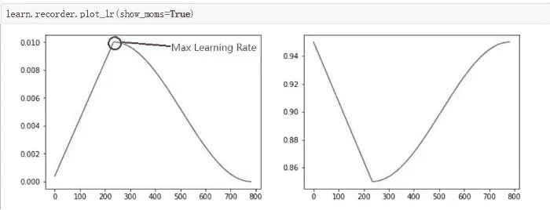
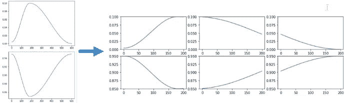

# 如何在 fastai 中恢复中断的训练课程

> 原文：<https://towardsdatascience.com/how-to-resume-an-interrupted-training-session-in-fastai-77c4f36cd3a1?source=collection_archive---------13----------------------->

## 如果使用 fit_one_cycle 的训练中途中断，该怎么办？


Courtesy of Gratisography@Pexels

如果您有一个庞大的数据集、一个庞大且训练缓慢的网络，并且您的训练会话在几个小时的训练后被中断，您会怎么做？发生这种情况的原因有很多:

*   因为你在谷歌 Colab 笔记本上达到了你的连续 12 小时“免费”操作时间；
*   您暂时失去了与 Colab 或 Kaggle 的联系；
*   因为你的电脑因为某种原因停了。我住在巴西，电力短缺是常事…

fast.ai 采用的 *fit_one_cycle()* 方法使用变化的、自适应的学习速率和*动量*，遵循速率先增加后减少的曲线，而*动量*则相反，如下图所示。



Cyclical learning rate and momentum variation in **fit1cycle**. Learning rate highlighting by Roger Mao.

如果您在第 10 个时段(比如说 20 个时段)中中断训练，然后再次开始 9 个时段以上的训练，**您将不会获得与不间断地训练 20 个时段相同的结果，**因为从头开始的新训练，即使您从上一个时段加载权重，也将采用新的学习速率和动量策略，并再次经历该循环。你想要的是从你在循环中被打断的地方开始。



Learning rate and momentum graphs for one ***fit1cycle*** training policy, divided into three consecutive training sessions. Image by PPW@GitHub

# 什么是 fit1cycle？

Fit1cycle 是 Leslie N. Smith 开发的超收敛策略。它被用作 fast.ai 中的标准培训策略。有关详细信息，请参见下文:

*   [https://docs.fast.ai/callbacks.one_cycle.html](https://docs.fast.ai/callbacks.one_cycle.html?source=post_page---------------------------)
*   神经网络超参数的训练方法:第 1 部分——学习速率、批量大小、动量和权重衰减—[https://arxiv.org/abs/1803.09820](https://arxiv.org/abs/1803.09820?source=post_page---------------------------)
*   超级收敛:使用大学习率快速训练残差网络—[https://arxiv.org/abs/1708.07120](https://arxiv.org/abs/1708.07120?source=post_page---------------------------)

如果你想看更多的论文，请点击这个链接:[莱斯利·n·史密斯论文。](https://arxiv.org/search/cs?searchtype=author&query=Smith%2C+L+N)我们不会在这个帖子中进入细节。媒体上有几篇帖子以简单易懂的方式介绍和讨论了*第一轮*训练政策:

*   [karan Bir Chahal 将训练神经网络的速度提高了 10 倍；](https://link.medium.com/k7eBAlLwDY)
*   [Yogesh gur jar 内置正则化的超收敛；](https://link.medium.com/D8uQlAFwDY)
*   超收敛:Aditya Gupta 使用大学习率非常快速地训练神经网络；
*   [Fast.ai Part1 v2/v3 笔记—学习率—从 SGDR 到 1cycle 和超收敛(Roger Mao)；](https://link.medium.com/tpmouPzwDY)
*   [用 fastai 复制 Leslie N. Smith 的论文。](http://Reproducing Leslie N. Smith’s papers using fastai” by Kushajveer Singh)

Kushajveer Singh 的最后一个帖子是一个非常有说明性的 Jupyter 笔记本，值得一看。还有一篇来自 [Nachiket Tanksale](https://towardsdatascience.com/@nachiket.tanksale) 的非常有趣的文章，名为[寻找好的学习率和单周期政策](/finding-good-learning-rate-and-the-one-cycle-policy-7159fe1db5d6)，其中讨论了周期学习率和动量。

# 我如何恢复训练？

为此，您必须首先能够记录您停止的位置，然后从该点恢复训练周期，并使用该周期部分的正确超参数。你要做的第一件事就是保存你的网络:

```
# Do not forget to import the callback function
from fastai.callbacks import SaveModelCallback# Train with the callback function set to save weights every epoch
learn.fit_one_cycle(20, max_lr=slice(1e-5,1e-6), 
       callbacks=[SaveModelCallback(learn, every='epoch',  
                  monitor='accuracy', name='saved_net')])
```

这将使您的网络在每个时期都被保存，您提供的名称后跟*_ #时期*。所以在时段#3，文件 *saved_net_3.pth* 将被写入。您可以在完成以下操作后加载此文件:

*   重新创建了*数据束*和
*   用这个特定的数据集群重新实例化了网络。

重装*后。pth* 文件，你可以重新开始你的训练，只是你要再次告诉 *fit_one_cycle* 考虑 20 个历元，而是从历元#4 开始训练。

Fast.ai 采用特殊的回调来实现这一点。要了解如何做到这一点的细节，请看这里:

*   [把一个长周期的政策分成几个小周期——PPW 的 GitHub](https://github.com/PPPW/deep-learning-random-explore/tree/master/divide_1cycle?source=post_page---------------------------)

**怎么编码？**

fast.ai 中的 *fit_one_cycle* 方法已经开发出来，允许您告诉它从周期的哪个部分恢复中断的训练。恢复培训的代码如下所示:

```
# Create a new net if training was interrupted and you had to 
# restart your Colab sessionlearn = cnn_learner(data, models.<your_model_here>, 
                    metrics=[accuracy, error_rate])# If you're resuming, only indicating the epoch from which to 
# resume, indicated by ***start_epoch=<epoch#>*** will load the last 
# saved .pth, it is not necessary to explicitly reload the last 
# epoch, you only should **NOT** change the name given in 
# name=<callback_save_file>: when resuming fast.ai will try 
# to reload ***<callback_save_file>_<previous_epoch>.pth***# Unfreeze the network
learn.unfreeze()# Use start_epoch=<some_epoch> to resume training...
learn.fit_one_cycle(20, max_lr=slice(1e-5,1e-6), 
                    ***start_epoch=<next_epoch#>***,
                    callbacks=[SaveModelCallback(learn, 
                    every='epoch', monitor='accuracy', 
                    ***name=<callback_save_file>***)])
```

…fast.ai 会告诉你“*已加载<回调 _ 保存 _ 文件> _ <上一个 _ 纪元# >* ”，恢复训练。

您可以在此查看 *fit_one_cycle* 方法支持的所有参数:

*   [https://docs.fast.ai/train.html#fit_one_cycle](https://docs.fast.ai/train.html?source=post_page---------------------------#fit_one_cycle)

# 如何将这种恢复策略嵌入到我的网络中？

这篇文章的重点是告诉你如何在 fast.ai 中轻松恢复训练，如果被中断的话。如果你是 fast.ai 的新手，为了找到一些背景并学习如何将上面的代码集成到训练网络的整个过程中，请查看我们在下面的 TowardsDataScience 中的帖子:

图像分类:

*   [*深度学习用 fastai 诊断皮肤图像*——*学习从皮肤镜图像中识别皮肤癌和其他病症*](/deep-learning-for-diagnosis-of-skin-images-with-fastai-792160ab5495?source=post_page---------------------------)Aldo von Wangenheim；
*   [Aldo von Wangenheim 利用 fastai 进行疟疾检测的深度学习和医学图像分析](/deep-learning-and-medical-image-analysis-for-malaria-detection-with-fastai-c8f08560262f?source=post_page---------------------------)；

语义分割:

*   [人工智能&古生物学:利用深度学习搜索微化石](/artificial-intelligence-paleontology-use-deep-learning-to-search-for-microfossils-18760bb30880)奥尔多·冯·万根海姆；

# 我们学到了什么？

在这篇文章中，我们简要介绍了 fast.ai 采用的超级收敛 *fit1cycle* 训练策略，并展示了一些易于阅读的发布材料，如果你想深入研究，可以使用这些材料，而不必阅读 Leslie N. Smith 的科学论文。

我们还向您展示了如何以一种非常简单实用的方式，使用 fast.ai 的 *fit_one_cycle()* 方法的一些附加参数来执行完全可中断和可恢复的训练周期。