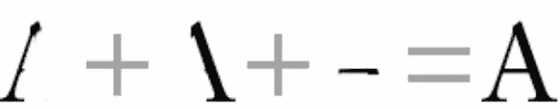
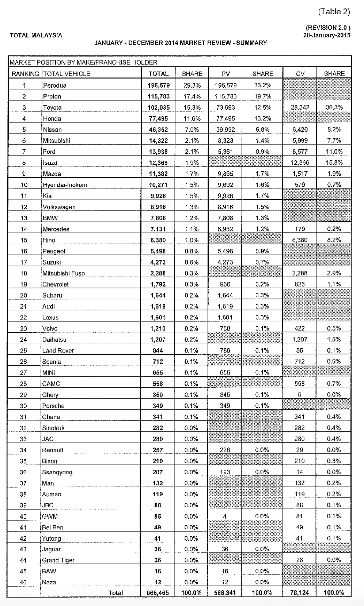
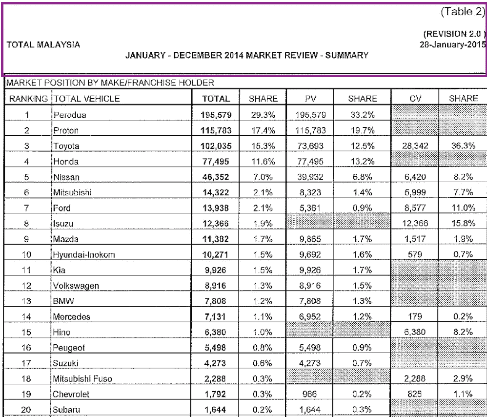

# 如何从复杂格式的文件中检索数据

> 原文：<https://towardsdatascience.com/how-to-retrieve-data-from-a-complex-formatted-file-894098d66e74?source=collection_archive---------17----------------------->

## 我从 PDF 扫描图像中提取数据的方式

当我提取数据对马来西亚汽车市场进行[分析时，我遇到了如何检索干净数据的问题。](/a-deeper-look-into-malaysia-vehicles-industry-c114fda97d36)

我一直在谷歌上寻找可能有其他来源获得数据，但我没有找到答案。起初，我以为 [**pdfMiner**](https://euske.github.io/pdfminer/index.html) 能够从 PDF 中提取一些文本，但都是 PDF 文件中的扫描图像。这是我唯一能得到的消息来源。

我很震惊，并感到累了，只是得到数据，并开始我的分析。过了一会儿，我尽力让引擎再次启动，谷歌搜索我找到了一个答案——OCR(光学字符识别)。

OCR 是一种识别数字或手写字符的技术。我发现最常用的库是 Python 中的 Tesseract OCR，这是一个由惠普公司发起的开源项目。在 Google 接手开发后，Google 发布了最稳定的基于深度学习框架的版本 4 . 0 . 0——LSTM(long short memory)。

简单来说，OCR 会逐行读取，逐字符识别字符，有两种

1.  模式识别
2.  基于特征的识别

## 1.模式识别

20 世纪 60 年代，一种叫做 **OCR-A** 的特殊字体被开发出来，用于银行支票等。所以，在当时，字体、笔画和字体大小都是标准化的，这样它就可以很容易地被识别为一个字符。然而，这种方式不能够识别不同种类的笔迹。

## 2.基于特征的识别

例如，一个字母“A ”,您可以将其视为 3 个笔画的组合:

因此，基于特征的识别可以在学习特征(笔画)时识别不同类型的笔迹。

换句话说，与简单的模式识别相比，像 LSTM 这样的基于特征的方法的当前技术能够识别字母“A”的特征。

# 我如何为马来西亚车辆分析检索数据

例如，在 NLP 中，我们经常有很多关于如何执行建模的想法，或者短语挖掘的多种方法。然而，当涉及到如何获取数据时，却常常被忽视。

首先，我必须通过谷歌搜索一些关键字，例如，马来西亚汽车协会(MAA)，但结果不是我想要的。因此，我试图更加具体，包括像 pdf 这样的关键字，所以最终使用了这个关键字:data 2017 年车辆销售数据。pdf 格式，以搜索所需的年度报告。通过改变年份，你将能够得到所有的年度报告。

然后，更有趣的部分来了:如何从包含快照图像的 pdf 中获取数据。我会把它分成两部分。

## 1.读入 pdf 文件，提取你需要的页面

我用的工具是 [pdf2image](https://github.com/Belval/pdf2image) 。它会将 pdf 的所有页面转换成图像。下面是我想提取文本的倒数第二页的快照。

所以我用 pdf2image 提取倒数第二页。然后，我只提取前 20 个品牌的汽车，并裁剪掉不相关的文本部分(如下图的紫色边界框所示)。使用这种方法，你将能够减少提取文本的噪音。

## 2.应用 OCR 将文本提取到 CSV

在裁剪掉所有不需要的部分后，我利用 [tesserocr](https://pypi.org/project/tesserocr/) 包提取文本。以下是我在使用这个软件包时遇到的一些经验和问题。

如果你使用 tesserocr 的默认模型，你会发现这个模型犯了一些错误，例如 **6** 被预测为 **8** 和**质子**被预测为**大虾，**但总体来说**还不错**。因此，如果您使用默认模型，请对所有文本进行手动检查，以确保解析正确。

根据我的经验，使用宇宙魔方 3 和宇宙魔方 4 的主要区别是:

1.  宇宙魔方 4 文本识别比宇宙魔方 3 好。
2.  宇宙魔方 3 的数字识别比宇宙魔方 4 好。

Tesseract 支持超过 130 种语言，所以当你发现在解析文本时存在很多错误时，也许你应该考虑改变语言。

# 资源

 [## OCR 文档扫描是如何工作的？

### 作者克里斯·伍德福德。最后更新:2018 年 12 月 11 日。你曾经努力去阅读朋友的笔迹吗？算你自己吧…

www.explainthatstuff.com](https://www.explainthatstuff.com/how-ocr-works.html)  [## Tesseract 版发布了基于 LSTM 的新引擎和更新的构建系统| Packt Hub

### 谷歌昨天发布了其 OCR 引擎 Tesseract 的 4.0 版本。宇宙魔方 4.0 带有一个新的神经网络(LSTM)…

hub.packtpub.com](https://hub.packtpub.com/tesseract-version-4-0-releases-with-new-lstm-based-engine-and-an-updated-build-system/) 

# 最后的想法

其实还有更好的 OCR 服务，比如可以使用 [Google OCR 付费服务](https://cloud.google.com/vision/?utm_source=google&utm_medium=cpc&utm_campaign=japac-SG-all-en-dr-bkws-all-super-trial-e-dr-1003987&utm_content=text-ad-none-none-DEV_c-CRE_256563271596-ADGP_Hybrid+%7C+AW+SEM+%7C+BKWS+~+T1+%7C+EXA+%7C+ML+%7C+1:1+%7C+SG+%7C+en+%7C+Vision+%7C+google+ocr-KWID_43700030974776171-kwd-12194465573&userloc_9062515&utm_term=KW_google%20ocr&gclid=EAIaIQobChMI1pyKtLD15AIV2yMrCh39lw_EEAAYASAAEgJG1vD_BwE)进一步提高准确率。

我希望你喜欢这个帖子，并在下面评论你感兴趣的话题，我会努力为你创造内容！

# 关于作者

[Low 魏宏](https://www.linkedin.com/in/lowweihong/?source=post_page---------------------------)是 Shopee 的数据科学家。他的经验更多地涉及抓取网站，创建数据管道，以及实施机器学习模型来解决业务问题。

他提供爬行服务，可以为你提供你需要的准确和干净的数据。你可以访问 [**这个网站**](https://www.thedataknight.com/) 查看他的作品集，也可以联系他获取**抓取服务**。

你可以在 [LinkedIn](https://www.linkedin.com/in/lowweihong/?source=post_page---------------------------) 和 [Medium](https://medium.com/@lowweihong?source=post_page---------------------------) 上和他联系。