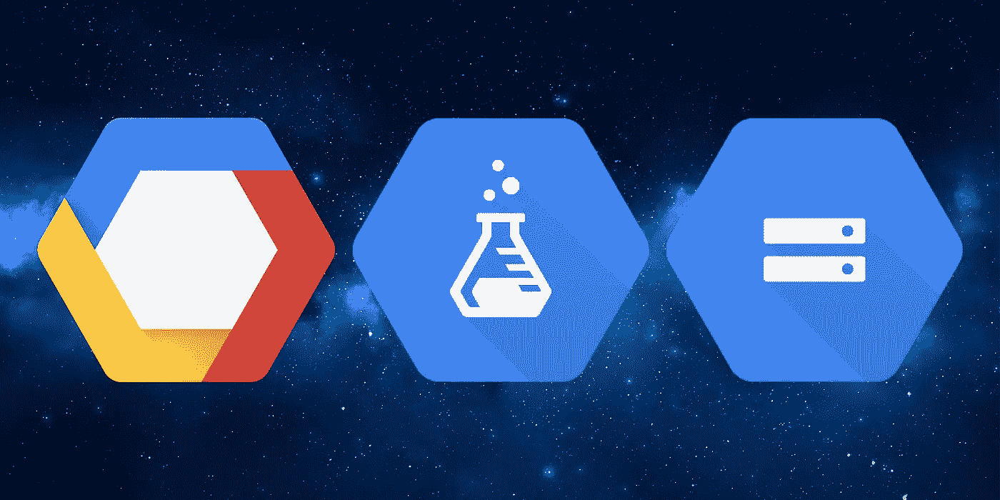
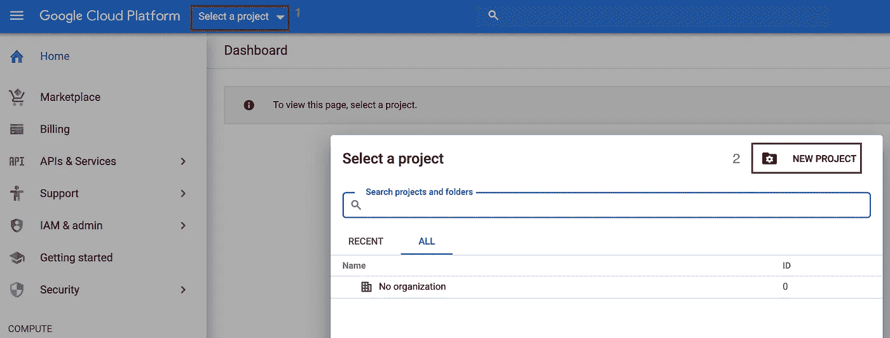
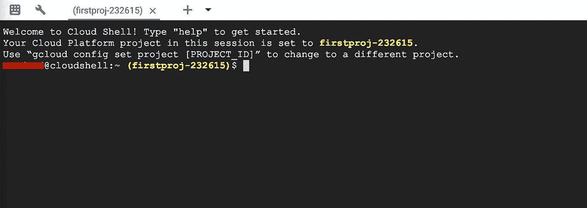
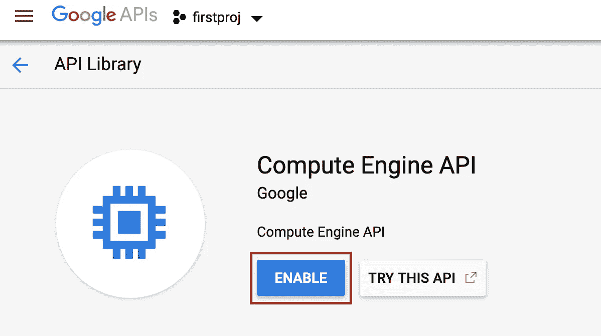
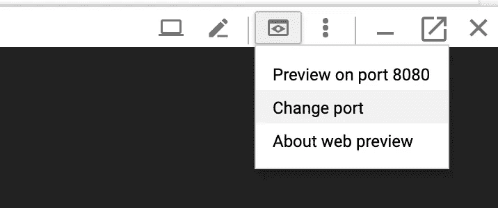
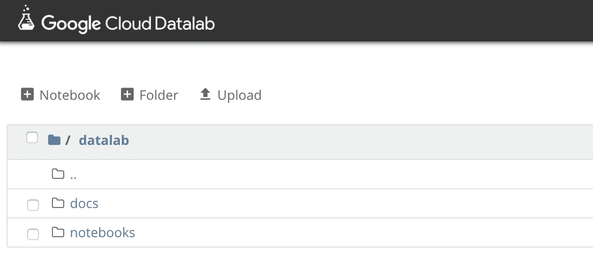
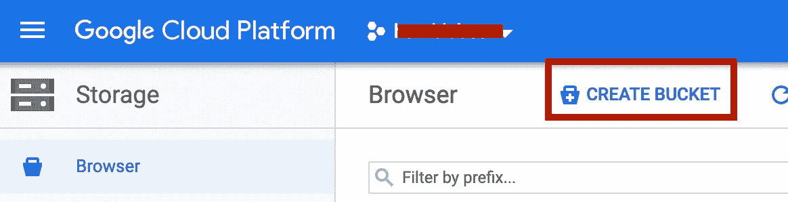
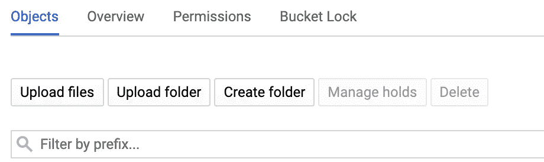

# 如何在 15 分钟内用一个数据库和一个 GPU 在 Google Cloud 上运行一个数据科学的笔记本？

> 原文：<https://towardsdatascience.com/how-to-run-a-notebook-for-data-science-on-google-cloud-with-a-database-and-a-gpu-in-15min-f662f36c3a66?source=collection_archive---------12----------------------->



## **设置您的云外壳**

首先，你需要有一个谷歌账户，并访问你的谷歌云控制台[这里](https://console.cloud.google.com)。

登录后，如果您是第一次使用 google cloud，您需要创建您的项目，方法是点击弹出窗口右上角的“*选择一个项目*，然后点击“*新建项目*，并按照几个简单的步骤创建您的第一个项目:



完成后，你应该会在谷歌云控制台窗口的顶部横幅中看到你的项目名称，而不是*新项目*。

现在，点击 Google Cloud 控制台窗口右上角的图标，打开您的云外壳(如果是第一次点击，您需要激活它，只需点击“启动云外壳”)。


你的云外壳窗口应该出现在当前谷歌云控制台窗口的底部。彩色文本是你的项目的名称，例如我的项目在这里是名称“first proj”+一个由谷歌提供的 id:



确保您的 ggcloud 组件保持最新并准备就绪:

```
sudo gcloud components update
```

# 安装和设置数据实验室

## 激活 API

Google Cloud console 要求您激活 API 以允许它们在您的项目上运行，如果您不这样做，您将不得不处理一个*HTTPError 403:Access Not Configured*错误。去那里，让我们激活所需的 API:[https://console.developers.google.com/apis/library](https://console.developers.google.com/apis/library)

搜索计算引擎 API 并启用它(**如果尚未创建计费帐户**，您将需要创建计费帐户)，确保 Google 云存储 API 已经启用:



## 安装 DataLab

```
gcloud components install datalab
```

现在，我们将创建一个数据实验室，该命令将创建一个具有数据科学基本要求的实例(我在这里选择了 n1-highmen-8，带有 8 个 vCPUs 和 52 GB 内存，请不要犹豫更改机器类型。要查看机器详情，请点击[此处](https://cloud.google.com/compute/docs/machine-types)并点击[此处](https://cloud.google.com/compute/pricing#machinetype)):

```
datalab beta create-gpu your-datalab-instance-name --machine-type n1-highmem-8
```

您必须接受 *NVidia GPU 驱动程序安装*，然后选择一个区域，并按照查看步骤使用 SSH 访问您的 datalab 实例。

> 重要说明:默认情况下，create-gpu 命令使用 Nvidia Tesla K80 创建一个实例，该实例仅在那些选定的区域上可用:

```
us-west1-b
us-central1-a
us-central1-c
us-east1-c
us-east1-d
europe-west1-b
europe-west1-d
asia-east1-a
asia-east1-b
```

安装完成后，您可以通过在云 Shell 中键入以下命令，在 windows 浏览器中运行您的 datalab:

```
datalab connect your-datalab-instance-name
```

然后通过点击*改变端口:*将**端口设置为 8081** 打开一个窗口浏览器



> 给你！您刚刚安装了您的 Datalab Google 实例，它看起来应该如下图所示。你现在可以像使用普通的 Jupyter 笔记本一样使用它了。



# **设置你的谷歌云存储**

一个实例不应该被用作一个存储环境这就是为什么 Google Cloud 提供了许多不同服务来提供不同种类的存储服务。这里我们就用最简单的一个:[谷歌云存储](https://cloud.google.com/storage/)。

点击左侧菜单，进入谷歌云的“存储”服务。

创建存储桶:



一切就绪，谷歌云存储非常简单，只需像通常的操作系统一样点击即可访问:



# 在你的数据实验室使用你的谷歌云存储

这是一个简单的示例函数，从 bucket 中读取一个文件和一个 csv。

```
import google.datalab.storage as storage
import pandas as pd from io
import BytesIO def get_bucket(bucket_target):
    shared_bucket = storage.Bucket(str(bucket_name))
   return shared_bucketdef read_file_from_bucket(file_target):
    shared_bucket = get_bucket(bucket_target)
    sample_object = shared_bucket.object(str(file_target)
    sample_text = sample_object.read_stream()
    return sample_textdef read_csv_from_bucket(bucket_name,csv_file_name):  
   %gcs read --object gs://+bucket_name+/+file_name --variable   csv_as_bytes
   df = pd.read_csv(BytesIO(csv_as_bytes))
   return df
```

要打印存储桶的内容，请执行以下操作:

```
shared_bucket = get_bucket(bucket_name)
for obj in shared_bucket.objects():
    if obj.key.find('/') < 0:
        print(obj.key)
```

例如，要打印文本文件:

```
sample_text = read_file_from_bucket(file_name)
print(sample_text)
```

要获取 csv 表格作为数据帧:

```
df = read_csv_from_bucket(bucket_target,file_target) 
df.head()
```

现在，您已经有了一台连接到存储云的高性能笔记本电脑，可以用于您的数据科学项目了！

尽情享受吧！:-)