# 如何在 3 分钟内免费在 AWS 上运行 RStudio

> 原文：<https://towardsdatascience.com/how-to-run-rstudio-on-aws-in-under-3-minutes-for-free-65f8d0b6ccda?source=collection_archive---------0----------------------->

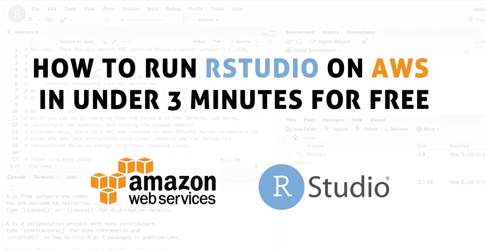

说到数据分析，我有理由从你的本地电脑转移到云端。最突出的是，您可以运行无限数量的机器，而不需要拥有或维护它们。此外，您可以在几分钟内随意缩放。如果您选择运行 t2.micro 服务器，在最初的 12 个月内，您可以每月免费运行 750 个小时！之后，每个月和服务器就要几美元。

好吧，让我们开始吧！可以理解的是，在点击了一个承诺在 3 分钟内为你提供解决方案的标题后，你将没有时间去阅读一篇十分钟的关于 RStudio Sever 和 T2 亚马逊网络服务的文章。所以我跳过正式的介绍，直接切入正题。

**第一步:**登录你的 [AWS 账户](http://aws.amazon.com/)(如果你是 AWS 新手，也可以创建一个)

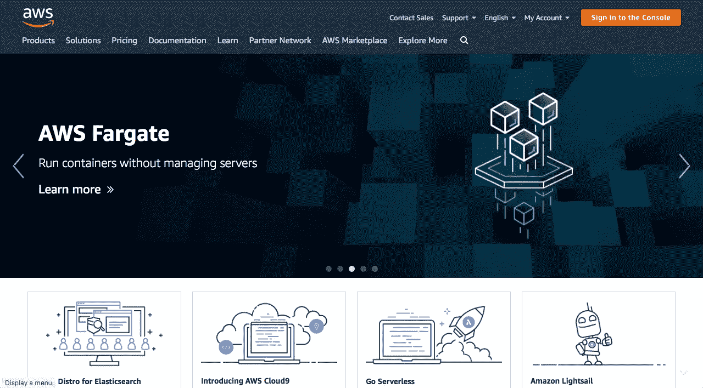

**第二步:**转到 [Louis Aslett 的网站](http://www.louisaslett.com/RStudio_AMI/)，选择您希望您的虚拟机驻留的地区，然后单击它旁边的链接(例如， [ami-02bf650155c44b475](https://console.aws.amazon.com/ec2/home?region=us-west-1#launchAmi=ami-02bf650155c44b475) 代表美国西部，N. California)。该链接将直接引导您到 EC2 管理控制台。

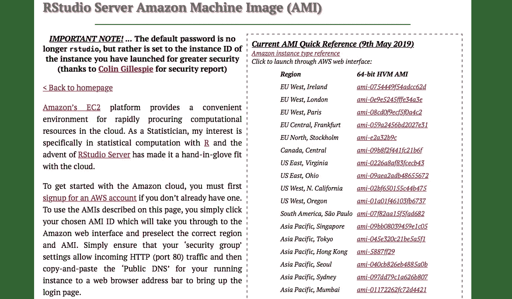

**步骤 3:** 单击启动实例向导。几乎所有的东西都已经预先填写好了，你的屏幕应该看起来像下面的截图。先不要按“查看并启动”。为了确保万无一失，我们需要检查一遍整个过程，所以请按“下一步:……”。

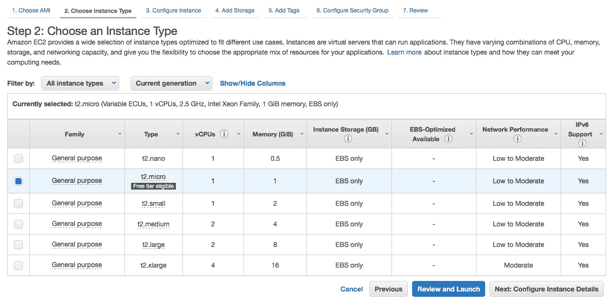

Nothing to change here. Press Next: Configure Instance Details.

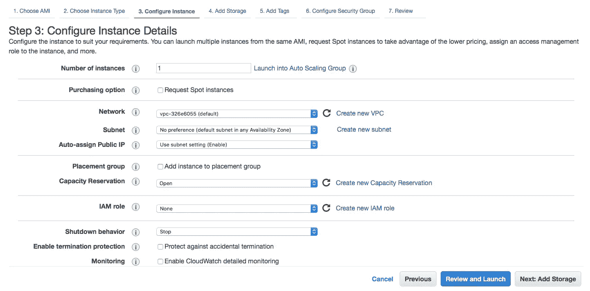

Nothing to change here. Press Next: Add Storage.

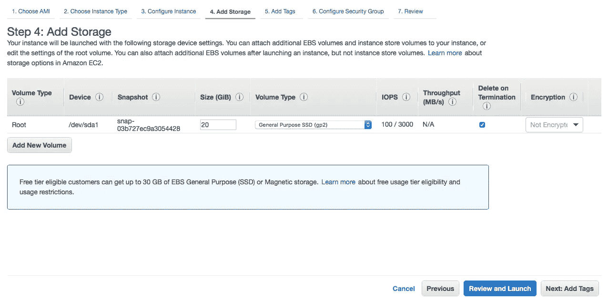

Nothing to change here. Press Next: Add Tags.

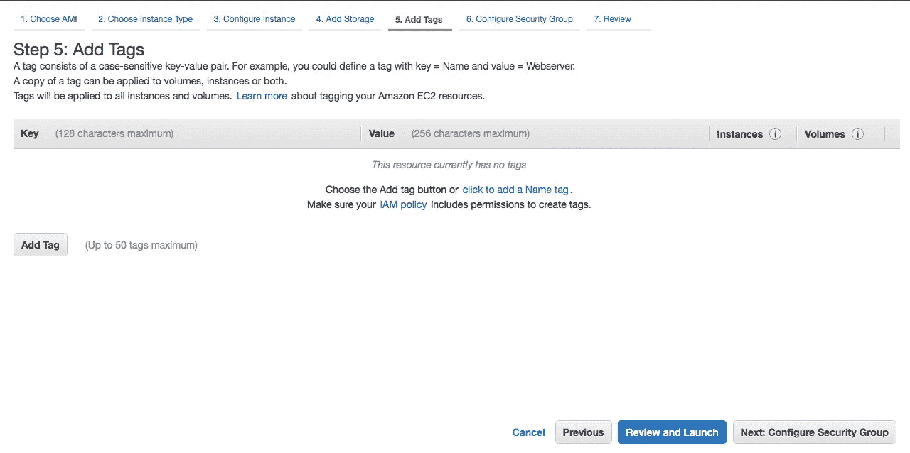

Nothing to change here. Press Next: Configure Security Group

啊哈！这里你需要再次活跃起来。点击“添加规则”，选择 HTTP 并将“源”从自定义改为任意位置。现在它应该看起来像下面的截图。

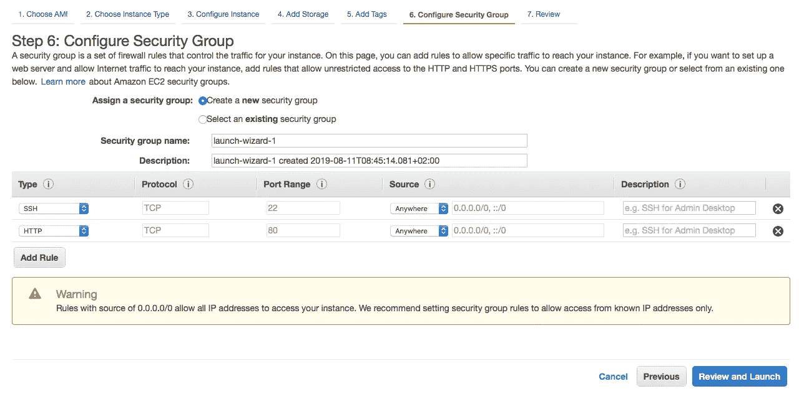

你快完成了！只需按下下一页的“查看并启动”和“启动”。最后一步是选择 SSH 安全密钥。虽然这不是最安全的设置，但最快的是选择不带钥匙继续。只需复制下一个截图中的设置，然后按“启动实例”

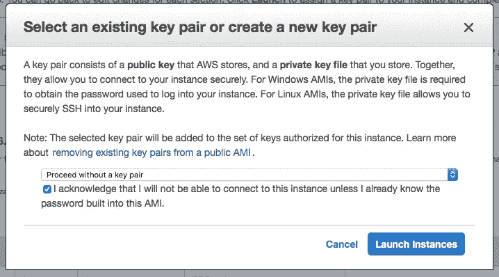

现在，亚马逊将完成剩下的工作。

不幸的是，这可能需要 5 分钟…

但是嘿！那不是我的错，对吗？请不要因为我在题目中的虚假承诺而生气。一个小小的点击诱饵不会伤害任何人……给我写封电子邮件，告诉我我是如何滥用你的信任，以及谷歌和脸书的算法是如何支持这种新闻报道方式的。我向你保证:一旦你写完第一段，你的服务器就启动并运行了！:)

JK，实际上只需要一分钟。

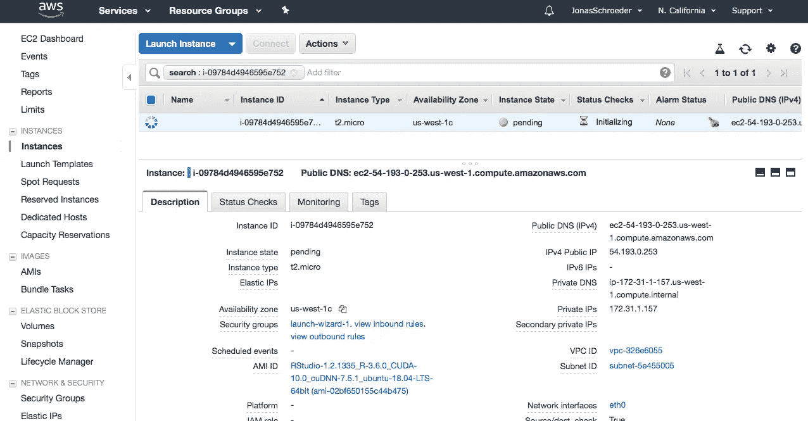

Server still pending…

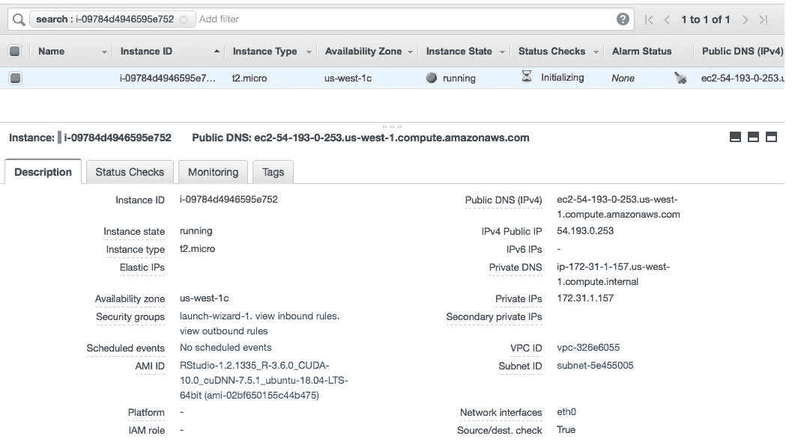

… and this is how it looks like once everything is done.

如果你的主机长得像上面的截图:**恭喜你！您现在是 RStudio 服务器的所有者。**

只需复制“IPv4 公共 IP”(这里:54.193.0.253)，并在一个新的标签中打开它。RStudio 服务器要求您登录。您的初始用户名是“rstudio ”,密码是该服务器的“实例 ID ”(这里是:i-09784d4946595e752 ),也可以在 AWS 控制台中找到。

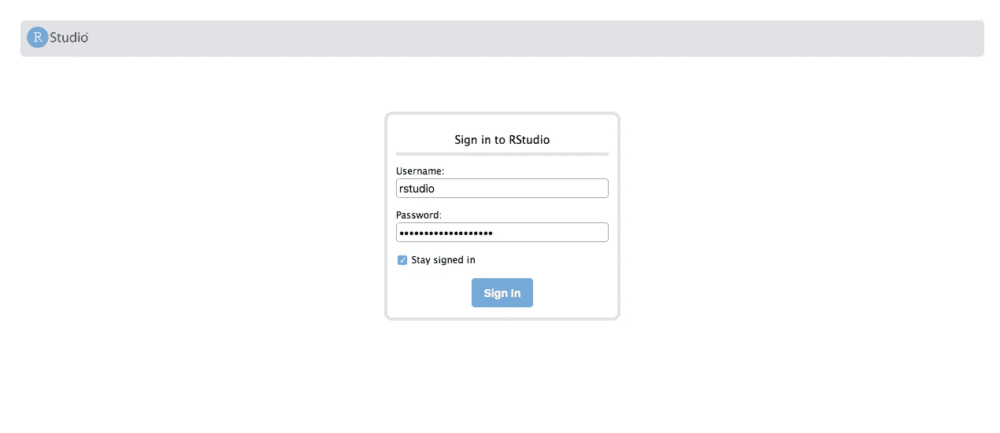

请击鼓…..

搞定了。

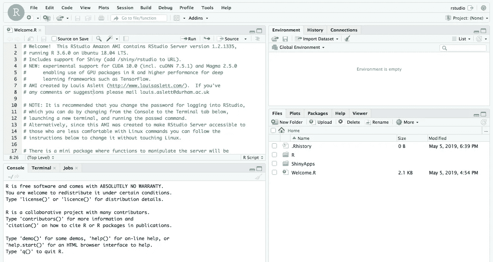

现在，您可以复制想要在云中运行的脚本，或者编写一个新的脚本。RStudio 服务器的外观和操作与本地 RStudio 几乎完全相同。

**那不是很容易吗？**

好吧，该表扬就表扬。[路易·阿斯莱特](https://twitter.com/louisaslett?lang=en)就是这个原因。他为虚拟机准备了模板，即所谓的 Amazon 机器映像(AMI ),它可以开箱即用地运行 RStudio 服务器(以及 my things more)。这些是您在步骤 2 中选择的。

如果你对我的逐步指导有困难，[请访问他制作的视频](http://www.louisaslett.com/RStudio_AMI/video_guide.html)。它不再是最新的了，但是有了这个指南，你将在几分钟内实现它！如果你有困难，可以写评论。现在开始用您的脚本填充您的 RStudio 服务器吧！

请务必关注我的媒体简介，获取有关 RStudio、数据科学和影响者欺诈的新帖子的更新。如果你想谈论我在市场营销方面的研究或数据科学，你可以在 [LinkedIn](https://www.linkedin.com/in/jonas-schröder-914a338a/) 或 [Twitter](https://twitter.com/Gedankennahrung) 联系我。

感谢阅读，

*乔纳斯·施罗德*