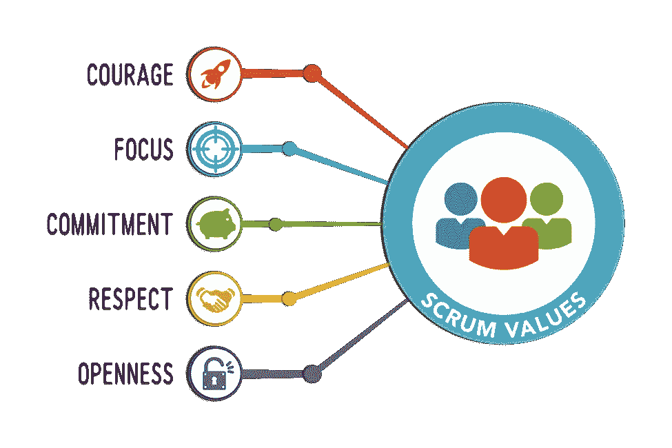

# 如何在数据科学团队中运行 Scrum

> 原文：<https://towardsdatascience.com/how-to-run-scrum-in-data-science-teams-56ddbe2ec8a5?source=collection_archive---------12----------------------->

在数据项目中使用 scrum 框架时，关于团队结构、技能、交叉功能、产品待办事项、冲刺长度、困难和好处的实践经验技巧。

后续——不要错过我即将发表的文章，其中包含一个案例研究的产品 backlog 项目，它展示了如何将 pbi 分成更小的部分并创建垂直切片。

我在一个敏捷团队中工作，该团队由 7 个团队和 58 个人组成，旨在为银行的现有产品提供人工智能功能。其中一个团队是架构团队，其他的是交付团队。

# **商业案例示例**

它可以是任何数据科学案例，如客户流失预测、客户风险计算、信用评分、人脸识别、情绪检测、欺诈检测、预防性维护等

# **团队结构**

Scrum 团队需要包括 3 到 9 名成员。我建议团队的最佳人数是 5 人，包括产品负责人。

有 4 个重要问题需要考虑:

**问题 1:团队应该具备哪些技能？**

这个列表可能会更长，我已经指出了最关键的技能:

*   分析以理解领域和需求
*   从不同来源收集必要数据的数据传输
*   数据预处理以创建模型所需的特征
*   可视化，从数据中获得洞察力，并与业务部门交流
*   建模以创建预测模型
*   建立数据管道，实现完全自动化的现场体验
*   API 或 web 服务开发来打开预测服务
*   测试上线后的“平静生活”。
*   仪表板开发，以技术和商业方式监控生产寿命。

**问题-2:对于一个由 5 个人组成的团队来说，拥有所有这些技能可能吗？**

不容易，但有可能。团队成员是跨职能的(产品负责人除外)。这并不意味着所有的团队成员都必须是所有这些领域的专家，但是他们应该在一两个领域是合格的。这就是 T 型人的确切定义。

我的观察告诉我，这个交叉功能的最佳候选人是具有软件开发背景的人。

**问题 3:这些技能有角色吗？**

理想情况下，不应该有。事实上，作为一个拥有大量数据的新生部落，我们决定从角色开始。因此，我们分享了 4 个不同的角色:

*   数据翻译:调整团队和业务方面，分析领域
*   数据科学家:建模
*   数据工程师:数据处理
*   数据架构:为其他团队的基础设施需求服务

**问题-4:为什么 5 人是最佳团队规模？**

不是规则，而是基于最佳实践的理论:

*   团队可以挤在一辆车里，一起参加活动:)
*   当团队规模越来越大时，scrum 仪式变得越来越低效，越来越耗时，这对团队的整体效率产生了负面影响。
*   团队可能倾向于创建更小的团队来一起工作，这导致了知识转移和同步问题。

# 产品待办事项 **&在 Sprint 评审中呈现什么？**

对于一个典型的软件开发团队来说，答案非常简单:产品 backlog 项目通常是用户故事，团队总是展示一个工作软件(即使 PBI 是一个错误，而不是用户故事)。

然而，数据科学团队的答案更复杂。以下是产品待办事项类别以及每种类别的展示内容:

*   数据洞察:这类产品 backlog 项目的主要焦点是理解现有的数据和结构。输出通常是图表或表格。在最初的冲刺阶段，有更多的洞察型输出。如果客户流失是一个项目，那么“流失率与时间”线图或“根据客户年龄组的流失率”条形图就是很好的例子。
*   模型结果:这对于团队和涉众来说都是最有吸引力的类别。您处理预测模型，并在 sprint 评审中展示它们的结果，一起讨论它们。一般来说，我们会集体思考模型的准确性和稳健性，模型在哪些领域表现最佳，在哪些领域表现不佳。当然，3 到 6 个月后工作的可能结果也包括在议程中。对于这种类型的 PBI，与业务部门的额外会议可能是必要的，因为讨论可能比预期花费更多的时间。
*   仪表板:它是最接近工作软件原则的产品积压类别。团队创建一个仪表板，并在评审中将其显示为工作仪表板。在模型的成熟度达到一定水平之后，团队可以处理这种类型的待定项。
*   API 开发:如果模型将作为服务开放，则需要进行服务开发。当团队完成此 PBI 时，他们会展示几张幻灯片，其中包括与现有软件的集成架构、API 的响应字段、现有软件将如何使用它获得的这些响应、API 对现有结构的非功能性影响(例如响应时间)。
*   ETL 开发:如果模型结果将被批量使用，就需要 ETL 开发。当团队完成此 PBI 时，他们会展示几张幻灯片，其中包括与现有软件的集成架构、文件中传输的字段、现有软件如何使用它获得的字段、如何安排此文件传输。
*   法规项目:处理数据的团队应了解 GDPR(一般数据保护法规)，这些法规可能因国家/地区而异。专门处理客户数据的数据科学团队可能需要准备一些文档并获得一些批准。这个 PBI 是为了所有这些作品的努力。
*   监控和推广:应该监控人工智能模型在生产中的表现。A/B 测试是最好的方法之一。结果可能比预期的更糟，可能需要进行一些修改。应制定并遵循推广战略。

产品待定项必须是什么样的？如何创建薄的垂直切片并分解它们？—不要错过我的下一篇文章，我将为您提供关于这些主题的更多细节和示例。

# **冲刺长度**

冲刺长度可以在 1 周到 4 周之间。我相信 1 周对于软件开发团队来说是完美的，但是对于数据科学团队来说太短了。由于数据传输和预处理任务可能需要几天时间，并且准备好的数据本身并不是要呈现的输出，团队必须对其进行更多的工作以产生一些输出。

我们已经开始了为期一周的冲刺，但团队不得不在每个冲刺阶段都加班加点，毫无例外地出现了精疲力竭的信号。然后团队决定将冲刺长度改为 2 周。

以下是经过两周冲刺后观察到的结果。

*   快乐团队
*   产出质量提高
*   利益攸关方对产出更加满意
*   团队速度增加！！！1 周冲刺的平均速度约为 35，2 周冲刺的平均速度变为 85(平均速度在最少 5 次冲刺后计算)。

# **困难**

让我们接受它——scrum 是一种很好的工作方式。尽管如此，在所有团队成员都习惯了它的方法之前，请为一些挑战做好准备，比如:

*   那些习惯于处理详细项目计划的人开始批评 scrum 缺乏远见。他们掌握 scrum“路线图”哲学需要时间。
*   喜欢独自工作的人开始抱怨花费在仪式和交流上的时间。他们相信如果不被打扰，他们的生产力会提高。
*   学习为数据科学项目创建薄的垂直产品 backlog 项目的艺术需要时间。
*   对于软件开发来说，编写和声明 done 的定义很容易。设置最小测试覆盖率或者把完成用户验收测试作为一个必须的例子。此外，您可以将其应用于您的所有 pbi。另一方面，对于数据科学敏捷团队来说，这些任务更具挑战性。由于所涉方案预算多种多样，几乎不可能为所有项目找到一个共同的完成定义。此外，即使对于一些 PBI 类型，比如迭代试错模型，找到 done 的定义也是很痛苦的。
*   编写验收标准也比软件开发案例更复杂。PBI 数据洞察类型的验收标准是什么？团队只是探索数据和领域，然后将可视化带到评审会议上进行讨论。“应该对数据进行可视化”并不是验收标准的一个好例子，对吗？

# **好处**

尽管存在上述所有困难，但还是有很多好处:

*   团队精神建立起来了，工作变成了一项有趣的活动。
*   自我组织能力提高。团队在回顾会议中解决了大部分问题。
*   应用 scrum 让团队保持一致。每个团队成员都知道产品的远景和路线图。
*   在几次冲刺之后，团队速度变得确定，可预测性出现了。

# **总之**

在这篇文章中，我试图分享我自己关于在数据项目中使用 scrum 框架的想法。请注意，条件和规则可能因团队和案例的不同而不同。这使得 scrum 令人兴奋，不是吗？

如果你有任何进一步的问题，请不要犹豫，写信给:haydarozler@gmail.com。