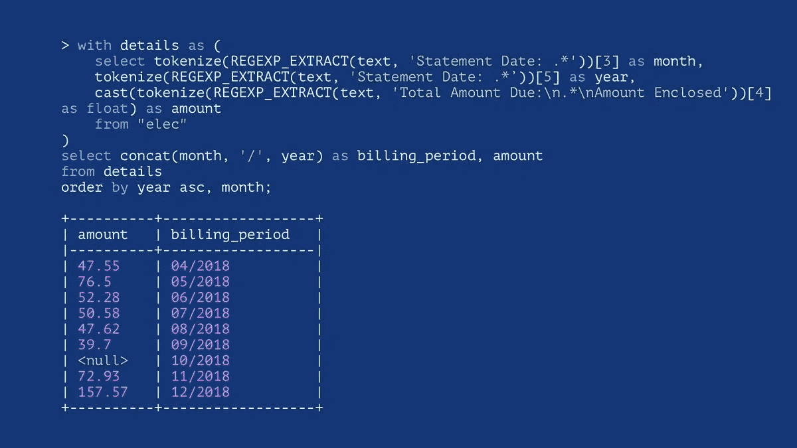
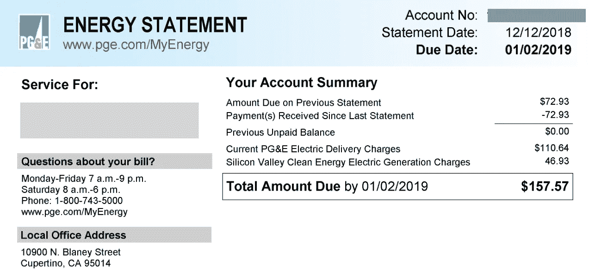
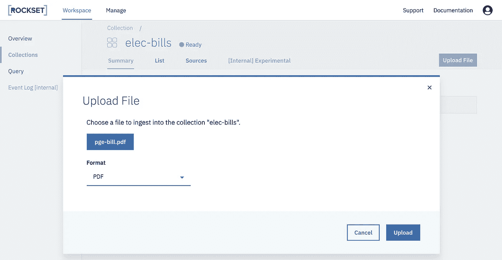
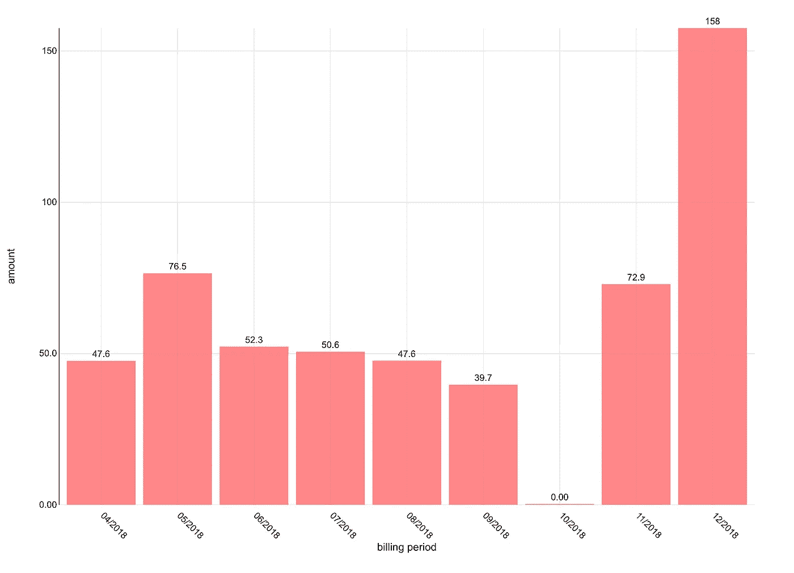

# 如何对 PDF 文件运行 SQL

> 原文：<https://towardsdatascience.com/how-to-run-sql-on-pdf-files-48d0a4dd151f?source=collection_archive---------12----------------------->

pdf 是今天分发和共享固定布局文档的事实标准。对我的笔记本电脑文件夹的快速调查显示，账户报表、收据、技术论文、书籍章节和演示幻灯片都是 pdf 格式的。许多有价值的信息都可以在各种 PDF 文件中找到。这也是 [Rockset](https://www.rockset.com/) 支持对 PDF 文件进行 SQL 查询的重要原因，我们的使命是让数据对每个人都更有用。



# Rockset 中 pdf 上的快速 SQL

Rockset 使开发人员和数据从业者可以轻松地在各种数据格式的半结构化数据上接收和运行快速 SQL，如 JSON、CSV 和 XLSX，而无需任何前期数据准备。现在将 PDF 添加到混合数据中，用户可以将 PDF 数据与来自不同来源的其他格式的数据组合到他们的 SQL 分析中。或者一起分析多个 pdf 也可能是有价值的，如果你像我一样有一系列的电费账单，我们将在下面的简短例子中看到。



**上传 pdf 文件**

从现有的[集合](https://docs.rockset.com/concepts/#collections)中，点击控制台右上角的[上传文件](https://docs.rockset.com/write-api/#upload-a-file)按钮，并指定 PDF 格式以摄取到 Rockset 中。



**查询 pdf 中的数据**

我上传了 9 个月的电费。我们可以使用 [DESCRIBE](https://docs.rockset.com/commands/#describe) 命令来查看从 pdf 中提取的字段。

```
> describe "elec-bills";
+--------------------------------------------+---------------+---------+-----------+
| field                                      | occurrences   | total   | type      |
|--------------------------------------------+---------------+---------+-----------|
| ['Author']                                 | 9             | 9       | string    |
| ['CreationDate']                           | 9             | 9       | string    |
| ['Creator']                                | 9             | 9       | string    |
| ['ModDate']                                | 9             | 9       | string    |
| ['Producer']                               | 9             | 9       | string    |
| ['Subject']                                | 9             | 9       | string    |
| ['Title']                                  | 9             | 9       | string    |
| ['_event_time']                            | 9             | 9       | timestamp |
| ['_id']                                    | 9             | 9       | string    |
| ['_meta']                                  | 9             | 9       | object    |
| ['_meta', 'file_upload']                   | 9             | 9       | object    |
| ['_meta', 'file_upload', 'file']           | 9             | 9       | string    |
| ['_meta', 'file_upload', 'file_upload_id'] | 9             | 9       | string    |
| ['_meta', 'file_upload', 'upload_time']    | 9             | 9       | string    |
| ['author']                                 | 9             | 9       | string    |
| ['creation_date']                          | 9             | 9       | int       |
| ['creator']                                | 9             | 9       | string    |
| ['modification_date']                      | 9             | 9       | int       |
| ['producer']                               | 9             | 9       | string    |
| ['subject']                                | 9             | 9       | string    |
| ['text']                                   | 9             | 9       | string    |
| ['title']                                  | 9             | 9       | string    |
+--------------------------------------------+---------------+---------+-----------+
```

Rockset 解析出所有元数据，如`author`、`creation_date`等。从文档中随同`text`。

`text`字段通常是 PDF 中大多数信息所在的地方，所以让我们检查一下示例`text`字段中有什么。

```
+--------------------------------------------------------------+
| text                                                         |
|--------------------------------------------------------------|
| ....                                                         |
| ....                                                         |
| Statement Date: 10/11/2018                                   |
| Your Account Summary                                         |
| ....                                                         |
| Total Amount Due:                                            |
| $157.57                                                      |
| Amount Enclosed:                                             |
| ...                                                          |
+--------------------------------------------------------------+
```

**合并来自多个 pdf 的数据**

在 Rockset 中获取并索引了我 9 个月的电费账单后，我可以对这段时间内的使用情况做一些简单的分析。我们可以运行 SQL 查询来选择`text`中的月/年和账单金额。

```
> with details as (
    select tokenize(REGEXP_EXTRACT(text, 'Statement Date: .*'))[3] as month,
    tokenize(REGEXP_EXTRACT(text, 'Statement Date: .*'))[5] as year,
    cast(tokenize(REGEXP_EXTRACT(text, 'Total Amount Due:\n.*\nAmount Enclosed'))[4] as float) as amount
    from "elec-bills"
) 
select concat(month, '/', year) as billing_period, amount
from details
order by year asc, month;

+----------+------------------+
| amount   | billing_period   |
|----------+------------------|
| 47.55    | 04/2018          |
| 76.5     | 05/2018          |
| 52.28    | 06/2018          |
| 50.58    | 07/2018          |
| 47.62    | 08/2018          |
| 39.7     | 09/2018          |
| <null>   | 10/2018          |
| 72.93    | 11/2018          |
| 157.57   | 12/2018          |
+----------+------------------+
```

并将结果绘制在[超集](https://docs.rockset.com/apache-superset/)中。



我 10 月份的账单出人意料地为零。账单金额提取不正确吗？我回去查了一下，结果是我在 10 月份收到了一份加州气候信用，这使我的账单归零了，所以摄取和查询 pdf 就像它应该的那样工作了！

*最初发表于*[*【rockset.com】*](https://rockset.com/blog/how-to-run-sql-on-pdf-files/)*。*