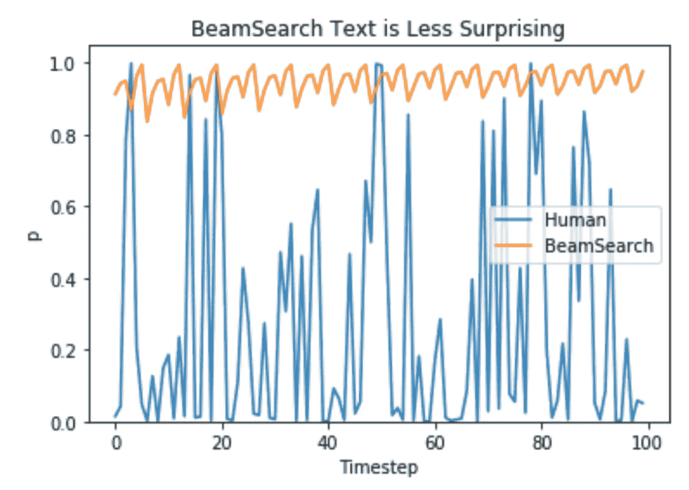
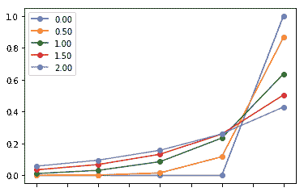
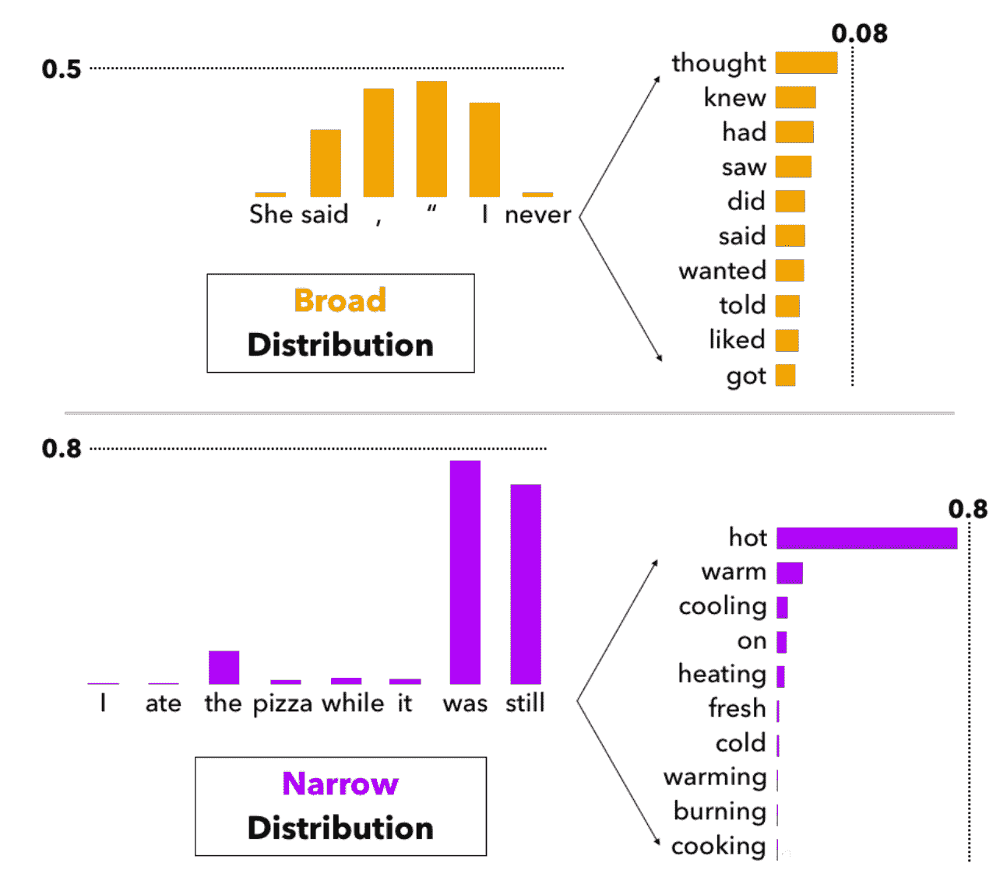
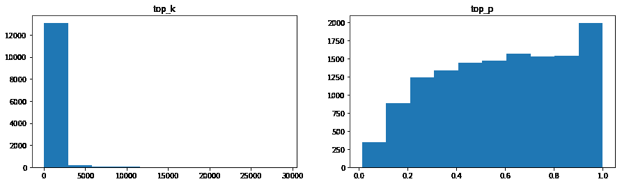

# 如何从语言模型中取样

> 原文：<https://towardsdatascience.com/how-to-sample-from-language-models-682bceb97277?source=collection_archive---------5----------------------->

## 标准抽样技术与新核心抽样的探讨



Humans often choose words that surprise language models (Holtzman et al 2019)

像 GPT-2 这样的因果语言模型被训练来预测给定一些上下文下一个单词的概率。例如，给定“我吃了一个美味的热 __ ”,模型可能以 80%的概率预测“狗”，以 5%的概率预测“煎饼”，等等。这个结构很酷的一点是，它们可以用来生成任意长度的序列。我可以给这个模型一个“我吃了”，从结果分布中抽取一个令牌来得到“我吃了一个”，然后再次通过这个模型来得到另一个分布和结果令牌。我们想重复多久就重复多久。事实证明，这一代人经常要么陷入重复的循环，要么忘记主题，跑题。为什么会发生这种情况，我们如何更好地采样以生成更像人类的文本？

本帖是霍尔茨曼等人 2019 对[神经文本*德*代](https://arxiv.org/abs/1904.09751)的好奇案例的总结和探索。我发现这是我近年来读过的最透彻、可读性最强的论文之一，所以如果这篇文章引起了你的兴趣，请看看吧！

如果我们总是对最可能的单词进行采样，标准的语言模型训练目标会导致我们陷入像“我不知道”这样的循环中。我不知道。我不知道。”这是不自然的，但现代语言模型中模型的大部分注意力只在最近的几个标记上。相反，流行的生成抽样方法是基于分布的抽样。但是采样也遇到了一个问题:如果我们有 50K 个可能的选择，即使底部的 25K 个记号每个都极不可能，它们总共可能有例如 30%的概率质量。这意味着每一个样本，我们都有 1/3 的机会完全偏离我们的“思路”由于前面提到的短上下文，这将导致不可恢复的错误级联，因为每个下一个单词都严重依赖于这个最近的错误单词。

为了防止尾部取样，最常用的方法是温度和顶部 k 取样。

**温度** **采样**受统计热力学启发，高温意味着更可能遇到低能态。在概率模型中，对数起着能量的作用，我们可以通过将对数除以温度来实现温度采样，然后将其输入 softmax 并获得采样概率。例如:

```
>>> import torch>>> import torch.nn.functional as F>>> a = torch.tensor([1,2,3,4.])>>> F.softmax(a, dim=0)tensor([0.0321, 0.0871, 0.2369, 0.6439])>>> F.softmax(a/.5, dim=0)tensor([0.0021, 0.0158, 0.1171, 0.8650])>>> F.softmax(a/1.5, dim=0)tensor([0.0708, 0.1378, 0.2685, 0.5229])>>> F.softmax(a/1e-6, dim=0)tensor([0., 0., 0., 1.])
```

或者视觉上



较低的温度使模型对其首选越来越有信心，而高于 1 的温度会降低信心。0 温度相当于 argmax/max 似然，而无限温度对应于均匀采样。

**Top k** **采样**是指按概率排序，将第 k 个令牌以下的概率归零。它似乎通过去除尾部来提高质量，使其不太可能偏离主题。但是在某些情况下，真的有很多词我们可以合理地从中取样(下面的广泛分布)，而在某些情况下没有(下面的狭窄分布)。



Holtzman et al 2019

为了解决这个问题，作者提出了 **top p** **采样**，也称为核采样，其中我们计算累积分布，并在 CDF 超过 p 时立即截止。在上面的广义分布示例中，可能需要前 100 个令牌才能超过 top_p = .9。在窄分布中，我们可能已经超过了 top_p = .9，在我们的样本分布中只有“热”和“暖”。通过这种方式，我们仍然避免了对极其错误的记号进行采样，但是当最高得分的记号具有低置信度时，保持了多样性。

为什么最大似然抽样不起作用？在培训过程中，永远没有机会看到复合错误。该模型被训练成基于人类生成的上下文来预测下一个令牌。如果它通过生成一个坏的分布而得到一个错误的标记，下一个标记将使用“正确的”人类生成的上下文，而与上一个预测无关。在生成过程中，它被迫完成自己自动生成的上下文，这是它在训练过程中没有考虑的设置。

# 定性结果

以下是使用 top_k=40 和上下文“我吃了一个美味”的示例

这里是使用 top_p=0.9 和相同“我吃了美味”上下文的示例:

自己试试[这里](https://colab.research.google.com/drive/1yeLM1LoaEqTAS6D_Op9_L2pLA06uUGW1)！您可以在*运行时>启用 GPU，更改运行时类型*，无需额外运行时即可获得大批量数据。

# 超越纸张:自动选择 p 和 k

我发现很难确定这些样本中哪一个更像人类。为此，我设计了一个实验来根据经验确定`top_k`和`top_p`。

我们的目标是使用 top_k 和 top_p 来最大化选择我们给出的实际下一个单词的概率。当搜索最佳 k 和 p 值时，实际上很容易通过分析确定给定样本。对于 k，我们找到“黄金”令牌出现的排序索引。对于 p，我们找到黄金令牌的 CDF。例如，如果上下文是“我吃了一份美味的热食”,实际单词是“狗”,但模型的预测分布最有可能是“煎饼”,我们将向下搜索概率，直到在索引 3 处找到“狗”。在指数 1 时，CDF 可能是 62%。在指数 3 处，CDF 可能是 86%左右，所以我们把它记为最优 p。

在许多例子中，我们可以计算最佳 p 和 k 值的直方图，并计算它们的汇总统计数据。我在维基百科的一个随机部分进行了测试，其上下文长度为 15。这比模型被训练的时间(1024)要短得多，但是对于像 https://duet.li 或聊天机器人这样的设置是常见的。



```
===== ks =====max 29094.00mean 233.69median 3.00len 13376.00===== ps =====max 1.00mean 0.59median 0.60len 13376.00
```

你可以在我的 [colab 笔记本](https://colab.research.google.com/drive/1BBJPKYsgheHcCH0JAqLZ49UXHDk4XzX7)里自己尝试一下。

如果对模型的训练集进行评估，则选择 top_k = 1 是最佳选择。但是由于模型稍微超出了范围，最有可能的标记有时会出现在列表的底部。此外，我们还有一个 50K 的令牌词汇表。在许多数据集中，我们永远不会看到所有的令牌，但模型对此并不确定。通过使用 top_p 或 top_k 将大部分概率质量归零，我们合并了我们的先验以从不选择这些从未在训练中见过的令牌。

也就是说，这种对 k 和 p 的寻找仍然是在模型的世界观的背景下，因此这只是一个创可贴。我们真正想要的是修正训练。

# 固定训练

我也开始考虑改变培训目标，以更好地匹配生成任务。例如，当模型生成看起来不像人类的整个序列时，我们可以训练某种鉴别器来惩罚它吗？如何将 GAN 架构应用于非连续域并不简单。我发现了没有强化学习的[对抗性文本生成](https://arxiv.org/abs/1810.06640)和一个[基于 RL 的想法](https://becominghuman.ai/generative-adversarial-networks-for-text-generation-part-2-rl-1bc18a2b8c60)，但似乎这些还没有成为主流。我认为将这些想法应用到过去几个月席卷艺术领域的大型变形金刚上会很有趣。

*感谢* [*雅罗斯拉夫布拉托夫*](https://medium.com/u/5511064b4364?source=post_page-----682bceb97277--------------------------------) *的反馈和编辑*