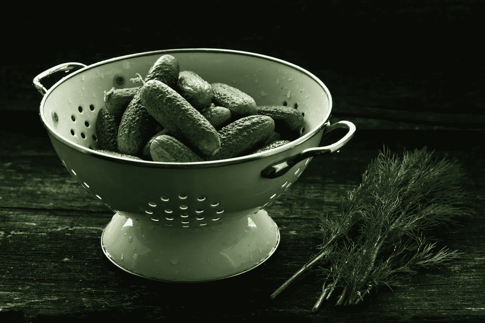
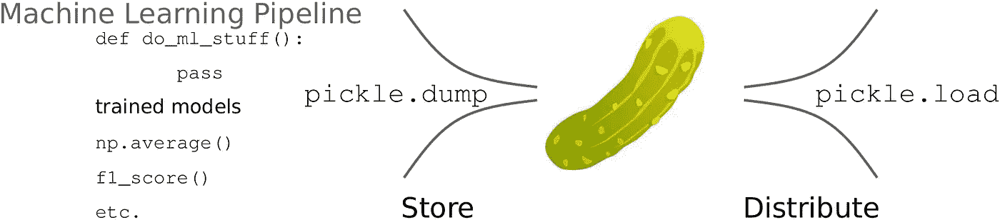

# 如何通过一个文件保存和共享您的机器学习模型(以及更多)

> 原文：<https://towardsdatascience.com/how-to-save-and-share-your-machine-learning-models-plus-more-all-with-one-file-a2536dd38883?source=collection_archive---------14----------------------->



Photo by [Jonathan Pielmayer](https://unsplash.com/@jonathanpielmayer?utm_source=unsplash&utm_medium=referral&utm_content=creditCopyText)

## 忘记模块导入。只需一行代码，您就可以在一个 Python 文件中存储和分发经过训练的 ML 模型等。

在处理机器学习模型时，通常建议您将它们存储在某个地方。在私营部门，您经常在生产前培训和存储它们，而在研究和未来的模型调整中，在本地存储它们是一个好主意。我总是使用令人惊讶的 Python 模块 [pickle](https://machinelearningmastery.com/save-load-machine-learning-models-python-scikit-learn/) 来做这件事。

我最近发现了一个有用的窍门。您不仅可以存储模型，还可以将整个函数和变量**都存储在同一个文件**中！当你想和其他人分享你的模型，但是你知道那个人不一定安装了所有需要的模块/功能，或者只是不具备这样做的专业知识时，这就特别方便了。他们只是想在一台具有基本 Python 环境的计算机上运行该算法以查看结果。

我将在这里向你展示如何做这个简单的把戏。

假设在您的本地计算机中，为了进行分类分析，您首先加载这些 sklearn 和 numpy 模块:

```
from sklearn.metrics import accuracy_score, f1_score
from sklearn import svm
from numpy import average
```

稍后用[交叉验证](/cross-validation-70289113a072)测试模型的准确性。最后，在验证完模型的准确性之后，用一些数据拟合最终模型:

```
sv_t = svm.SVC()
sv_t.fit(Features,Classes)
```

现在到了有趣但相当简单的部分。您可以将经过训练的模型以及任何功能/模块存储到一个 pickle 中，以便以后在其他地方分发！



Free to use and part of the public domain Pickle drawing taken from [here](https://www.pinterest.com/pin/470274386081459180/?nic=1). Image generated with [Inkscape](https://inkscape.org/)

这样你就可以将训练好的模型`sv_t`加上例如 numpy 的`average`函数和 sklearn 模块的`f1_score`函数保存在一个文件中。为此，您只需:

```
import pickle
pickle.dump([sv_t,average,f1_score], open('complete_ml.pkl', 'wb' ))
```

就是这样！下次您(或其他人)从任何计算机加载 pickle 文件 *complete_ml.pkl* **时:**

```
sv_t,average,f1_score = pickle.load(open('complete_ml.pkl','rb'))
```

您将可以访问存储的训练模型以及您想要打包在一起以供将来分发的任何函数和变量。为什么要这样做？嗯，正如我在乞求中所说的，很多时候你想要共享、部署和分发你的 ML 管道到其他计算机，这些计算机可能没有预装所有需要的模块。有了这个技巧，唯一需要的模块就是 Pickle，它是 [Python 的标准库](https://docs.python.org/3/library/pickle.html)的一部分。

希望这个简单的指南对你的 ML 之旅有所帮助，它让我的 ML 之旅与众不同。

感谢您的阅读！