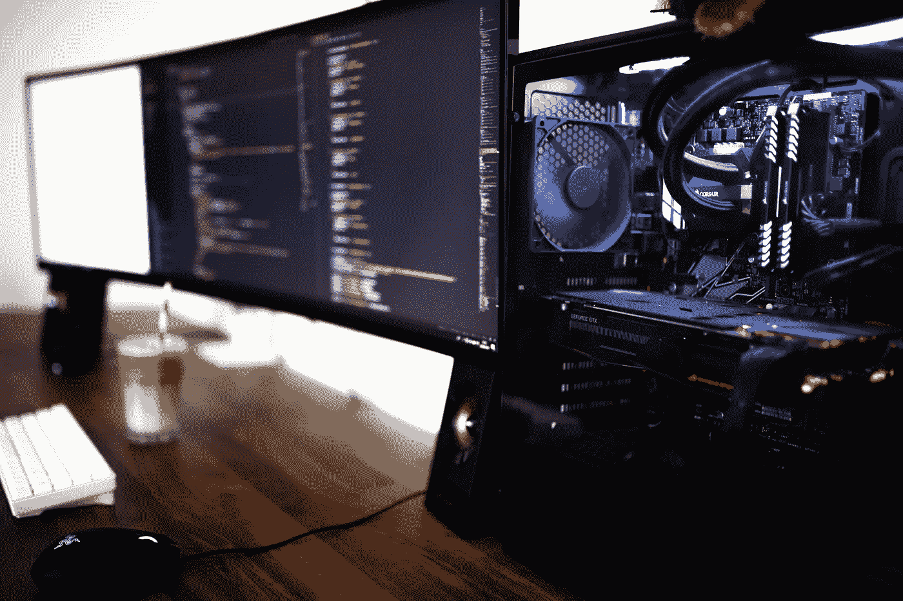
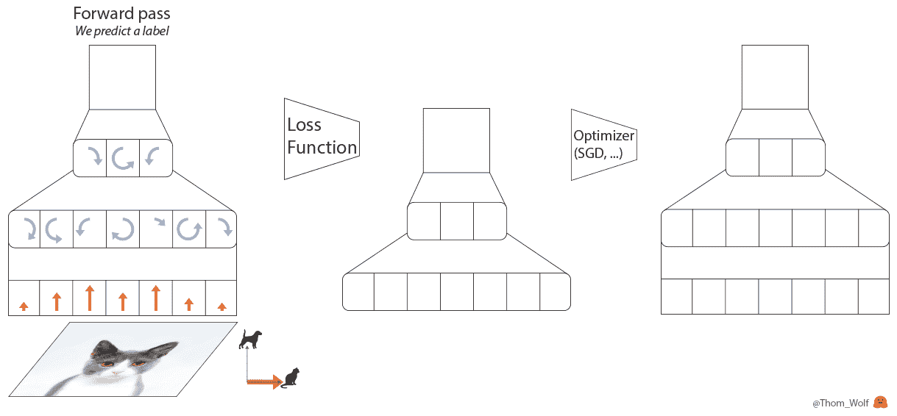
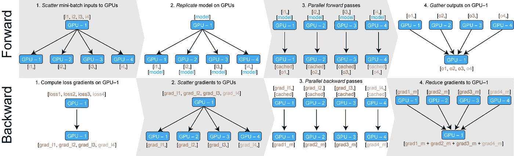
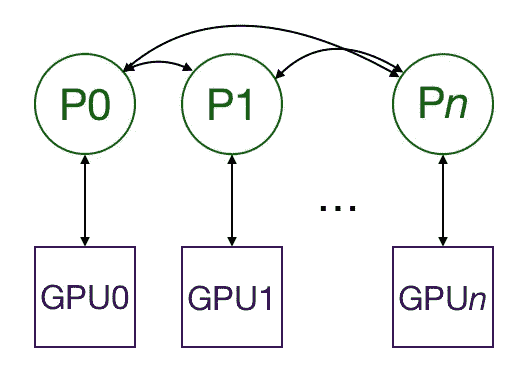
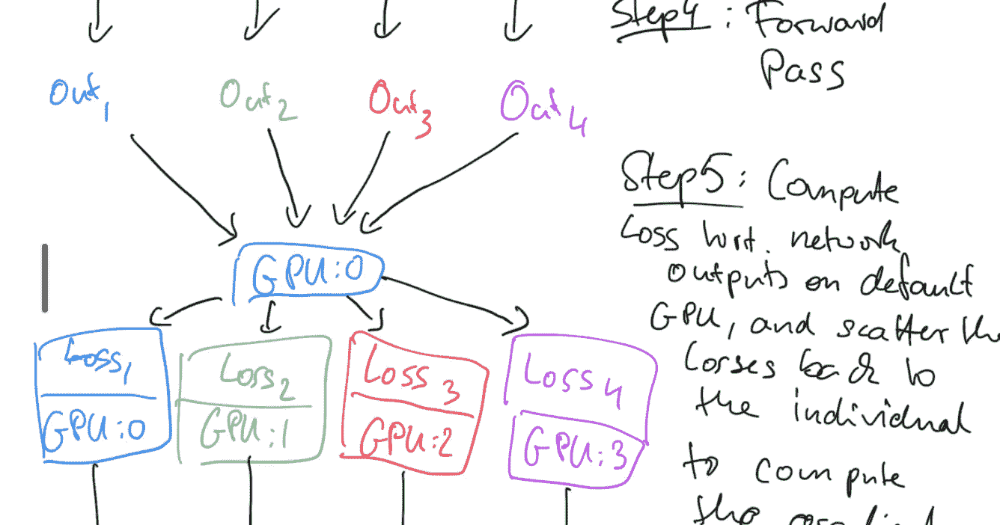

# 如何在多个 GPU 上扩展训练

> 原文：<https://towardsdatascience.com/how-to-scale-training-on-multiple-gpus-dae1041f49d2?source=collection_archive---------1----------------------->

## 如何在多个 GPU 中训练 PyTorch 模型

深度学习模型的最大问题之一是，它们变得太大，无法在单个 GPU 中训练。如果在单个 GPU 中训练当前的模型，它们将花费太长时间。为了及时地训练模型，有必要用多个 GPU 来训练它们。

我们[需要](https://medium.com/south-park-commons/scaling-transformer-xl-to-128-gpus-85849508ec35)来缩放训练方法，以使用 100 个甚至 1000 个 GPU。例如，一位[著名研究员](https://medium.com/south-park-commons/scaling-transformer-xl-to-128-gpus-85849508ec35)能够将 ImageNet 的训练时间从 2 周减少到 18 分钟，或者在 2 周内训练出最大和最先进的 Transformer-XL，而不是 4 年。他使用了 100 个 GPU 来完成这个任务。

我们非常关心我们的训练迭代速度。因此，为了提高我们的迭代速度，我们必须将我们的训练扩展到多个 GPU。在这篇博文中，我将介绍如何用 PyTorch 扩大训练规模。我们已经在 TensorFlow ( <2.0) and scaled our training, using [Horovod](https://github.com/horovod/horovod) )中有了一些模型，这是优步工程团队开发的一个工具。如果你走这条路，我们建议使用他们的 [Docker 镜像](https://github.com/horovod/horovod/blob/master/docs/docker.rst)来安装它。

我们发现 PyTorch 在易用性和控制性之间取得了最好的平衡，[同时又不牺牲性能](https://medium.com/huggingface/benchmarking-transformers-pytorch-and-tensorflow-e2917fb891c2)。PyTorch 构建了两种方法来在多个 GPU 中实现分布式训练:`nn.DataParalllel`和`nn.DistributedParalllel`。它们是包装和更改代码以及在多个 GPU 中增加训练网络的能力的简单方法。

`nn.DataParallel`更容易使用，但要求只能在一台机器上使用。`nn.DataParalllel`仅使用一个进程来计算模型权重，并在每批中将其分配给每个 GPU。

在这篇博文中，我将详细介绍`nn.DataParallel`和`nn.DistributedDataParalllel`是如何工作的。我将介绍两者之间的主要区别，以及在多个 GPU 中进行训练的工作原理。我将首先解释训练神经网络是如何工作的。

# 训练循环

首先，让我们回顾一下训练神经网络通常是如何工作的。为此，我们将使用由 [HuggingFace](https://huggingface.co/) 创建的一些图像:

训练神经网络时，每个循环都有四个主要步骤:

1.  正向传递，由神经网络处理输入
2.  计算损失函数，比较预测标签和地面实况标签
3.  进行反向传递，根据损耗计算每个参数的梯度(使用反向传播)
4.  使用梯度更新参数

对于大于 1 的批量大小，我们可能希望批量规范化训练。关于批处理规范化的深入解释，我推荐阅读这篇博文:

 [## 了解反向传递批处理规范化层

### 目前在斯坦福大学有一门很棒的课程，叫做 CS231n -卷积神经…

kratzert.github.io](https://kratzert.github.io/2016/02/12/understanding-the-gradient-flow-through-the-batch-normalization-layer.html) 

# 数据并行

DataParallel 有助于将训练分布到单台机器的多个 GPU 中。让我们详细了解一下 DataParallel 是如何工作的。每当使用数据并行训练神经网络时，都会发生几个步骤:

Image created by [HuggingFace](https://huggingface.co/)

1.  小批量在 GPU 上拆分:0
2.  将小批量分割并移动到所有不同的 GPU
3.  将模型复制到 GPU
4.  正向传递发生在所有不同的 GPU 中
5.  计算与 GPU:0 上的网络输出相关的损耗，并将损耗返回给不同的 GPU。计算每个 GPU 上的梯度
6.  对 GPU:0 上的梯度求和，并使用优化器更新 GPU:0 上的模型

## 简单的例子

让我们把这个编码起来。首先，让我们进口我们需要的一切

我们定义一个非常简单的卷积模型来预测 MNIST

第 4–14 行:我们正在定义这个神经网络的层次。

第 16–21 行:我们定义了向前传球

main()函数将接受一些参数并运行训练函数:

第 2–6 行:我们实例化模型并将其设置为在指定的 GPU 中运行，并通过使用`DataParallel`在多个 GPU 中并行运行我们的操作。

第 9–23 行:我们定义损失函数(标准)，和[优化器](/types-of-optimization-algorithms-used-in-neural-networks-and-ways-to-optimize-gradient-95ae5d39529f)(在这种情况下，我们使用 SGD)。我们定义了训练数据集(MNIST)和数据加载器。

第 24–45 行:这就是训练神经网络的循环发生的地方。我们加载输入和预期输出。我们运行向前传递和向后传递以及优化器。

这里肯定有一些额外的东西(例如，GPU 和节点的数量)我们还不需要，但将整个框架放在适当的位置是有帮助的。

# 分布式数据并行

为了 nn。' DistributedDataParallel '，机器每个 GPU 有一个进程，每个模型由每个进程控制。GPU 可以都在同一个节点上，也可以跨多个节点。只有渐变在进程/GPU 之间传递。

在训练过程中，每个进程从磁盘加载自己的小批量，并将其传递给 GPU。每个 GPU 执行其正向传递，然后梯度在 GPU 之间全部降低。每层的梯度不依赖于先前的层，因此梯度 all-reduce 与向后传递同时计算，以进一步缓解网络瓶颈。在反向过程结束时，每个节点都有平均梯度，确保模型权重保持同步。

## 辅导的

为了用多重处理来做到这一点，我们需要一个脚本来为每个 GPU 启动一个进程。每个进程都需要知道使用哪个 GPU，以及它在所有正在运行的进程中的排名。我们需要在每个节点上运行脚本。

让我们来看看每个函数的变化。我已经把新代码隔离开来，以便于查找。

让我们回顾一下主函数的参数:

*   `args.nodes`是我们正在使用的节点总数(机器数量)。
*   `args.gpus`是每个节点(每台机器上)的 GPU 数量。
*   `args.nr`是当前节点(机器)在所有节点(机器)中的排名，从 0 到`args.nodes` - 1。

让我们一行一行地看看新的变化:

第 12 行:根据节点数和每个节点的 GPU 数，我们可以计算出`world_size`，或者要运行的进程总数，它等于 GPU 总数乘以节点数。

第 13 行:这告诉多处理模块为进程 0 寻找什么 IP 地址。它需要这样做，以便所有的进程可以同步开始。这需要在所有节点上保持一致。

第 14 行:同样，这是查找进程 0 时使用的端口。

第 15 行:现在，不再运行一次 train 函数，我们将产生`args.gpus`进程，每个进程运行`train(i, args)`，其中`i`从 0 到`args.gpus` - 1。记住，我们在每个节点上运行`main()`函数，这样总共会有`args.nodes` * `args.gpus` = `args.world_size`个进程。

我可以在终端中运行`export MASTER_ADDR=10.57.23.164`和`export MASTER_PORT=8888`，而不是第 13 和 14 行。

接下来，让我们看看对`train`的修改。我会再把新线路围起来。

我已经删除了一些代码，并用`...`代替，以使本教程更容易阅读，但如果你想要完整的脚本，这里是。

第 3 行:这是该流程在所有流程中的全局排名。我们将在第 6 行使用这个。

第 4–6 行:初始化流程并与其他流程连接。这是“阻塞”，意味着在所有进程都加入之前，没有进程会继续。我用的是`NCCL`，因为它是最快的..`init_method`告诉进程组在哪里寻找一些设置。在这种情况下，它在查看`MASTER_ADDR`和`MASTER_PORT`的环境变量，我们在`main`中设置了这些变量。这就是为什么我们把它设置为`env://`。我们可以在那里设置`world_size`和`WORLD_SIZE.`

第 23 行:将模型包装成一个`[DistributedDataParallel](https://pytorch.org/docs/stable/nn.html#distributeddataparallel)`模型。这将模型复制到每个 GPU 上。

第 35–39 行:`[nn.utils.data.DistributedSampler](https://pytorch.org/docs/stable/_modules/torch/utils/data/distributed.html)`确保每次加载数据时，每个进程都获得不同的训练数据片段。如果您想要调试并验证每个 GPU 都加载了正确的数据，您可以计算加载到每个 GPU 中的张量的 sha。

第 46 行和第 51 行:使用`nn.utils.data.DistributedSampler`而不是通常的洗牌方式。这就是为什么我们将 shuffle 设置为 false。

比方说，要在 4 个各有 8 个 GPU 的节点上运行，我们需要 4 个终端(每个节点一个)。在节点 0 上(由`main`中的第 13 行设置):

然后，在其他节点上:

对于 i∈1，2，3。换句话说，我们在每个节点上运行这个脚本，告诉它在训练开始之前启动彼此同步的`args.gpus`进程。

请注意，有效的 batch_size 现在是每 GPU batch_size(脚本中的值)* GPU 总数(全局大小)。

## 问题

当在几个 GPU 而不是一个 GPU 中运行同一模型时，可能会出现一些问题。可能出现的最大问题是主 GPU 可能会耗尽内存。这样做的原因是因为第一个 GPU 将为不同的 GPU 保存所有不同的输出以计算损失。

每当您训练网络时，以下信息将显示在控制台上:`ran out of memory trying to allocate 2.59GiB`

为了解决这个问题，并减少内存使用量，我们使用两种技术:

1.  减少批量大小
2.  将 Apex 用于混合精度

第一种技术非常简单，通常只需要改变一个超参数。

第二种技术意味着我们将降低神经网络中使用的权重的精度，因此使用更少的内存。混合精度意味着对某些事情使用 16 位，但对权重等事情保持 32 位。要了解更多关于混合精度的信息，我推荐阅读这篇博文:

 [## 做深度学习的时候 FP16 和 FP32 有什么区别？

### 回答(第 1 题，共 3 题):这是一个适时的问题，因为我们上周五刚刚给 Horovod 添加了 FP16 支持。所以很自然，我…

www.quora.com](https://www.quora.com/What-is-the-difference-between-FP16-and-FP32-when-doing-deep-learning) 

# 混合精度的顶点

为了解决内存不足的问题，我们建议使用较低精度的数字。这使我们能够使用更大的批量，并利用 NVIDIA Tensor 内核加快计算速度。

为了让 APEX 工作，我们需要更改代码的 2 个部分。第一个是在代码库中的`train`循环中:

## 训练步骤

第 18 行:`[amp.initialize](https://nvidia.github.io/apex/amp.html#unified-api)`包装混合精度训练的模型和优化器。注意，在调用`amp.initialize`之前，模型必须已经在正确的 GPU 上。`opt_level`从使用所有浮点的`O0`到使用半精度的`O3`。`O1`和`O2`是不同程度的混合精度，其细节可以在 Apex [文档](https://nvidia.github.io/apex/amp.html#opt-levels-and-properties)中找到。

第 20 行:`[apex.parallel.DistributedDataParallel](https://nvidia.github.io/apex/parallel.html)`是`nn.DistributedDataParallel`的替代产品。我们不再需要指定 GPU，因为 Apex 只允许每个进程使用一个 GPU。它还假设脚本在将模型移动到 GPU 之前调用了`torch.cuda.set_device(local_rank)`(第 10 行)。

第 37–38 行:混合精度训练要求损失被[缩放](https://devblogs.nvidia.com/mixed-precision-training-deep-neural-networks/)，以防止梯度下溢。Apex 会自动执行此操作。

确保无论何时初始化 AMP，你都设置了`opt_level=O1`，因为它的实现有一个[错误](https://github.com/NVIDIA/apex/issues/250)

## 检查站

每当使用 Apex 时，我们需要改变我们保存和加载模型的方式，请参见下面的[问题](https://github.com/NVIDIA/apex/issues/250)。我们需要改变保存检查点并将其加载到模型中的方式:

第 5 行:我们将`amp.state_dict`添加到检查点

第 19 行:我们在这里加载`state_dict`到 amp。

# 结论

有了所有这些，您应该能够开始在多个 GPU 中训练您的模型。我们建议在尝试将训练扩展到多个 GPU 之前，先在一个 GPU 中训练一个小模型。但是，如果有必要进行规模化训练，本教程可能会有所帮助。

# 链接和参考:

[https://lambda labs . com/blog/introduction-multi-GPU-multi-node-distributed-training-nccl-2-0/](https://lambdalabs.com/blog/introduction-multi-gpu-multi-node-distributed-training-nccl-2-0/)

[https://medium . com/Intel-student-ambassadors/distributed-training-of-deep-learning-models-with-py torch-1123 fa 538848](https://medium.com/intel-student-ambassadors/distributed-training-of-deep-learning-models-with-pytorch-1123fa538848)

[https://towards data science . com/visual-intuition-on-ring-all reduce-for-distributed-deep-learning-d1f 34 b 4911 da](/visual-intuition-on-ring-allreduce-for-distributed-deep-learning-d1f34b4911da)

[https://medium . com/hugging face/training-large-batches-practical-tips-on-1-GPU-multi-GPU-distributed-settings-EC 88 C3 e 51255](https://medium.com/huggingface/training-larger-batches-practical-tips-on-1-gpu-multi-gpu-distributed-setups-ec88c3e51255)

[https://medium . com/south-park-commons/scaling-transformer-XL-to-128-GPU-85849508 EC 35](https://medium.com/south-park-commons/scaling-transformer-xl-to-128-gpus-85849508ec35)

[https://yang kky . github . io/2019/07/08/distributed-py torch-tutorial . html](https://yangkky.github.io/2019/07/08/distributed-pytorch-tutorial.html)