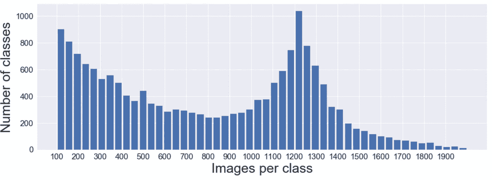
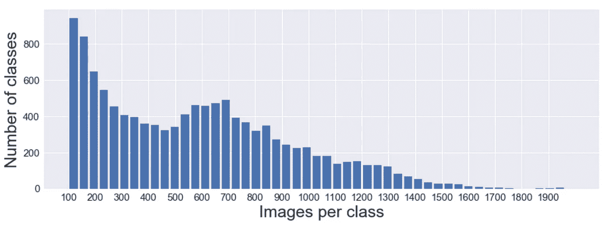
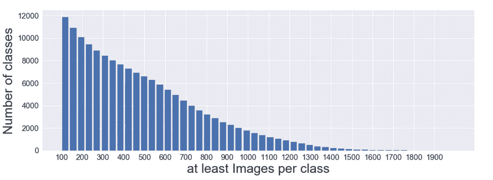
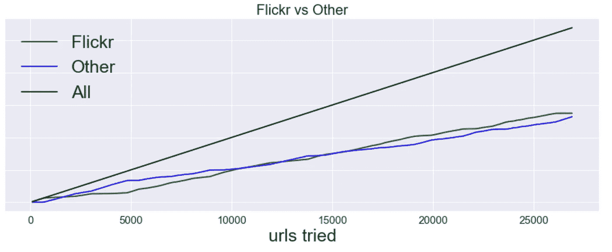
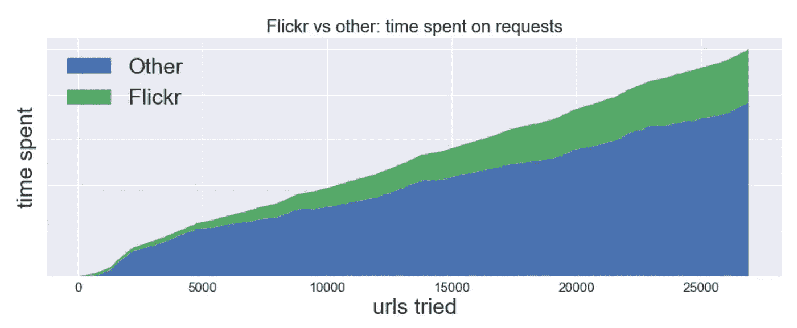
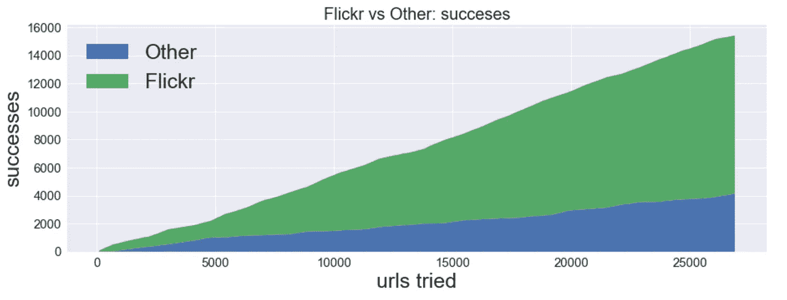
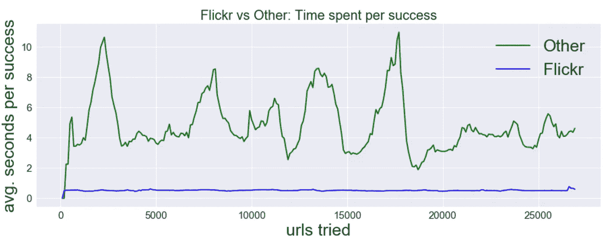

# 正在下载 ImageNet…

> 原文：<https://towardsdatascience.com/how-to-scrape-the-imagenet-f309e02de1f4?source=collection_archive---------8----------------------->

# 结果是:

我写了一个[软件工具](https://github.com/mf1024/ImageNet-datasets-downloader)，它使用 ImageNet API 提供的 URL 从 ImageNet 数据创建新的数据集。

**你可以告诉这个工具:“我想要一个有 200 个类的数据集，每个类至少有 800 张图片”，它就会开始收集图片。**

此外，在这个过程中，我做了一个[小分析](https://github.com/mf1024/data_analysis_notebooks/blob/master/imagenet_urls/ImageNet%20urls%20analysis.ipynb)，得出了关于 ImageNet 图片 URL 状态的有趣结论。

# 完整的故事:

我需要在大于 32x32 像素的图像上构建和训练分类 ConvNet，因此我必须找到一个包含用类标记的更大图像的数据集。ImageNet 就是这样一个数据集。

ImageNet 广泛用于图像分类模型的基准测试。它包含超过 20 000 个类别的 1400 万张图片。

获取数据的一种方法是使用 [ImageNet LSVRC 2012](http://academictorrents.com/collection/imagenet-lsvrc-2015) 数据集，它是整个 ImageNet 的 1000 个类别的选择，包含 128 万张图像。

但是我不一定想要也不需要下载 20 000 个类中每一个类的 150GB 的数据和图像。出于原型和测试的目的，数据集的较小子集就足够了，例如，100 个类的数据集。

ImageNet 项目不拥有任何图像，但是它们通过 [API](http://image-net.org/download-API) [或在一个文件](http://image-net.org/download-imageurls)中为每个图像提供 URL 列表。

我想了解我能够从 ImageNet 创建什么样的数据集。我分析了 URL 列表并绘制了每类图像直方图:

峰值大约是每类 1200 张图片，超过 1000 个这样的类。足以创建 100 个类数据集的许多变体，每个类至少有 1000 个图像。

# 下载和第一次观察

于是我写了一个程序，开始下载。

**在这个过程中，我观察到了 5 件事:**

1.  许多网站都关闭了。许多图像找不到了。(这些网址来自 2011 年)
2.  从自己的 URL 逐个下载图片是一个缓慢的过程，但关闭的不包含图片的 URL 会使这个过程更慢——在大多数情况下，下载图片比意识到网站不会用图片来响应要快。
3.  图像来源的多样性很高。
4.  大量图片来自 Flickr。
5.  在某些网站上，如果图像不存在，则返回另一个图像，并带有一些文本，表明该图像不存在。例如:

这是一个不太容易解决的问题。

我想到了一个可能解决一些问题的选择——只使用 Flickr 网址。

为了继续，我首先检查了 ImageNet 中是否有足够的 Flickr 图片来创建足够大的数据集。**快速 URL 解析显示，700 万张图片来自 Flickr，正好是一半。**

然后我检查了只有 Flickr URLs 的每个类的图像，得到了下面的图像:

高峰已经过去，形势看起来不再那么好了。

为了更好地理解这种情况，我创建了每类图像的反向累积图，它不是显示每类有多少个图像，而是显示每类有多少个图像:

它显示大约有 2000 个类，每个类至少有 1000 个图像，这仍然非常好，对于我的目的来说绰绰有余。

# Flickr 网址与其他网址

现在我需要检查仅使用 Flickr 网址是否会改善下载过程。

**我运行了一段时间我的下载器。在这个过程中，我尝试了 25 000 个随机网址。对于我发出的每一个 URL 请求，我都标记了图片下载是否成功，并测量了处理 URL 所花费的时间。**

首先，我想知道我尝试的网址中有多少是 Flickr 网址，有多少是其他网址:

至少在我的随机样本中，这些 URL 在 Flick 和 other 之间平均分布，这将使它们更容易比较。

以下是 Flickr URLs 与其他 URL 的请求时间对比:

似乎下载者在其他网址上花了很多时间。让我们看看所花的时间有多有成效。以下是 Flickr 网址与其他网址的成功比较:

在这里，我们可以看到，其他网址需要更多的时间，不太成功。我计算了一下平均值:**大约。80%的 Flickr 网址是成功的，而只有 30%的其他网址是成功的**

现在让我们检查一下最有趣的指标—**Flickr URL 和其他 URL 每次成功花费的时间**:

该图显示，下载者在其他 URL 上平均每次成功花费 2 到 10 秒(平均接近 4 秒)，而在 Flickr URLs 上，每次成功的时间始终保持在 0.5 秒以下。一个非常显著的差异。每张图片 0.5 秒仍然很慢，但比使用所有的 URL 要快得多，也更一致。

# ImageNet 下载器

在这个过程中，我编写了一个[下载器](https://github.com/mf1024/ImageNet-datasets-downloader)，它将创建一个包含 Y 个类的数据集，每个类包含 X 张图片。我准备好用了放在 GitHub 上。

下载器将随机挑选每班至少有 YY 图像的班级。但是如果你有什么特殊的需求，你可以指定一个下载的类列表。要选择类，您可以查看一下[类列表 csv](https://github.com/mf1024/ImageNet-datasets-downloader/blob/master/classes_in_imagenet.csv) ，其中我列出了出现在 ImageNet 中的每个类及其名称、id 和 URL 计数。

默认情况下，下载器将只使用 Flickr 网址，但如果你足够勇敢，并准备等待更长时间，并准备清理坏图像的数据，你可以关闭该选项。

# 更新:多处理器工作人员带来 25 倍的性能提升

我已经实现了并行请求处理。**有了 24 名员工，我的速度提高了 25 倍——大约。每幅图像约 0.02 秒。2 到 6 MB/s 的总下载速度。**我担心 Flickr 会以某种方式限制带宽和下载的数据量，但幸运的是，情况并非如此——我通过在短时间内下载 1000 x 1000 的图像数据集(60GB 的数据)测试了这些限制，没有出现任何问题。

[这是我博客的转贴。](https://mf1024.github.io/2019/06/09/how-to-scrape-the-imagenet/)