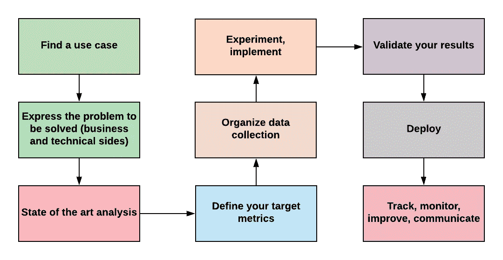
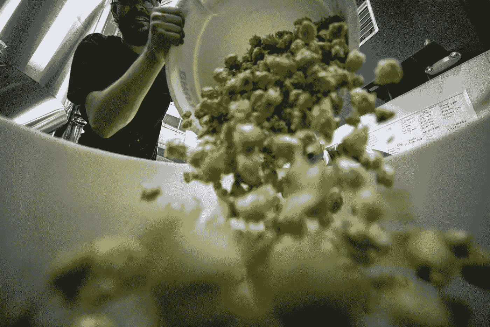
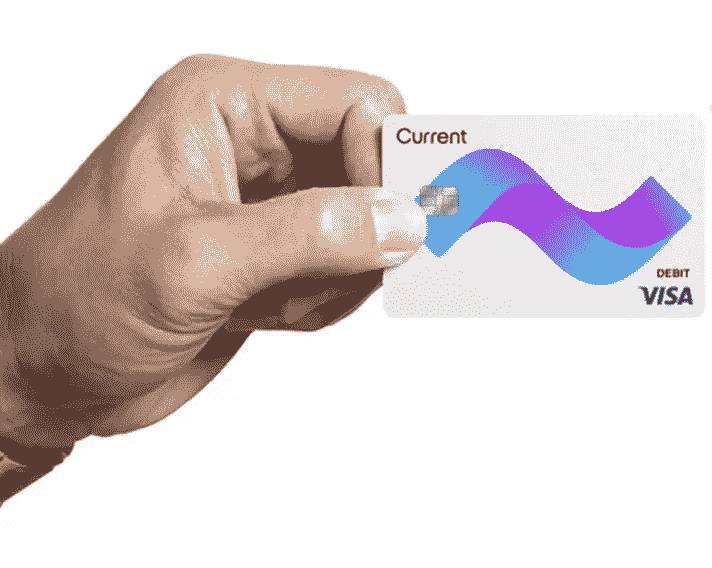

# 如何搞砸一个计算机视觉项目

> 原文：<https://towardsdatascience.com/how-to-screw-up-a-computer-vision-project-166dfcc44a5f?source=collection_archive---------12----------------------->

统计数据(它们准确吗？)告诉 [85%的 AI 项目没有交付](https://designingforanalytics.com/resources/failure-rates-for-analytics-bi-iot-and-big-data-projects-85-yikes/)。这样只剩下 15%的真正成功，而这些项目成功的原因是很充分的。从规划到沟通，我们来看看是什么让一个基于 AI 的计算机项目脱颖而出。

# 第一课:承诺过多，兑现不足

AI 就是炒作，毫无疑问。过多的承诺和过少的兑现是很容易的。最好的例子？自动驾驶汽车。他们是 AI 领域过度承诺的完美例子！回顾[汽车制造商在 2016 年讲述的自动驾驶汽车愿景很有趣](https://mashable.com/2016/08/26/autonomous-car-timeline-and-tech/?europe=true)。结果发现他们中的一些人非常乐观。


Tesla Semi prototype ([Steve Jurvetson](https://www.flickr.com/people/44124348109@N01)). Is promising big stuff a good idea?

另一方面，熟悉人工智能的人知道，我们在 2020 年初看到完全自动驾驶汽车的可能性很小。挑战是巨大的，许多分析师并不完全理解它会涉及到什么。

为了避免过度承诺，你必须找到现实世界中的用例，这些用例做出微小但重要的步骤。你的项目投资回报率必须是显而易见的。仅仅因为说话或对着相机挥手很酷就替换日常用品，但这些用例通常假设技术会完美无瑕。

你猜怎么着？一开始就不会完美无瑕。

因此，你的 AI 实现——尤其是你的第一个项目——应该总是有备份！在上面有趣的视频中，一把好的旧钥匙可能会很有用…

就部署和目标而言，这意味着您的计算机视觉应用程序应该为您的用户带来更多的东西，但如果它不能按预期工作，就永远不应该妨碍他们。

第二件重要的事情是要有一个狭窄的焦点。我将在未来的帖子中讲述更多这方面的内容，但深度学习需要大量数据。深度学习是巨大的。因此，如果你计划部署一个超级炒作的人工智能项目，例如，能够检测到野外的任何物体，但只有几百个样本可用，你就完蛋了。

[我喜欢来自](https://medium.com/@CharlesOllion/whats-easy-hard-in-ai-computer-vision-these-days-e7679b9f7db7) [Charles Ollion](https://medium.com/u/736a7799caa3?source=post_page-----166dfcc44a5f--------------------------------) 的这篇文章，它讲述了是什么让计算机视觉项目变得容易或困难。

所以，如果你想搞砸，最简单的方法就是选择一个模糊的项目，没有明确的投资回报，有很大的复杂性，只有很少的数据。例如，从头开始实现面部检测算法显然属于这一类。

# 第二课:不要从计划开始

> 如果你不知道你要去哪里，你可能不会到达那里。

正如《阿甘正传》提醒我们的，猜测有时被高估了。一个计算机视觉项目有一条清晰而稳定的成功之路，步骤总是相同的。你猜怎么着？我知道很多(我的意思是，很多)才华横溢的数据科学家有时会忘记这一点。

好了，计划是这样的！



The Data Science process — long version

我来告诉你数据科学家的肮脏秘密:我们喜欢做的部分是“实验”，看到了吗，上图中的黄色小方块？

如果这部分花费了你项目工作的 20%以上，那么相信我:你完蛋了。为什么？因为在没有仔细的问题定义的情况下开始，没有可能揭示深度学习不是这个特定问题的解决方案或者一个团队已经用完全不同的方法解决了它的最先进的分析，在没有组织数据收集的情况下开始(在第 4 课中有更多关于这一点的内容)，并且在没有适当沟通的情况下部署一些半生不熟的东西…嗯。

你想毁掉你的项目吗？这里有一个 3 步食谱:

1.  甚至在明确定义项目之前就组建数据科学团队
2.  打开 Jupyter 笔记本
3.  观看您的项目崩溃

如果你在实验阶段之前错过了一个步骤，那么你肯定会在这个项目上花费两倍以上的费用。

# 第四课:垃圾进，垃圾出

说到准备工作，数据科学中有一个神奇的公式:垃圾进，垃圾出。如果你不给你的团队提供代表你的算法将会起作用的数据，你就完了。



Garbage in. What do you expect to come out? Photo by [Elevate](https://unsplash.com/@elevatebeer?utm_source=medium&utm_medium=referral) on [Unsplash](https://unsplash.com?utm_source=medium&utm_medium=referral)

例子不胜枚举。最好的情况下，你的算法会完全不准确。更糟糕的是，它会有偏见，在伤害发生之前没有人会注意到。好的，想要一些例子吗？

还记得我们的自动驾驶汽车吗？算法目前主要在美国接受训练。想象你是一家英国汽车制造商。啊哦:突然，左手驾驶似乎是一个问题…

你是一名放射科医生，正在开发最先进的深度学习放射学软件(我猜每周都有 10 家公司因为这个承诺而成立)。你的实验室只能买得起一台好的 GE 医疗设备，但是你的客户有 Phillips 医疗设备。嗯，理论上是可行的。实际上，你没有证据证明它会。你完蛋了。


Photo by [Mathew Schwartz](https://unsplash.com/@cadop?utm_source=medium&utm_medium=referral) on [Unsplash](https://unsplash.com?utm_source=medium&utm_medium=referral)

一个更微妙的例子。几年前，我开发了一个系统，可以自动检测你智能手机上的积分卡。这是一个困难的问题，因为它是一个有 500 个类别的分类器，而每个类别只有一个样本。我们成功了(根据我们的目标衡量标准)，因为我们大量使用了数据增强和其他技巧来使我们的深度学习部分工作。



A thumb on a credit card, from [The Verge](https://www.theverge.com/circuitbreaker/2017/5/9/15599020/current-app-controlled-visa-debit-card-allowance-kids-spending)

我们最引以为傲的技巧之一是在卡片的不同部分模拟拇指，并将其输入神经网络。答对了。除了它有缺陷和偏见:它只适用于白人男性的拇指。哎呀。

但总的来说，我经常看到客户有一个很好的数据集，但完全无法使用，因为它不是在生产环境的条件下捕获的。测试材料不能很好地概括。在 90%的情况下，我们在 [NumeriCube](http://www.numericube.com) 不得不从头开始重做数据集。要做到这一点，我们必须按顺序执行这些步骤——当您还不知道将使用哪种摄像机时，如何为系统收集图像呢？

你想确保你的计算机视觉项目失败吗？给它输入不准确的数据。经验之谈。

# 第五课:永远不要评估

计算机视觉项目失败的最后一种方式——但还有其他方式——是忽略评估部分。我所说的“评估”，是指从写下你的业务目标开始，到满意地查看你的生产监控系统，确认一切正常为止。


How deep will your project fail? Photo by [Gonard Fluit](https://unsplash.com/@gonardfluit?utm_source=medium&utm_medium=referral) on [Unsplash](https://unsplash.com?utm_source=medium&utm_medium=referral)

首先，在开始编写任何代码之前(嘿，在编写代码之前你应该做很多事情)，开始陈述你将用来决定你的项目是否成功的度量标准。

哦，小心点，有诡计。例如，如果你说“我希望我的癌细胞检测器在 99%的情况下都是正确的”，我已经可以给你一个有效的算法:

```
def is_cell_cancerous(img):
    """A very powerful algorithm that returns True if the given image is of a cancerous cell and False otherwise. Gives more than 99% accuracy provided you feed it with less than 1% cancerous cell images."""
    return False
```

明白了吗？这里的精度指标不令人满意，您必须使用其他方法。什么？这取决于你的项目目标，但考虑 F1 分数，确保你的数据集是平衡的，并使用可以在现实世界中测量的指标。例如，如果您想检测图片上的汽车，使用平均精度(地图)很适合于训练，但可能您的用户希望有一个计数而不是表面的百分比…

事实上，许多项目在开始后就找到了他们的客观标准。在 [NumeriCube](http://www.numericube.com) 公司，我们习惯于在开始项目之前就与客户协商目标指标，但那是因为我们有丰富的经验。当你开始第一个项目时，保持低目标(参见第一课:不要承诺过多)。

# 结论…

我们还可以说很多其他的事情来帮助构建更好的数据科学项目:清晰的沟通，让利益相关者参与进来，分享最佳实践，在需要时使用外部输入…你对此有什么看法？我们谈谈吧！