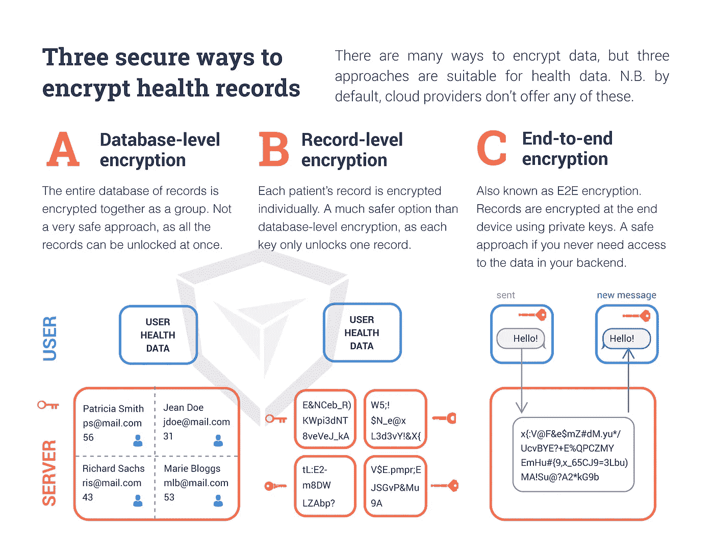

# 如何保护云中的健康数据

> 原文：<https://towardsdatascience.com/how-to-secure-health-data-in-the-cloud-541fbdad811a?source=collection_archive---------16----------------------->

> 数据保护是一个大新闻，人们开始意识到保持健康数据安全的重要性。在这篇博客中，我将探讨数字健康公司应该使用哪些数据安全技术来保护您的健康数据的安全。

我一生都在研究健康数据安全。我在医疗保健 IT 巨头 [GPI](https://www.gpi.it/) 做了 4 年的软件架构师。然后，我对这个主题的热情让我完成了一个博士学位。2014 年，我将我对商业和数据安全的兴趣结合起来，创建了 [Chino.io](https://www.chino.io/technology) ，这是一家专注于数字健康的网络安全公司。

五年后的今天，GDPR 让所有人都关注这个话题。数据保护不再仅仅是一项“值得拥有”的功能。最近，我在[看到了许多案例](https://www.chino.io/blog/gdpr-fines-in-helthcare-7-lessons/)，在这些案例中，公司因为犯错而遭受巨额罚款和名誉损失。2019 年早些时候，[英国 IPO 因违反 GDPR](https://www.chino.io/blog/320m-euro-gdpr-fines-really-hurt/) 对英国航空公司和马里奥特处以总计 3 . 2 亿€的罚款。在这两起事件中，违规都与糟糕的数据安全实践有关。

> 遗憾的是，你不能依靠你的云提供商来确保你的应用安全。保护健康数据需要你做比 Azure 或 AWS 所能提供的更多的事情。

# 背景

在读博士期间，我意识到妥善保护健康数据极其困难。从法律上讲，健康数据受到特殊对待，因为它非常敏感。在美国，它受《健康保险流通与责任法案》( [HIPAA](https://www.hhs.gov/hipaa/for-professionals/privacy/laws-regulations/index.html) )保护。而在欧盟，根据 GDPR[和](https://www.chino.io/blog/gdpr-one-year-on-why-still-matters/)的规定，它被定义为一个特殊的个人数据类别。

这些法律对数据安全采取了[非常不同的方法](https://www.chino.io/blog/gdpr-vs-hipaa-for-digital-health-apps/)。HIPAA 对数据安全给出了精确的指示，而 GDPR 谈论的是提供“最先进的”安全。但是，最终的结果是一样的。有些[特定的](https://www.chino.io/blog/https-www-chino-io-blog-10-key-tips-about-gdpr-for-health-data-apps-developers/)数据安全和管理措施是你必须实施的，而这些并不容易做好。

> 2017 年，[谷歌 DeepMind 因不当访问 160 万患者的健康数据而被判有罪](https://techcrunch.com/2017/07/03/uk-data-regulator-says-deepminds-initial-deal-with-the-nhs-broke-privacy-law/)。这场争议对他们的 Streams 应用程序的声誉产生了持久的影响。

# 数据保护与数据安全

在这一点上，[澄清数据保护和数据安全之间的区别](https://www.chino.io/blog/data-protection-vs-data-security/)可能是有用的。数据保护是指保护个人数据的安全。这是通过结合组织措施和数据安全来实现的。组织措施包括用户协议、关于谁可以访问数据的政策、关于数据可以存储多长时间的准则等。数据安全性与您如何存储数据有关，以便只有被允许的人才能访问这些数据。本文主要关注数据安全性。

# 健康数据的数据安全性

历史上，健康数据存储在本地。例如，每家医院都有自己的患者记录服务器。然而，电子医疗应用程序需要数据在应用服务器上可用。这些服务器通常位于云中。正确保护这些数据很难。使用了 3 种关键技术:加密、假名化和匿名化。让我们详细看一下其中的每一个。

# 加密

数据加密通过使用合适的加密操作对数据进行编码来保护您的数据。您可以加密静态数据(例如，存储在您的设备或服务器上的数据)或传输中的数据(通过网络)。如下图所示，有三种主要的加密形式。

通常，数据库级安全性对于大多数数据来说已经足够好了。这就是云提供商为客户提供的服务。但是，对于健康数据，您应该使用记录级(应用程序级)加密。在这里，每个单独的记录都用自己的密钥加密。对于保护敏感聊天(例如医生和患者之间的聊天)，端到端加密可能更合适。在这里，消息在发送到网络之前被加密，并且只能由接收者解密。这些技术不是主流云提供商提供的。

# 假名化

[假名化](https://www.chino.io/blog/how-to-implement-pseudonymization-key-questions/)包括用假名替换所有的个人标识符。这可能是一个真实的假名，但通常是一个数字或字母数字标识符。假名是随机生成的。这一过程如下图所示。

假名在数据保护中被用来掩盖一个人的身份。然后，敏感数据可以与假名一起存储，而假名和相关个人信息的列表(映射)被分开存储。这使得攻击者更难窃取数据。但是，假名数据仍然算作个人数据。

# 匿名化

匿名包括完全删除所有个人数据，然后混淆或掩盖剩余数据。这样做的目的是确保您无法从剩余的数据中重新识别特定的个人。标准技术包括概括、交换、扰动和聚合。众所周知，正确对待匿名非常困难。下图显示了聚合的工作原理。

问题是，匿名化要求将根据数据的独特性而变化。例如，如果你有一组 20 个病人，但只有一个超过 50 岁，那么简单地将年龄四舍五入到最近的十年是不够的。人们对不同的技术进行了大量的研究，如 k-匿名和差分隐私，这些技术试图保证数据的匿名性。

# 我应该使用哪种数据安全技术？

在设计电子医疗应用程序时，您需要了解使用哪种技术或技术组合。当我向客户提供建议时，我首先会问他们的使用案例是什么。他们是否只需要存储数据，是否需要能够搜索数据，或者是否需要将数据用于商业智能和分析。

# 存储健康数据

如果您只想安全地存储健康数据，最好的方法是使用记录级加密。然而，有几个问题你需要明白。

1.  记录级加密很难实现。它需要密钥管理和强大的登录和权限系统来控制谁可以访问密钥。
2.  数据在数据库中被加密。这意味着您无法直接搜索它。您需要考虑这对您的应用程序设计的影响。
3.  像这样的加密数据库永远不会像未加密数据库那样响应迅速。在设计应用程序时，您需要记住这一点。
4.  理想情况下，您需要将用户详细信息和记录数据存储在不同的系统中。这增加了一层额外的保护。它还允许您减少加密的数据量。

# 共享健康数据

通常，您需要能够在受信任的各方之间共享健康数据。例如，一个病人，他们的家庭医生和医院顾问。这里，重要的是提供强大的 AAA 控制。AAA 代表认证、授权和计费。它用于控制谁有权访问数据，允许他们对数据做什么，并记录每次数据访问/更改。

通常，你只需要分享实际的健康数据，而不是随之而来的个人信息。这通常是您的系统使用 AI 来分析扫描和患者观察数据的情况。在决定加密哪些数据时，这是您应该考虑的事情之一。

# 分析健康数据

大数据是大新闻，即使这些数据像健康记录一样敏感。例如，制药公司可以从分析和理解典型的患者档案中获得巨大的利益。这就是数据匿名化的用武之地。问题是，匿名健康数据尤其困难。很多时候，留下的数据对任何有意义的分析都不再有用。

# 结论

确保数据安全总是很重要的。但是健康数据让这个问题变得更加困难。你不能只是把问题委托给你的云提供商。既然您已经了解了相关技术，那么您就知道应该向您的技术团队提出哪些正确的问题，以确保您不会与 GDPR 或 HIPAA 发生冲突。

# 关于作者

[Jovan Stevovic](https://www.linkedin.com/in/jovanstevovic/) ，博士在完成博士学位后于 2014 年联合创办了 [Chino.io](https://www.chino.io/) 。Jovan 是健康数据的数据保护、隐私和安全方面公认的专家。他担任过 5 个创业加速器的顾问，是柏林和整个欧盟健康技术社区的受人尊敬的成员。