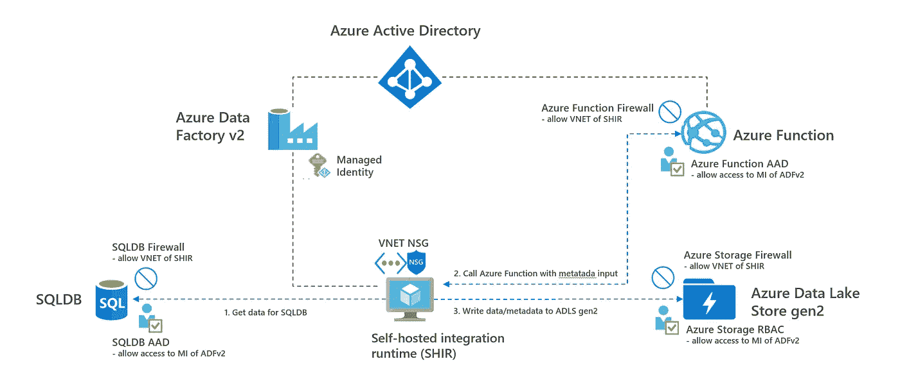
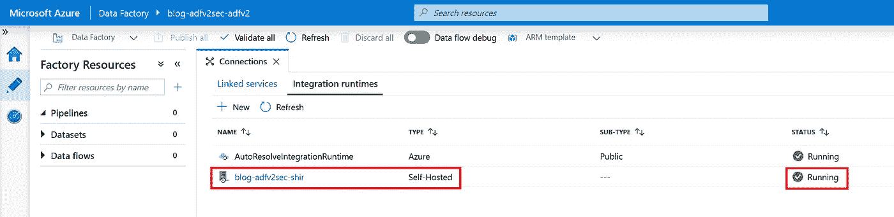
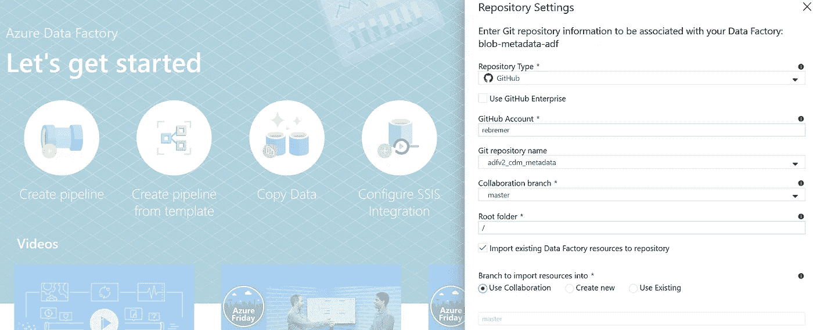
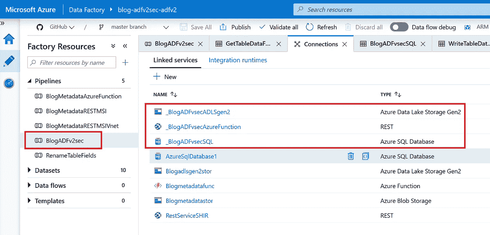
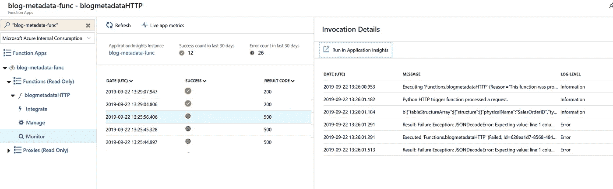
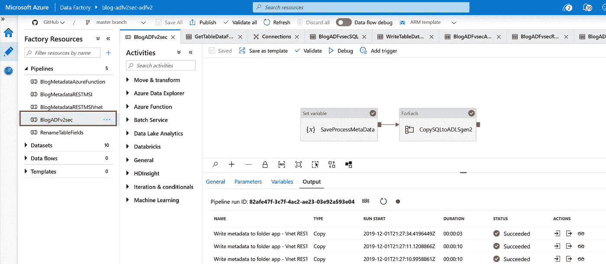

# 如何保护你的 Azure 数据工厂管道

> 原文：<https://towardsdatascience.com/how-to-secure-your-azure-data-factory-pipeline-e2450502cd43?source=collection_archive---------13----------------------->

# 1.介绍

Azure Data Factory (ADFv2)是一个流行的工具，用于协调从内部到云的数据接收。在每个 ADFv2 管道中，安全性都是一个重要的主题。常见的安全方面如下:

*   Azure Active Directory (AAD)对数据和端点的访问控制
*   管理身份(MI)以防止关键管理流程
*   数据和端点的虚拟网络(VNET)隔离

在本博客的剩余部分，将讨论如何使用 AAD、MI、VNETs 和防火墙规则来保护 ADFv2 管道。关于 Azure 功能安全性的更多细节，请参见[我的另一篇博客](https://medium.com/@rebremer/how-to-secure-your-azure-function-data-processing-c9947bf724fb)。关于如何使用快照和增量备份来防止数据湖中的数据丢失的解决方案，请看这个[博客](/how-to-create-snapshots-and-backups-of-your-azure-storage-e72bef58e0aa)。

***更新 2020–07–26:现在可以在一个*** [***托管的 VNET***](https://docs.microsoft.com/en-us/azure/data-factory/managed-virtual-network-private-endpoint) ***中运行 ADFv2 Azure 托管集成运行时。这是在公共预览，这个博客还没有更新这个功能。***

# 2.Azure 数据工厂管道的架构

在这个 [ADFv2 管道](https://github.com/rebremer/adfv2_cdm_metadata)中，数据从 SQLDB 中读取，使用 Azure 函数进行转换，并写入 ADLS gen2 帐户。该项目的架构可以在下面找到。



2\. Azure Data Factory pipeline architecture

Azure 服务及其在本项目中的使用描述如下:

*   **SQLDB** 被用作包含将被复制的表格数据的源系统。
*   **Azure 数据工厂** **v2** (ADFv2)被用作将数据从源复制到目的地的编排器。ADFv2 使用一个**自托管集成运行时** (SHIR)作为计算，它运行在 VNET 中的虚拟机上
*   **Python**中的 Azure 函数**用于解析数据。函数无法访问其他 Azure 资源**
*   ****Azure 数据湖存储 gen2** (ADLS gen2)用于存储来自 10 个 SQLDB 表的数据和由 Azure 函数创建的元数据文件**
*   ****Azure Active Directory**(AAD)是微软的身份和访问管理服务，用于对 Azure 资源进行认证和授权**

**以下安全方面是该项目的一部分。**

*   ****AAD 访问控制** : SQLDB、ADLS gen 2、Azure 函数只允许 ADFv2 的 MI 访问数据。这意味着不需要在 ADFv2 或密钥库中存储任何密钥。**
*   ****防火墙规则** : SQLDB、ADLS gen 2、Azure Function 都有防火墙规则，只允许 SHIR 的 VNET 作为入站网络**

**在下一章中，将实现 ADFv2 流水线架构。**

# **3.创建和部署 ADFv2 管道**

**在本章中，将执行以下步骤来创建和部署 ADFv2 管道。**

*   **3a。安装准备工作和资源**
*   **3b。在 ADFv2 中创建自托管集成运行时**
*   **3c。保护 ADLS 第二代帐户**
*   **3d。安全 SQLDB 数据库**
*   **3e。部署和保护 Azure 功能**
*   **3f。配置并运行 ADFv2 管道**

## **3a。安装准备工作和资源**

**在本教程中，资源的部署将尽可能使用代码来完成。需要安装以下资源:**

*   **安装 [Azure CLI](https://docs.microsoft.com/en-us/cli/azure/install-azure-cli?view=azure-cli-latest)**
*   **安装 [Azure PowerShell](https://docs.microsoft.com/en-us/powershell/azure/install-az-ps?view=azps-3.1.0)**
*   **安装 [Visual Studio 代码](https://code.visualstudio.com/)**
*   **在 Visual Studio 代码中安装 [Azure 函数 Python](https://docs.microsoft.com/en-us/azure/azure-functions/functions-create-first-function-python) 库**

**安装好预备程序后，就可以安装基础资源了。打开 Visual Studio 代码，创建一个新的终端会话并执行下面的命令。**

```
# Login with your AzureAD credentials
az login# set parameters
$rg = "<<Resource group>>"
$loc = "<<Location, e.g. westeurope>>"
$adfv2 = "<<Adfv2 name>>"
$sqlserv = "<<Logical sql server>>"
$sqldb = "<<SQLDB name>>"
$sqluser = "<<SQLDB username>>"
$pass = "<<SQLDB password, [use https://passwordsgenerator.net/](https://passwordsgenerator.net/)>>"
$adls = "<<adls gen 2 account, only alphanumeric>>"
$funname = "<<Azure Function name>>"
$funstor = "<<Azure Function storage>>"
$funplan = "<<Azure Function plan>>"
$vnet = "<<Azure VNET name>>"# create resource group
az group create -n $rg -l $loc# create Azure Data Factory instance
az resource create --resource-group $rg --name $adfv2 --resource-type "Microsoft.DataFactory/factories" -p {}# create logical SQL server and SQLDB
az sql server create -l $loc -g $rg -n $sqlserv -u sqluser -p $pass
az sql db create -g $rg -s $sqlserver -n $sqldb --service-objective Basic --sample-name AdventureWorksLT# create ADLS gen 2 account and container
az storage account create -n $adls -g $rg -l $loc --sku Standard_LRS --kind StorageV2 --hierarchical-namespace true
az storage container create --account-name $adls -n "sqldbdata"# create Azure Function
az storage account create -n $funstor -g $rg --sku Standard_LRS
az appservice plan create -n $funplan -g $rg --sku B1 --is-linux
az functionapp create -g $rg --os-type Linux --plan $funplan --runtime python --name $funname --storage-account $funstor# create VNET
az network vnet create -g $rg -n $vnet -l $loc --address-prefix 10.100.0.0/16 --subnet-name shir --subnet-prefix 10.100.0.0/24
```

## **3b。在 ADFv2 中创建自托管集成运行时**

**在这一部分中，将配置 ADFv2 中的自托管集成运行时。这将使用之前创建的 VNET 中运行的虚拟机来完成。执行下面的 Azure CLI 脚本。**

```
# use the same parameters in step 3a, plus additional params below:$shir_rg="<<rg name>>"
$shir_name="<<shir name>>"
$shir_vm="<<name of VMs on which SHIR runs>>"
$shir_admin="<<name of VMs on which SHIR runs>>"
$shir_pass="<<VM password, [use https://passwordsgenerator.net/](https://passwordsgenerator.net/)>>"az group deployment create -g $shir_rg --template-uri [https://raw.githubusercontent.com/Azure/azure-quickstart-templates/master/101-vms-with-selfhost-integration-runtime/azuredeploy.json](https://raw.githubusercontent.com/Azure/azure-quickstart-templates/master/101-vms-with-selfhost-integration-runtime/azuredeploy.json) --parameters existingDataFactoryName=$adfv2 existingDataFactoryResourceGroup=$rg existingDataFactoryVersion=V2 IntegrationRuntimeName=$shir_name NodeCount=2 adminUserName=$shir_admin adminPassword=$shir_pass existingVirtualNetworkName=$vnet existingVnetLocation=$loc existingVnetResourceGroupName=$rg existingSubnetInYourVnet="shir"
```

**脚本可能需要 15 分钟才能完成。运行脚本后，您可以在 ADFv2 实例中验证它是否已成功部署，另请参见下文。**

****

**3b1\. Self-hosted Integration Runtime successfully deployed**

## **3c。保护 ADLS 第二代帐户**

**在这一部分中，ADLS gen2 帐户将受到保护。这是按如下方式完成的:**

*   **添加 RBAC 规则，即只有 ADFv2 的 MI 可以访问 ADLS gen 2**
*   **添加防火墙规则，只有 SHIR 的 VNET 可以访问 ADLS gen 2 容器**

**在这种情况下，Azure PowerShell 用于使用相同的变量配置规则**

```
# Get params, PowerShell is used here, can be done in VSC terminal
Set-AzDataFactoryV2 -ResourceGroupName $rg -Name $adfv2 -Location $l
$adfv2_id = Get-AzDataFactoryV2 -ResourceGroupName $rg -Name $adfv2
$sub_id = (Get-AzContext).Subscription.id# Give ADFv2 MI RBAC role to ADLS gen 2 account
New-AzRoleAssignment -ObjectId $adfv2_id.Identity.PrincipalId -RoleDefinitionName "Reader" -Scope  "/subscriptions/$sub_id/resourceGroups/$rg/providers/Microsoft.Storage/storageAccounts/$adls/blobServices/default"New-AzRoleAssignment -ObjectId $adfv2_id.Identity.PrincipalId -RoleDefinitionName "Storage Blob Data Contributor" -Scope  "/subscriptions/$sub_id/resourceGroups/$rg/providers/Microsoft.Storage/storageAccounts/$adls/blobServices/default/containers/sqldbdata"# Turn on firewall
Update-AzStorageAccountNetworkRuleSet -ResourceGroupName $rg -Name $adls -DefaultAction Deny# Set service endpoints for storage and SQL to subnet
Get-AzVirtualNetwork -ResourceGroupName $rg -Name $vnet | Set-AzVirtualNetworkSubnetConfig -Name "shir" -AddressPrefix "10.100.0.0/24" -ServiceEndpoint "Microsoft.Storage", "Microsoft.SQL" | Set-AzVirtualNetwork# Add firewall rules
$subnet = Get-AzVirtualNetwork -ResourceGroupName $rg -Name $vnet | Get-AzVirtualNetworkSubnetConfig -Name "shir"
Add-AzStorageAccountNetworkRule -ResourceGroupName $rg -Name $adls -VirtualNetworkResourceId $subnet.Id
```

**在最后一步之后，从 Azure 门户访问您的存储帐户将被拒绝(因为它不是 VNET 的一部分)。要允许从门户访问，您需要将您的 IP 地址列入白名单。**

## **3d。安全 SQLDB 数据库**

**在这一部分中，SQLDB 将受到保护。这是按如下方式完成的:**

*   **添加数据库规则，只有 ADFv2 的 MI 可以访问 SQLDB**
*   **添加防火墙规则，只有 SHIR 的 VNET 可以访问 SQLDB**

**Azure PowerShell 用于配置规则。**

```
# Configure AAD access to logical SQL server
Connect-AzureAD
$aaduser = "<<your aad user email address>>"
Set-AzSqlServerActiveDirectoryAdministrator -ResourceGroupName $rg -ServerName $sqlserver -DisplayName $aaduser# log in SQL with AAD (e.g. via portal query editor, SSMS or VSC)
# Execute following SQL statement
CREATE USER [<<your Data Factory name>>] FROM EXTERNAL PROVIDER;
EXEC sp_addrolemember [db_datareader], [<<your Data Factory name>>];# Add firewall rules
$subnet = Get-AzVirtualNetwork -ResourceGroupName $rg -Name $vnet | Get-AzVirtualNetworkSubnetConfig -Name "shir"
New-AzSqlServerVirtualNetworkRule -ResourceGroupName $rg -ServerName $sqlserver -VirtualNetworkRuleName "shirvnet" -VirtualNetworkSubnetId $subnet.Id
```

**要从计算机进行访问以进行测试，您需要清空您的 IP 地址。**

## **3e。部署和保护 Azure 功能**

**在这一部分，将部署 Azure 功能。这是按如下方式完成的:**

*   **将源部署到功能**
*   **添加防火墙规则，只有 SHIR 的 VNET 可以访问 Azure 功能**
*   **添加只有 ADFv2 的 MI 才能访问 Azure 功能的 App 注册**

**第一步是使用这个[快速入门](https://github.com/MicrosoftDocs/azure-docs/blob/master/articles/azure-functions/functions-create-first-function-python.md)在 python 中创建一个 Azure 函数。随后，更新 requirement.txt，__init__。py 并从[这个 git 库](https://github.com/rebremer/adfv2_cdm_metadata/tree/master/modeljson/modeljsonwrite)添加 cdmschema.py。然后将您的函数发布到步骤 3a 中创建的$funname。要增强安全性，请使用以下 Azure CLI 脚本添加防火墙规则:**

```
az webapp config access-restriction add -g $rg -n $funname --rule-name "shirvnet" --action Allow --vnet-name $vnet --subnet "shir" --priority 300
```

**最后，对 Azure 函数的 AAD 访问可以通过向 Azure 函数添加一个 app 注册来配置，并且只允许 ADFv2 的 MI 访问 Azure 函数。参考这个[教程](https://github.com/rebremer/managed_identity_authentication)和这个 [PowerShell 脚本](https://github.com/rebremer/managed_identity_authentication/blob/master/AAD_auth_ADFv2_MI_to_Azure_Function.ps1)如何做到这一点。**

## **3f。配置并运行 ADFv2 管道**

**在这一部分中，将配置和运行 ADFv2 管道。转到您的 Azure Data Factory 实例，选择设置一个代码存储库并导入下面的 GitHub 存储库 **rebremer** 和项目 **adfv2_cdm_metadata** ，见下文。**

****

**3f1\. Setup code repository in ADFv2**

**只有管道 **BlogADFv2sec** 与这个博客相关。为 ADLS gen2、Azure Function 和 SQLDB 定制此管道的相关链接服务，另请参见下文。**

****

**3f2\. Customize linked services in pipeline BlogADFv2sec**

**查看此[链接](https://docs.microsoft.com/en-us/azure/azure-functions/functions-monitoring#add-to-an-existing-function-app)如何使用 Applications Insights 登录 Azure 功能。下面是一个日志记录的例子。**

****

**3f3\. Logging ADFv2 pipeline**

**最后一步，管道可以在 ADFv2 中运行。转到您的管道并单击 debug。当一切顺利时，所有的绿色检查将出现在输出中，如下所示。**

****

**3f4\. Successful run of pipeline**

# **4.结论**

**在这篇博客中，创建了一个部署安全 ADFv2 管道的架构，其中数据从 SQLDB 读取，使用 Azure 函数转换，并写入 ADLS gen2 帐户。其中，AAD 访问控制、托管身份、虚拟网络和防火墙规则用于保护管道，另请参见下面的架构。**

****

**4\. Azure Data Factory pipeline architecture**

*****注来自《走向数据科学》的编辑:*** *虽然我们允许独立作者根据我们的* [*规则和指导方针*](/questions-96667b06af5) *发表文章，但我们不认可每个作者的贡献。你不应该在没有寻求专业建议的情况下依赖一个作者的作品。详见我们的* [*读者术语*](/readers-terms-b5d780a700a4) *。***