# 如何在 Amazon RDS 上建立 PostgreSQL 数据库

> 原文：<https://towardsdatascience.com/how-to-set-up-a-postgresql-database-on-amazon-rds-64e8d144179e?source=collection_archive---------13----------------------->


LPhoto by [Joshua Sortino](https://unsplash.com/@sortino?utm_source=unsplash&utm_medium=referral&utm_content=creditCopyText) on [Unsplash](https://unsplash.com/s/photos/data?utm_source=unsplash&utm_medium=referral&utm_content=creditCopyText)

[**PostgreSQL**](https://www.postgresql.org/about/) **是一个开源的对象关系数据库系统，使用 SQL 语言进行交互和维护。它已经被证明是一个高度可扩展的数据库解决方案，因为它允许您管理万亿字节的数据，并且可以处理许多并发用户。PostgreSQL 也是符合 ACID 的，以确保出错时的有效性。**

当您需要创建关系数据库时，您应该**选择 PostgreSQL 数据库，**其中数据被组织到一个或多个由列和行组成的表中，使用唯一的键来标识每一行。一个表中的行通常使用该唯一键链接到其他表中的行。

虽然有许多地方可以托管您的 PostgreSQL 数据库，但是**本文特别关注在** [**亚马逊关系数据库服务**](https://docs.aws.amazon.com/AmazonRDS/latest/UserGuide/Welcome.html) **(亚马逊 RDS)** 上托管您的数据库。Amazon RDS 允许在 AWS 云中设置关系数据库，非常容易使用。

如果您刚刚开始使用所有 AWS 服务，希望您会发现这很有帮助！在本文的大部分时间里，我将介绍 AWS 上的 PostgreSQL 设置，然后介绍如何执行一些其他有用的数据库操作。如果您已经建立了数据库，请随意跳过！⏭⏭

**这篇文章涵盖了哪些内容:**

*   如何在 Amazon RDS 中创建 PostgreSQL 数据库
*   如何从外部连接到 PostgreSQL 数据库
*   如何使用 SQL 在数据库中创建表
*   如何使用 SQL 将数据插入数据库的表中
*   如何使用 SQL 删除数据库中的表

# 在 Amazon RDS 中创建 PostgreSQL 数据库

要在 AWS 中创建 Postgres 数据库，首先登录您的帐户并在 AWS 管理控制台中搜索`RDS`。点击左边工具条上的`Databases`，你将被带到一个如下所示的页面。

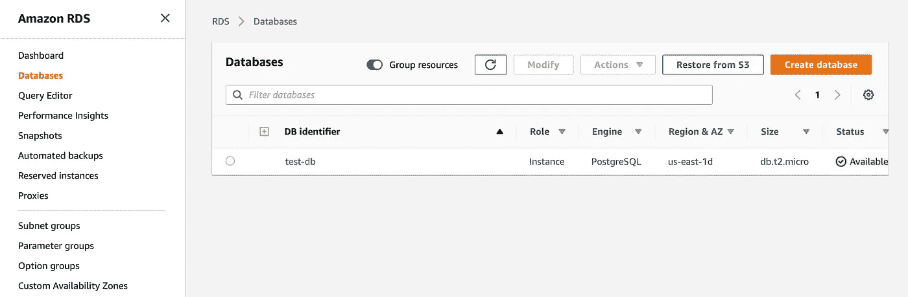

RDS Databases View

点击右上角的橙色`Create database`按钮，现在你可以开始为你的新数据库选择选项了。

## **选择一种数据库创建方法**

选择`Standard Create`以便您可以定制数据库配置。

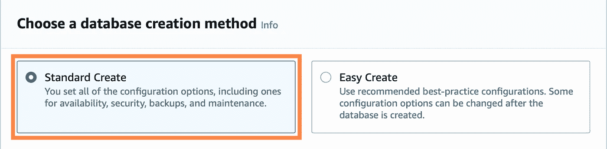

## **选择发动机选项**

我们正在创建 Postgres 数据库，因此选择 PostgreSQL 并保留默认版本 11.5-R1。

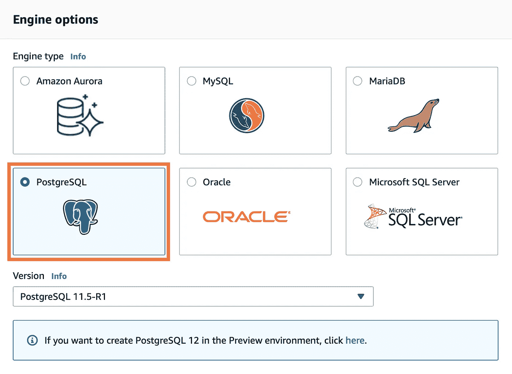

## **为您的用例选择一个模板**

因为我们正在测试，所以我选择了免费层！

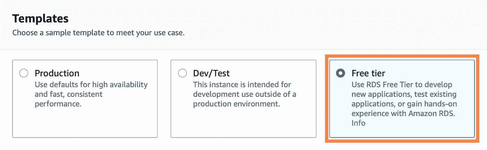

## **自定义设置**

您可以更改`DB instance identifier`和`Master username`或保留默认值。我把我的用户名改成了`test-db`和，并保留了默认用户名`postgres`。您也可以让 Amazon RDS 为您生成一个密码，或者您可以指定自己的密码。在这个例子中，我指定了我自己的。

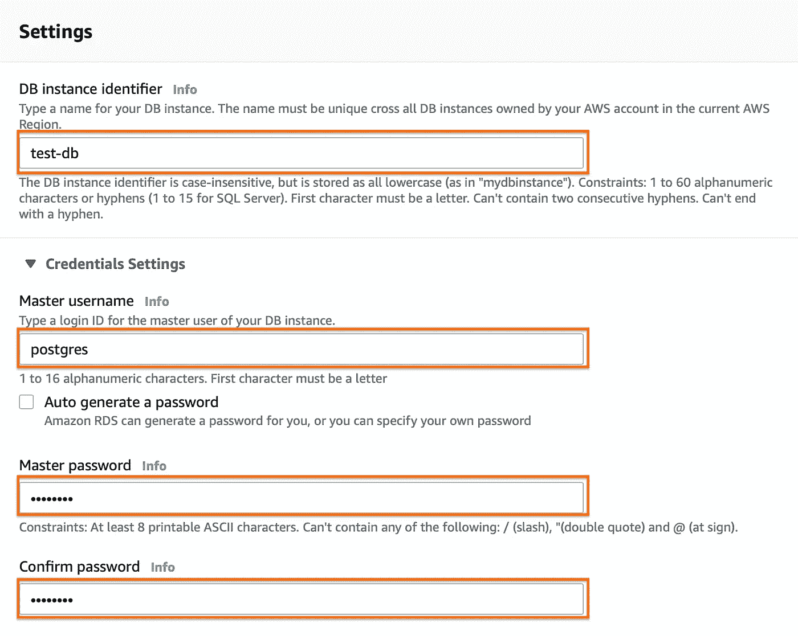

## **数据库实例大小**

DB instance 类决定 Amazon RDS DB 实例的计算和内存容量。您需要的 DB 实例类取决于您的处理能力和内存需求( [Amazon 文档](https://docs.aws.amazon.com/AmazonRDS/latest/UserGuide/Concepts.DBInstanceClass.html))

这是您希望选择满足内存需求的实例的地方。对于免费层，我们只有`Burstable classes`作为选项，我将这部分保留为默认的`db.t2.micro`。

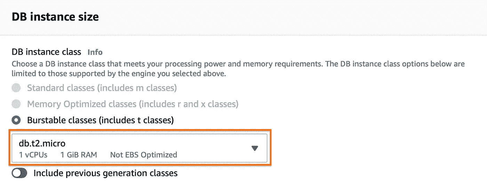

## **存储大小**

您可以在这里指定数据库的存储要求。您还可以选择启用存储自动扩展，以便您的数据库是动态的，可以自动扩展🙂

同样，我只是保留了`storage type`、`allocated storage`、`maximum storage threshold`的默认值，并保留了`enable storage autoscaling`选中的✅

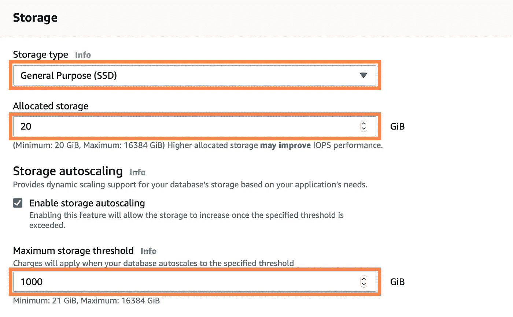

## **可用性&耐用性**

该选项用于创建一个备用数据库，以防停机，这样您的数据库就可以一直正常运行。该选项在空闲层不可用。

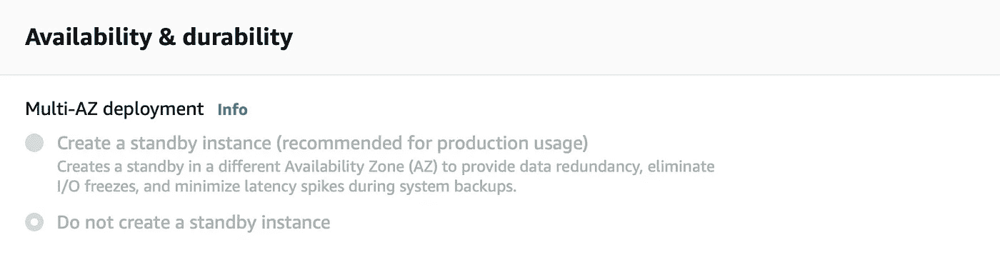

## 连通性

您可以在这里指定以下连接配置:

*   **VPC** —为该数据库实例定义虚拟网络环境的 VPC
*   **子网组** —定义数据库实例可以使用哪些子网和 IP 范围的子网组
*   **公共可访问性** —数据库是否可公开访问
*   **VPC 安全组** —允许 VPC 之外的流量进入的安全组
*   **可用性区域** —通过将故障与其他可用性区域隔离来提高高可用性
*   **数据库端口** —数据库实例将用于应用程序连接的 TCP/IP 端口

我保留了除`Publicly accessible`部分之外的所有默认值，我将它改为`Yes`，这样我的数据库就可以在 VPC 之外访问，就像从 Jupyter 笔记本上访问一样。

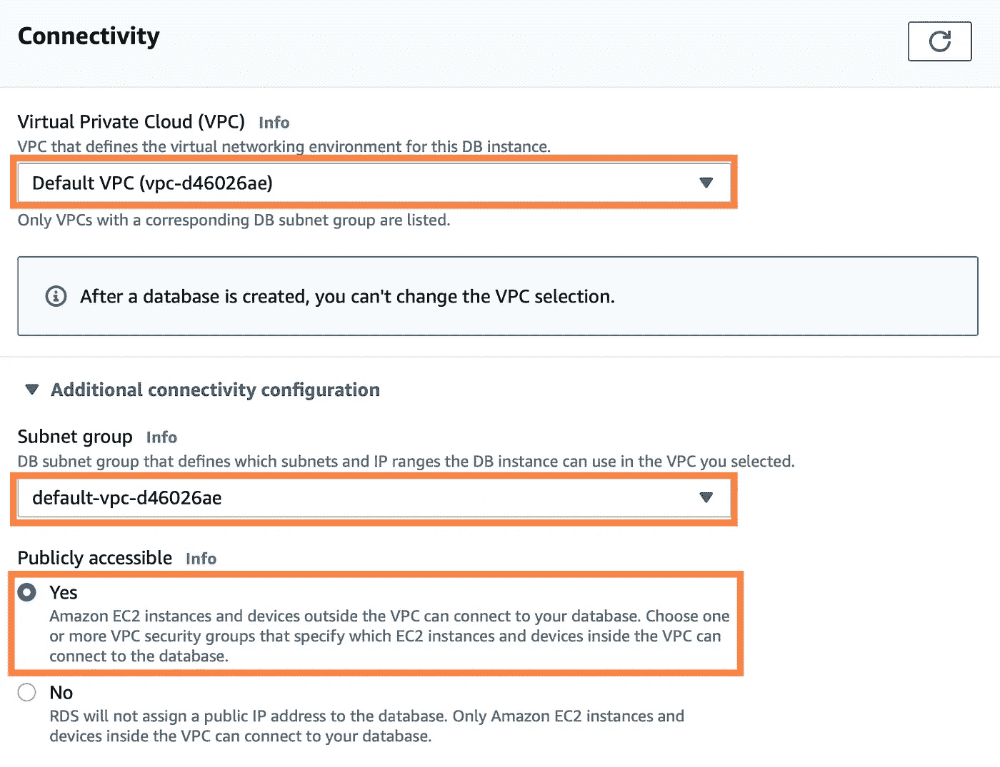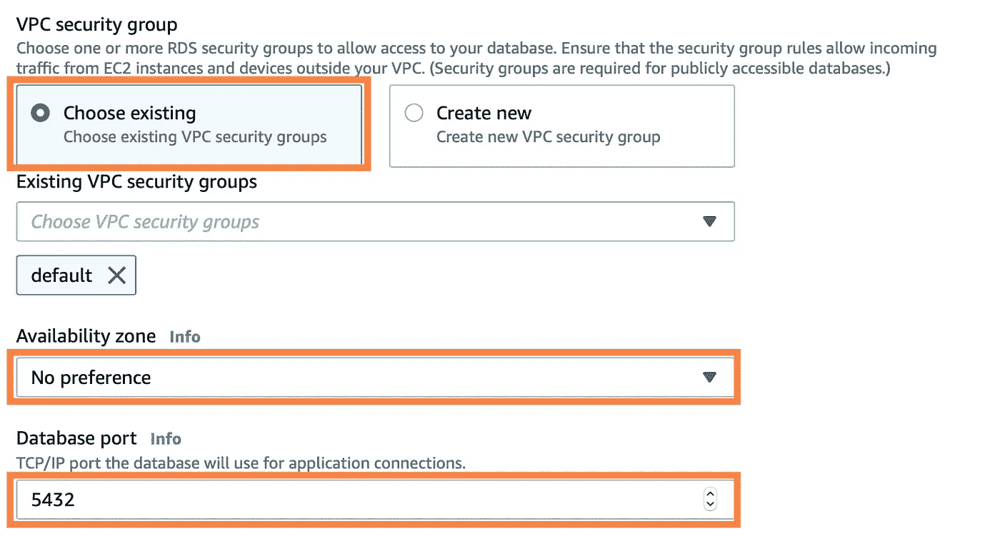

## 数据库认证

在此部分中，您可以从以下选项中选择如何验证您的数据库凭据:

*   **密码认证** —通过 DB 引擎的本机密码认证特性管理您的数据库用户凭证。
*   **密码和 IAM 数据库认证** —通过 DB 引擎的本机密码认证功能和 IAM 用户和角色管理您的数据库用户凭证。
*   **密码和 Kerberos 认证** — 通过 DB 引擎的原生密码认证特性和 AWS 目录服务创建的 AWS 托管 Microsoft AD 管理您的数据库用户凭证。这样，您可以集中存储和管理用户凭证，而不是为每个数据库实例单独存储和管理。

让我们和`Password authentication`一起去吧。

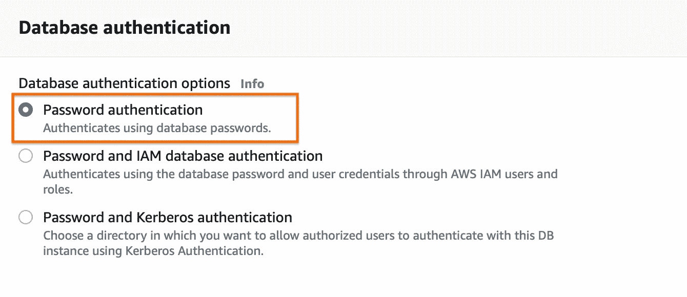

## 创建数据库

最后，单击底部的`create database`开始创建数据库，您应该会在页面上看到以下消息。这需要几分钟时间！

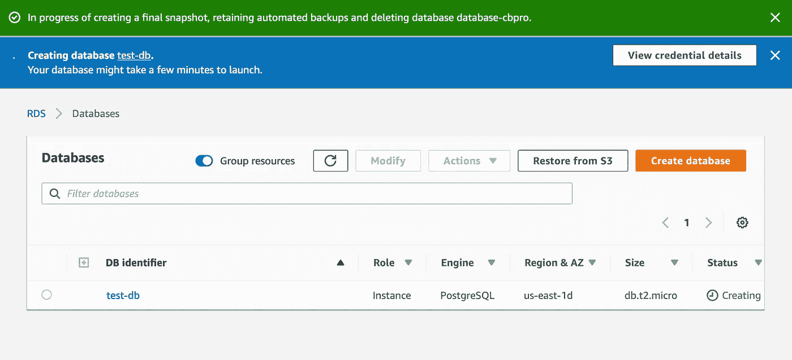

# 连接到 AWS RDS 中的 PostgreSQL 数据库

> 下载 [Jupyter 笔记本](https://github.com/Cryptolytic-app/cryptolytic/blob/master/medium_articles/postgres_setup.ipynb)跟随

我们将使用 psycopg2 库在 Jupyter 笔记本中本地连接到 postgres 数据库(您也可以从 IDE 或终端连接)。继续使用`!pip install psycopg2-binary`安装 psycopg2，然后可以运行下面的代码进行连接。

***注意*** *:对于* `*POSTGRES_DBNAME*` *，当我放入真正的数据库名时，它实际上从来没有工作过，在这种情况下我将其命名为 test-db，我必须放入* `*postgres*` *来代替。如果它最终不能使用您给定的数据库名称，尝试默认的* `*postgres*` *它可能会工作。*

```
import psycopg2 as ps# define credentials 
credentials = {'POSTGRES_ADDRESS' : '', # change to your endpoint
               'POSTGRES_PORT' : '', # change to your port
               'POSTGRES_USERNAME' : '', # change to your username
               'POSTGRES_PASSWORD' : '', # change to your password
               'POSTGRES_DBNAME' : ''} # change to your db name# create connection and cursor    
conn = ps.connect(host=credentials['POSTGRES_ADDRESS'],
                  database=credentials['POSTGRES_DBNAME'],
                  user=credentials['POSTGRES_USERNAME'],
                  password=credentials['POSTGRES_PASSWORD'],
                  port=credentials['POSTGRES_PORT'])cur = conn.cursor()
```

如果你没有得到一个错误，你已经成功地连接到你的 postgres 数据库！🎊

# 在 Postgres 数据库中创建表

既然您已经成功地创建了一个 postgres 数据库，让我们在其中创建一个表。

首先，验证数据库中有什么—应该什么都没有。您可以使用以下返回空列表的代码进行检查。

```
query = """SELECT * FROM pg_catalog.pg_tables
            WHERE schemaname != 'pg_catalog'
            AND schemaname != 'information_schema';"""cur.execute(query)
cur.fetchall()
```

***注意:*** *如果您跳过了本文的部分内容，请先确保您已经连接到了数据库(见上文)😀*

您可以通过运行以下代码来创建您的第一个表:

```
cur.execute("""CREATE TABLE table_1
                (column_1 integer, 
                column_2 float,
                column_3 varchar(50),
                column_4 boolean);""")# Commit table creation
conn.commit()
```

这将创建一个名为`table_1`的表，包含 4 列。我已经包含了一些常见的 SQL 数据类型，因此您可以将它们更改为您的表的数据类型。

如果我们运行上面的代码来检查数据库中的表，我们会得到下面的响应，可以看到 table_1 现在在数据库中:

```
[(‘public’, ‘table_1’, ‘postgres’, None, False, False, False, False)]
```

**好处:**如果您想要系统地创建一组给定了表名列表的表，您可以使用下面的代码:

```
table_list = [] # a list of string table namesfor table_name in table_list:
    cur.execute("""CREATE TABLE {table_name}
                (column_1 float,
                column_2 float,
                column_3 float,
                column_4 float);""".format(table_name=table_name))# Commit table creation
conn.commit()
```

# 将数据插入 PostgreSQL 数据库的表中

现在 postgres 数据库中有了一个表，可以开始输入数据了。

若要插入一行数据，请运行以下代码:

```
data = [1, 2.2, 'three', True]
insert_query = """INSERT INTO table_8
                   (column_1, column_2, column_3, column_4)
                   VALUES (%s, %s, %s, %s);"""# execute insert
cur.execute(insert_query, data)

# commit data insert
conn.commit()
```

我将数据放入一个列表中，确保数据类型与为表中的列选择的数据类型相匹配。确保自定义正在创建的表，以匹配将要插入的数据类型。然后，我编写了将该列表插入到表中的查询，执行该查询，并将它提交到表中。如果不提交执行，您的数据将不会保存到表中。

通过从表中提取数据来验证数据是否已保存:

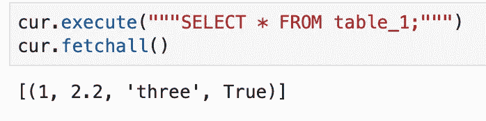

select 语句返回我们插入的数据，所以我们知道它是有效的！

要在表中插入多行数据，请运行以下代码:

```
data = [[5, 5.5, 'five', True], [5, 5.5, 'five', True], [5, 5.5, 'five', True]]
insert_query = """INSERT INTO table_1
                   (column_1, column_2, column_3, column_4)
                   VALUES (%s, %s, %s, %s);"""# execute multiple inserts
cur.executemany(insert_query, data)

# commit data insert
conn.commit()
```

这里的区别在于，变量`data`是一个包含要插入的数据的列表列表。我们还使用`cur.executemany`而不是`cur.execute`来遍历我们的数据列表并插入所有的输入。

同样，您可以使用简单的 select 语句验证是否插入了三行新数据:


现在，您可以看到 select 语句返回了使用前面的 insert 语句添加的 3 个新行。

# 删除/删除 SQL 中的表

你最终会想要删除这个测试表，开始你真正的工作——或者你可能像我一样搞砸了一些事情🙃

使用 SQL 命令`DROP TABLE`删除 postgres 数据库中的一个表:

```
cur.execute("""DROP TABLE table_1""")
conn.commit()
```

确保您确实提交了，否则您的表不会被删除！使用我们之前用来检查的代码来验证您的数据库包含的表。

就是这样！现在，您可以在 AWS 上建立自己的 PostgreSQL 数据库，创建表，添加数据，并删除任何不需要的表。如果你按照教程学习并发现任何错误，请让我知道，这样我可以修复它！

您还可以使用更好的用户界面来管理 PostgreSQL。我推荐 pgAdmin，这里[可以免费下载](https://www.pgadmin.org/download/)。

这篇文章最终将成为我和我的团队在从事一个名为 Cryptolytic 的项目时所学到的经验的系列文章的一部分(文章将很快写出来并链接到这里)。这是我们在进行项目时希望拥有的指南。


**包含本文中使用的所有代码的笔记本可以在这里**[](https://github.com/Cryptolytic-app/cryptolytic/blob/master/medium_articles/postgres_setup.ipynb)****找到，这是我们的密码破解项目的回购文件中的内容——所以如果你很好奇，可以去看看！****

****在 twitter [@elizabethets](http://www.twitter.com/elizabethets) 上找到我或者在 [LinkedIn](https://www.linkedin.com/in/elizabethts/) 上联系我！****

****来源:****

****[](https://docs.aws.amazon.com/AmazonRDS/latest/UserGuide/Welcome.html) [## 什么是亚马逊关系数据库服务(Amazon RDS)？

### Amazon 关系数据库服务(Amazon RDS)是一个 web 服务，它使设置、操作和扩展关系数据库变得更加容易

docs.aws.amazon.com](https://docs.aws.amazon.com/AmazonRDS/latest/UserGuide/Welcome.html)  [## 关于

### PostgreSQL 是一个强大的、开源的对象关系数据库系统，它使用并扩展了 SQL 语言和

www.postgresql.org](https://www.postgresql.org/about/) [](https://github.com/Cryptolytic-app/cryptolytic) [## 密码破解-app/密码破解

### 你可以在 Cryptolytic 找到这个项目。Trello 板产品 Canvas Cryptolytic 是一个为初学者修修补补的平台…

github.com](https://github.com/Cryptolytic-app/cryptolytic) [](https://en.wikipedia.org/wiki/Relational_database) [## 关系数据库

### 关系数据库是基于数据关系模型的数字数据库，由 E. F. Codd 于 1970 年提出。一个…

en.wikipedia.org](https://en.wikipedia.org/wiki/Relational_database) [](https://en.wikipedia.org/wiki/ACID) [## 酸

### 在计算机科学中，ACID(原子性、一致性、隔离性、持久性)是数据库的一组属性…

en.wikipedia.org](https://en.wikipedia.org/wiki/ACID)****