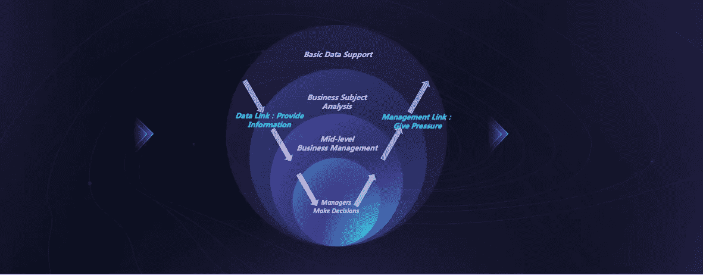
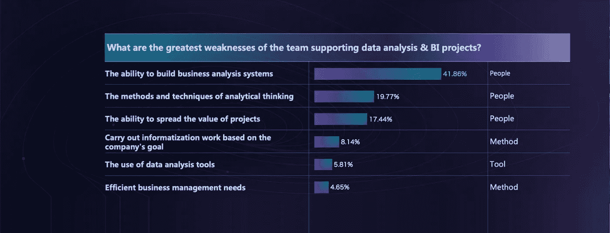
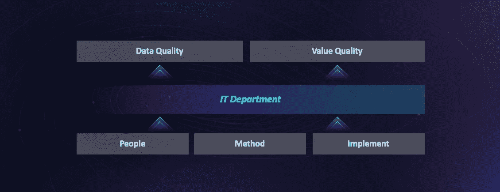
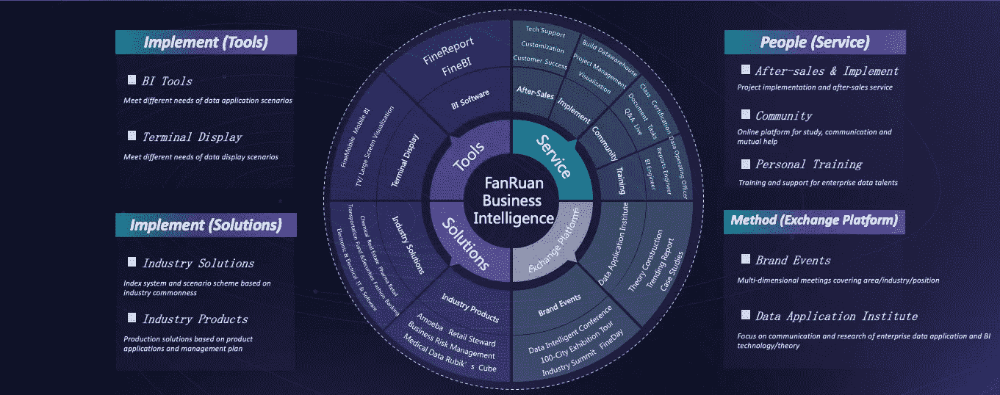
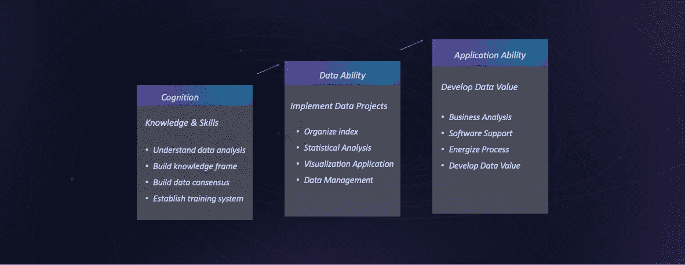
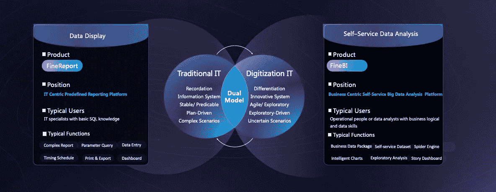

# 如何缩短数据与价值的距离？

> 原文：<https://towardsdatascience.com/how-to-shorten-the-distance-between-data-and-value-a48e2f1ef086?source=collection_archive---------31----------------------->

上次我写了一篇关于[数据重力](/do-you-know-that-data-has-gravity-6ca55e192372)的文章，分享了关于如何提高数据质量和价值的想法。如前所述，今天本帖将给你**关于缩短数据和价值之间距离的提示。换句话说，建立数据链接。**在这方面，IT 部门扮演着最关键的角色，它是公司数据链的保障。

## 开始之前，让我解释一下什么是数据链路。

公司里的管理环节就是给压力的过程。当公司出现问题时，老板通常会给中层管理人员施加压力，不管是从业务表现还是运营角度来看。然后中层管理者向运营人员询问业务数据。为此，运营团队向管理团队提交原始数据。

数据链路的方向与管理链路的方向相反。为了支持管理链接，IT 部门需要以数据链接的形式及时提供数据。

## 但是 IT 部门如何建立数据链接呢？

以下是对支持数据分析和 BI 项目的团队的弱点的研究。

“2018 China Enterprise Data Research Report”, from FanRuan Data Institute

从图中我们可以发现，问题最初源于**人、方法和工具。**

因此，IT 部门应该通过改善这三个方面来建立数据和价值之间的桥梁。

同样，你可能会问怎么做？大多数公司都有自己的 IT 培训系统。他们中的一些人可能会向 IT 咨询部门寻求解决方案或购买 BI 工具。

在这里，我将结合[泛软](http://www.finereport.com/en/company?utm_source=medium&utm_medium=media&utm_campaign=blog&utm_term=How%20to%20Shorten%20the%20Distance%20between%20Data%20and%C2%A0Value%3F)提供的解决方案，向大家展示如何建立数据与价值之间的联系。

## 先从‘人’的角度说起吧。

一个好的团队应该具备以下三种能力。首先是认知，涵盖理解数据分析、构建知识框架、数据共识、培训体系的能力。

第二是数据能力。换句话说，团队可以实现数据项目，包括组织索引、统计分析、可视化应用和数据管理。

最后是应用能力。它需要团队进行业务分析，支持软件，激发专业流程，开发数据价值。

在这方面，我建议 IT 部门建立一个培训系统，并鼓励团队成员加入在线社区进行学习、交流或互助。

## 然后，我们将重点放在“实施”上。

为了支持其他部门，IT 部门需要两支部队。一个是负责构建企业报表的主要力量。另一个是侦察力量。他们熟悉不同部门的业务，通过探索业务数据为业务注入活力。基于这些现实需求，**前团队需要一个报表平台，比如**[**fine report**](http://www.finereport.com/en/?utm_source=medium&utm_medium=media&utm_campaign=blog&utm_term=How%20to%20Shorten%20the%20Distance%20between%20Data%20and%C2%A0Value%3F)**来处理复杂的报表。后者应该使用** [**数据分析工具**](/top-6-data-analytics-tools-in-2019-4df815ebf82c) **对公司进行分析、预测和创新。**

以上是关于“工具”的一个要素——工具。“实施”的另一个要素是解决方案。要构建全面的解决方案，IT 部门不仅要考虑公司的情况，还要考虑[行业解决方案](http://www.finereport.com/en/)。

在过去的几年里，泛软为 233 个行业的公司提供服务。在这个过程中，凡软发现，即使产品很优秀，当推向不同行业时，这些行业的各种需求会降低项目实施的效率。

而且其实每个板块都有一定的共性。只要把这些共性总结成行业解决方案，重用它，不断改进它，产品在行业中的价值就能得到极大的发挥。这就是为什么 [**泛软**](http://www.finereport.com/en/company?utm_source=medium&utm_medium=media&utm_campaign=blog&utm_term=How%20to%20Shorten%20the%20Distance%20between%20Data%20and%C2%A0Value%3F) 除了提供产品之外，还提供全面的行业解决方案。

## 有了这些，最后就是“方法”的问题了。

“方法”的要点是交流思想。我非常推荐 IT 人员参加各种活动，例如新加坡的[大数据世界](https://www.bigdataworldasia.com/)欧洲的 AI &大数据博览会、伦敦的大数据 LDN、美国的 Tableau 大会、中国的[智能数据大会](http://www.finereport.com/en/events/fanruan-intelligent-data-conference-2019.html?utm_source=medium&utm_medium=media&utm_campaign=blog&utm_term=How%20to%20Shorten%20the%20Distance%20between%20Data%20and%C2%A0Value%3F)。你必须了解行业趋势，与世界接轨。向别人学习永远是最快的方法。

总之，缩短数据和价值之间距离的主体是 IT 部门，我们应该从人、工具和方法开始建立数据和价值之间的联系。

# 您可能也会对…感兴趣

[*2019 年 6 大数据分析工具*](/top-6-data-analytics-tools-in-2019-4df815ebf82c)

[*2019 年你不能错过的 9 款数据可视化工具*](/9-data-visualization-tools-that-you-cannot-miss-in-2019-3ff23222a927)

[*初学者财务报表分析指南*](/guide-to-financial-statement-analysis-for-beginners-835d551b8e29)

[*制作销售仪表盘的分步指南*](/a-step-by-step-guide-to-making-sales-dashboards-34c999cfc28b)