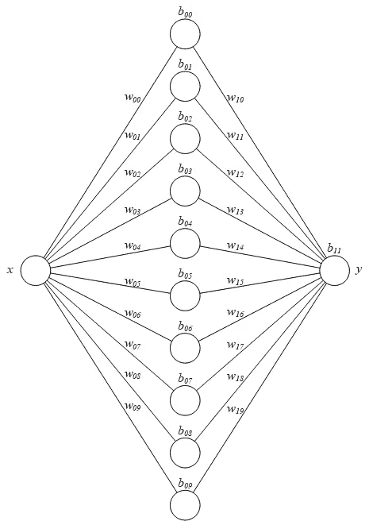
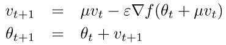
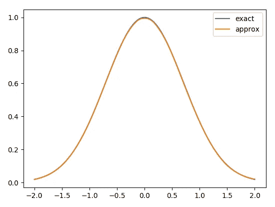

# 如何用神经网络求解常微分方程

> 原文：<https://towardsdatascience.com/how-to-solve-an-ode-with-a-neural-network-917d11918932?source=collection_archive---------9----------------------->

如今，[自动微分](https://arxiv.org/abs/1502.05767)使得从机器学习的角度处理微积分问题成为可能。也许你在 NIPS 2018 上听到过关于[神经常微分方程](https://arxiv.org/abs/1806.07366)论文的一些议论，这篇论文是由作者之一[大卫·杜文瑙德](https://github.com/HIPS/autograd)提交[并签名](https://www.youtube.com/watch?v=V6nGT0Gakyg)的。同时，亲笔签名已经被 JAX 取代，这就是我们将在这里使用的。

主要问题如下:我们想找一个由微分方程定义的未知函数 *y=f(x)* ，比如 *y'=-2xy，*加上一些初始条件，比如 *y(0)=1* 。例子来自 Kreyszig 的 [*高等工程数学*](https://www.amazon.com/Advanced-Engineering-Mathematics-Erwin-Kreyszig/dp/0471553808/) 的前几页。这个特定初始值问题的解析解是 *y=exp(-x)，*我们将使用它来验证神经网络提供的结果。

一般来说，对于常微分方程可能没有封闭形式的解，但是可以用神经网络来近似未知函数 *y=f(x)* 。为了简单起见，我们将使用一个具有带 *10* 个节点的单个隐藏层的神经网络来解决问题*y’=-2xy*和 *y(0)=1* 。

这是我们神经网络的示意图:

总的来说，网络有 *31* 个可训练参数:隐藏层的权重和偏差，加上输出层的权重和偏差。

让我们按如下方式实现网络:

我们使用类似 JAX NumPy 的 API，这样，稍后，我们可以通过自动微分计算`f`的导数。注意，`f`有两个参数:一个网络参数数组(`params`)和一个输入值(`x`)。在机器学习中，我们通常根据模型的参数来区分模型，这里我们也将根据`x`来区分`f`，以便求解 ODE。

网络参数可以随机初始化，例如使用正态分布:

这里我们使用 JAX 提供的*伪随机数发生器* (PRNG)。通过用某个种子创建 PRNG 键，我们确保我们的结果是可重复的。

`f`相对于`x`的导数可以通过调用`grad`来获得:

其中`1`表示我们想要`f`相对于其*第二*自变量`x`(从零开始的索引)的梯度。在 JAX 中，`grad`返回一个函数，该函数计算`f`的梯度，并具有与原始`f`相同的参数。

现在，我们会想要求解某个域中的 ODE，例如在 *-2 ≤ x ≤ 2* 中。因此，我们在该范围内创建一个输入值数组:

其中 *401* 点是任意选择在区间 *[-2，2]* 内具有 *0.01* 的分辨率。

然而，`f`接受单个值`x`作为输入。我们可以以数组的形式传递给它，但是为了便于区分，JAX 需要一个标量函数，所以我们必须传递一个单一的值作为输入，以便得到一个单一的值作为输出。为了有效地计算输入值数组的`f`及其导数`dfdx`，我们使用`vmap`对这些函数进行矢量化:

其中`(None, 0)`指定每个函数将映射到第二个参数(`x`)的`0`-轴上，而第一个参数(`params`)应保持不变(使用`None`，它将在映射中传播)。

我们现在可以定义我们的损失函数(是的，任何机器学习项目中出现的*损失函数*，其最小化将产生我们想要的解决方案):

注意微分方程 *y'=-2xy* 和初始条件 *y(0)=1* 是如何分别在`eq`和`ic`中被捕获的。为了使训练过程中的残差 *y'+2xy* 和 *y(0)-1* 最小化，它们被表示为 *y'+2xy=0* 和 *y(0)-1=0* 。我们在这个函数上使用 JIT(实时编译)来加速它在加速器硬件上的执行，比如 GPU 或 TPU，如果可用的话。

如同任何机器学习项目一样，我们现在根据可训练参数来区分损失函数:

其中`0`意味着我们想要损失函数相对于它的*第一个*自变量(`params`)的梯度。同样，我们使用 JIT 来加速这个新函数的执行。

该开始训练了！为了加快速度，我们将使用带有内斯特罗夫动量的梯度下降。回想一下[内斯特罗夫加速梯度](http://proceedings.mlr.press/v28/sutskever13.pdf) (NAG)的公式:

因此，我们实施如下培训流程:

让我们运行它！

最后，让我们绘制结果并与解析解进行比较:

这就对了，神经网络近似看起来和精确的解析解几乎没有区别。

最后一个问题:在近似的域 *[-2，2]* 之外会发生什么？好吧，我将把它作为一个练习留给读者……
(提示:重新定义`inputs`，并再次绘制结果。)