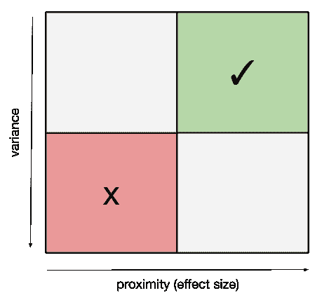
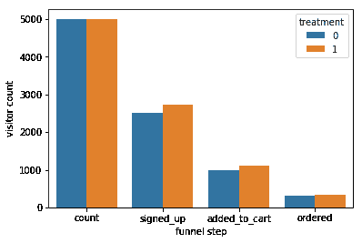
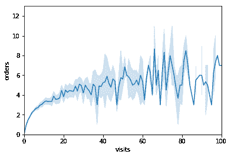
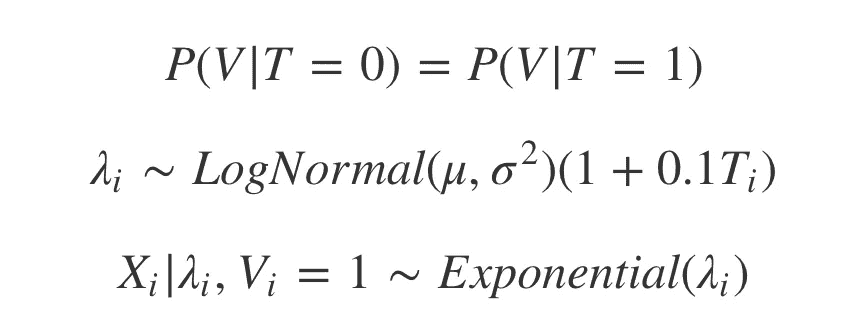
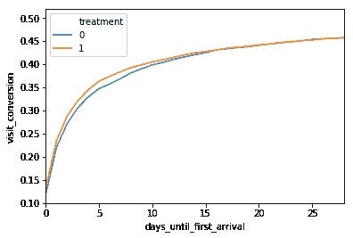
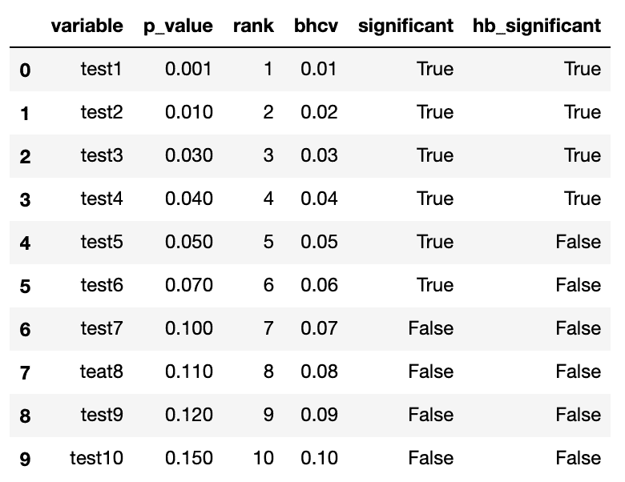

# 如何加快你的 AB 测试

> 原文：<https://towardsdatascience.com/how-to-speed-up-your-ab-test-10c1f1702b94?source=collection_archive---------20----------------------->


Spot the difference

# 第 1 部分:测量两次，切割一次

*本帖最初发表于*[](https://faire.com/thecraft/how-to-speed-up-your-ab-test/)**[*The Craft*](https://faire.com/)*，Faire 的技术博客。这是我们关于使用 A/B 测试加速决策的系列文章中的第一篇。***

**像许多超增长的创业公司一样，Faire 使用实验来快速迭代我们的产品，并做出更好的决策。然而，与服务于数亿甚至数十亿潜在用户消费市场的许多同行不同，我们的市场是为小型企业构建的，在美国大约有 3000 万小型企业[0]。再加上我们才刚刚成立三年，这意味着我们实验的样本量往往小于其他科技公司数据科学团队进行实验的规模。举个例子，我们的平台目前为 100，000 家零售商和 10，000 家制造商提供服务。**

**当一个团队测试相对较大的效应尺寸时，较小的样本可能不是问题。但是在我们的案例中，许多简单的产品已经实现了，我们必须运行大量的实验来找到真正的大提升(这是我们计划很快写更多的主题。)由于这些限制，我们经常被产品经理问到，为什么他们的实验要花这么长时间才能达到显著效果，或者他们能做些什么来加速实验。为了响应这些要求，我们构建了第一个版本的工具来加速我们的实验结果，并为设计实验的数据科学家、工程师和产品经理制定了指南，以确保我们能够更快地做出决定，并对我们的结论有更高的信心。**

**在这一系列的文章中，我们提供了当前加速 AB 测试所使用的各种技术的概述，有些是简单的，有些是技术性更强的。随附的 Python 笔记本[提供了示例和工作代码，以具体展示这些技术的影响，并为您提供一个改进自己的实验程序的起点。](https://howtospeedupyourabtest-danielxbpajg.notebooks.azure.com/j/notebooks/HowtoSpeedUpYourABTest.ipynb)**

# **试验设计**

**提前花时间设计能尽快产生最有用结果的实验是一种有效的方法，可以确保团队不会在回答错误问题的测试上浪费时间，也不会花太多时间来回答正确的问题。此外，以系统化的方式记录实验让公司更难忘记或记错之前测试的结果[1]。这对于非直观结果的实验和那些不能推广到整个用户群体的实验来说尤其重要。有了这个历史数据的存储库，团队可以围绕什么样的产品处理起作用和不起作用，在用户群的什么部分，他们移动哪些指标，以及移动多少，开发更好的先验信念。**

# **更好的指标**

**在 Faire 设计实验时，我们首先要做的决定之一就是主要的度量标准是什么。我们通常必须做出许多权衡，以找到一种既能捕捉到我们试图通过治疗影响的行为，又能快速收敛以给出具有统计学意义的结果的指标。最重要的两个维度是度量与治疗的接近度(作为效果大小的代表)和度量的预期方差(T3)。**

****

**Consider proximity and variance when choosing metrics**

# **接近度**

**因为我们的零售商比制造商多一个数量级，所以我们的大多数实验都是在市场的需求方进行的。就零售商而言，PMs 大多数时候希望衡量的指标与商品总值(GMV)相关，因为商品总值的增加反映了零售商从产品中获得了更多的经济价值，这也是我们的关键业务指标之一。这在实践中可能具有挑战性，因为 GMV 位于我们测试的所有项目的下游。例如，我们对注册流程所做的更改通过许多中间步骤从实际下单的零售商处删除。因此，我们看到的注册数量的任何提升往往会因零售商在客户旅程中下单的时间点而显著减少。**

**我们可以用一个简单的例子来强调这一点，在这个例子中，我们通过注册、添加到购物车和下订单来吸引访问者，然后让他们通过转换漏斗。在本例中，我们观察到从访问到注册的转化率大幅提升，并假设添加到购物车和订购的转化率没有差异。**

****

**Lifts can be harder to measure downstream from the treatment**

**为了简单起见，我们对治疗组和对照组在漏斗中每个步骤的转化率不同的假设进行卡方检验。我们看到了注册和添加到购物车转换的显著结果，但订单转换没有。这是因为当我们沿着漏斗向下移动时，绝对升力下降，而当值接近零时，转换的方差增加。**

```
**print(proportion.proportions_chisquare(summary_treatment_1['signed_up'], summary_treatment_1['count'])[1])
print(proportion.proportions_chisquare(summary_treatment_1['added_to_cart'], summary_treatment_1['count'])[1])
print(proportion.proportions_chisquare(summary_treatment_1['ordered'], summary_treatment_1['count'])[1])4.826037697355727e-06
0.0027419906333688462
0.11399561233236452**
```

**这个问题的一般解决方案是选择一个与我们在产品中所做的改变最接近的主要度量。在这种情况下，显而易见的选择是从访问转换为注册。然而，我们不能确定由我们的治疗导致的任何额外注册实际上最终参与了我们最终想要推动的下游行为，例如下订单。我们缓解这一问题的两种方法是选择适当的二级指标(在这种情况下，添加到购物车和订单转换将是很好的选择)，以及利用我们以前的实验和观察研究的资料库，围绕我们的一级指标和它的下游指标之间的关系强度开发先验信念。简而言之，如果我们有理由相信注册量的增加转化为订单量的增加，那么我们不一定需要等待订单转换量的增加达到显著性(但不要在测试不足的情况下得出次要指标没有变化的结论[2])。)最后，在我们提升注册转化率但不提升下游指标的情况下，未来的注册实验仍将受益于样本量的增加，从而使我们能够随着时间的推移获得更有意义的结果。**

# **差异**

**选择指标时要考虑的第二个因素是它们相对于预期效果大小的预期方差。例如，比例指标(分子是分母的子集)如注册转化率或访问品牌的零售商百分比被限制在 0 和 1 之间，产生的估计值比无界指标的估计值误差更小。**

**选择比例指标，而不是像 GMV/零售商这样的无限制指标，是我们缩短实验达到显著结果所需时间的常用方法。但是在一组可用的数学上无界的度量中，一些比其他的在现实中“更无界”。就 Faire 上的零售商而言，他们可以访问网站上的制造商页面的次数实际上不受限制，而他们向我们下订单的能力受到他们可以通过商店销售的库存数量的限制。这意味着每个零售商的订单分布通常比每个零售商的品牌访问量分布具有更低的方差。**

****

**Orders often increase logarithmically with visits**

**为了说明这一点，我们构建了一个假设的实验，在这个实验中，预期的订单数量与品牌访问量成对数关系。这种类型的关系并不罕见，因为它反映了这样一个事实，即数字行为实际上是不受约束的，而现实世界中的财务预算肯定是不受约束的。我们进一步假设就诊和订单在治疗中均提高了 5%。同样，运行 t-tests 比较访问和订单的两个样本显示，我们会发现后者的显著结果，因为与前者相比，它的均值方差更低。**

```
**print(stats.ttest_ind(experiment_2['visits'][experiment_2['treatment'] == 1], experiment_2['visits'][experiment_2['treatment'] == 0]))
print(stats.ttest_ind(experiment_2['orders'][experiment_2['treatment'] == 1], experiment_2['orders'][experiment_2['treatment'] == 0]))Ttest_indResult(statistic=0.7573654245170063, pvalue=0.44884881305779467)
Ttest_indResult(statistic=2.5239860524427873, pvalue=0.011618610895742018)**
```

# **加速**

**使用比例度量的最后一点:小心加速。如果你衡量采取了他们最终*很有可能*采取的行动的用户比例，不管他们接受了什么样的治疗，随着你继续进行你的实验，你的比例指标显示没有提升的可能性会增加。虽然你可能提高了采取行动的次数或减少了采取行动的时间，但你不会在实验中提高每个用户的唯一转化率。**

**在下面的例子中，我们将控制和处理平均分开，具有相同的和确定的访问转换。然而，我们将这些访问的首次到达时间建模为具有对数正态分布的单个 lambdas 的指数。此外，我们假设治疗成员的λ增加 10%。**

****

**A simple hierarchical model captures acceleration without lift**

**我们看到治疗组的访问转化率在收敛到我们事先知道的相同的长期转化率之前处于领先地位。**

****

**We would have naively called this test at one week**

**在 Faire，当我们在现有零售商样本中跟踪访问品牌页面的独特转换时，就会发生这种情况。因为大多数活跃的零售商会在几天或几周内访问一个品牌，我们有时会看到这个指标的提升最初达到峰值，然后随着实验的成熟收敛到零。如果没有被发现，这些新奇和首要效应可能是有害的。这并不是说促进良好行为是不值得的。但是重要的是要理解你是在提升指标还是简单地加速它们。**

# **更少的指标**

**最后，当谈到实验度量选择时，通常越少越好。随着你在实验中测试的假设数量的增加，你也增加了第一类错误的可能性。根据你对犯这些错误的容忍度，你会想要控制[家庭错误率](https://en.wikipedia.org/wiki/Family-wise_error_rate) (FWER)或不太严格的[错误发现率](https://en.wikipedia.org/wiki/False_discovery_rate) (FDR)。FWER 技术，如[霍尔姆-邦费罗尼方法](https://en.wikipedia.org/wiki/Holm%E2%80%93Bonferroni_method)，控制至少一个 I 型错误的概率，而 FDR 程序，如常用的[本杰明-霍赫伯格程序](https://en.wikipedia.org/wiki/False_discovery_rate#Benjamini%E2%80%93Hochberg_procedure)，对错误拒绝的无效假设的预期比例提供较弱的保证。下面我们演示了在一个有十个指标的实验中，如何使用 FDR 控制将重要测试的数量从六个减少到四个。无论您采用哪种方法或具体使用哪种方法，通过额外的指标进行的比较越多，您就需要越多的数据来获得有意义的结果。**

****

**FDR control renders fewer metrics significant**

**同样的原理也适用于你实验中的变异数。包含更多变量的测试测试更多的假设，在其他条件相同的情况下，需要更多的数据来达到显著性。基于成本、复杂性甚至是对什么可行什么不可行的强烈先验信念等因素排除额外的治疗方案，不仅可以设计出更强大的测试，还可以缩小产品、工程和设计团队的范围。通过迫使您的团队选择一个单一的主要指标、更少的变量和尽可能少的次要指标来做出决策，您可以显著减少做出决策和交付产品的时间。**

# **机器学习**

**在本系列的下一篇文章中，我们将讨论如何使用时间盒、离群点去除和分层来减少度量方差。然后，我们将讨论一种称为 CUPED 的分层一般化，我们使用简单的线性模型使用这种技术取得的成功，以及如何使用非线性机器学习方法将其一般化。后面的文章将涵盖功耗分析、顺序测试和减少实验持续时间的动态流量分配策略。**

# ****致谢****

**[Daniele Perito](https://medium.com/u/9e8300851cc1?source=post_page-----10c1f1702b94--------------------------------) 感谢您的投入和指导。**

**[0] [2018 小企业简介](https://www.sba.gov/sites/default/files/advocacy/2018-Small-Business-Profiles-US.pdf)**

**[1] [机构记忆](https://en.wikipedia.org/wiki/Institutional_memory)**

**[2] [十二个肮脏的游戏:在线控制实验中十二个常见的度量解释陷阱](https://exp-platform.com/Documents/2017-08%20KDDMetricInterpretationPitfalls.pdf)**

**[3] [随机在线控制实验中的新颖性/首要效应检测](https://ww2.amstat.org/meetings/jsm/2018/onlineprogram/AbstractDetails.cfm?abstractid=330383)**