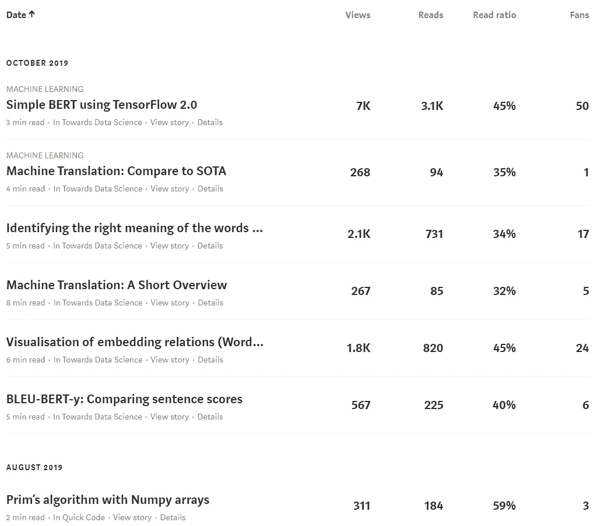
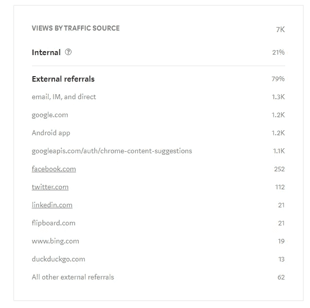
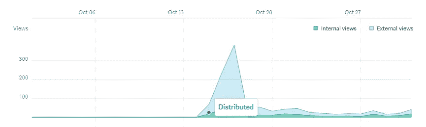
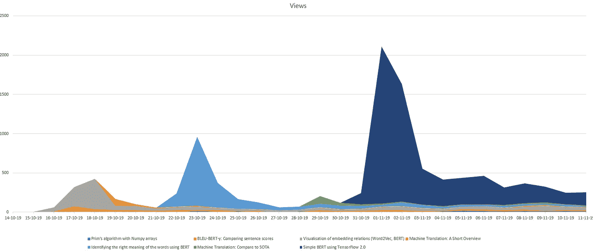
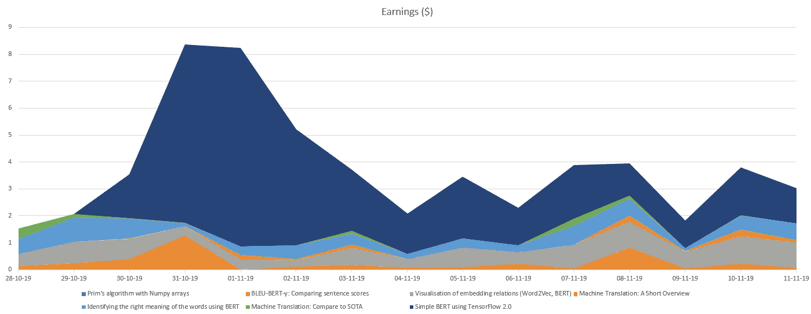
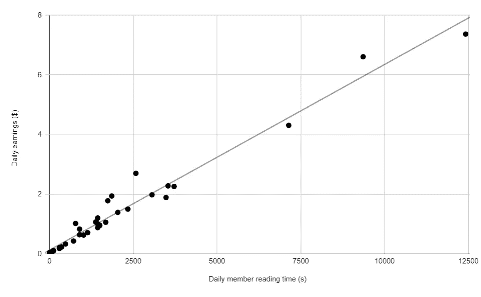

# 如何开始在介质上写作

> 原文：<https://towardsdatascience.com/how-to-start-a-writing-carrier-on-medium-5df87c62b3e9?source=collection_archive---------22----------------------->

## 数据科学作家第一个月的实践建议分析

Photo by [Free-Photos](https://pixabay.com/photos/?utm_source=link-attribution&amp;utm_medium=referral&amp;utm_campaign=image&amp;utm_content=336376) on [Pixabay](https://pixabay.com/hu/?utm_source=link-attribution&amp;utm_medium=referral&amp;utm_campaign=image&amp;utm_content=336376)

一个月前，我开始在媒体上写故事。作为一名人工智能爱好者，我将我的博客帖子发给了一家名为[走向数据科学](https://towardsdatascience.com/) (TDS)的出版物，该出版物目前拥有大约 28 万名粉丝。这个故事是我经过一个月 6 个故事的分析思考的总结。

上个月，我在 TDS 上发表了 6 篇自然语言处理领域的故事。我的故事涉及伯特和机器翻译。总的来说，我有超过 12k 的浏览量，5k 的阅读量和 100 个粉丝。希望这个故事可以成为考虑在介质上开始书写载体的人的指南。

# **对写作的热爱**

首先，我想谈谈我的动机。我开始写这些故事，作为我经历的总结。我在研究新的科学领域，我想保留我对它的第一印象。像日记一样。然而，我想分享它，这样每个新进入这个领域的人都可以从中受益。

第一个月结束时，我注意到我可以在日常工作中使用我的故事作为帮助。为了有一个好的媒介故事，我已经把实验打磨成一个可读的、可理解的工具，如果我需要的话，我可以回头去找它。

我还有第二个动机:作为一个非英语母语的人，我发现写作是保持语言技能的一个很好的练习。作为一个早期职业科学爱好者，我认为写媒介故事是写科学论文的一个很好的练习，也是在该领域获得更多认可的一个好方法。

我对中型合作伙伴计划也很好奇。有可能以此为生吗？当它的第一个结果出来时，我意识到我的动机开始从“写一个好故事”转变为“写一个高薪的故事”。最明显的影响是，我每天都感受到写作的压力，而不是分享知识的快乐。目前，如果我觉得我的主要动机是*错了*，我会有意识地停止写作。

My stories on Medium. The first one is published in [Quick Code](https://medium.com/quick-code), the others in [Towards Data Science](https://towardsdatascience.com/)

# 一个中等故事的阶段

Medium 提供读者分布的统计数据。你可以了解你的故事是如何传播给谁的。基于此，我把故事的生命分成三个主要阶段。

1.  早期观众
2.  社交媒体分享
3.  媒体和出版物发行(TDS)
4.  Android 应用和谷歌 Chrome 建议
5.  来世(幸好谷歌搜索结果)

Reader distribution of [one of my stories](/simple-bert-using-tensorflow-2-0-132cb19e9b22) published in TDS.

早期读者是你发送给你的故事的朋友，你的追随者和出版物的编辑。他们是潜在的第一批粉丝，他们可以纠正你故事中的明显错误。

**社交媒体分享**来自你的 Twitter /脸书/ LinkedIn /等。以及早期观众的分享。对于我所有的故事，一些我不认识的随机 twitter 用户分享了它，导致了 10-20 次浏览。(非常感谢！)

**媒体和出版物发行:**前两个阶段对于第三个阶段非常重要。媒体策展人和出版物的编辑都可以选择在网站的某个地方分享你的文章。我不知道这些决定背后的实际过程，但我认为故事的早期观点和掌声是重要的。当然最重要的还是故事的质量！

我的故事的原始数据是，我在 TDS 上发表的所有故事都是由媒体策展人选择发行的。根据其他的故事(像[这个](https://medium.com/the-post-grad-survival-guide/how-to-get-your-story-selected-by-medium-curators-512f8a74bbf8))，这是一个伟大的成就。关于 TDS 分发，对我来说重要的一步是当 TDS 在他们的 Twitter 上分享故事时。我一半的故事都发生了这种情况，我不知道这是什么模式。

**安卓应用&谷歌 Chrome 建议:**这些都是大数字！为了在 Android 应用程序或 Chrome 建议中赢得一个好位置，故事必须在前面的阶段表现良好。中等适合 Chrome 建议，所以在 Chrome 建议中有很多中等的文章。然而，要获得这些位置，你必须写一些热门的东西，一些人们现在想读的东西。

**来世**:媒介故事就是新闻。它们在开始时有一个 3 天的高峰，但过后就消失了。对于一个在第一天获得 100 次浏览的故事，在第一周之后，它每天有 10 次浏览。一个 500 次浏览的高峰故事有 20-40 次浏览，一个第一天有 2000 次浏览的故事在第一周之后有 300 次浏览。相关性显而易见。然而，令我惊讶的是，在第一周之后，这些数字相当稳定。我预计未来几个月会缓慢下降，但这只是一个假设，因为我在 TDS 上的第一篇文章才发表了一个月。到目前为止，我的故事里还看不到这种趋势。

增加来世浏览量的一个方法是给这个故事加上一个标题，这个标题很适合用**谷歌搜索**。比如我有一个故事叫[*简单 BERT 使用 TensorFlow 2.0*](/simple-bert-using-tensorflow-2-0-132cb19e9b22) *，*它在标题中有两个热门话题的名字( *BERT* 和 *TensorFlow* )和一个不错的 Google 搜索关键词(*简单*)。如果我考虑得更周到，我可能也会在标题中添加关键字 *example* 。

Views of [a story](/visualisation-of-embedding-relations-word2vec-bert-64d695b7f36): 3-day peak and afterlife

# 我的操作列表

如果你对这个话题感兴趣，你可以在 Medium 上找到很多关于如何成为一名优秀作家的文章。在这里，我将添加我的列表建议。

## 我的成功作家清单:

0.英语

1.  质量
2.  一致性
3.  出版物
4.  最畅销的关键词

以英语为母语的人可能没有意识到他们的障碍，但是如果你把英语作为第二语言，你可能会在生活中有这样的时刻，你认为“用英语会容易得多”。是的，用英语写作更容易。即使它不是我的母语。假设我用匈牙利语写了一个故事，它有 100 次浏览，以同样的速度，一个英语写的故事将有 20，000 次浏览！(根据本文对英语用户的估计。

关于**质量**我不想写太多。是的，质量很重要。很多。阅读高质量的论文，认真写作，使用工具，倾听读者和编辑的意见。你会进步的。

我预测一致性的重要性会变小，但在第一个月之后，我不得不纠正自己。我已经提到过，我的老故事的每日视图是相对恒定的。这些故事每天的收入都差不多。如果你写了 4 篇文章，每天赚 0.5 美元，你每天赚 2 美元。如果你写了 40 篇文章，就是 20 美元。

此外，写一个新的故事也可以促进旧的故事，因为如果你写了一篇好文章，你的读者可能会想你是否也有其他伟大的文章。

My views in the first month.

如果你打算在媒体上写作，你可能知道出版物的存在。找到高质量的出版物，它们会帮助你写出更好的文章，提高你的浏览率。因为对数据科学感兴趣，我的故事被媒体策展人选中发行，并被 Chrome Suggestions 推荐。

我的最后一个要点是我称之为**畅销关键词的东西。**总有热门话题，读者搜索的词。你的兴趣并不总是与大多数读者的兴趣相同。但有时确实如此。如果你找到合适的术语，并把它放在你文章的标题中，它可以提升你的观点。但是不要写你不真正感兴趣的东西。即使你以写作为生，也要找到非常适合你的话题！

# 基于介质读取的支付

11 月初，Medium 换成了基于阅读的支付方式，他们升级了故事的统计数据。下面是基于我的故事的表现对这个新特性的分析。

Earnings of my stories since Medium shows daily earnings

首先，我们对故事有了一个新的总体衡量标准，叫做**平均阅读时间**。对我来说总是在 30 到 50 秒之间。我认为这包括那些点击了我的文章，但在意识到这个故事在付费墙之下后关闭了它的读者。那些刚刚浏览过的人。根据文章的长度，Medium 估计阅读时间为 3-8 分钟。不是每个人都深思熟虑地阅读它。

对于一个故事的每日浏览量，我们得到了两个新的每日统计数据:每日收入和每日会员阅读时间。一个故事的收入是基于会员的阅读时间。对于每个媒体会员，他/她的会员资格$5 被分配给他所阅读的文章的作者，该作者根据他/她在文章上花费的阅读时间进行加权。

下图是从我的三个故事中提取的数据。其中一个共有 600 次浏览，另一个 1800 次，最后一个 7000 次浏览。所有数据都来自新时代的第一天(10 月 28 日-11 月 15 日)。由此，我们可以计算出，我的读者每阅读一分钟，我的平均收入是 0.04 美元。

The correlation between reading time and earnings based on 3 stories

# 摘要

这个故事是我作为一个媒介作家的经验总结。我在出版物《走向数据科学》中撰写数据科学文章(更具体地说是自然语言处理相关的故事)。我在 10 月 14 日发表了我的第一篇文章，这篇文章分析了第一个月的情况。我写了 6 篇文章，总共有 12k 的浏览量，5k 的阅读量和 100 个粉丝。到目前为止，我在中等合作伙伴计划中赚了 91.47 美元。