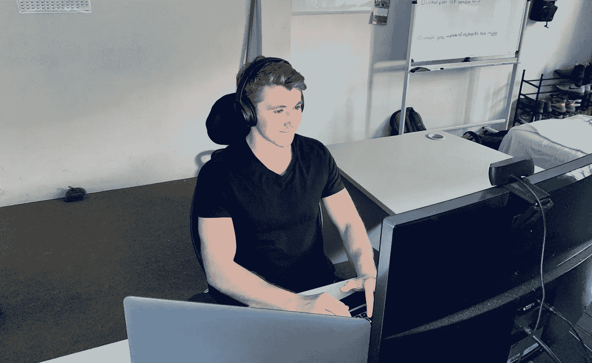

# 如何开始自己的机器学习项目

> 原文：<https://towardsdatascience.com/how-to-start-your-own-machine-learning-projects-4872a41e4e9c?source=collection_archive---------4----------------------->

## 哪些课程没有(也不能)教给你

Where most of my project work goes down. See more on [YouTube](http://bit.ly/DanielBourkeOnYouTube).

戴夫开始说话。

测试结果出来了。怀尔德是聋子。

完全？

是啊，他没有在听力表上记录任何东西，即使他们在他耳边播放一种像喷气式飞机起飞一样大的噪音。

接下来会发生什么？

我们将进行更多的测试，如果他符合条件，他将接受耳蜗植入来帮助听力。但是他们还不确定。

戴夫是我最好的朋友。怀尔德是他的儿子。他天生失聪。医生说:“十万分之一的几率。”

我知道除了听，我什么也做不了。感到无助不是一种好的感觉。

几个星期后，我们在怀尔德的开关上。这是他第一次打开人工耳蜗，使他能够听到声音。他通过了所有的测试，是这些设备的主要候选人。

当他们上场时，这位女士放了三个音。一个高，一个中，一个低。她追踪了怀尔德对每一封信的反应。"该软件将在两者之间的空隙中构建."她说。

接下来还需要几次预约才能让植入物充分发挥作用，但这是第一次，即使只有轻微的声音，Wylder 也能听到了。

活动的前一天早上，我早早起床，开始在 Coursera 上学习[生物信息学专业。我想知道更多。必须知道更多。什么是生物信息学？这是生物学和技术的交叉。维基百科增加了一点深度。](http://bit.ly/courserabioinformatics)

> 生物信息学是一个跨学科领域，开发理解生物数据的方法和软件工具。作为一门跨学科的科学，生物信息学结合了生物学、计算机科学、信息工程、数学和统计学来分析和解释生物数据。

为什么是生物信息学？我想知道更多关于怀尔德的事情。耳蜗是什么？是什么原因造成的？是基因吗？哪个基因？我所知道的编程知识能有所帮助吗？

为什么 [Coursera](http://bit.ly/CourseraDanielBourke) ？因为在过去的两年里，我的很多知识都是从这里开始的。

关键词是**基础**。课程和专业非常适合这个。但是知识增长的真正方式是通过修补，探索，扩展，建立在这些基础之上。

所以我建立了自己的项目。一个探索 DNA。寻找与内耳毛细胞发育有关的基因。他们做了什么？毛细胞将声波转化为大脑可以解释为声音的电信号。我能在生物信息学专业中使用我所学的代码操作 DNA 吗？是的。

但事实证明这一切都是错的。

我所做的一切都没有生物学或科学基础。我给[做了一个关于它的视频](http://bit.ly/bioinformaticsvideo2)，评论里有人这么说。我已经知道了。我在视频的开头加了一条，在描述中也加了一条。

如果错了又有什么意义呢？

我们会谈到这一点。最好先从为什么开始。

# 为什么是你自己的项目？

当你开始学骑自行车时，你戴着辅助轮。你学会了如何兜售，如何刹车，如何移动车把。

但是你遗漏了一些东西。骑自行车最重要的技能。平衡。

只有当训练轮脱落后，你才学会如何保持平衡。

我在 [Coursera](http://bit.ly/CourseraDanielBourke) 上使用了[应用数据科学和 Python 专门化](http://bit.ly/courseraDS)来建立数据科学的知识基础。但是当我致力于构建探索性数据分析的温和介绍时，我学到了更多。这也是不对的。看过的人自己研究了一下，告诉我。所以我修好了。然后还有一个别人发现的错误。我修正的每一个错误，都让我学到了新的东西。更深层的东西。一些我以前没见过的东西。

有知识基础很重要。知道如何兜售，如何刹车和如何驾驶对骑自行车很重要。但是当训练的车轮停下来的时候，学习更多的这些东西是不会帮助你的。

课程也是一样。你可以继续完成更多的课程，提高你的知识基础(你应该这样做)，但不要把这误认为是能力。

参加更多关于如何更好地兜售的课程不会让你骑自行车。

只有当你卸下辅助轮，你才能学会骑车。

# 一些可能不起作用的东西

最好的项目就是这样开始的。

当你去旅行时，有一个指南针和一张地图是很好的。但是如果你只能选择一个呢？哪个更重要？

指南针。

为什么？

因为地图只有一定数量的路径。指南针可以有无数种用途。

这就是你如何构建自己的项目。从你想去的方向开始。一个想法，一个主意。那是你的指南针。

计划好你要采取的步骤是有价值的，但是不要让它阻碍探索。

没有一个伟大的项目是从一个人预先知道他们要走的确切路线开始的。如果你已经知道事情会如何发展，你会感到厌烦。已知的未来已经成为过去。

# 交叉规则

这就是混合想法的切入点。假设你一直在学习数据科学和机器学习。你已经学了一些课程，但现在你想学更多。

你不可能在一件事情上做到最好。你可以试试，但是记住，竞争很激烈。更好的选择是成为跨界者中的佼佼者。两件事，三件事，四件事的交叉。但是不要太多，否则质量会开始下降。

这与项目有什么关系？

你可以利用你在课程中积累的知识基础，并将其与你在心理健康方面所做的研究相结合。你如何利用数据向他人展示对精神健康世界的见解？

如果你是一名音乐家，你可以使用机器学习从你的旧录音带中创作一首新歌。

例子不胜枚举，但公式保持不变。无论你的兴趣是什么，健康、艺术、技术、科学、金融、工程、天气，交叉在哪里？

The crossover happens when you take one of your skills and pair it with another.

# 允许犯错

在考试中做错了什么，它通常会返回一个红叉，旁边写着*你错了*。

学校强调避免犯错。生活鼓励它。

这并不意味着你应该有错的目标。但是当你开始自己的新工作时。一个可能行不通的项目，允许自己犯错。

为什么？

因为犯错会调整你的罗盘。这是一个学习的机会。现在你知道哪里不能去了。

我的下一个项目会更好，因为我的上一个项目有错误。

# 创建一个时间表，从小处着手

> 我将为此工作四周。

你可以这么说。连续四周每天一小时是很好的时间。

你可以根据自己的需要调整这些数字。但是有一个截止日期给了你努力的方向。

我哥哥和我在咖啡馆。他开始说话。

我一直在看这门课。

给我看看。

他给我看了。我通读了一遍。我说话了。

但是你已经做了所有这些事情？你已经完成了基础，你已经完成了高级数据结构，你已经完成了发布你自己的项目。你想从中得到什么？

我不确定我认为了解更多会有帮助。

你一个月做一个小 app 怎么样？称之为 App 一个月，分享一个关于每一个的故事。

是的，你说得对，第一周是设计，第二周是计划和原型制作，第三周也一样，然后在第四周发布。

他的眼里充满了想法。我笑了。然后说话了。

现在你在想。

你可能无法控制你的项目是否达到你想象的一切，但是投入一定的时间和精力是可以做到的。

总会有干扰。生活就是这样。当它发生时，处理好它，然后带着时间表回到你的项目中。

Once you’ve picked something to work on, shut everything else out for a period of time.

# 当你准备好 70%的时候开始

够了。你永远不会 100%准备好。

# 分享一个故事

你选择了一些不可行的东西，你使用了交叉法则。你还没完全准备好就开始了。你坚持你的时间表。

现在怎么办？

装运它。分享你的所作所为。

现在其他人可以批评你的工作，告诉你哪里错了，告诉你哪里对了，帮助你变得更好，这就是你所追求的，不是吗？

下次有人问你在忙什么，你就有故事了。

> 我开始从事一个生物信息学项目，我不知道结果会如何，但我脑海中有一个想法。我想看看我是否能把我在 Coursera 上的[生物信息学专门化课程中学到的东西结合到我最好的朋友的儿子身上。他天生失聪，所以我研究了是什么基因导致婴儿失聪。我发现了 ATOH1 基因。它负责触发耳朵中毛细胞的生长。毛细胞将声波转化为电信号。我花了大约一个月的时间进行研究和构建，但当我有了一些东西时，我制作了一个视频，并在网上发布了我的代码。我意识到我的发现没有一个是生物学或科学上合理的。有人给我指出来了。但是现在我知道我下一步要去哪里了。我被迷住了。](http://bit.ly/courserabioinformatics)

我的[生物信息学项目](http://bit.ly/bioinformaticsvideocode)错了。但是我学到了一些东西。我知道下一步该做什么。

我的[探索性数据分析教程](/a-gentle-introduction-to-exploratory-data-analysis-f11d843b8184)有错误。人们好心地给我指出来。这让它变得更好。这让我以后的工作更好。

你听过我的。你呢？

## 你可以在 [Twitter](http://bit.ly/mrdbourketwitter) 、 [LinkedIn](http://bit.ly/mrdbourkelinkedin) 、 [YouTube](http://bit.ly/AIMastersDegree) 和[mrdbourke.com](http://www.mrdbourke.com)上找到更多我的作品和故事。