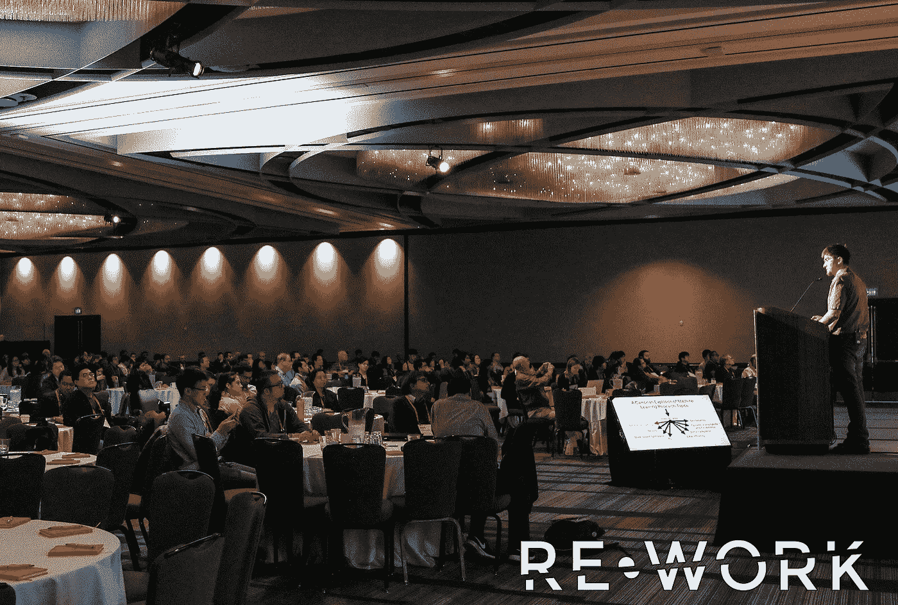
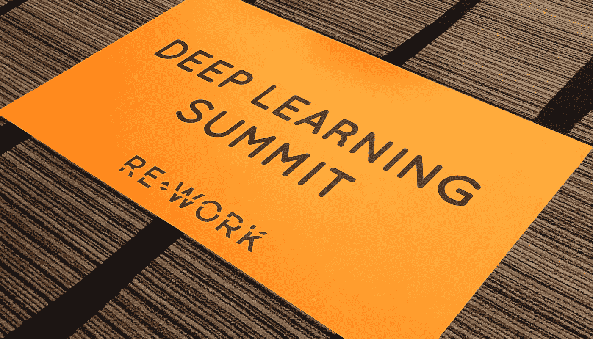
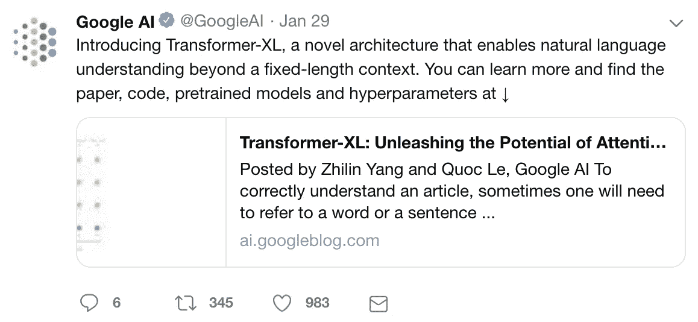
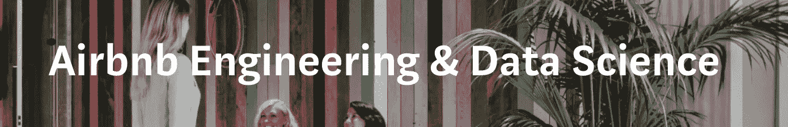
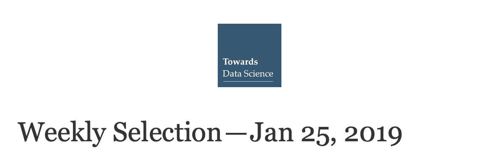
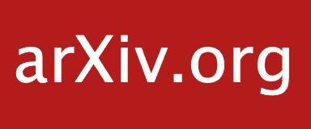

# 作为一名数据/研究科学家，如何与时俱进

> 原文：<https://towardsdatascience.com/how-to-stay-up-to-date-as-a-data-research-scientist-3846ef6b1739?source=collection_archive---------10----------------------->

## *我如何跟上所有新的研究论文和新的机器学习更新？让我告诉你我是做什么的。*

I am sitting somewhere in there if you can spot me. (Image is from [https://www.flickr.com/photos/teamrework/31974957947/in/album-72157676030072907/](https://www.flickr.com/photos/teamrework/31974957947/in/album-72157676030072907/))

# 介绍

你好。

S o 看了我的教程 [**无学位如何数据科学**](/how-to-data-science-without-a-degree-79d8388a49ba) **(** *39k 浏览量和统计截至 2019 年 1 月！谢谢你。* **)** ，但你的旅程才刚刚开始。随着每年数百篇研究论文的发表和深度学习行业的重大技术进步，很难保持领先。

尽管我热爱我的工作，但我知道如果我不跟上时代并继续学习，就很难保持胜任和相关的工作。尽管你在数学、编程和机器学习方面的基础知识总是必不可少的，但是新的想法和工具每天都在被引入。你必须不断学习。

跟上时代是我不断努力掌握的东西。是的，这可能让人不知所措，但是深呼吸一下，知道这对任何人来说都不容易，你就会感到安慰。为了让你的旅程更轻松，我想分享一些我非常喜欢用来保持领先的技巧和资源。这些是:**会议、Twitter、工程博客、时事通讯、研究论文和 YouTube。**

# 1.会议

At the Rework Deep Learning Conference

我想从会议开始，因为我刚刚在 2019 年 1 月从一个会议回来。在我看来，这可能是最昂贵但也是最有趣的选择。自从我成为数据科学家以来，我已经参加了以下会议:

*   **2018**[**data bricks Spark+AI Summit @三藩**](https://databricks.com/sparkaisummit) **。**
*   **2019** [**返工深度学习峰会@旧金山**](https://www.re-work.co/events/deep-learning-summit-san-francisco-2019) **。**

置身于一个充满专家、领导者和渴望学习你所呼吸和实践的话题的人的环境中是相当超现实的。虽然我发现在这些会议上与陌生人交谈并不容易，但与会的每个人都很高兴与你谈论他们的兴趣和项目。例如，午餐时，我和坐在我旁边的人就他们的工作和项目进行了许多有趣的对话。了解不同的人和行业如何应用深度学习真是太棒了。

此外，我真的很喜欢参加会议上的演示，因为你可以看到其他人正在做什么，看到趋势和新技术。看到像**谷歌**、**脸书**和 **OpenAI** 这样的研究领导者在做什么是非常激励人心的。此外，你还可以听到像 **Dropbox** 、**易贝**、 **Airbnb** 、**优步**和**网飞**这样的公司在深度学习方面做了什么。发布会结束后，我想起了**甘**(生成对抗网络)的力量，想尝试学习一下 **PyTorch** 因为**1.0 版本**终于在 2019 年 1 月发布了。

既然你不再处于一个结构化的学校环境中，我把这些会议视为学校课程。记得参加 **Spark 峰会**的时候，了解到**熊猫 UDF** (我相信是在 Spark**2.3 版**上)，回去后马上开始在工作中使用。

当你在自学或在公司做项目时，行业的所有变化和趋势可能都不是很明显。但是参加会议真的给了你视角，让你亲身感受到每个人都在做什么。

有几种方式可以参加:

*   让您的公司支付费用(最佳选择)。如果你们一起去，要求打折。即使你不跟团去，他们也经常提供折扣。所以就问吧！
*   要求在大会上做志愿者，免费去(我遇到过这样做的人)。
*   作为学生参加，你通常可以得到很大的折扣。

接下来，我想尝试去 **NIPS(神经信息处理系统)**和 **ICLR(国际学习代表大会)**、**、**这两个更偏重学术的地方。

# 2.推特

Example Deep Learning News on Twitter

我之前并不是很喜欢 twitter，但是因为深度学习新闻我又开始了。我发现许多人(研究人员和公司)在 twitter 上发布有价值的最新信息。正如你在上面看到的， **GoogleAI** 账户经常发布他们深度学习研究的更新。

当我开始关注一些著名的深度学习的人和公司账号( **@GoogleAI、@OpenAI、@AndrewYNg、@ KDNuggets、@Goodfellow_Ian、@YLeCun、@Karpathy** )时，我很容易找到其他人，因为 twitter 一直在推荐类似的账号。

我的账号目前超级无聊，不过可以随意关注: **@jasjung_** 。我计划用它来发布自发的提示或更新，但主要是向其他深度学习明星学习。

# 3.工程博客和电子邮件简讯

如果你搜索类似“最佳数据科学通讯”的东西，你会得到很多很棒的结果。这是我收集资源的方式之一。

## 3.1.公司工程/技术博客

Image caption from Airbnb Tech Blog on Medium

我认为这些工程博客是公司在纸上举行的迷你会议，向世界炫耀和分享他们最新最聪明的成就。他们经常在这里展示有趣的实验、研究和项目。因为是公司维护的，所以质量通常很高。我认为 **Medium** 开始在这里发挥重要作用，因为许多公司开始在 Medium 上托管他们的工程和技术博客。这里有几个我喜欢的网站！

*   [T3【网飞理工大学博客】中型 ](https://medium.com/netflix-techblog)
*   [**脸书研究博客**](https://research.fb.com/blog)
*   [**谷歌人工智能博客**](https://ai.googleblog.com)
*   [**优步工程博客**](https://eng.uber.com) (如需机器学习相关内容，请点击[此处](https://eng.uber.com/tag/machine-learning/)
*   [**Airbnb Tech Blog on Medium**](https://medium.com/airbnb-engineering)(如果你只想要机器学习相关的内容，点击[这里](https://medium.com/airbnb-engineering/ai/home)

请记住，工程博客不会只谈论机器学习，但他们经常这样做，并有许多其他有趣的事情可以阅读。

## 3.2.时事通讯

除了工程博客，还有许多在线出版物的时事通讯，如 Medium 或 personal，你可以订阅。我认为这些内容更个人化，更容易理解，因为像我这样的任何人都可以写这些文章。它们通常包含小型的个人项目，而来自公司博客的项目对于个人来说可能有点深远。

*   像 [**走向数据科学**](https://towardsdatascience.com) 这样的刊物绝对是我关注的一个。我发现每天的简讯太多了，但每周订阅一次对我来说已经足够了。
*   我真正喜欢的一个个人简讯是 [**机器学习很有趣**](https://www.machinelearningisfun.com) 。它发送有趣的每周文章，如果你想的话，你可以自己尝试一下。
*   杰森·布朗利的[**【machinelearningmastery.com】**](https://machinelearningmastery.com/start-here/)**也包含了很多实用的教程和代码。**

**我知道还有很多，但我还没有真正探索太多。所以如果你知道更多，请在下面的评论里告诉我！**

# **4.研究论文**

****

**最后但同样重要的是，这是另一个免费但最困难的选择。对于这一部分，我建议你查看以下 Medium 上的帖子:**[**开始阅读深度学习研究论文:为什么和如何**](/getting-started-with-reading-deep-learning-research-papers-the-why-and-the-how-dfd1ac15dbc0) **。”作者提供了许多阅读研究论文的有用信息和技巧。综上所述，如果你有兴趣阅读机器学习研究论文，你应该去[**Arxiv Sanity Preserver**](http://www.arxiv-sanity.com/)**，**a project by[**Andrej kar pathy**](https://www.linkedin.com/in/andrej-karpathy-9a650716/)。它基本上向你展示了最新、最受欢迎的研究论文，这样你就可以读到最有趣的论文。用他自己的话来解释这个项目:******

> **这个项目是一个网络界面，试图驯服 Arxiv 上铺天盖地的论文。它允许研究人员跟踪最近的论文，搜索论文，根据与任何论文的相似性对论文进行排序，查看最近的热门论文，将论文添加到个人图书馆，并获得(新的或旧的)Arxiv 论文的个性化推荐…**

**我说这是最难的选项，因为我不能随便看这些论文。我需要集中注意力，需要更长的时间来阅读。有时候，我需要一张纸来完成数学。尽管这对我来说是最困难的选择，但也是最有收获的，因为你真的很好地理解了这个主题。我计划在我的[机器学习 Github 库](https://github.com/jasjung/Machine_Learning/)中有一个[研究论文](https://github.com/jasjung/Machine_Learning/tree/master/Research_Paper)目录来记录我的阅读。我会尽我所能经常更新。**

**如果你需要一篇论文作为开始，看看下面这篇论文。由于在卷积神经网络中的成功工作，许多人将此视为深度学习中最有影响力的论文之一。**

*   **[**【ImageNet 分类与深度卷积神经网络(2012)**](https://papers.nips.cc/paper/4824-imagenet-classification-with-deep-convolutional-neural-networks.pdf) 作者*Alex Krizhevsky、Ilya Sutskever、Geoffrey Hinton。***

**以下是该论文的摘要，供您参考:**

> **我们训练了一个大型深度卷积神经网络，将 ImageNet LSVRC-2010 竞赛中的 120 万幅高分辨率图像分类为 1000 个不同的类别。在测试数据上，我们实现了 37.5%和 17.0%的前 1 名和前 5 名错误率，这大大优于以前的最先进水平。具有 6000 万个参数和 650，000 个神经元的神经网络由五个卷积层组成，其中一些卷积层后面是 max-pooling 层，以及三个完全连接的层，最后是 1000 路 softmax。为了加快训练速度，我们使用了非饱和神经元和卷积运算的高效 GPU 实现。为了减少全连接层中的过拟合，我们采用了最近开发的正则化方法“dropout ”,该方法被证明非常有效。我们还在 ILSVRC-2012 竞赛中加入了该模型的变体，并获得了 15.3%的前五名测试错误率，而第二名的错误率为 26.2%。**

# **5.YOUTUBE*(2019–04–13 更新)***

****

**我在这里增加了一个部分，因为我真的相信这是有帮助的！许多人都会同意，YouTube 是一个学习如此多主题的好地方。我喜欢在 YouTube 上关注 Siraj Raval 的频道。他发布了许多关于人工智能主题的最新更新和教程。它们看起来也很有趣。**

# **结论**

**当大量的新信息铺天盖地而来时，保持最新是一项令人生畏的任务。这是我每天都在纠结的事情。但是我希望这些资源可以帮助你引导你的旅程，保持在这一切之上。如果你知道什么好的资源，请在下面的评论里分享！我很想了解他们。**

**最后，不要感到阅读和学习一切的压力。学习所有的东西可能是不可能的，所以你必须挑选。选择一个让 [**火花四射的**](https://konmari.com/products/spark-joy) 给你。如果你不喜欢内容，那学习还有什么意义？**

**祝你好运，感谢你的阅读！**

***(* [*领英*](https://www.linkedin.com/in/jasjung/) *，* [*推特*](https://twitter.com/jasjung_) *)***

***2019–07–31 更新。***

**查看我的最新项目[www。薪.忍者](https://salary.ninja/) 及相应文章 [**欢迎来到薪忍者**](https://medium.com/salary-ninja/welcome-to-salary-ninja-e87f275863d6) 。**

***2019–10–30 更新。***

**看看我的程序( **AlphaBlitz** )，它用深度学习打败了脸书的文字游戏。喜欢并订阅！:)**