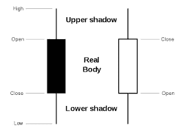
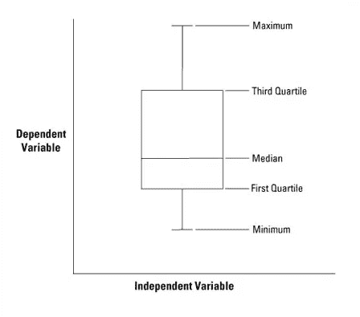

# 如何存储金融市场数据以进行回溯测试

> 原文：<https://towardsdatascience.com/how-to-store-financial-market-data-for-backtesting-84b95fc016fc?source=collection_archive---------4----------------------->


我正在处理中等规模的金融价格数据集。我所说的适度大是指每个资产少于 4 百万行。

400 万行可以覆盖常规资产(如指数期货合约或常规现金股票)在没有延长交易时间的情况下所做的过去 20 年的分钟价格棒线。

当处理价格柱时，分钟和 5 分钟柱会产生大量的数据集。如果你碰巧处理分笔成交点分析，那么它将是巨大的而不是巨大的，但是分笔成交点数据的获取、管理和货币化是非常昂贵的；除非你在回溯测试刷单策略，或者在 HFT 行业工作，否则他们的优势是可疑的。

尽管 400 万行听起来并不令人印象深刻，但我们需要理解，每项资产有 400 万行*。因此，分析来自 *Russell 2000* 的所有资产将意味着 80 亿行(现在我们越来越大)。添加一些欧洲股票市场、你所在国家的中小市值股票、大宗商品和*外汇*就可以了:你刚刚登上了大数据竞技场。*

> 世界上有 1700 多个受监管的市场，一旦你开始积累日内数据，这些数字就会变得令人印象深刻——非常快。

还要记住，目前的趋势是延长所有期货合约的交易时间——欧洲期货交易所从去年 1 月开始延长 FDAX 期货的交易时间，所以就需要分析的数据量而言，情况并没有好转。

现在，每个“*金融数据科学家”*都会问自己一个问题:我应该把我的数据放在哪里，怎么放。

关系数据库是第一个答案，可能不是最有效的，但肯定是最简单的。

我可以列举四个选项作为主要的存储库策略:

1.  SQL 关系数据库。
2.  大型数组的序列化存储。
3.  键/值数据库(比如 *Oracle Berkeley DB* )。
4.  CSV 文件。

出于明显的原因，我放弃了最后一个，对于其他三个，我只评估了前两个。

我计划探索第三个:键/值数据库。这些数据库并不是真正的主流，但在处理需要大量阅读的简单数据结构时，它们可以提供出色的性能(金融数据就是这种情况)。我真的相信这可能是序列化存储和关系数据库之间的最佳折衷解决方案。

在这篇文章中，我主要关注第一个策略。在进入细节之前，我们将回顾一下我们正在处理的数据。

# 烛台的快速历史回顾:我们为什么使用它们

几乎所有你要在金融市场上交易的数据都是价格条或烛台。这是有原因的。金融价格条的高/低/开/闭结构类似于统计学中使用的经典须状图和盒状图，但是它们更容易获得。



Price bar used in financial markets.

我使用了类似于 T1 的词，因为胡须和箱形柱(四分位数和中位数)提供的所有重要信息在金融烛台上是无法获得的。四分位数和中位数不是任意值，它们提供了关于被分析变量的描述性信息。



Whiskers and box bar used in statistics.

有人可能想知道为什么在金融市场中不使用晶须和盒棒线(我认为它的使用可能会导致有用和创新的价格行为洞察力)，原因很简单。烛台图表被认为是在 18 世纪由一个叫 Munehisa Homma 的日本大米商人首先使用的。如果你想知道 18 世纪是否有期货合约，你会想知道虽然第一个现代期货合约交易所是 T2 芝加哥期货交易所，但在 17 世纪欧洲和日本已经建立了期货市场。


The Dōjima Rice Exchange Monument. First future contracts exchange in Japan.

获得最高价、最低价、开盘价和收盘价来建造一个特定时期的烛台是非常容易的。你只需要一段时间内所有交易的清单。现在交易是电子化的，并且以有序的方式进行，但是请记住，情况并非总是如此。电子交易是相对现代的(它在 80 年代开始获得相关性)。在那之前，场内交易是常态，资产只在特定时间在场内交易。我们所知的持续交易市场的概念在当时并不适用。

即使在几乎所有交易都以电子方式进行的当前情况下，存储和分析在给定时期发生的所有交易以构建胡须和箱线图也是具有挑战性的(可行，但具有挑战性)。这意味着要么对订单簿进行严格的连续跟踪— *阅读磁带—* ，要么以不太严格的方式将较短的时间框架整合为较长的时间框架。

通过使用烛台，你最终会得到与四分位数和中位数类似的信息(请注意，突出显示了与 T9 类似的信息)。这就是所谓的烛台或烛台模式的价格行为，实际上，这只是对所有烛台系列中价格相关之处的解释性分析。所以一根大胡须和一个小身体(比如你在一只*蜻蜓*身上发现的)将意味着价格拒绝，如果大部分时间价格都集中在身体部分，当它试图移动到该区域下方或上方时，它很快就会被拒绝。这就是你可以从烛台上得出的结论(同样，当你在给定的市场背景下阅读它时)。

因此，存储开盘价/收盘价/最低价/最高价的区间价格信息将能够进行一定程度的价格行为分析，并且根据经验，给定环境中的某些模式具有统计相关性，并且将导致有利可图的策略。

# 存储烛台的数据模型

现在我们理解了为什么使用烛台，我们可以提出一个简单的数据模型来存储我们的信息。

```
CREATE TABLE candlestick (
 “id” INTEGER PRIMARY KEY AUTOINCREMENT,
 “timezone” TEXT NOT NULL,
 “timestamp” DATETIME NOT NULL,
 “open” DECIMAL(12, 6) NOT NULL,
 “high” DECIMAL(12, 6) NOT NULL,
 “low” DECIMAL(12, 6) NOT NULL,
 “close” DECIMAL(12, 6) NOT NULL,
 “volume” DECIMAL(12, 6) NOT NULL
);
```

我肯定您对这个简单的数据模型印象不深，但是即使是这个模型也可能会受到挑战。我们将不讨论`timezone`列(我计划写另一篇关于时区和数据的文章)，但是`timestamp`的用法已经是相关的并且有性能问题。

从可用性的角度来看，这种存储财务信息的方式简单且结构良好。查询数据非常简单:

```
sqlite> select * from candlestick where date(timestamp)='2018-01-12' limit 10;3489458|Europe/Berlin|2018-01-12 07:00:00+01:00|13243.5|13245.5|13234.5|13245.5|294
3489459|Europe/Berlin|2018-01-12 07:01:00+01:00|13244.5|13250|13243|13245|149
3489460|Europe/Berlin|2018-01-12 07:02:00+01:00|13244.5|13246|13242.5|13244|39
3489461|Europe/Berlin|2018-01-12 07:03:00+01:00|13242.5|13243.5|13239|13241.5|64
3489462|Europe/Berlin|2018-01-12 07:04:00+01:00|13241|13241|13235.5|13236.5|61
3489463|Europe/Berlin|2018-01-12 07:05:00+01:00|13236.5|13240|13236|13239.5|49
3489464|Europe/Berlin|2018-01-12 07:06:00+01:00|13239|13241.5|13237|13240|49
3489465|Europe/Berlin|2018-01-12 07:07:00+01:00|13238.5|13241|13237|13239|43
3489466|Europe/Berlin|2018-01-12 07:08:00+01:00|13239|13239|13236.5|13237|24
3489467|Europe/Berlin|2018-01-12 07:09:00+01:00|13237|13239|13237|13239|11
```

获取给定时段的开盘价很简单:

```
sqlite> select * from candlestick where date(timestamp)='2018-01-12' limit 1;3489458|Europe/Berlin|2018-01-12 07:00:00+01:00|13243.5|13245.5|13234.5|13245.5|294
```

所以它得到了收盘价:

```
 sqlite> select * from candlestick where date(timestamp)='2018-01-11' order by timestamp desc limit 1;3489457|Europe/Berlin|2018-01-11 21:03:00+01:00|13241|13241|13241|13241|25
```

但是这种方式有一些性能问题，我们将在后面讨论。

注意，我们使用了`datetime`字段来存储时间戳。我们也可以使用单独的字段来表示年、月、日、小时和分钟，但这将使以后在 Python(或 Java)中处理`datetime`类型变得复杂。这些复杂类型可能会带来性能问题，但也有助于处理时间、时区、时间偏移等。它还支持在 SQL 查询中使用时间范围。

# 未经优化的性能问题

使用这种方法存在性能问题:

1.  当进行数据的批量加载时(使用 Python 和 ORM 来确保在 SQLite 中正确处理时间戳),在单核 VPS 服务器上需要 14 分钟。
2.  在同一台 VPS 服务器上，获取给定会话的所有数据需要 5 秒钟。获得开盘价或收盘价的类似结果。

14 分钟听起来太长了，但批量装载并不常见，这可能是可以接受的。即使可以找到更优化的数据加载方式，这也不是重点。只需喝杯咖啡或为初始数据供应进行程序批量加载，这只会发生一次。

相反，5 秒钟可能听起来没什么大不了的，但确实如此。请记住，我们在这里处理的是多资产蒙特卡罗模拟场景。这意味着数千发子弹。所以 5 秒乘 1000 秒太长了。我们需要在这里进行优化。

虽然我不打算在这篇文章中讨论序列化策略，但我会分享一些关于这两种策略的时间比较:

```
# Bulk provisioning of 3.5Million price bars:SQLite + Pyhon ORM: 15 min              
Serialized Stored Arrays + ANSI C: 1.5 min# Retrieve a given specific 1 minute price bar:SQLite + Pyhon ORM: 5 seconds
Serialized Stored Arrays + ANSI C: Negligible (microseconds)
```

如前所述，这些环境中的真正问题是检索时间。在序列化数组中，它可以低至微秒，因为可以定义一种策略来为所有数据分配内存空间。

如果假设所有月份都有 31 天，那么检索给定的分钟只是一个超级简单的内存查找操作。没有索引或搜索操作这样的东西。

如果我们不知道交易时间(即使我们知道交易时间，也可能会有异常情况，如交易暂停或数据不一致)，获得给定时段的收盘价或开盘价可能会有点困难，但我们可以遍历特定的一天。遍历所有每日数据的阵列既快速又简单。

> 在介绍具有内置优化功能的数据库如何加快这些数字时，我们可能会使分析过于复杂。如果您的项目能够为 DBA 优化专家分配每年 150000 美元的成本，Oracle 数据库的性能将会更好，但这里要指出的是，简单的数组查找(序列化方法)永远不会被任何关系数据库击败。作为一个缺点，关系数据库使得查询和移动数据比存储序列化数组容易得多。

我尽可能使用 SQLite，因为它非常简单，易于使用和备份。尽管许多人说它是一个太基础的数据库，但它可以处理巨大的数据集。它的主要缺点是缺乏页面或区域锁定，这导致写很多的应用程序出现性能问题。除此之外，它的性能通常比预期的好得多，它非常轻便，而且无需维护。

# 创建索引以提高性能

最简单、最容易的优化是使用索引(这也是 SQLite 中唯一可以做到的)。

```
sqlite> create index idx_timestamp on candlestick(timestamp);sqlite> select * from candlestick where date(timestamp)='2018-01-11' order by timestamp desc limit 1;
3489457|Europe/Berlin|2018-01-11 21:03:00+01:00|13241|13241|13241|13241|25
```

现在搜索只需不到一秒钟。这是一个有意义的性能改进。

```
[user@host gaps]$ ls -ltr dax*
-rw-r--r-- 1 memmanuel memmanuel 284292096 Jan 26 12:43 dax-withoutindex.db
-rw-r--r-- 1 memmanuel memmanuel 409865216 Jan 26 22:32 dax-withindex.db
```

请注意，索引也极大地增加了数据库的大小。

# 将不同数据库中的资产分开

在 SQLite 中，拥有几个数据库非常简单。每个数据库只是一个文件的连接。因此，没有理由将所有资产合并到同一个数据库中。您可以将每个资产拆分到一个数据库文件中，并依赖于文件系统。将文件移动到不同的服务器并进行备份也将变得更加容易。在 SQLite 中处理每个数据库的多个资产将变得非常困难，它将需要一个额外的索引来跟踪资产报价器。所以这更像是一个必须要做的事情，而不是一个优化技巧。

# 在适用的情况下使用混合策略

将会话或每周数据从 SQLite 检索到内存数组或列表中。然后，您的数据会飞起来，您将使用 SQLite 作为永久的数据存储，在那里您可以检索大块的数据。这将减少对关系数据库性能不足的影响，同时仍然给你使用关系数据库的优势。

# 摘要

就性能而言，将金融价格数据存储在关系数据库中并不是最好的主意。金融市场数据是时间序列数据，其消费通常是使用基本搜索和检索查询的长链数据。

尽管如此，在关系数据库中存储数据简化了操作。所以你可以用它。

这里提到的三个简单的优化技巧/模式将会带来更好的结果:

1.  为时间戳创建索引。
2.  将数据集划分到不同的数据库中(在 SQLite 中，这非常简单)。
3.  从关系数据库中检索数据子集，并使用后来的内存列表/数组。

还有更多信息可能与使用序列化数组的方法以及处理时区这一复杂的主题相关，但这些将是其他帖子的素材。