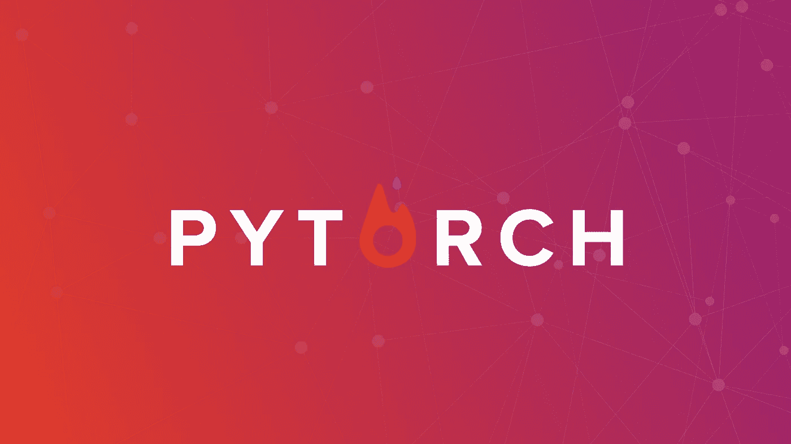
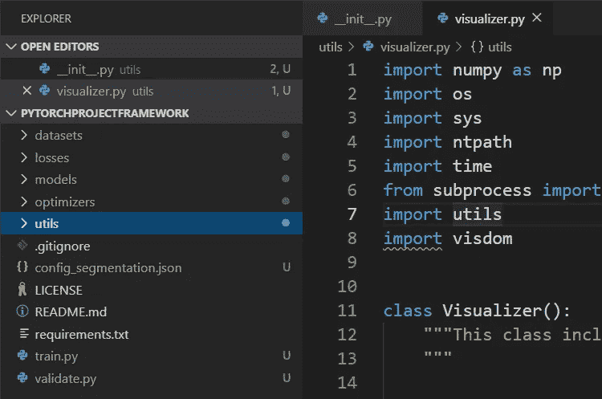
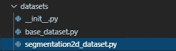
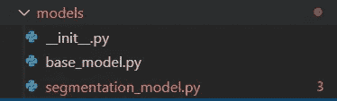
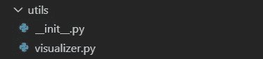

# 如何构建您的 PyTorch 项目

> 原文：<https://towardsdatascience.com/how-to-structure-your-pytorch-project-89310b8b2da9?source=collection_archive---------14----------------------->

## 一个构建 PyTorch 培训代码的建议



自从我开始训练深度神经网络，我就在想我所有的 Python 代码应该是什么结构。理想情况下，一个好的结构应该支持广泛的模型实验，允许在一个紧凑的框架中实现各种不同的模型，并且容易被每个阅读代码的人理解。您必须能够通过编码和重用各种数据加载器来使用来自不同数据源的数据。此外，如果模型支持在一个模型中组合多个网络(如 GANs 或原始 R-CNN 的情况)，那就更好了。该框架还应该具有足够的灵活性，以允许复杂的可视化(这是我在数据科学中的核心信念之一，即可视化使一切变得更容易，尤其是在计算机视觉任务的情况下)。

深度学习框架的详细实现当然取决于您正在使用的底层库，无论是 TensorFlow、PyTorch 还是 CNTK。在这篇文章中，我将介绍我基于 PyTorch 的方法。然而，我认为通用结构同样适用于您正在使用的任何库。你可以在 https://github.com/branislav1991/PyTorchProjectFramework 的[找到整个资料库。](https://github.com/branislav1991/PyTorchProjectFramework)

# 总体结构



Project structure for our deep learning framework.

在上面的图片上(取自 VS code，我选择的 Python 编辑器)，你可以看到我为我的框架创建的一般文件夹结构。**框架由一些启动脚本** (train.py，validate.py，hyperopt.py)以及隐藏在文件夹内的库组成。**数据集文件夹**包含**类和方法，用于加载各种类型的数据**进行训练。**损失文件夹**可能包含额外的损失函数或验证指标。如果您的项目不需要任何自定义损失函数，您可能不需要此文件夹。**模型文件夹**是最重要的:它**包含实际的模型**。**优化器文件夹**包含定制优化器的代码。与 losses 文件夹一样，如果您没有任何自定义优化器，也可以忽略该文件夹。最后， **utils 文件夹包含了在整个框架中使用的各种实用程序**，最著名的是**可视化器**。您还会注意到项目根文件夹中的 config_segmentation.json 文件。该文件包含培训所需的所有配置选项。

您可能已经猜到，训练是通过调用 train.py 脚本启动的。使用适当的配置文件作为命令行参数调用该脚本。它负责所有高级别的训练工作，例如加载训练和验证数据集以及模型，设置可视化，运行训练循环，最后导出训练好的模型。

类似地，通过调用适当的脚本并将配置文件作为参数传递来使用验证。

# 数据集



Files in the datasets folder with a 2D segmentation dataset as an example.

在上图中，你可以看到数据集文件夹的结构。它包括 __init__。py 模块，包括一些必要的函数来查找和创建正确的数据集，以及一个自定义的数据加载器，它将数据转发到训练管道(有关这方面的更多信息，请查看 [PyTorch API 文档](https://pytorch.org/tutorials/beginner/data_loading_tutorial.html))。顾名思义，base_dataset.py 为您在框架中定义的每个数据集定义了抽象基类。

对于您定义的每个自定义数据集，您必须实现 *__getitem__* 和 *__len__* 方法，以便 PyTorch 可以对其进行迭代。您不必再处理数据加载器，因为它是在 datasets/__init__ 中定义的。已经开始了。您还可以为数据集定义自定义回调，以便在每个时期之前和之后调用。如果您希望使用某种预热方法，在最初的几个时期向模型提供不同的数据，然后切换到更复杂的数据集，这可能会很有用。

为了实例化数据集，train.py 脚本调用以下代码:

```
print(‘Initializing dataset…’)
train_dataset =
   create_dataset(configuration[‘train_dataset_params’])train_dataset_size = len(train_dataset)
print(‘The number of training samples = {0}’.format(train_dataset_size))
```

这将调用 *create_dataset* 函数，该函数查看配置文件并根据其名称选择正确的数据集。在命名数据集时，遵循约定<dataset name>_ dataset . py 很重要，因为这是脚本能够根据配置文件中的字符串找到数据集的方式。最后，上面的脚本调用数据集上的 *len()* 函数来通知您数据集的大小。

# 模型



Files in the models folder with a segmentation model as an example.

框架中的模型以与数据集相同的方式工作:init__。py 模块包括根据模块名和配置文件中定义的字符串查找和创建正确模型的函数。模型类本身继承自抽象的 BaseModel 类，并且必须实现两个方法:

*   *forward(self)* 运行正向预测，并且
*   *optimize _ parameters(self)*在训练通过后修改网络的权重。

所有其他方法都可以被重写，或者您可以使用默认的基类实现。您可能想要覆盖的函数包括 *pre_epoch_callback* 和 *post_epoch_callback* (在每个 epoch 之前和之后调用)或 *test* (在验证期间调用)。

为了正确使用框架，了解如何使用网络、优化器和模型中的损耗是很重要的。由于在一个模型中可能有多个使用不同优化器的网络以及多个不同的损失(例如，您可能想要显示语义本地化模型的边界框分类和回归损失)，所以界面会更复杂一些。具体来说，您为 BaseModel 类提供损失和网络的名称以及优化器，以了解如何训练您的模型。在提供的代码中，我包含了一个 2D 分割模型的例子和一个数据集例子，让你看看这个框架应该如何使用。

看看提供的 2D 分段模型的 __init__()函数:

```
class Segmentation2DModel(BaseModel):
   def __init__(self, configuration):
      super().__init__(configuration)
      self.loss_names = [‘segmentation’]
      self.network_names = [‘unet’]
      self.netunet = UNet(1, 2)
      self.netunet = self.netunet.to(self.device) if self.is_train: # only defined during training time
         self.criterion_loss = torch.nn.CrossEntropyLoss()
         self.optimizer = torch.optim.Adam(self.netunet.parameters(), lr=configuration[‘lr’]) self.optimizers = [self.optimizer]
```

这里发生的事情是这样的:首先，我们读取模型配置。然后，我们定义“分段”损失，并将其放入 *self.loss_names* 列表中。损失的名称很重要，因为我们使用变量 *self.loss_segmentation* 来表示损失。通过了解名称，*基本模型*可以查找损失，并在控制台中打印或可视化(下一节将详细介绍可视化)。同样，我们定义网络的名称。这确保了 *BaseModel* 知道如何训练模型，而无需我们明确定义它。接下来，我们初始化网络(在本例中是 U-Net ),并将其移动到 GPU。如果我们处于训练模式，我们还定义损失标准并实例化优化器(在本例中是 Adam)。最后，我们将优化器放入*self . optimizer*列表中。该列表再次在*基本模型*类中使用，以更新学习率或从给定的检查点恢复训练。

让我们也来看看 *forward()* 和 *optimize_parameters()* 函数:

```
def forward(self):
   self.output = self.netunet(self.input)def backward(self):
   self.loss_segmentation = self.criterion_loss(self.output, self.label)def optimize_parameters(self):
   self.loss_segmentation.backward() # calculate gradients
   self.optimizer.step()
   self.optimizer.zero_grad()
```

正如您所看到的，这是标准的 PyTorch 代码:它唯一的职责是在网络上调用 forward()，在计算梯度后逐步优化程序，并再次将它们归零。为您自己的模型实现这一点应该很容易。

# 形象化



Files in the utils folder.

可视化可以在*可视化器*类中找到。这个类负责将损失信息打印到终端，以及使用 [**visdom**](https://github.com/facebookresearch/visdom) **库**可视化各种结果。它在训练脚本开始时初始化(加载 visdom 服务器)。训练脚本还调用其 *plot_current_losses()* 和 *print_current_losses()* 函数来可视化并写出训练损失。它还包含类似*plot _ current _ validation _ metrics()*、 *plot_roc_curve()* 和*show _ validation _ images()*的函数，这些函数不会自动调用，但可以从 *post_epoch_callback()* 中的模型中调用，以在验证时进行一些有用的可视化。我试图让可视化工具相当通用。当然，您可以自己扩展可视化工具的功能，让它对您更有用。

# 结论

我提出了一种编写通用深度学习框架的方法，该框架可以用于深度学习的所有领域。通过使用这种结构，您将为进一步的开发获得一个清晰而灵活的代码库。当然，解决这个问题还有许多其他方法。如果你有其他建议，请在评论中告诉我！