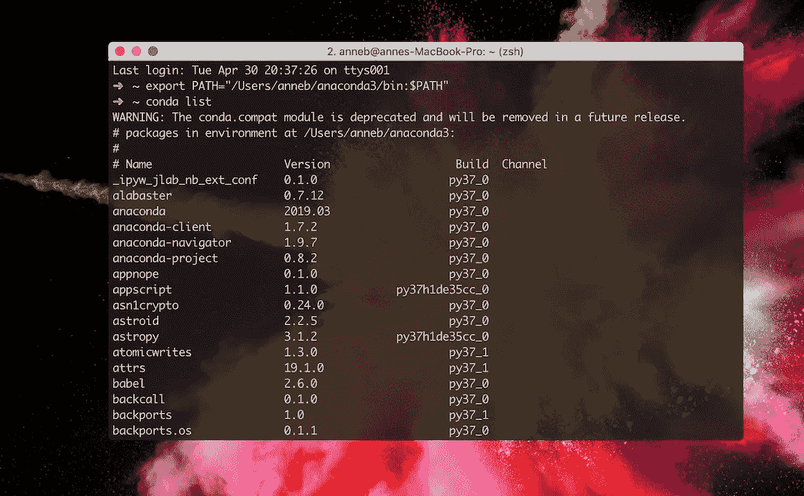

# 如何在 Mac 上成功安装 Anaconda(并让它实际工作)

> 原文：<https://towardsdatascience.com/how-to-successfully-install-anaconda-on-a-mac-and-actually-get-it-to-work-53ce18025f97?source=collection_archive---------0----------------------->

## 正确安装 Anaconda 并修复可怕的“找不到 conda 命令”错误的快速而轻松的指南


Image by [Michael Schwarzenberger](https://pixabay.com/users/blickpixel-52945/?utm_source=link-attribution&utm_medium=referral&utm_campaign=image&utm_content=543243) from [Pixabay](https://pixabay.com/?utm_source=link-attribution&utm_medium=referral&utm_campaign=image&utm_content=543243)

你知道你需要它。

当您开始学习数据科学、机器学习或人工智能时，您很快就会意识到您需要能够使用 Anaconda。你可能想用 Jupyter 笔记本，Spyder，或者其他很棒的程序，但是不管怎样，你都需要这个东西来工作。

最近在安装电脑时，我想起了第一次让 Anaconda 工作有多难。安装本身没有问题！[官方 guid](https://docs.anaconda.com/anaconda/) e 对于安装本身是清晰而全面的。你完成它，遵循一些简单的步骤，你就可以开始了！

最后，它告诉您通过键入类似“conda list”的命令来验证您的安装是否成功，这样就完成了！

**没有。**


## 康达没有

“康达”我第一次装的时候没用。没有现成的链接可以告诉你该怎么做。你验证一下就完事了。

你只能靠自己了。

> 没有什么比甚至不能**打开**你需要的程序更令人沮丧的了。

在机器学习和人工智能方面入门并不是一件容易的事情，无法正确安装必要的工具只会造成严重后果。随着你开始理解更多的语言和命令，你会发现有很多简单的答案。但是当一切都是新的时候，它们就没有任何意义了！仅仅谷歌一下你的问题就很有挑战性。

我实际上已经这样对自己了。

我在苹果电脑上工作(如果你感兴趣的话，可以叫我莫哈维)。在终端工作了一段时间后，我把它变成了一个快速、高效、外观漂亮的东西。[你可以在这里看到我为了让我的终端变得更棒而做的一切](/trick-out-your-terminal-in-10-minutes-or-less-ba1e0177b7df)，但本质上，它是在运行的

*   iTerm2
*   公司自产自用
*   Zsh
*   哦，我的 Zsh
*   几个我的 Zsh 插件
*   Z
*   语法突出显示

[](/trick-out-your-terminal-in-10-minutes-or-less-ba1e0177b7df) [## 在 10 分钟或更短时间内搞定你的终端

### 如何在短短几分钟内打造一个更好、更快、更强、更性感的终端

towardsdatascience.com](/trick-out-your-terminal-in-10-minutes-or-less-ba1e0177b7df) 

我一点也不知道这会让我的 Anaconda 安装变得更加困难。事实证明，一行代码更难，但对新手来说，挑战性是一百万倍。

这是一步一步的安装过程，通过简单的一行修复程序，您可以“conda”任何您想要的东西。即使你用的是可爱又惊艳的 Zsh。

## 发生了什么事？

事情是这样的:安装是成功的，但是在 Zsh 和我的终端想要与 Anaconda 对话的方式之间有一个小问题。发生这种情况的原因有很多，但 Zsh 是罪魁祸首。

它非常容易修理！但是因为我不知道我在做什么，所以我花了很长时间才弄明白。


Image by boanergesjr via [Pixaby](http://pixabay.com)

其他人不应该经历这些。

## 修复

[*官方安装指南*](https://docs.anaconda.com/anaconda/) *在这里，如果你想检查一下。*

我第一次决定[下载 Anaconda](https://www.anaconda.com/distribution/) ，我经历了正常的图形化 Mac 安装。作为一个应用程序，它工作得很好，但它就是不能在我的终端上工作。

不愿意放弃，我卸载了 Anaconda，然后尝试命令行安装。这一点非常好，因为您可以在安装过程中决定让您的终端与 Anaconda 通信。在安装过程中，您会得到一个提示，询问“您希望安装程序通过运行 conda init 来初始化 Anaconda3 吗？”

> 我建议给这个答案一个大大的肯定。

当然还是没有效果。不过，如果你没有一个精心设计的终端，它可能会！如果你没有使用 Zsh 和我的 Zsh，你可能已经设置好了。

**那么，如果您对终端进行了更改，如何让它正常工作呢？**

很简单！

这些是成功安装 Anaconda 的简单步骤，即使面对可怕的“conda command not found”错误消息。

## 步骤 1:下载 Anaconda

可以[去这里下载 Anaconda](https://www.anaconda.com/downloads) 。然后向下滚动一点，到显示“Anaconda 2019.03 for MAC OS Installer”的部分

您需要知道您使用的是哪个版本的 Python，所以请在您的终端上键入

```
python
```


This shows Python version 3.7.3

你有几个下载的选择。您可以选择图形化安装程序，这意味着您将像安装任何其他程序一样安装 Anaconda。或者您可以选择命令行安装程序，这意味着您将进入您的终端并键入(或复制和粘贴)命令。

我们将执行命令行安装程序，因此单击您的 Python 版本下的链接，您的下载应该会开始。


## 步骤 2:命令行安装

下载完成后，前往您的终端。

如果你有 Python 3.7，你会跑

```
bash ~/Downloads/Anaconda3-2019.03-MacOSX-x86_64.sh
```

对于 Python 2.7，运行

```
bash ~/Downloads/Anaconda2-2019.03-MacOSX-x86_64.sh
```

> 请记住，如果您没有将 Anaconda 下载到您的下载文件夹中，您将需要更改该路径。

查看许可协议，点击“回车”接受它，直到你看到最后。最后，如果你想同意，请键入“是”。

(会提示你。错过的话会反复提示*。)*

**

*如果你对它建议的位置满意，点击“输入”您可以通过输入 CTRL-C 来更改位置或取消安装。**注意这个位置**！如果您收到错误消息，它会派上用场。*

*现在保持不动。耐心点。这可能需要几分钟的时间，而且您一开始并不知道是否发生了什么。如果您愿意，您可以去喝点饮料，但是要快，因为安装程序会问，“您希望安装程序通过运行 conda init 来初始化 Anaconda3 吗？”当别人问你的时候，你几乎肯定想在那里输入“是”。*

***“感谢您安装 Anaconda！”***

*安装完成后，关闭您的终端窗口并打开一个新窗口，以使更改生效。想看看有没有用吗？在您的终端中，键入如下命令*

```
*conda list*
```

*看看会发生什么。如果成功了，你会看到这样的东西*

**

> *如果您想知道您的环境中安装了哪些包和版本，这是一个非常有用的命令！*

*如果成功了，恭喜你！！！您现在已经准备好开始使用 Anaconda、Jupyter Notebooks、Spyder 和所有其他好东西了。庆祝的时间到了！*

**

*Image by [StockSnap](https://pixabay.com/users/StockSnap-894430/?utm_source=link-attribution&utm_medium=referral&utm_campaign=image&utm_content=2564630) from [Pixabay](https://pixabay.com/?utm_source=link-attribution&utm_medium=referral&utm_campaign=image&utm_content=2564630)*

## *步骤 3:找不到 conda 命令*

*另一方面，你可能会看到这个:*

**

*这个问题的解决方法其实很简单。*

## *故障排除步骤#1:*

# ** * * *重启你的终端！！！****

> *(我知道我已经说过了，但是 Anaconda 团队告诉我，不刷新您的终端是人们在这一点上遇到问题的最常见原因。)*

## *故障排除步骤#2:*

*您需要知道您的 Anaconda 二进制目录在哪里，以及您的用户名是什么。如果您在安装过程中注意了，您已经有了这些信息！您需要在安装过程中指定的位置。*

*如果没有，如果你只是简单地按照安装说明操作，很有可能你的目录是`/Users/`(如果你在 macOS 上)。(或者 Linux 上的`/home/`或者 Windows10 上的`\Users\`。)*

*如果您不知道自己的用户名，请运行*

```
*echo $USER*
```

**

## ** * *更新！！****

*我建议修改 PATH 来解决这个问题(您可以在下面看到最初的修复)，但是 Anaconda 团队提供了一些非常有用的信息！*

***他们不建议修改路径！***

*你可以阅读下面的完整评论，但这里有一个信息的压缩版本，你可以在评论部分找到惊人的[迈克尔萨拉汉](https://medium.com/u/d12b3861dff8?source=post_page-----53ce18025f97--------------------------------):*

> *“如果您的系统中有任何其他程序具有相同的名称，那么修改路径会导致问题，Anaconda 会首先发现这些程序，然后隐藏它们(阴影)。“conda init”所做的是建立一个 conda“shell 函数”,并使其他东西远离路径。除了康达什么都没有。然后，它默认在启动时激活您的基本环境。净效果非常像您的路径添加，但有一些微妙的，但至关重要的差异:*
> 
> *激活确保了 anaconda 的路径内容是正确的。将 anaconda 永久地放在 PATH 的前面是好的，因为它可以防止混淆，但是不好的是它会遮蔽其他东西，并且可能会破坏东西。激活是一种不太持久的方法。您可以使用“auto _ activate _ base”condarc 设置关闭基础环境的自动激活。*
> 
> *激活不仅仅是修改路径。它还提供任何 activate.d 脚本，这些脚本可以设置附加的环境变量。有些东西，比如 GDAL，需要这些。没有激活，这些软件包将无法工作。*
> 
> *因此，如果您选择不运行 conda init，我们建议您遵循安装程序末尾的说明，而不是您修改路径的提示:*
> 
> *…*
> 
> *这看起来像两个命令:*
> 
> *1.eval " $(/home/msarahan/mc3 _ dummy/bin/conda shell . bash hook)"*
> 
> *2.conda 初始化*
> 
> *注意，在步骤 1 中，我将 shell 名称从 YOUR_SHELL_NAME 改为 bash。您可能需要根据您的 shell 自行调整。"*

*长话短说，修改 PATH 很有可能会给你带来一些问题。更聪明的做法是激活，因为它不是永久的，并且会允许一些原本不能运行的包运行。*

*因此，在安装程序结束时，不是运行原始解决方案:*

```
*export PATH="/Users/myname/anaconda2/bin:$PATH"*
```

*你想跑吗*

```
*eval "$(/home/msarahan/mc3_dummy/bin/conda shell.bash hook)”
conda init*
```

*(但是要确保将目录位置和 shell 更改为您自己的！)*

**** * *更新结束******

## *原始解决方案:*

*你所需要做的就是运行*

```
*export PATH="/Users/myname/anaconda3/bin:$PATH"*
```

*你可以走了！！！*

> *(一定要确保用您的用户名替换“myname ”,并在需要时更改目录的路径。如果你看上面的那一行，`*/Users/myname/anaconda3*`将被先前安装位置的`*/Users/anneb/anaconda3*`所取代。其他一切保持不变。)*

*如果您没有安装 Anaconda3，那么您需要运行*

```
*export PATH="/Users/myname/anaconda2/bin:$PATH"*
```

*对于 Anaconda2 或者*

```
*export PATH="/Users/myname/anaconda/bin:$PATH"*
```

*确保在必要时更改“myname”和目录位置。*

*现在试试`conda list`！*

**

## *恭喜你！*

*你做到了！！！*

*您已经成功安装了 Anaconda，现在可以从命令行运行它了！*

*试着打字*

```
*jupyter notebook*
```

*看看会发生什么！*

*GIF via [GIPHY](https://media.giphy.com/media/MhHcCN6PoTdL2/giphy.gif)*

*感谢阅读！如果你想接触或者找到更多很酷的文章，请来[内容简约](https://contentsimplicity.com/articles/)和我一起吧！*

*[](https://contentsimplicity.com/articles/)*

*想了解创建、运行、发布甚至共享 Jupyter 笔记本的最简单方法吗？*

*[](/getting-started-with-saturn-cloud-jupyter-notebooks-b3f509a500ef) [## 如何毫不费力地创建、发布甚至共享云托管的 Jupyter 笔记本

### 完全初学者指南，以闪电般的速度在 Jupyter 笔记本上创建、运行和协作…

towardsdatascience.com](/getting-started-with-saturn-cloud-jupyter-notebooks-b3f509a500ef) 

感谢阅读！*