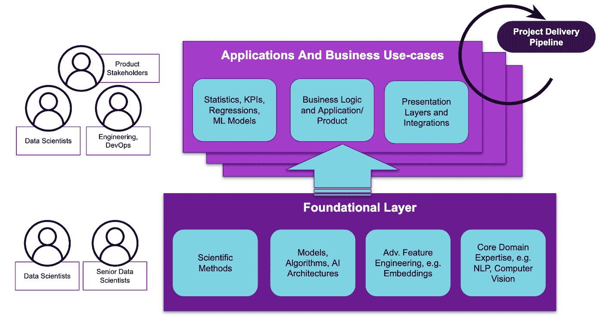
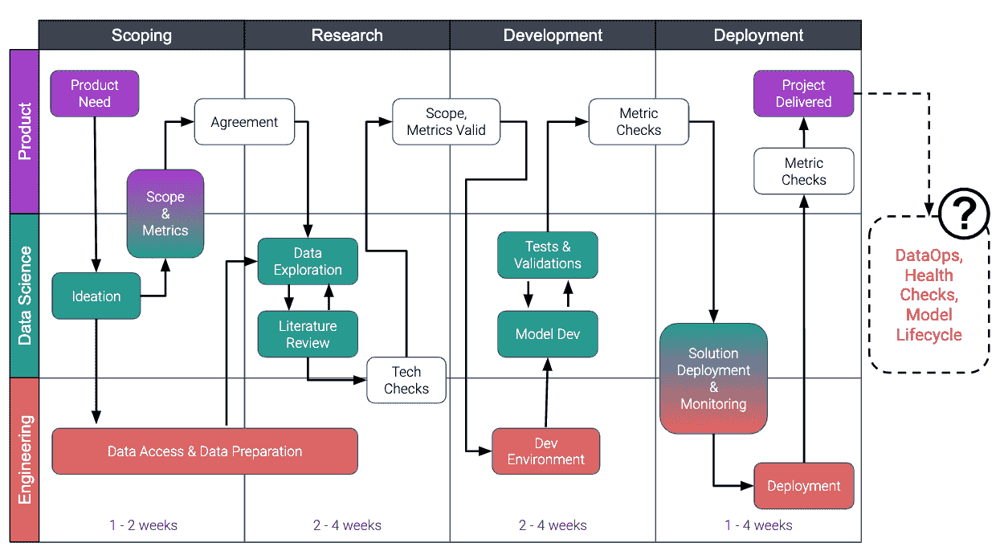

# 如何成功管理数据科学交付渠道

> 原文：<https://towardsdatascience.com/how-to-successfully-manage-a-data-science-delivery-pipeline-33bdec1a9a27?source=collection_archive---------8----------------------->

## *数据科学项目:交付还是不交付。*

根据 [Gartner](https://www.techrepublic.com/article/85-of-big-data-projects-fail-but-your-developers-can-help-yours-succeed/) 的说法，这不是选项，而是 85%的数据和数据科学项目未能交付商业价值或看不到业务适应的令人失望的现实。事实是，在商业环境中成功掌握数据科学是一项复杂的挑战。你可以在我之前的[博文](https://medium.com/@jan.teichmann)中读到关于独特的[战略需求](/how-to-make-a-success-story-of-your-data-science-team-1719129941ba)和[技术需求](/rendezvous-architecture-for-data-science-in-production-79c4d48f12b)。这个博客涵盖了拼图的最后一块，即数据科学项目的交付管理。

 [## 生产中数据科学的会合体系结构

### 如何构建一个前沿的数据科学平台来解决数据科学中的真正挑战:生产化。

towardsdatascience.com](/rendezvous-architecture-for-data-science-in-production-79c4d48f12b)  [## 如何让您的数据科学团队取得成功？

### 出于某种原因，让数据科学取得成功真的很难，超过 75%的企业报告称面临业务挑战…

towardsdatascience.com](/how-to-make-a-success-story-of-your-data-science-team-1719129941ba) 

当我们审视项目交付管道时，重要的是要记住数据科学(a)仍然是一个新兴的业务功能，以及(b)从持续的创新中不断发展。

# 构建基础层

许多数据科学家发现自己在运行敏捷软件开发周期的科技公司中，这感觉有点像圆孔中的方钉。数据科学职能与软件开发的不同之处在于该角色所带来的开放式研究的数量，这也是标准敏捷流程与数据科学家的兴趣相冲突的地方。

> **研究是数据科学的重要组成部分，但不太适合标准的敏捷流程。**

任何数据科学团队都需要花费大量时间进行研究，以构建他们的基础层，其中数据科学使不断发展的领域适应业务的特定环境。我们可以将这项基础研究工作分为三类:

**长期**:由成熟的数据驱动型高科技公司的专业研究团队进行。这不是典型的企业商业数据科学家。

**中期**:通过调整数据科学中不断发展的关键领域以适应特定的业务环境，构建可扩展的基础。

**短期**:应用特定的挑战，如解决方案设计、表示层、算法选择以及模型和指标的验证方法。

许多企业通过从相关领域(如 NLP 或计算机视觉)雇用特定的专业知识和人才来快速推进他们的研究积压。无论如何，需要对基础层进行持续投资，以保持资源的相关性，并为数据科学团队提供发展机会。这对于团队激励和保留至关重要。

*[OC]*

当我们将数据科学的职责分成两个工作流时，很明显哪个部分应该作为敏捷交付管道和项目管理委员会(如吉拉)的一部分，哪个部分与标准敏捷流程相冲突。

一方面，构建基础层和管理这个工作流应该是数据科学家的内部职责。另一方面，我一次又一次地发现这对于团队来说是非常个人化的。通常，这是用于未定义成功标准或截止日期的概念证明的合适工作流。与其顺应这种混乱，不如对这一工作流的资源分配实施透明，围绕协作和知识转移设定期望，并通过博客帖子和社区会议等方式交流这一工作的进展和价值。

# 转向项目管理需求

在团队坚实的基础上，我们扩展了越来越多的应用程序和业务用例，成为标准交付管道的一部分，具有更严格的项目管理要求:

*Adapted Flow Chart originally by* [*Shay Palachy*](https://towardsdatascience.com/@shay.palachy)

数据科学项目的交付是科学、产品和工程的团队运动。其协调和优先级的关键是项目交付管理中的**价值证明**思维，而不是激励团队研究工作的概念证明思维。

**范围界定**阶段必须从具体的产品需求开始，目标是在产品和数据科学之间就成功项目将解决的范围和指标达成一致。这一阶段是对已建立的产品和科学关系的巨大考验。在成熟的合作中，产品团队尚未解决合适的数据科学项目。构思过程应大量参考数据，以定义现实的项目范围，并应主要由数据科学团队负责。

在**研究**阶段**这将未完成的研究限制在短期应用特定的挑战，如最终解决方案设计(包括表示层和 API)、算法选择以及模型和商定指标的合适验证方法。因此，对这一阶段进行时间限制是合适的，但有可能需要重复一个研究阶段。研究阶段的成功完成见证了工程部门的感觉检查，以及对范围和商定指标仍然有效的确认。**

这是真正的模型**开发**开始的时候。数据科学家编写代码，但这与软件工程师的工作方式有很大不同。这个阶段是高度迭代的，在模型开发和模型评估之间有大量的来回，以优化解决方案。这就是数据科学家使用笔记本而不是传统 ide 的原因。这让他们可以快速制作原型。

笔记本电脑非常适合快速原型开发，但是对于可重复性和企业部署来说却很糟糕。数据科学开发环境的成熟度以及工程对访问和处理大量数据的支持至关重要。它不仅影响模型开发过程中的生产力，而且保证解决方案的质量，以避免后续解决方案部署过程中的意外。

您可以在我的另一篇文章中了解更多有关 MLFlow 以及它如何帮助数据科学家开发可用于生产部署的模型的信息:

 [## 用 Mlflow 为非傻瓜完成数据科学项目模板。

### 数据科学项目最佳实践，适用于在本地或云中工作的每个人，从刚起步的忍者到大…

towardsdatascience.com](/complete-data-science-project-template-with-mlflow-for-non-dummies-d082165559eb) 

模型的**部署**本身就是一个具有挑战性的话题。通常，模型数据科学家在前一阶段开发的模型数据需要大量的工作来将其转化为可以在现有堆栈上部署的企业解决方案。这包括日志记录、监控、审计、身份验证、SLA 等要求。

为每个模型解决部署问题根本无法扩展。此外，一个大问号仍然存在。谁拥有生产中已部署模型的操作职责？模型因其在生产中复杂的生命周期管理需求而独一无二。因此，关注平台化数据科学很重要，你可以在我之前关于[机器学习物流和 Rendezvous 架构](/rendezvous-architecture-for-data-science-in-production-79c4d48f12b)的文章中了解更多。

这个故事已经作为甲骨文的 AI 影响者博客系列的一部分重新发布:

[https://blogs.oracle.com/ai-and-datascience/post/ai-influencer-blog-series---how-to-successfully-manage-a-data-science-delivery-pipeline](https://blogs.oracle.com/ai-and-datascience/post/ai-influencer-blog-series---how-to-successfully-manage-a-data-science-delivery-pipeline)

Jan 是公司数据转型方面的成功思想领袖和顾问，拥有将数据科学大规模应用于商业生产的记录。他最近被 dataIQ 评为英国 100 位最具影响力的数据和分析从业者之一。

**在领英上连接:**[https://www.linkedin.com/in/janteichmann/](https://www.linkedin.com/in/janteichmann/)

**阅读其他文章:**[**https://medium.com/@jan.teichmann**](https://medium.com/@jan.teichmann)