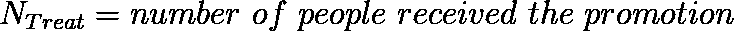
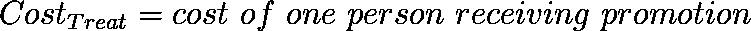
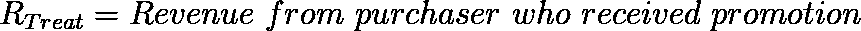
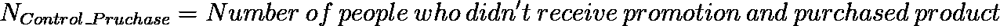
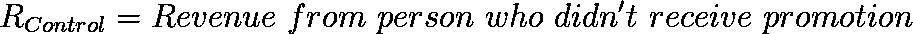
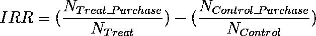
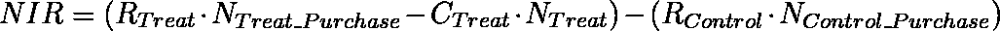
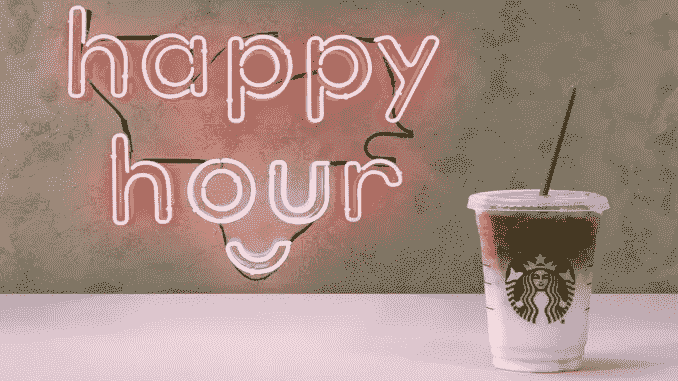
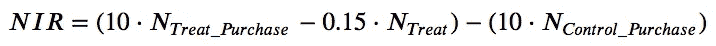
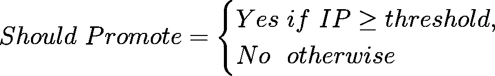

# 如何使用转换预测模型确定促销目标，以最大化净增量收入？

> 原文：<https://towardsdatascience.com/how-to-target-promotions-with-conversion-prediction-model-to-maximize-net-incremental-revenue-f51dabdb6320?source=collection_archive---------17----------------------->

Identifying the right set of customers to be targeted for the promotion is the key for a successful campaign [Image Source](http://www.brimmingdesign.com/branding-your-product/)

每当一家公司选择通过提供折扣或开展数字广告活动等策略来推广某种产品时，都会有一定的成本以及一些与之相关的潜在创收机会。如果公司不小心选择合适的客户群来接受促销，最终可能会损失很多钱，却没有获得多少回报。

## 如何量化促销活动的净回报？

让我们假设该公司有权向一组人推销其产品。他们可以被视为现有客户，或者只是通过社交媒体、搜索引擎广告、电子邮件或其他一些沟通机制可以接触到的受众。

假设该公司进行了一项实验，从这些人中随机抽取一小部分样本，从中得出统计结论。

它进一步将这个样本分成大小大致相等的两组。哪个人被分配到哪个组也是随机的。

对于其中一组，公司选择发送促销信息，为简单起见，我们假设所有人都收到了促销信息。我们称这个组为治疗组。例如，公司选择向该组中的所有成员发送折扣券，每个人都会收到并看到它。

让我们考虑一个人获得晋升的相关成本。例如社交媒体平台收取的每次点击成本。

考虑在接受促销后选择购买产品的人数。

公司从接受促销的人购买的产品中获得收入。

第二组是公司不向其发送促销的组。我们称这个组为控制组。

在这个对照组中，会有一些人没有收到促销，但他们仍然购买了产品。

公司从没有得到促销的人购买产品中获得收入。

假设公司在一段时间内进行了这个实验，在这段时间结束时，它得到了这些数据。然后它可以像这样计算促销活动的回报。

**增量响应率(IRR)** 量化接受促销后人们的响应或购买率的变化量。

**净增量收入(NIR)** 量化公司在开展促销活动后获得的净收入的变化，同时考虑与之相关的成本。

我相信上面的两个公式直观上是有意义的，它们很好地抓住了促销活动的效果。

公司的目标是最大化 IIR 和 NIR 这两个参数。

对于不同类型的公司或场景，IRR 可以捕捉来自个人的任何积极行为作为响应，如签约或购买等。

对于一个产品销售公司来说，NIR 反映了促销活动在直接金钱收益方面的有形结果。

想象一个场景，在接受促销后选择购买产品的人数大致等于(或可能少于)没有接受促销但仍然购买产品的人数。在这种情况下，如果治疗组和对照组的人均收入相同，则该活动的净增量收入为负。这意味着该公司通过开展促销活动造成了金钱损失！

## 公司如何最大化 IIR 和 NIR？

如果我们假设向一个人发送促销的成本和从接受促销的人的购买中产生的收入都是常数，那么我们留下来调整的唯一两个参数是接受促销的最小人数和接受促销后选择积极响应(例如购买)的最大人数。

> 公司应该只向那些在获得晋升后极有可能做出积极回应的个人发送晋升。

## 公司如何决定向谁发送促销信息？

根据通过实验收集的数据，该公司可以将其潜在购买者组成的可接触受众分为两类:在接受促销后购买的人和其他人。

请注意，其余的人将包括那些不值得被提升的人。其中包括:

1.  那些购买了产品却没有得到促销的人。这一点很重要，因为发送促销信息是有成本的，公司不希望把这笔钱花在那些可能已经购买了产品的人身上。
2.  接受促销但没有购买的人。这些人是公司花钱进行促销的对象，但他们选择不购买产品。这些人可能会因为某种原因(可能是隐私问题)在看到公司针对他们的促销活动后感到恼火，并有意识地选择不购买。
3.  没有收到促销且没有购买产品的人。该公司从实验中获得的数据很少，无法判断是否向他们发送促销信息。保守的做法是不给这样的人升职。

这个问题转化为决定哪个人属于哪个类别。应用基于机器学习的统计模型可以有所帮助。如果公司有一些与潜在受众相关的个人数据，如人口统计、年龄、性别、地点、购买历史、财务状况、婚姻状况、教育、就业背景、兴趣等。然后，它可以使用它来识别这些人中的哪些子集在接受促销后更有可能购买该产品。

## 让我们看一个例子

为了进一步解释这种技术，我将举一个由 Starbucks 提供的样本数据集的例子。

你可以在这个[笔记本这里](https://patelatharva.github.io/Starbucks_Exercise/Starbucks.html)找到我这个项目的代码，这个项目是[在 GitHub](https://github.com/patelatharva/Starbucks_Exercise) 上可用。

Happy Hour, Starbucks’ invite only promotion [Image Source](https://www.chewboom.com/2018/03/29/starbucks-brings-back-happy-hour-as-invite-only-promotion/)

它曾经向数据科学家候选人提供该数据集。它包含 120，000 行，其中有 7 个名为 V1 到 V7 的数字变量，这些变量与他们实验中的每个人有关。它有两个额外的变量，表明这个人是否得到了促销和她是否购买了产品。

在星巴克的例子中，从接受和未接受促销的两类顾客那里，每次购买的收入是 10 美元。向一个人发送促销信息的成本是 0.15 美元。因此，在这种情况下，用于 NIR 的公式可以转换成如下形式:

为了评估我们的预测模型的性能，有必要将来自实验结果的可用数据集分成训练和测试数据集。测试数据集不得以任何形式用于训练模型。它必须仅在训练结束时用于对照一些预定参数评估模型，在我们的情况下是 IIR 和 NIR。如果我们想在训练阶段评估我们的预测模型，我们可以将训练数据集进一步分成两部分:训练数据集和验证数据集。该模型可以用训练数据集上的一些超参数来训练，并在验证数据集上进行评估，以选择超参数的最佳值。

有几种方法可以将该数据集用于训练基于机器学习的统计模型。我将讨论一些使用该数据集获得良好结果的方法。

# 第一种方法

由于公司只对那些只有在收到促销后才会购买产品的人感兴趣，我们可以定义一个名为`Response`的新的二进制变量，如果这个人同时有两个变量，即表示她是否收到促销的`Promotion`和表示她是否购买了产品的`Purchase`，则该变量将被设置为`True`。对于拥有其余`Promotion`和`Purchase`变量值组合的人，分配给`Response`的值将为`False`。在用这个新的目标变量丰富数据集之后，像[正则化梯度推进(XGBoost)](https://xgboost.readthedocs.io/en/latest/) 这样的机器学习模型可以用于通过将变量 V1 到 V7 视为输入变量并且将`Response`视为输出变量来训练数据集。

## **检查和处理数据集中的不平衡**

在定义了这个新的`Response`变量之后，我决定检查分配给它的值是否不平衡。因为这通常是市场营销活动的情况，在这些接受促销的人中只有一小部分人选择按照它行动。在该数据集中，分配给`True`和`False`的人数与目标变量`Response`的值之间的比率约为 1:116。这表明数据集中存在巨大的不平衡。

如果我们选择忽略这种不平衡，并继续在这个数据集上训练一个机器学习模型，它可以实现 0.99/1 的精度，只需在测试中收到的所有情况下，将`Response`变量的输出给`False`。得出该模型在准确性方面表现很好的结论可能会产生误导。具体来说，这种模型根本无法识别公司应该向哪些人发送促销信息。

有几种方法可以处理不平衡数据集

1.  通过包含新的合成生成的数据点，对输出变量等于少数类的数据进行过采样(例如，使用 [SMOTE 技术](https://www.researchgate.net/publication/220543125_SMOTE_Synthetic_Minority_Over-sampling_Technique)
2.  通过在采样期间替换，用等于少数类的输出变量对数据进行过采样。在这种情况下，属于少数类的数据点附近的决策边界可能不能很好地概括。
3.  对输出变量等于多数类的数据进行下采样。在这种情况下，我们删除了一些可以用来训练模型的数据。
4.  使用机器学习模型中可用的类别加权机制，根据目标变量的值为训练样本分配不同的权重

对于这个数据集，我决定使用[合成少数民族过采样技术](https://www.researchgate.net/publication/220543125_SMOTE_Synthetic_Minority_Over-sampling_Technique)，通过在分配给少数民族类的现有数据点之间引入新的数据点来实现数据集的平衡，输入变量值会有一些变化。

对于这个数据集，我决定在这个数据集上训练[正则化梯度增强模型(XGBoost)](https://xgboost.readthedocs.io/en/latest/) 来预测一个人的`Response`变量，其属性被指定为`V1 to V7`作为输入变量。

XGBoost 有大量的[超参数](https://xgboost.readthedocs.io/en/latest/parameter.html)，需要基于交叉验证进行设置。我决定调整一些重要的值，并选择用那些在交叉验证测试中表现最好的值来训练模型。

该模型在验证集上获得的 F1 分数约为 0.028311，这被认为是相当低的。然而，我们必须记住，在我们的问题中，真正的评估指标是 IIR 和 NIR。

我继续使用 XGBoost 模型对最佳参数进行训练，并使用它对测试数据集进行预测，以决定给定的人是否是在接受公司促销后会购买的人。如果是，那么它将推荐发送促销给那个人。

在测试数据集上，该模型的 IIR = 0.0206，NIR = 259.25。

星巴克在数据集描述中提到，他们的团队实现了 IIR = 0.0188 和 NIR = 189.45

从我们的预测模型获得的结果表明，这种方法可以是解决这种类型问题的非常有效的方式，其中公司需要决策支持系统来决定向谁发送促销。

# 方法 2

另一种方法是对每个人进行评估，与未接受促销相比，接受促销的人进行购买的*增量概率*是多少。如果给定人员的递增概率足够高，我们的算法将推荐向该人员发送促销。

Formula for calculating Incremental Probability (IP)

为了实现这种方法，我们需要添加`Promotion`，作为该人是否获得晋升的指示变量，作为除我们拥有的每个人的个人数据之外的输入变量。目标输出变量将指示该人是否采取了期望的行动。

在我们的 Starbucks 数据集的例子中，我们将使用变量`V1 to V7`和`Promotion`作为输入变量，使用`Purchase`作为目标输出变量。

下面是在这种方法中如何决定是否发送促销信息。我们首先通过将`Promotion`输入变量分别设置为真或假，并计算两个概率之间的差异，来计算得到促销和没有得到促销的人进行购买的概率。如果差异大于某个阈值，那么我们可以向该人发送促销信息。可以使用超参数优化技术来确定阈值，同时使用 NIR 公式来计算要最小化的目标函数的返回值，即分数可以是-NIR。

数据集的`Purchase`变量值在`True`和`False`值之间的比率约为 1:80。这表明数据集中高度不平衡。我使用 SMOTE 技术对少数类进行过采样，以使两个类在训练数据集中的比例相等。

在这里，我使用[对数损失作为评估指标](http://wiki.fast.ai/index.php/Log_Loss)，同时调整估计数作为 XGBoost 的超参数，因为我更感兴趣的是计算给出特定响应的人的准确概率，而不仅仅是预测响应类别。根据这个概率，我可以计算出人们在接受促销后购买某种产品的增量概率。

具有最佳超参数的经训练的 XGBoost 模型在验证数据集上获得 0.07 的对数损失分数。就对数损失而言，它越小，模型的预测性能就越好。

我使用这个模型对测试数据集提出建议，并计算出 IIR = 0.018826，NIR = 98.30。将其与星巴克声称其团队实现的 IIR = 0.0188 和 NIR = 189.45 进行比较，我们可以说该模型显示出不错的性能，但不如方法 1 或星巴克声称实现的效果好。然而，在不同的问题场景中，它可以被认为是一个值得考虑的选项。

## **可以尝试的方法 3**

在与促销相关的文献中提出了一种基于两种模型的方法。在这种方法中，我们训练了两个独立的`Purchase`预测模型:一个针对获得晋升的人，另一个针对没有获得晋升的人。然后，我们计算每个人在有促销和没有促销的情况下进行购买的概率差异。如果差异足够大，我们可以选择向那个人发送促销信息。然而，一些人对这种方法提出的警告是，它训练两个独立的模型，每个模型都可以在输出中生成自己的概率范围，并且正确预测增量概率的误差会加倍，因为我们使用了两个预测模型。我将这种方法留给感兴趣的读者(或我自己)在将来的某个时候在这个数据集上进行尝试。

我希望你觉得这篇文章很有见地。

你可以在这里的这个[笔记本里找到我这个项目的代码，带有星巴克数据集的项目在 GitHub](https://patelatharva.github.io/Starbucks_Exercise/Starbucks.html) 上有[。](https://github.com/patelatharva/Starbucks_Exercise)