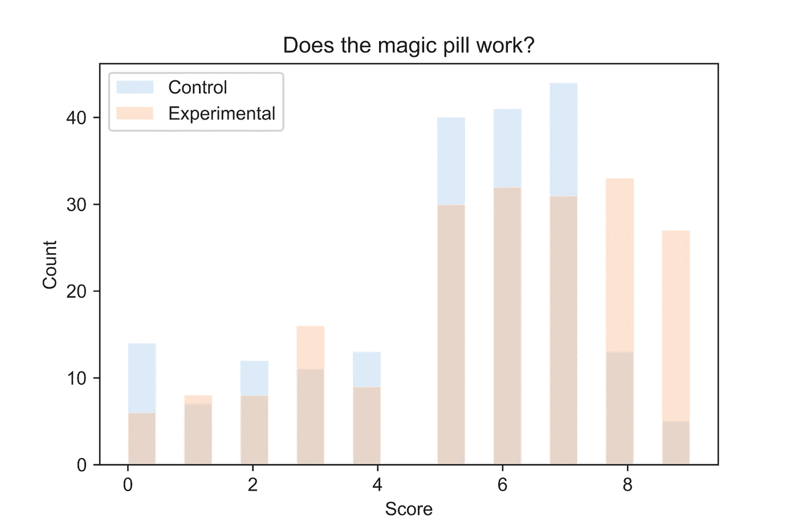
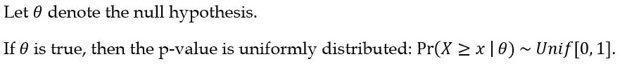
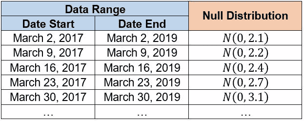
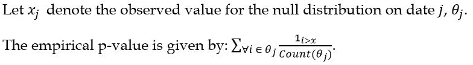
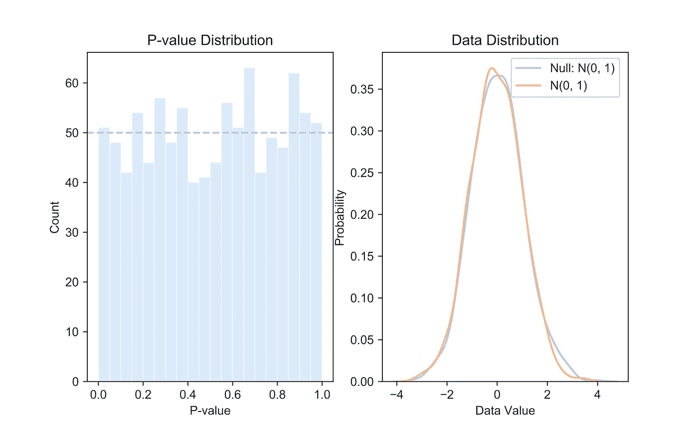
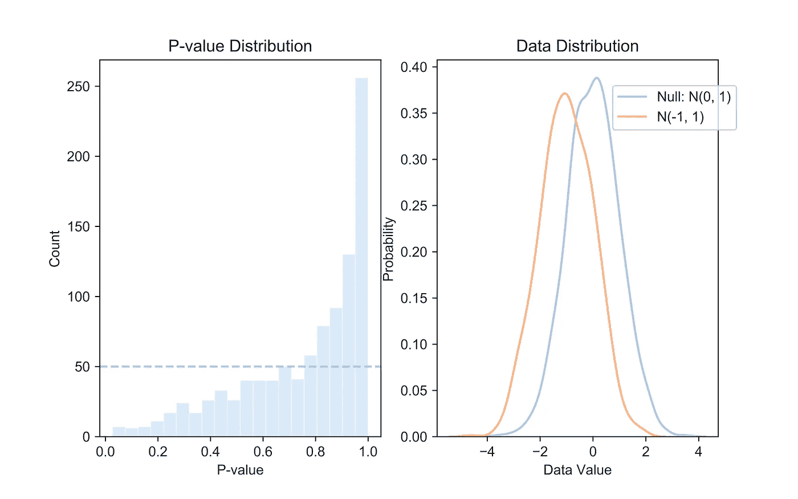
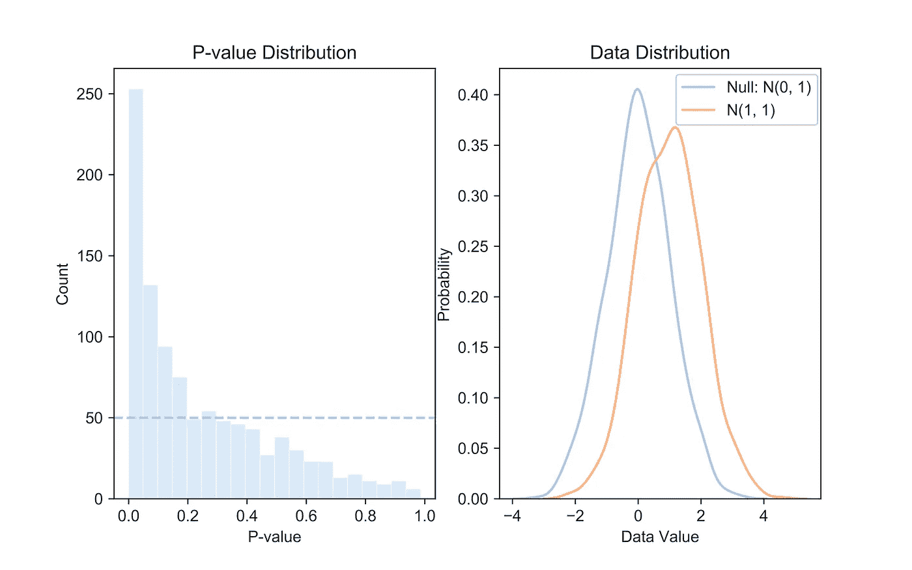
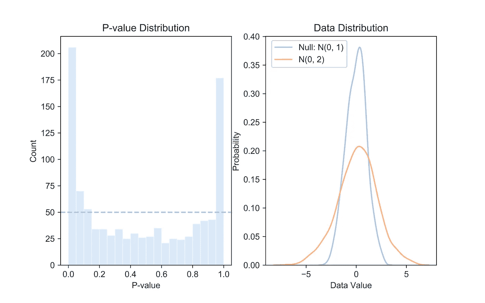
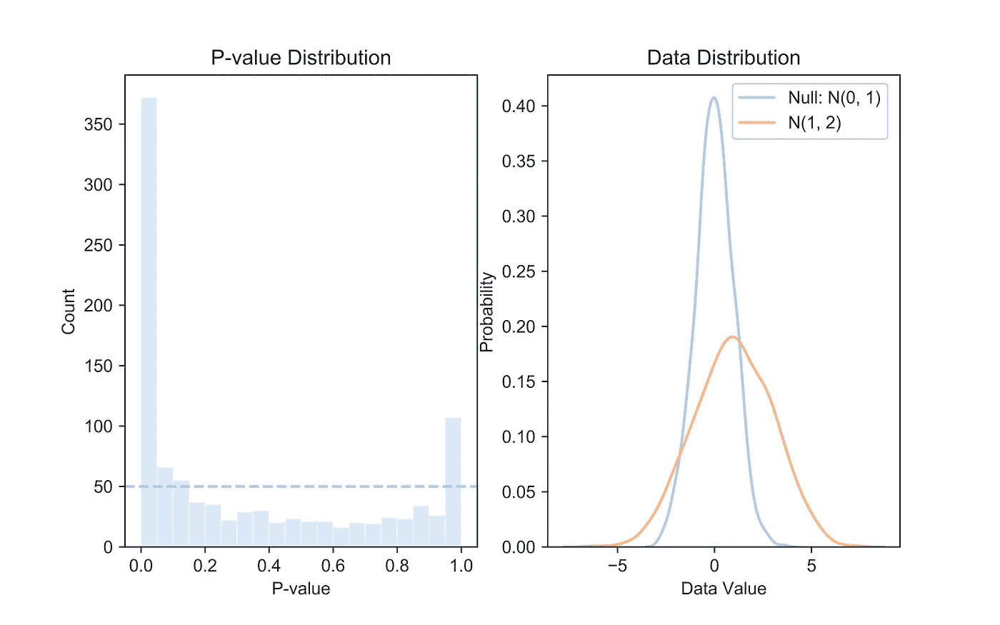

# 如何使用 P 值一致性检验来检验您的假设

> 原文：<https://towardsdatascience.com/how-to-test-your-hypothesis-using-p-value-uniformity-test-e3a43fc9d1b6?source=collection_archive---------16----------------------->

## [现实世界中的数据科学](https://towardsdatascience.com/data-science-in-the-real-world/home)

## *你知道如果零假设为真，p 值是均匀分布的吗？*

If you test 20 colours of jelly beans, how many null hypotheses do you expect to reject? ([Webcomic](https://imgs.xkcd.com/comics/significant.png) from [xkcd](https://xkcd.com/))

这篇文章是为那些熟悉假设检验和 p 值的定义和一些应用的人写的，希望加深对两者的理解。虽然这篇文章以一些评论开始，但鼓励读者在继续之前阅读[这篇文章](/p-values-explained-by-data-scientist-f40a746cfc8)。

## **什么是假设？**

我们每天都对新事物做出有根据的猜测。例如，我们可能会偶然发现一种新的神奇补充剂，声称可以提高注意力和工作效率。我们仔细阅读了公式，并坚信它会起作用。在这一点上，我们已经做出了一个假设，即补充剂会起作用，现在需要对其进行测试。

为了检验假设，我们首先需要收集经验数据。因此，我们对两组参与者进行了一项在线调查——一组每天服用补充剂，另一组不服用——报告他们的自我评估日常生产力水平，等级为 1 到 10。

## 我们如何测试它？

有各种各样的方法来检验假设，选择哪种方法实际上取决于个人的舒适程度。以下是一些常见的例子:

1.  根据对照组结果，计算几个实验组结果的 p 值。如果它们是极端的，我们可以相信避孕药是有效的。
2.  如上图所示，目视检查两个分布。
3.  对相等的平均值进行 2 次样本 t 检验，以比较平均结果。
4.  应用非参数双样本检验来比较两种分布(例如 Kolmogorov-Smirnov (KS)，Anderson-Darling (AD)检验)。
5.  进行 p 值均匀性测试。

在我们之前的例子中，我个人完全接受第二种选择，因为这是最快的选择，也容易解释。

然而，如果我们正在编写提交给美国和加拿大监管机构的白皮书，我们必须选择更严格的方法，如选项四或五。由于网上有更多关于 KS 和 AD 检验的信息，我将在本文中演示何时以及如何使用 p 值一致性检验。

Try to prove it and check your solution [right here](https://www.r-bloggers.com/a-simple-proof-that-the-p-value-distribution-is-uniform-when-the-null-hypothesis-is-true-2/).

## **什么是 p 值均匀性检验？**

本质上，p 值均匀性检验很简单:我们从观察值中获得一个 p 值样本，并测量它们与均匀分布的相似程度。通过进行这种检验，我们间接地检验了零假设的有效性，因为逆命题表示，如果 p 值不是均匀分布的，我们可以拒绝零假设。

## 为什么要用？

在众多优点中，这种方法提供的两个主要优点是:

1.  它需要大样本量，产生统计上更可靠的结果
2.  它可以适应动态零假设。

该方法不是拒绝基于小于 5%显著性水平的单个 p 值的零假设，而是将 p 值的经验概率分布与均匀分布进行比较。因此，这种方法需要更大的样本，自然产生相对可靠的结果。

更重要的是，在进行零假设是动态的实验时，这种方法很方便。这在非平稳数据中很常见，因为零假设可能会说预测值是基于最近两年的数据。换句话说，如果我们每周更新我们的数据，我们的零分布也会每周改变(见下图)。然而，我们的零假设，它定义了我们如何生成这些零分布，将保持不变。

Null distributions exhibit an increasing trend in estimated variance.

在这种情况下，我们只能将单个观测值与其对应的零分布进行比较。因此，我们不能有意义地比较一个样本的观察值与任何零分布。

## 我们如何测试它？

作为 p 值均匀性测试的第一步，我们可以根据各自的零分布将样本的观察值转换为经验 p 值，从而对样本进行归一化处理(见下面的公式)。

有了经验 p 值的衍生样本，我们可以继续找出它与从 0 到 1 的均匀分布有多相似。正式方法包括分布比较测试，如 KS 或 AD 测试，而快速直观方法通常足以理解结果。在本文的其余部分，我们将通过展示不同情况下的 p 值分布来结束。

## 我们如何解释 p 值分布的形状？

*例 1:均匀 P 值分布*

假设零假设说一个随机变量服从均值为 0，方差为 1 的正态分布。如上所述，如果样本遵循零分布，p 值分布将非常类似于均匀分布。

这是因为如果数据遵循零分布，则 5%的数据将高于第 95 百分位，5%的数据将介于第 90 和第 95 百分位之间。换句话说，5%的数据将给出从 0 到 0.05 的 p 值，另外 5%的数据将给出从 0.05 到 0.1 的 p 值，依此类推。

因此，当我们绘制直方图时，覆盖 5 个百分点的每个块将代表 5%的数据，包括均匀分布。

*例 2:增加或减少 P 值分布*

如果我们看到具有更高 p 值的 p 值分布，这表明我们的样本数据通常具有负的数据偏移。当样本分布出现负偏移时，与零分布相比，我们将拥有相对更多的低值样本数据。反过来，这些过剩的数据将被转化为过剩的高 p 值，显示出不断增加的 p 值分布。

相反，通过类似的推理，样本数据的正偏移将对应于 p 值分布的下降。

*示例 3:尾部递增的 P 值分布*

这种情况下，样本数据的方差高于零假设所表明的方差。方差高于预期的样本数据将具有相对更多的极值数据点，这些数据点将被转换为极值 p 值。

看完基本示例后，我建议您绘制样本数据的 p 值分布，该分布遵循均值为 1、方差为 2 的正态分布和标准正态零分布。这是一个很好的测试你对所涵盖的材料的理解的练习。解决方案在文章的结尾，所以如果你想试试，就在这里停下来。

我想做一个总结性的评论，p 值一致性检验是检验零假设的一个非常有效的方法，尤其是在与 KS 或 AD 检验结合使用时。学习可视化和解释 p 值分布特别方便，因为它有助于我们在投入更多时间之前预见实际数据与我们的假设有多接近。

好好利用它，下面是习题的解答！

*解决方案*

