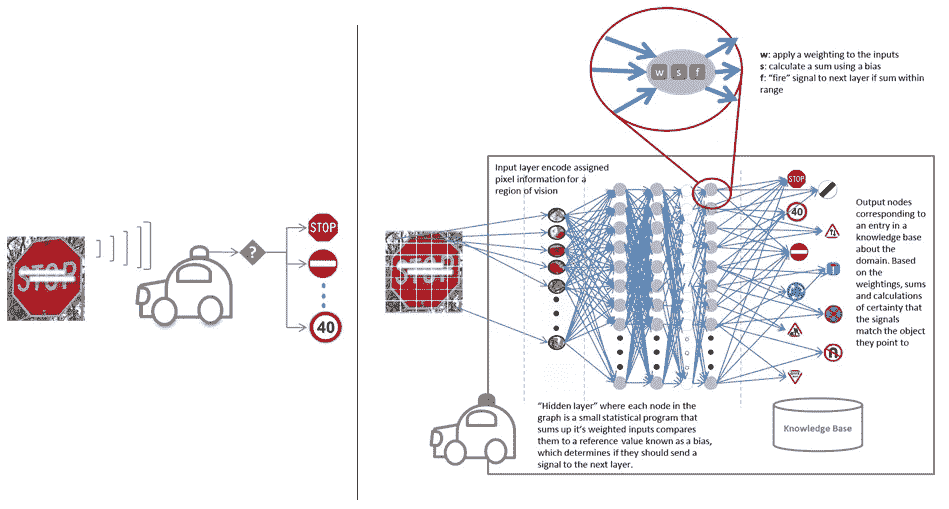

# 如何跟踪机器学习的准备情况，以及为什么我们都应该关心

> 原文：<https://towardsdatascience.com/how-to-track-machine-learning-readiness-and-why-we-should-all-care-8639ca7dd7b6?source=collection_archive---------21----------------------->

*这是一篇关于* [*BBC 技术和创意博客*](http://www.bbc.co.uk/blogs/internet/entries/d1cf4610-fd61-4f76-93eb-228fb18333fa)*——*[*机器学习就绪指数*](http://www.bbc.co.uk/blogs/internet/entries/d1cf4610-fd61-4f76-93eb-228fb18333fa) *的原始帖子的扩展版本。*

无论是数学家、数据分析专家、经验丰富的软件工程师，还是在家接受推荐观看新系列《路德、浴血黑帮》或《隔壁两扇门》的观众，我们都在人工智能和机器学习的发展中发挥着作用。我们都应该关注这些系统如何发展，以处理我们的个人信息，并推动影响我们和我们所爱的人的生活的决策。最近，我发现围绕“机器学习”和“机器洞察力”的对话比那些以人工智能(AI)为主题的对话更能引发关于技术进化的实际、诚实、进步的对话。后者往往会激发更具创造性、更浪漫的未来图景，在这种图景中，人类和机器变得交织在一起，几乎无法区分，因此我们需要围绕权利、正义、道德以及活着意味着什么发展新的思维。我也准备好了这些对话，但在这篇文章中，我有意提到机器学习，这样就很少提到拥有智能和其他人类特征的机器。在这里，我将机器和机器学习视为工具和方法，通过这些工具和方法，我们可以收集、处理和呈现关于我们过去、现在和预测未来的洞察力。他们处理大量数据，以生成可重复使用的统计洞察、特征、趋势和异常。即使数学和计算机科学可能显得势不可挡，我们在社会中仍然需要关注机器学习如何进步，教育我们自己和我们的孩子，并且不要远离正在进行的对话。数字媒体和信息融入了我们的日常生活，并影响着我们对世界、人民、政治、经济和身份的看法。机器学习与现在和未来媒体的委托、开发、交付和消费方式密切相关。

在过去 3-5 年中，机器学习能力激增，这是由算法的根本改进、计算机硬件的进步、数据量的增加以及用于学习、开发和将机器学习能力纳入产品的知识库、社区和工具的增加所驱动的。随着机器学习的进步，我们对可能性有了更好的看法，围绕道德、责任和社会公益的紧张和讨论也在升级。随着机器学习领域最近的许多突破，包括机器在内的灾难和致命事故，如最近在亚利桑那州发生的自动驾驶汽车事件(见:[https://www.bbc.co.uk/news/business-43459156](https://www.bbc.co.uk/news/business-43459156))，在部署机器学习时产生了一种谨慎的感觉，特别是在人类至关重要的环境中。理解这些事件的原因强化了机器学习在炒作中的现实:机器学习是大规模的计算，比较和选择最佳统计可能性，受限于过去数据的广泛性及其正确和全面编码当前感知的能力。

机器学习中的许多事件和事故都与当前被称为“对立例子”的难题有关。当物理环境中的微小变化严重危及机器学习系统决策的可靠性时，就会出现这种情况，而人类通常会忽略这些变化。例如，放置在停车标志上的一条白色胶带可能会改变机器学习系统的计算和区分路标的能力。日常场景、声音和物体的意外或有意改变，如涂鸦或不可避免的磨损会“扰乱”机器学习算法，导致不可靠的推理。这种对立的例子可以解释为什么会发生亚利桑那号这样的事故。然而，只有认识到机器学习对看似琐碎的日常调整的敏感性，才能更好地理解它的真正能力和局限性。

显然，自动驾驶汽车中的致命事故远比推荐系统在某人的媒体主页上呈现相关程序的失败更加关键和令人担忧。然而，我们应该记住，类似的概念和技术在幕后工作。假设一名记者依靠面部和物体识别来记录和验证故事中的事实，这些事实可能会影响人们和地方的声誉。如果这些类型的错误在没有审查和纠正的情况下频繁发生，对机器学习的依赖可能会导致报道不准确，并损害新闻的可信度。在某些情况下，审查和纠正的工作比一开始就做任务更乏味。机器学习能力，如计算机视觉、音频处理和自然语言理解，已经在产品就绪的媒体工作流中使用，都容易受到上述敌对例子的影响。此外，机器学习算法仍然消耗大量的计算和存储容量，并且难以在不牺牲质量和严格性的情况下进行优化。在一些应用中，机器学习是“生产就绪”的，而在另一些应用中，计算能力或算法能力不足。以有意义的、指示性的方式阐明“准备就绪”的方法将有助于导航机器学习能力的前景。

在 BBC 技术战略与架构(TS&A)中，我们一直在关注机器学习市场，并尝试不同的方法、工具、产品和服务，以更好地了解它们的能力、局限性以及当前的研发进展。这样做时，我们会问以下问题:

1.  我们应该在哪里投资研究？
2.  我们需要建立什么样的战略伙伴关系？
3.  我们应该在哪里考虑试验和试点？
4.  我们的下一个采纳计划应该是什么？
5.  我们还不知道什么还为时过早？

我们的大部分讨论和分析都围绕着自动化以及在传统的手动媒体工作流程中增强人类认知功能的可能性。认知功能包括感知、决策和执行任务，每一项都为自动化和人机交互带来不同的挑战。以下是目前由各种提供商作为产品和服务提供的 8 类机器学习能力。

根据我们的讨论，我们开发了"**机器学习就绪指数**，如下图所示。这是一个 0–7 等级的方案，其中每增加一个等级，指定一个特定应用的能力准备程度就提高一个等级。“机器学习就绪”被定义为机器学习能力在给定场景中取代人类认知功能的能力。机器学习就绪性更具体地是指使用一种或多种机器学习能力来解决生产工作流程中的选定问题的方法的适合性或适用性，这通常依赖于人的认知。

索引中的级别描述如下:

**0 级(早期):**此阶段的能力本质上是概念性的。有一些关于该功能如何工作的建议和想法，也有一些理论上的甚至是模拟的工作流，但是没有发表实际的、同行评审的证明或演示。应用和好处是通过原型和实物模型展示的命题和用户体验。

**第 1 级(初始):**这个阶段的能力是用工作模型开发的，证明一个概念至少是可实现的。然而，为了证明规模效益，仍然需要开发相关能力(不一定是机器学习，而是在其他领域，例如动画、可视化和数据处理)、计算能力(处理、存储和网络)和训练数据，以便在实际工作流程中进行评估。如果市场需求很小，或者所需的计算能力和训练数据远远超出当前实践中可获得的范围，则能力可能会长时间保持在这一阶段。

**第 2 级(渐进):**此阶段的能力证明它们可以在实践中发挥作用。基本的计算和算法挑战已经解决，但仍然没有足够的训练数据来实现对现实世界场景的更广泛应用以及调整模型和学习算法。下一个挑战是收集相关的培训数据，并确定优化其性能的策略。

**第 3 级(突破):**在这一阶段，对能力的限制(提供有用结果的最低条件)和调整参数(可控地影响能力的行为、性能和质量的数据、算法和计算的可调属性)有了更好的理解。该功能可能会作为“测试版”向公众发布，目的是增强训练集并进行大规模使用的早期实验。

**第 4 级(谨慎):**在此阶段，能力的性能是稳定的，但输出并不总是可靠的。这种能力可能容易受到偏离其训练的细微差别、文化或其他特定领域特性(如行话、方言、手势、图标、颜色联想)的影响。由于这个原因，在没有人的监督和纠正的情况下，这种能力是不可信的。它可能提供“第一次切割”的产品，但工作流程将包括强制性的质量控制过程。

**第 5 级(稳定):**在这一阶段，在某些情况下，在输入的已知、可控条件和属性下，该能力提供可预测的、正确的结果。因此，可以在生产工作流中为选定的域委托重定向、升级或异常处理，以便在超出域的边界条件时通知并雇佣人员。机器能力被认为在其受限领域表现得与人类一样好，成本更低，并且在更长的时间内更可靠(即人类会疲劳并犯错误)。人工监督是监控通知和警报，以便按需进行质量控制和干预。考虑一下呼叫中心使用的自动聊天机器人，如果投诉的语气或问题变得过于敏感，它会将对话重定向到主管。

**第 6 级(高级):**这一阶段的能力被认为比人类工作得更好，更便宜，相当于更高质量的输出，并且在选定的领域更长时间内更可靠。监督是最少的，并且关注于确保整个工作流和系统保持可用，而不是能力的质量。为了不断提高能力，可以回顾日志，但是这个阶段的改进是微不足道的。对于可能影响执行该功能的个人的生命或生计的高风险情况，机器能力将优于人类。然而，如果担心更多的人群受到失败事件的影响，仍然可以选择一个人或给予他监督的、压倒一切的控制权。

**第 7 级(复杂):**这一阶段的能力是完全自主的，被认为能够在大多数领域实现超出人类能力的质量、性能和可靠性水平。在高度关键或高风险的任务中，这些能力将比人类更受青睐，这些任务可能会影响组织的声誉或履行职能的个人以外的人口的生计和福祉。

然后，机器学习就绪指数可以进一步用作视觉地图，提供方向(我们当前所在的位置)、目的地选项(我们想去的地方)、可选路径(什么是可能的)和方向(要到达那里需要做什么)。当应用机器学习就绪指数时，有三个问题以及要收集的信息类型:

1.**当前准备程度:***当前*可能达到什么程度的准备程度？

2.**期望的准备程度:**根据受众和业务指标，我们希望在给定的时间范围内达到什么程度的准备程度*？*

3.**预计准备程度:**根据技术评估和市场指标，在给定的时间范围内*可能达到什么样的准备程度？*

回答这些问题可以加强我们的战略地位，向合作伙伴、提供商和公众传达和挑战我们的利益、不感兴趣、意图和优先事项。另一个目标是使用该框架作为背景，支持与非技术观众围绕机器学习现实、事实和虚构进行更高级别的讨论。围绕机器学习采用的许多担忧是不理性的，是基于耸人听闻，但正如前面提到的，最近的事件确实有理由担忧。

下面显示了一个基于一组假设用例的示例结果(该图仅用于说明目的，并不代表我们对所呈现场景的当前立场)。

这种地图可以应用于用例、产品、平台、组织或行业合作伙伴和联盟级别，有助于围绕战略的对话。例如，以下是可以从上述地图中获取的一些信息:

*使用语音到文本(STT)、自然语言理解(NLU)和文本到语音(TTS)的对话和反馈场景的当前准备程度为 5 级——稳定但预计准备程度为 6 级，相当于所需的准备程度。这表明需要建立伙伴关系，在下一个时间范围内开展试验和试点，以便过渡到准备就绪的高级阶段。*

*使用深度学习和分析(DLA)的推荐场景的当前准备程度为 6 级—高级，相当于期望的准备程度，并且没有计划的进一步改进。这表明商品和决策应该集中在选择合适的供应商上。*

机器学习就绪性的问题通常集中在组织上，而不是技术能力上。这个框架不是评估一个组织是否适合纳入机器学习能力，而是评估这些能力是否准备好为组织带来价值。就绪指数不是一门绝对的科学，它取决于集体的主观意见，基于对场景和机器学习能力的共同理解。特别是用这个框架做的预测只不过是不精确的印象和最好的猜测。

其目的并不是放弃使用真实数据和工作负载对解决方案进行严格的基准测试和比较，而是为了在某个时间点提供市场相关性的高水平画面。创建这样一个视图的另一种方法是为每一个功能类型建立一个自动化的测试管道，其中包含来自不同场景的测试数据，并报告所选择的测试度量。尽管这看起来更加量化和以指标为导向，但仍然需要解释这些数字，并判断所评估的能力是否适合测试中的场景。

随着算法、框架和计算能力的进步，机器学习能力不断发展。作为一家媒体机构，我们将继续关注这些发展，以便做出明智的判断，找出有意义、现实的方法来改善我们的工作方式和体验。作为消费者、观众和公民，我们都应该关心机器学习，确保我们了解并参与塑造我们未来的方式。