# 如何像量化分析师一样分析债券

> 原文：<https://towardsdatascience.com/how-to-trade-bonds-like-a-quant-da2c297958ef?source=collection_archive---------6----------------------->

## 我有 99 个问题，但我把它们减少到了 3 个。

## 放弃

一个成熟的定量分析师会使用大量其他工具来分析债券，尤其是公司债券(价值、价格、动量等)。).这只是一个普通观点的介绍。这并没有透露我的雇主的具体战略的重要信息。

# 介绍

今年夏天，我在一家固定收益投资基金实习，扮演数学家的角色。我被要求建立一个模型，分析不同国家的债券价格变动，虽然我不能透露我研究了哪些国家或结果，但我能做的是分享方法。

这绝不是对债券或股票进行定量分析的所有方法的全面指导，但它是观察价格变动最普遍的工具之一——主成分分析——的快速指南。

# 收益率曲线

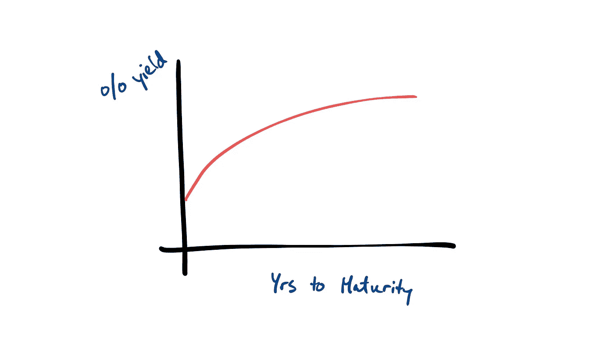

A cute little yield curve

你可能听说过收益率曲线。这是一个图表，显示了债券发行时间和你得到的利率之间的关系。你期望看到的是，远期债券会带来更高的回报，因为你应该得到补偿，把你的钱锁定更长的时间。然而，随着时间越来越往后推，这个斜率会越来越小，因为储存资金 25 年和 30 年真的有很大的区别吗？因此，曲线。

# 问题是

假设我们在看收益率曲线，我们看到了这个。

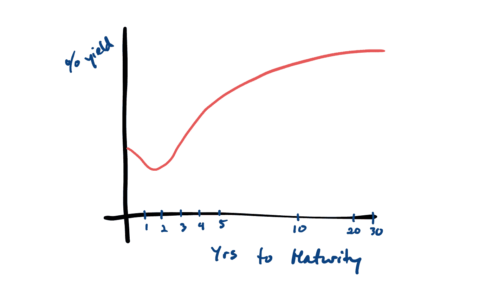

This one inverted, so I’m sure there will be a Planet Money episode on it soon.

哪里出了问题？坏了吗？不，你看到的是利率随着人们相互买卖债券而调整。如果许多人希望购买 2 年期国债，需求就会压低该债券的收益率。

收益率曲线的这些重大转变来自影响投资者风险承受能力和乐观情绪的宏观经济条件。然而，我们应该看到的是一条总体上平滑的收益率曲线。即使它弯曲了，也不应该有一个键从弯曲处伸出来。3 年期与 2 年期和 4 年期看起来完全不同，这没有多大意义。

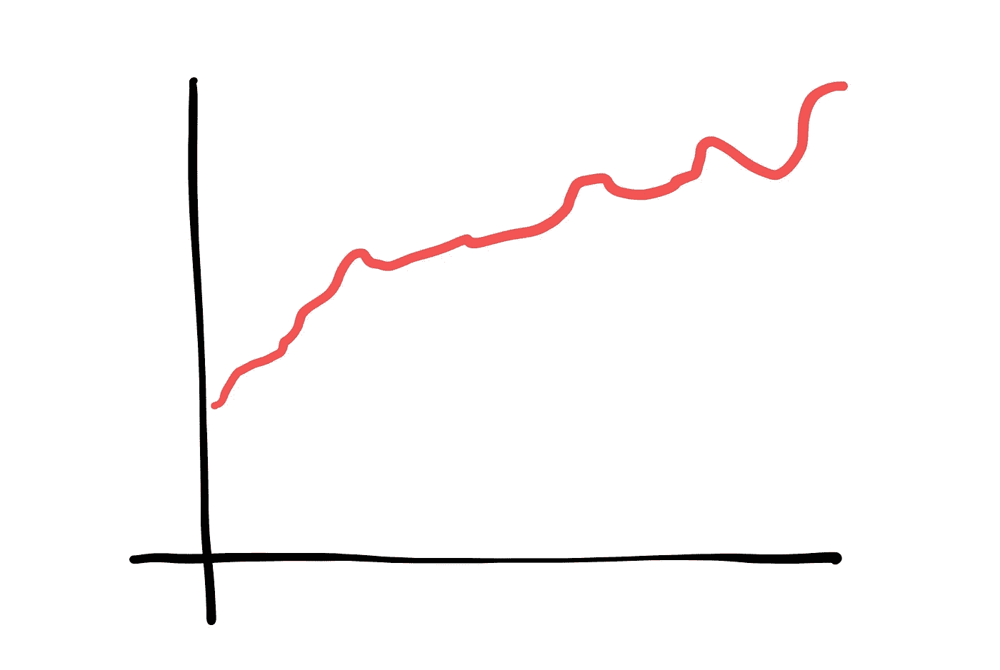

I would feel sick if I saw this on my Bloomberg Terminal.

那么，我们如何预测收益率曲线将如何变动？如果我们能买入一种债券，并在需求更大时卖出，我们就能获利。然而，宏观经济预测难以置信地困难，需要在你的投资组合中承担巨大的风险。

我们不用根据**外部**因素来预测收益率曲线将如何移动，相反，我们可以利用我们对其平滑度的了解，根据**内部**因素来预测它将如何移动。

# 主成分分析

主成分分析(或简称 PCA)从数学意义上来说是一种降维方法。这到底是什么意思？最好通过一个例子来说明。假设我们在三维空间中有一些点——x、y 和 z。

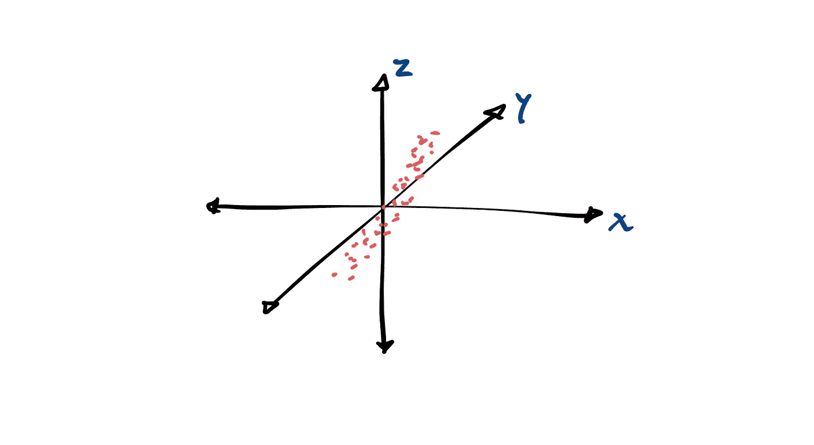

It’s hard to draw points in 3D.

注意这些点是如何形成对角线趋势的。不过，在三维空间工作很烦人。当然，三个轴的每一个都有变化，但是我们可以把它画在 2D 平面上。我们有办法做到吗？

PCA 来了。通过称为协方差矩阵的东西，您可以找到一组称为主成分的新轴，它们最有效地描述了数据中的方差，同时彼此之间没有相关性。您找到的第一个轴解释了最大的方差，第二个解释了次大的方差，第三个代表最小的方差。

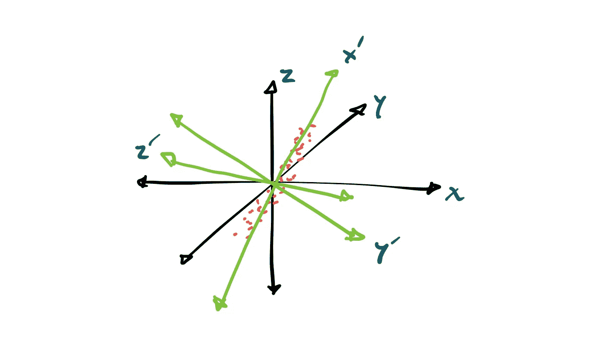

It’s even worse drawing six axes.

你现在找到了一种新的方式来描述你所有的信息。然而，如果最后一个轴解释了一个微不足道的变化量，您可以选择忽略它。

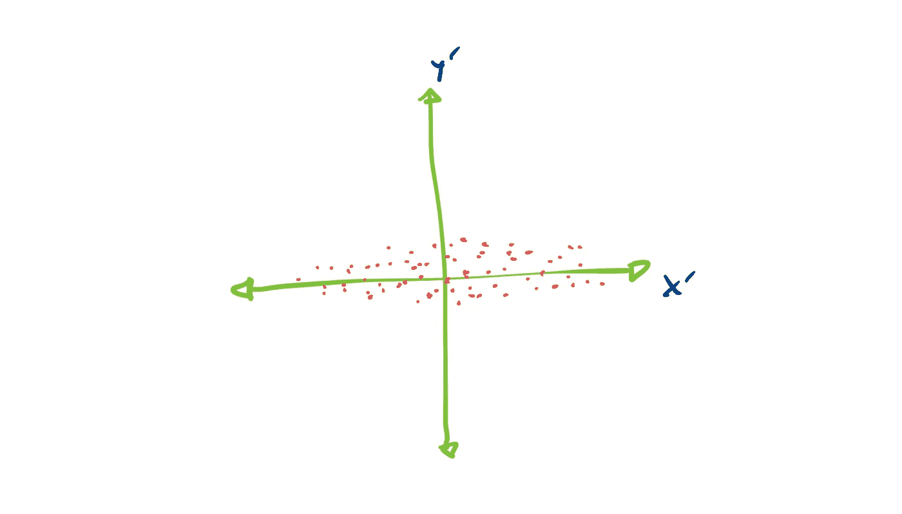

Ignore z’ and simplify into this one plane.

# 把它带回债券

我们可以采用历史债券收益率，并绘制它们来得到我们的点。每个债券日期都是一个维度，所以如果我们使用美国所有的国债，我们最终会得到超过 200 个维度的数据。那是胡说八道。

你可以使用主成分分析来找到一组新的坐标轴，正如一些研究发现的那样，解释债券价格所需的坐标轴之少令人震惊。第一个轴定义了 90%多一点的运动！接下来的两个解释了剩下的 98%。有时你会考虑第四种，但很少。除此之外，你应该忽略它们或者只是把它们加在一起。

我们所做的是接管一个 200 维的空间，并将其简化为一个三维空间，它保留了我们开始时 98%以上的信息。这太疯狂了。

这些轴甚至可以用来描述市场的特征。第一个轴表示沿收益率曲线的水平效应。第二个轴与曲线斜率的倾斜有关。第三个描述了弯曲的翅膀和腹部。这些都是系统性风险的形式。

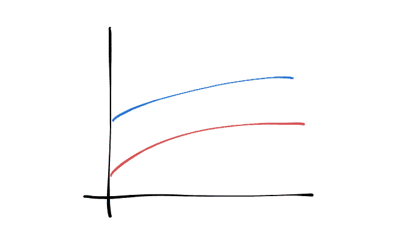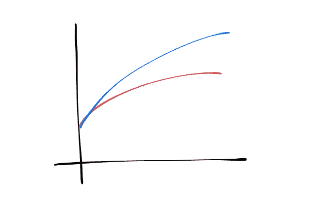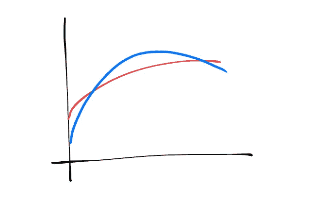

Left: 1st PC of level risk. Middle: 2nd PC of slope risk. Right: 3rd PC of curvature risk.

# 如何根据这些信息采取行动

您已经运行了您的 PCA 并准备好开始。你所做的不是找到收益率曲线整体的关系以及它的走向，而是找到每只债券的收益率如何相互关联。曲线是否弯得太多太快？收益率曲线是否比预期的更加崎岖不平？

我们早些时候指出，相邻的债券不应该相对于彼此定价过高，我们现在可以做的是在这组坐标轴上绘制**今天的**收益率，看看我们的债券收益率是否有任何异常。这种期望与现实的差异是残余的。我们可以打一个不错的赌，债券的定价可能会比 T4 低一点或高一点，最终会回到这个预期水平。不完全是均值回归，但也差不多。

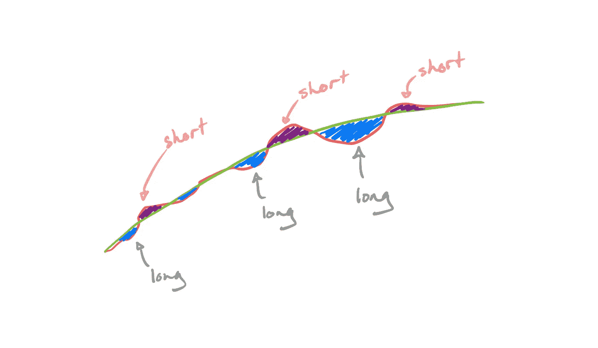

If there is a larger residual, you should feel more confident in the reversion.

要计算残差，您需要确保将所有结果除以主成分得分变化的标准偏差。基本上，有些轴比其他轴更不稳定；控制它。

# 花絮和建议

根据定义，你的 PCA 在你的回看窗口的轴上是零相关的，但是有可能在后半部分发展的关系被前面的点抵消了。确保对另一个小于 PCA 的回看进行轴之间的相关性测试，以便对您是否隔离了某个特征有一些合理的怀疑。

用 PCA 管理你的投资组合是一种短期的相对价值策略。你没有对收益率曲线的走向采取立场，只是试图在市场上涨或下跌的地方寻找机会。

不要在 Excel 中这样做。这个用 R。最好通篇使用 R。我尝试使用 BERT 来进行与 Excel 集成的 R 会话，但它导致了更多的问题，得不偿失。

# 后续步骤

你可以用这个策略做一些更复杂的事情，从风险策略的角度来看，这些事情非常酷。当我们找到每个主成分的得分，而不仅仅是用它来寻找剩余，我们可以用它来创建一个系统风险中性的投资组合。

如果我们能找到一组债券，它们在每个轴上的总风险相互抵消，我们就能把赌注隔离在**身上，只关注剩余价值，而不是担心宏观经济状况的恶化。两点总比一点好。三强。一旦你数到四，你会非常自信你受到了保护。**

还有一种形式的 PCA 称为 kPCA，即核主成分分析。我们没有使用基本的线性代数来降低维度，而是首先增加维度来寻找非线性关系，然后再降回更少的维度。我发现了一些适用于股票而非债券的有趣文章，所以一旦我再次在一家拥有历史债券数据的公司工作，我会尝试做一些自己的研究。TL；DR，市场效率越低，你的模型应该越不线性。

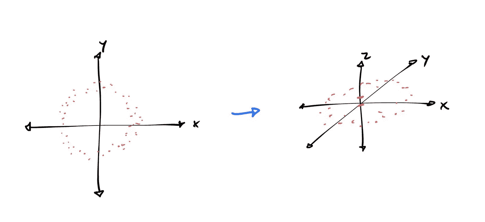

Try making a best fit line through a circle. Try. I dare you.

# 结论

诚然，这些策略不适合普通人使用，但我们无法进入这些债券市场，也无法利用它们，所以我希望你觉得自己学到了一些东西。这种将问题简化为最重要的事情的思维模式不仅在金融领域出现了很多，在数据科学和其他具有复杂特征的领域也出现了很多。我强烈推荐你阅读其他文章，听听播客，比如 AQR 的《好奇的投资者。他们有一些很好的内容，关于在其他地方应该如何考虑风险管理的心态。

***注来自《走向数据科学》的编辑:*** *虽然我们允许独立作者根据我们的* [*规则和指导方针*](/questions-96667b06af5) *发表文章，但我们不认可每个作者的贡献。你不应该在没有寻求专业建议的情况下依赖一个作者的作品。详见我们的* [*读者术语*](/readers-terms-b5d780a700a4) *。*