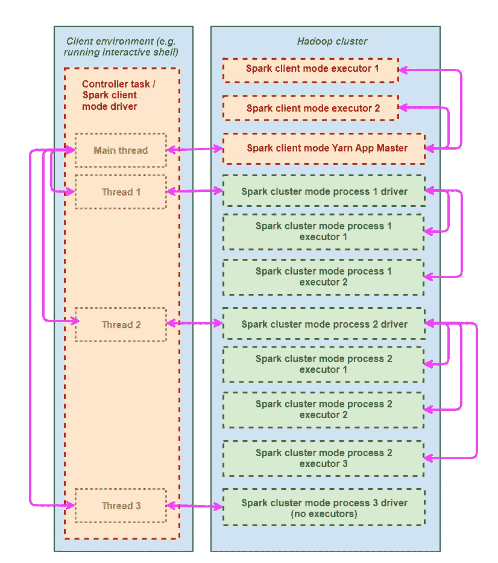

# 通过 YARN + Spark +多线程训练多个机器学习模型并并行运行数据任务

> 原文：<https://towardsdatascience.com/how-to-train-multiple-machine-learning-models-and-run-other-data-tasks-in-parallel-by-combining-2fa9670dd579?source=collection_archive---------14----------------------->

## 利用大规模计算资源，允许单个数据科学家并行执行数十或数百个大数据任务，扩展数据科学扩展和自动化的极限


*图片:Freepik.com*

# 摘要

本文的目的是展示单个数据科学家如何在不使用复杂部署框架的情况下同时启动数十或数百个数据科学相关任务(包括机器学习模型训练)。事实上，这些任务可以从一个“数据科学家”友好的界面启动，即一个可以从 Jupyter、Spyder 或 Cloudera Workbench 等交互式 shell 中运行的 Python 脚本。为了处理大量数据，任务本身可以并行化，这样我们就可以有效地增加第二层并行性。

# 这篇文章是写给谁的？

*   希望用更少的时间做更多的工作的数据科学家，通过利用大规模计算资源(例如集群或公共云)，可能通过 YARN 与其他用户共享。要理解这篇文章，你需要很好的 Python 知识，Spark 的工作知识，至少对 Hadoop YARN 架构和 shell 脚本有基本的了解；
*   支持数据科学家利用可用计算能力和操作大规模数据的机器学习工程师

# 介绍

## 数据科学和自动化

“数据科学”和“自动化”是两个总是联系在一起的词，因为机器学习的关键目标之一是让机器比人类更快、更低成本和/或更好地执行任务。

自然，对于一个组织来说，在应该开发和维护自动化工作系统的技术人员(数据科学家、数据工程师、DevOps 工程师、软件工程师和其他人)身上花费比在人工工作的人员身上花费更多是没有意义的。因此，不足为奇的是，一个反复出现的讨论是我们可以在多大程度上自动化数据科学团队本身的工作，例如通过[自动化机器学习](https://medium.com/microsoftazure/how-do-teams-work-together-on-an-automated-machine-learning-project-11bed3a7ad86)。

为了实现经济高效的数据科学自动化，必须能够利用公共云或私有云的计算能力；毕竟，与高技能技术人员的成本相比，硬件的成本相当低。虽然实现这一点的技术肯定是可用的，但许多组织最终都面临着“大数据软件工程师与数据科学家的难题”，或者更准确地说，两者之间的巨大差异

*   “大数据软件工程师技能”，即在复杂的计算环境中处理大量数据，并以可靠的方式运行这些流程以及其他并发流程所必需的技能
*   “数据科学家技能”，即，将算法和数学应用于数据以提取从商业角度有价值的见解所必需的技能


Harnessing computational power is key to automating data science work

*图片:Freepik.com*

一些组织会让“数据科学家”负责在某种“受控分析环境”中开发分析模型，在这种环境中，人们不需要过多考虑底层计算资源或与其他流程共享资源，而让“大数据软件工程师”负责对数据科学家开发的模型的“生产就绪”版本进行编码，并将它们部署到生产中。这种设置导致了明显的低效，例如:

1.  由于没有利用大规模数据和计算资源，数据科学家正在开发次优模型。在一些组织中，数据科学家甚至最终使用 Pandas/Scikit-Learn 等单节点框架，并将其模型完全基于通过采样或过度设计的功能获得的小数据集；
2.  开发的模型在分析环境中表现良好，但在生产环境中表现不佳或完全无法运行；
3.  评估业务价值的产生、识别和修复问题以及进行迭代改进的难度，因为一旦模型投入生产，数据科学家最终会严重失去对分析过程的监督。

不同的组织以不同的方式处理这种情况，要么迫使大数据软件工程师和数据科学家学习“其他角色”的技能，要么通过[创造一种“第三角色”，名为“机器学习工程师”，以弥合两种角色之间的差距](https://medium.com/@tomaszdudek/but-what-is-this-machine-learning-engineer-actually-doing-18464d5c699)。

但事实是，现在有更多的资源允许没有特殊软件工程技能的数据科学家在“现实”环境中工作，即在计算复杂性方面类似于生产。Spark MLLib、Kubeflow、Tensorflow-GPU、MMLSpark 等机器学习库允许数据准备和模型训练分布在多个 CPU、GPU 或两者的组合上；同时，Apache Hadoop YARN 和 Kubernetes 等框架允许数据科学家使用相同的计算资源同时工作，只需了解底层服务器基础架构的基本概念，如可用 CPU/GPU 的数量和可用内存。

本文的目的是提供一个示例，说明如何利用这些库和框架以及大量(但共享的)计算资源来自动化数据科学模型的创建和测试。

## 从单个大规模并行任务到大规模并行运行任务

像 Spark 和 Kubeflow 这样的框架可以轻松地在 GPU 和/或数百个 CPU 之间分发大数据任务，如特征处理或机器学习模型训练，而无需详细了解服务器架构。另一方面，并行执行任务，而不是单独的并行任务，并不是无缝的。当然，对于一个数据科学家来说，在 Jupyter 中同时处理两三个 PySpark 会话并不难，但是为了自动化，我们可能会对同时运行几十个甚至几百个任务感兴趣，所有任务都以编程的方式指定，并尽量减少人工干预。

自然，有人会问为什么要并行运行任务，而不是简单地增加每个任务的内核数量，并使每个任务在更短的时间内运行。有两个原因:

1.  处理速度通常与内核数量不成比例。例如，在训练机器学习模型的情况下，如果数据不够大，通过将内核数量从 10 个增加到 100 个，计算时间可能没有改善，有时计算时间甚至可能由于处理和通信开销而增加，以及无法利用一些机器学习库中可用的高效单处理器实现
2.  机器学习算法模型的准确性也可能由于并行化而降低，因为这些算法通常依赖次优试探法来以分布式方式运行，例如数据分割和投票

使用部署工具(如 Airflow)运行任意复杂、动态定义和高度自动化的数据分析管道(涉及并行任务)当然是可能的。然而，这些工具需要低级别的脚本和配置，不适合数据科学家每天进行的快速“试错”实验，他们通常习惯于在 Jupyter 或 Spyder 等交互式 shells 中快速尝试和反复尝试想法。此外，让我们回到之前提到的“大数据软件工程师与数据科学家”难题，组织可能更喜欢数据科学家将时间花在数据实验和产生商业价值上，而不是沉浸在低级别的实施或部署中。

## 你将从这篇文章中学到什么？

在本文中，我将展示我们如何利用 Apache Hadoop YARN，通过 Python 多线程，直接从任何 Python 代码(包括来自 Jupyter 等交互式 Python shells 的代码)同时启动和监控 Hadoop 集群中的多个作业(包括单独并行的 Spark 作业)。虽然该示例将包括并行训练多个机器学习模型，但我将提供一个通用框架，可用于启动任意数据任务，如特征工程和模型度量计算。

多模型并行训练的一些应用是:

*   **超参数调整:**对于相同的训练数据集，使用不同的模型类型(比如逻辑回归、梯度提升和多层感知器)以及不同的超参数配置同时进行训练，以便尽快找到最佳的模型类型/超参数集；
*   **多标签分类:**并行训练多个二元/多类分类模型，其中每个模型训练任务将使用不同的列作为标签列，这样得到的模型组合将有效地成为多标签分类器；
*   **特征缩减:**对于先前排序的特征的投票，训练多个模型，每个模型仅使用前 N 个排序的特征作为特征列，N 在训练任务中变化。

## 技术概述

在我们的框架中，我将调用主任务，即创建并行运行的附加任务的 Python 代码，作为**控制器任务**，而由控制器任务启动的任务作为**从属任务。** *(为了避免混淆，我故意避免使用“工人”这个表达，因为在 Spark 中，“工人”是 Spark 执行者的同义词)*

控制器任务负责:

*   定义应该同时运行多少个从属任务，以及在其中一个任务失败的情况下做什么；
*   创建从属任务，将输入传递给每个任务，并获取它们的输出(如果有的话)；
*   生成输入并处理从属任务的输出。

YARN 的一个有趣的方面是，它允许 Spark 同时用于控制器和从属任务。尽管两者都不是必需的，但只要我们有足够的计算资源，我们就可以处理任意大的数据集，而无需担心数据工程。即控制器任务可以在*客户端模式*下运行 Spark，从属任务可以在*集群模式*下运行 Spark:

*   在客户端模式下，Spark 驱动程序运行在控制器的 Python 代码正在运行的环境中(我们称之为**客户端环境** ) **，**允许使用本地安装的交互式外壳，如 Jupyter，而 Spark 执行器运行在 YARN 管理的 **Hadoop 集群**中，驱动程序和执行器之间的交互通过也运行在 Hadoop 集群中的名为 Application Master 的第三类进程进行；
*   在**集群模式**中，驱动程序和执行器都运行在 YARN 管理的 Hadoop 集群中。请注意，没有什么可以阻止我们让控制器任务也以集群模式运行，但是交互式 shells 不能以这种方式使用。

该框架如下图所示:



Illustration of the parallelisation framework

关于上面的例子，有两点需要注意:

*   虽然在示例中，控制器任务也是 Spark 进程的驱动程序(并因此通过 YARN 应用程序主机与 Hadoop 集群中的执行器相关联)，但这不是必需的，尽管这在例如我们想要在部署到从属任务之前对数据进行一些预处理时是有用的；
*   虽然从属任务不需要使用 Spark 并行化，但我们将使用`spark-submit`命令来启动它们，这样它们将始终有一个 Spark 驱动程序，尽管不一定是 Spark 执行器。这就是上面过程 3 的情况。

# 技术实现

## 作为 Spark 作业执行从属任务

在深入研究并行化之前，我将首先解释如何从用 Python 编写的控制器任务执行从属任务。如前所述，我们将使用 Apache Spark 安装中包含的`spark-submit` shell 脚本这样做，这样从属任务在技术上就是一个 Spark 作业，尽管它不一定有我之前提到的执行器或 Spark 代码。

原则上，我们可以通过简单地调用`os.system`函数从 Python 中使用`spark-submit`，这允许我们从 Python 中执行一个 shell 命令。在实践中，我们需要能够调试和监控任务；为此，最好使用优秀的`subprocess`图书馆。一个例子:

```
import json
import subprocessspark_config_cluster_path = "/home/edsonaoki/spark_config_cluster"
app_name = "some_model_training"
spark_config = {
    "spark.jars.packages" : 
        "com.microsoft.ml.spark:mmlspark_2.11:0.18.1",
    "spark.dynamicAllocation.enabled": "false",
    "spark.executor.instances": "10",
    "spark.yarn.dist.files": "/home/edsonaoki/custom_packages.tar"
}
command = "lightgbm_training.py "\
    "hdfs://user/edsonaoki/datasets/input_data.parquet "\
    "hdfs://user/edsonaoki/models"spark_submit_cmd = “SPARK_CONF_DIR=%s spark-submit -name %s %s %s"
    % (spark_config_cluster_path, app_name, 
    " ".join(['-conf %s="%s"' % (key, value) for key, value in   
    spark_config.items()]),
    command)
cmd_output = subprocess.Popen(spark_submit_cmd, shell=True,
    stdout=subprocess.PIPE, stderr=subprocess.STDOUT, 
    bufsize=1, universal_newlines=True)for line in cmd_output.stdout:
    print(line)
cmd_output.communicate()
```

在代码的开始，我设置了包含集群模式基本 Spark 配置的路径，该路径稍后用于更改`SPARK_CONF_DIR` 环境变量。如果控制器任务被配置为在客户机模式下的 Spark 中运行，这实际上是一个至关重要的步骤，因为集群模式的 Spark 配置通常不同于客户机模式。

如果你不太了解如何在集群模式下配置 Spark，可以从复制现有的`SPARK_CONF_DIR`开始。在`spark-defaults.conf`文件中，我们需要

```
spark.submit.deployMode=cluster
```

代替

```
spark.submit.deployMode=client
```

某些配置选项，如`spark.yarn.rmProxy.enabled`和`spark.driver.options.*`选项需要禁用，因为在集群模式下运行 Spark 时，驱动程序没有特定于网络的配置。如有疑问，检查纱线文件上的[火花。当然，如果控制器任务也在集群模式下运行 Spark，就不需要有单独的配置。](https://spark.apache.org/docs/latest/running-on-yarn.html)

现在，看看后续步骤:

```
app_name = "some_model_training"
spark_config = {
    "spark.jars.packages" : 
        "com.microsoft.ml.spark:mmlspark_2.11:0.18.1",
    "spark.dynamicAllocation.enabled": "false",
    "spark.executor.instances": "10",
    "spark.yarn.dist.files": "/home/edsonaoki/custom_packages.tar"
}
command = "lightgbm_training.py "\
    "hdfs://user/edsonaoki/datasets/input_data.parquet"\
    "hdfs://user/edsonaoki/models"
spark_submit_cmd = “SPARK_CONF_DIR=%s spark-submit -name %s %s %s"
    % (spark_config_cluster_path, app_name, 
    " ".join(['-conf %s="%s"' % (key, value) for key, value in   
    spark_config.items()]),
    command)
```

在这里，我设置了应用程序名、额外的 Spark 配置选项和由`spark-submit`脚本执行的命令。这些很容易理解，但是应用程序名称在我们的例子中特别重要——我们稍后会明白为什么。我们还通过`spark.yarn.dist.files`配置参数提交一个定制的 Python 包，正如我将在后面展示的，这非常方便，因为从属任务在 Hadoop 集群中运行，因此无法访问本地(客户端)环境中可用的 Python 函数。

还要注意，我指定了两个 HDFS 路径作为`lightgbm_training.py` Python 脚本(从属任务的代码)的参数，原因与上面类似:由于 Python 脚本将在 Hadoop 集群中运行，它将无法访问客户端环境的文件系统中的任何文件，因此要在控制器或从属任务之间交换的任何文件必须通过`spark.yarn.dist.files`显式提交，或者放入共享文件系统，如 HDFS 或 AWS S3。

准备好 spark-submit shell 命令行后，我们准备使用`subprocess.Popen`命令来执行它:

```
cmd_output = subprocess.Popen(spark_submit_cmd, shell=True,
    stdout=subprocess.PIPE, stderr=subprocess.STDOUT, 
    bufsize=1, universal_newlines=True)
```

我们设置`shell=True`让 Python 启动一个单独的 shell 进程来执行命令，而不是试图直接从 Python 进程启动`spark-submit`。虽然在使用子进程库时设置`shell=False`通常更好，但是这样做限制了命令行格式，在我们的情况下不可行。

`stdout`、`stderr`、`bufsize`和`universal_newlines`参数用于处理 shell 命令在执行期间发出的输出(STDOUT)和错误消息(STDERR)。当我们并行执行多个从属任务时，我们可能希望忽略所有的执行时间消息，因为它们会非常混乱，而且无论如何都无法解释。这对于节省内存也很有用，原因我们将在后面解释。但是，在尝试并行运行多个任务之前，最好首先确保每个单独的任务都能正常工作，方法是运行一个启用了输出/错误消息的从属任务。

在这个例子中，我设置了`stdout=subprocess.PIPE`、`stderr=subprocess.STDOUT`、`bufsize=1`和`universal_newlines=True`，它们基本上将所有 shell 命令输出指向一个名为`subprocess.PIPE`的先进先出(FIFO)队列。

请注意，在集群模式下运行 Spark 作业时，`subprocess.PIPE`只能访问来自 YARN 应用主机的消息，而不能访问驱动程序或执行器。要检查驱动程序和执行器消息，您可以通过浏览器查看 Hadoop 集群 UI，或者在执行后检索驱动程序和执行器日志，我将在后面介绍。此外，如果在`log4j.properties`文件(位于 Spark 配置中)中启用了文件记录，来自应用程序主机的消息将被记录到一个文件中，而不是直接发送到`subprocess.PIPE`，因此如果需要，请禁用文件记录。

最后，为了在 Python 脚本的输出中显示输出/错误消息，我继续上面的代码，如下所示:

```
for line in cmd_output.stdout:
    print(line)
cmd_output.communicate()
```

`cmd_output.communicate()`的目的是在`subprocess.PIPE`为空后等待流程结束，即不再有从属任务的输出写入其中。强烈建议在调用上述`cmd_output.communicate()`方法之前读取整个队列，以防止队列大小增加和浪费内存。

## 在不使用调试消息的情况下监控从属任务

正如我前面提到的，当我们并行运行任务时，我们不希望显示调试消息；此外，如果大量任务同时向内存中的 FIFO 队列发送消息，内存使用率将会增加，因为从队列中读取消息的速度赶不上消息生成的速度。从调用`spark-submit`开始，上一节中没有调试的代码版本如下:

```
cmd_output = subprocess.Popen(spark_submit_cmd, shell=True,
    stdout=subprocess.DEVNULL, stderr=subprocess.DEVNULL)def getYARNApplicationID(app_name):
    state = 'RUNNING,ACCEPTED,FINISHED,KILLED,FAILED'
    out = subprocess.check_output(["yarn","application","-list",
        "-appStates",state], stderr=subprocess.DEVNULL, 
        universal_newlines=True)
    lines = [x for x in out.split("\n")]
    application_id = ''
    for line in lines:
        if app_name in line:
            application_id = line.split('\t')[0]
            break
    return application_idmax_wait_time_job_start_s = 120
start_time = time.time()
while yarn_application_id == '' and time.time()-start_time\
        < max_wait_time_job_start_s:
    yarn_application_id = getYARNApplicationID(app_name)cmd_output.wait()if yarn_application_id == '':
    raise RuntimeError("Couldn't get yarn application ID for application %s" % app_name)
```

代码像以前一样通过启动从属任务开始，但是禁用了调试:

```
cmd_output = subprocess.Popen(spark_submit_cmd, shell=True,
    stdout=subprocess.DEVNULL, stderr=subprocess.DEVNULL)
```

由于在进程运行时没有调试消息显示，我们使用`cmd_output.wait`而不是`cmd_output.communicate()`来等待任务完成。注意，虽然我们看不到应用程序主的消息，但我们仍然可以通过 Hadoop 集群 UI 在运行时调试 Spark 作业的驱动程序和执行器。

然而，我们仍然需要能够从编程的角度监控任务；更具体地说，控制器任务需要知道从属任务何时完成，是否成功，并在失败时采取适当的行动。为此，我们可以使用我们在开始时设置的应用程序名称:

```
app_name = "some_model_training"
```

YARN 可以使用应用程序名来检索 YARN 应用程序 ID，这允许我们检索从属任务的状态和其他信息。同样，我们可以借助子进程库来定义一个函数，该函数可以从应用程序名称中检索应用程序 ID:

```
def getYARNApplicationID(app_name):
    state = 'RUNNING,ACCEPTED,FINISHED,KILLED,FAILED'
    out = subprocess.check_output(["yarn","application","-list",
        "-appStates",state], stderr=subprocess.DEVNULL, 
        universal_newlines=True)
    lines = [x for x in out.split("\n")]
    application_id = ''
    for line in lines:
        if app_name in line:
            application_id = line.split('\t')[0]
            break
    return application_id
```

注意到`getYARNApplicationID`解析了`yarn application -list` shell 命令的输出。根据您的 Hadoop 版本，输出格式可能略有不同，解析需要相应调整。如果有疑问，可以在终端中运行以下命令来测试格式:

```
$ yarn application -list -appStates RUNNING,ACCEPTED,FINISHED,KILLED,FAILED
```

棘手的是，只有当应用程序名称在 Hadoop 集群中是唯一的时，这种方法才有效。因此，您需要确保您正在创建一个唯一的应用程序名称，例如通过包含时间戳、随机字符串、您的用户 ID 等。可选地，当试图解析`yarn application -list`的输出时，您也可以添加其他过滤器，例如，用户 ID、纱线队列名称或一天中的时间。

由于 Spark 作业在使用`spark-submit`启动后需要一些时间在 YARN 中注册，所以我实现了这个循环:

```
max_wait_time_job_start_s = 120
start_time = time.time()
while yarn_application_id == '' and time.time()-start_time\
        < max_wait_time_job_start_s:
    yarn_application_id = getYARNApplicationID(app_name)
```

其中`max_wait_time_job_start_s`是等待注册的时间，以秒为单位，可能需要根据您的环境进行调整。

的意思

```
if yarn_application_id == '':
    raise RuntimeError("Couldn't get yarn application ID for"\
        " application %s" % app_name)
```

是直白的；如果没有应用程序 ID，这意味着 Spark 作业没有成功启动，我们需要抛出一个异常。这也可能表明我们需要增加`max_wait_time_job_start_s`，或者改变在`getYARNApplicationID`内部解析`yarn application -list`输出的方式。

## 检查从属任务的最终状态

从属任务完成后，可以按如下方式检查其最终状态:

```
def getSparkJobFinalStatus(application_id):
    out = subprocess.check_output(["yarn","application",
        "-status",application_id], stderr=subprocess.DEVNULL, 
        universal_newlines=True)
    status_lines = out.split("\n")
    state = ''
    for line in status_lines:
        if len(line) > 15 and line[1:15] == "Final-State : ":
            state = line[15:]
            break
    return statefinal_status = getSparkJobFinalStatus(yarn_application_id)
```

同样，您可能需要根据您的 Hadoop 版本来调整对`yarn application -status`的解析。如何处理最终状态完全取决于您，但一种可能是将 Spark 作业的驱动程序和执行程序日志存储在一个文件中，并引发一个异常。例如:

```
log_path = "/home/edsonaoki/logs/%s_%s.log" % (app_name, 
    yarn_application_id)if final_status != "SUCCEEDED":
    cmd_output = subprocess.Popen(["yarn","logs", 
        "-applicationId",yarn_application_id],
         stdout=subprocess.PIPE, stderr=subprocess.STDOUT,
         bufsize=1, universal_lines=True)
    with open(log_path, "w") as f:
        for line in cmd_output.stdout:
            f.write(line)
    print("Written log of failed task to %s" % log_path)
    cmd_output.communicate()
    raise RuntimeError("Task %s has not succeeded" % app_name)
```

## 使用多线程并行执行从属任务

如果不明显，在尝试并行执行从属任务之前，确保在没有并行化的情况下测试尽可能多的任务，因为调试并行任务会非常困难。

为了执行并行化，我们将使用 Python 的`concurrent`库。[并发库使用多线程而非多处理](https://docs.python.org/3/library/concurrent.html)；即线程在同一处理器中运行，从而从控制器任务的角度来看，不存在真正的并行处理。然而，由于控制器任务中启动的线程在等待从属任务完成时处于 I/O 模式(未阻塞),因此多个从属任务可以异步启动，这样它们将实际上在 Hadoop 集群中并行运行。虽然我们在技术上可以使用`multiprocessing`库而不是并发库来实现控制器任务端的并行性，但我建议不要这样做，因为这将大大增加客户端环境中的内存消耗，几乎没有任何好处——其想法是“艰难的处理”在 Hadoop 集群中完成。

当我们启动一个 Spark 作业时，我们通常会意识到集群环境中的处理和内存约束，尤其是在共享环境的情况下，并使用配置参数(如`spark.executor.memory`和`spark.executor.instances`)来控制任务的处理和内存消耗。我们的情况也需要这样做；我们需要根据集群中计算资源的可用性来限制同时执行的从属任务的数量，这样当我们达到这个限制时，一个从属任务只能在另一个任务完成后开始。

并发包提供了`futures.ThreadPoolExecutor`类，它允许我们启动多个线程并等待它们完成。该类还允许我们通过`max_workers`参数来限制正在进行活动处理(即没有被 I/O 阻塞)的线程数量。然而，正如我之前提到的，当从属任务运行时，控制器任务中的一个线程被视为被 I/O 阻塞，这意味着`max_workers`不会有效地限制线程的数量。因此，所有从属任务将几乎同时提交，Hadoop 集群可能会过载。

这可以通过如下修改`futures.ThreadPoolExecutor`类很容易地解决:

```
import concurrent.futures
from queue import Queueclass ThreadPoolExecutorWithQueueSizeLimit(
    concurrent.futures.ThreadPoolExecutor): def __init__(self, maxsize, *args, **kwargs):
        super(ThreadPoolExecutorWithQueueSizeLimit, 
            self).__init__(*args, **kwargs)
        self._work_queue = Queue(maxsize=maxsize)
```

这个新类`ThreadPoolExecutorWithQueueSizeLimit`的工作方式与`futures.ThreadPoolExecutor`完全一样，但它不允许在任何时间点存在超过`maxsize`个线程，这有效地限制了 Hadoop 集群中同时运行的从属任务的数量。

我们现在需要定义一个函数，包含线程的执行代码，它可以作为参数传递给类`ThreadPoolExecutorWithQueueSizeLimit`。基于前面在不调试消息的情况下从 Python 执行从属任务的代码，我给出了下面的通用线程执行函数:

```
def executeThread(app_name, spark_submit_cmd, error_log_dir, 
        max_wait_time_job_start_s=120):
    cmd_output = subprocess.Popen(spark_submit_cmd, shell=True,
        stdout=subprocess.DEVNULL, stderr=subprocess.DEVNULL)
    start_time = time.time()
    while yarn_application_id == '' and time.time()-start_time\
        < max_wait_time_job_start_s:
        yarn_application_id = getYARNApplicationID(app_name)
    cmd_output.wait()
    if yarn_application_id == '':
        raise RuntimeError("Couldn't get yarn application ID for"\ 
            "application %s" % app_name)
    final_status = getSparkJobFinalStatus(yarn_application_id)
    log_path = %s/%s_%s.log" % (error_log_dir, app_name, 
        yarn_application_id)
    if final_status != "SUCCEEDED":
        cmd_output = subprocess.Popen(["yarn","logs", 
            "-applicationId",yarn_application_id],
             stdout=subprocess.PIPE, stderr=subprocess.STDOUT,
             bufsize=1, universal_lines=True)
        with open(log_path, "w") as f:
            for line in cmd_output.stdout:
                f.write(line)
        print("Written log of failed task to %s" % log_path)
        cmd_output.communicate()
        raise RuntimeError("Task %s has not succeeded" % app_name)
    return True
```

如您所见，该函数使用了之前定义的函数`getYARNApplicationID`和`getSparkJobFinalStatus`，应用程序名称、`spark-submit`命令行和存储错误日志的目录作为参数传递给该函数。

请注意，如果找不到纱线应用程序 ID，或者 Spark 作业的状态不成功，该函数会引发一个异常。但是根据具体情况，我们可能只是希望函数返回一个假值，这样控制器任务就知道这个特定的从属任务没有成功，需要再次执行，而不需要再次运行已经成功的任务。在这种情况下，我们只需要替换线

```
raise RuntimeError("Couldn't get yarn application ID for application %s" % app_name)
```

和

```
raise RuntimeError("Task %s has not succeeded" % app_name)
```

随着

```
return False
```

下一步是创建一个通用代码来启动线程并等待它们完成，如下所示:

```
def executeAllThreads(dict_spark_submit_cmds, error_log_dir, 
        dict_success_app=None):
    if dict_success_app is None:
        dict_success_app = {app_name: False for app_name in 
            dict_spark_submit_cmds.keys()}
    with ThreadPoolExecutorWithQueueSizeLimit(maxsize=max_parallel, 
            max_workers=max_parallel) as executor:
        future_to_app_name = {
           executor.submit(
               executeThread, app_name, 
               spark_submit_cmd, error_log_dir,
           ): app_name for app_name, spark_submit_cmd in                 
              dict_spark_submit_cmds.items() if 
              dict_success_app[app_name] == False
        }
        for future in concurrent.futures\
                .as_completed(future_to_app_name):
            app_name = future_to_app_name[future]
            try:
                dict_success_app[app_name] = future.result()
            except Exception as exc:
                print('Subordinate task %s generated exception %s' %
                    (app_name, exc))
                raise
    return dict_success_app
```

该函数的强制参数是:

*   以应用程序名作为关键字，以相应的作业提交命令行作为值的字典；
*   存储错误日志的目录。

该函数的输出也是一个字典，包含每个从属任务的返回值(真或假)，按应用程序名称进行索引。可选参数是`dict_success_app`，如果我们只想运行尚未成功的从属任务，它可以是函数先前执行的返回值。稍后我将展示如何实现这一点。

为了方便读者，我将并行化框架的完整代码汇总如下:

```
import subprocess
import concurrent.futures
from queue import Queueclass ThreadPoolExecutorWithQueueSizeLimit(
    concurrent.futures.ThreadPoolExecutor): def __init__(self, maxsize, *args, **kwargs):
        super(ThreadPoolExecutorWithQueueSizeLimit, 
            self).__init__(*args, **kwargs)
        self._work_queue = Queue(maxsize=maxsize)def getYARNApplicationID(app_name):
    state = 'RUNNING,ACCEPTED,FINISHED,KILLED,FAILED'
    out = subprocess.check_output(["yarn","application","-list",
        "-appStates",state], stderr=subprocess.DEVNULL, 
        universal_newlines=True)
    lines = [x for x in out.split("\n")]
    application_id = ''
    for line in lines:
        if app_name in line:
            application_id = line.split('\t')[0]
            break
    return application_iddef getSparkJobFinalStatus(application_id):
    out = subprocess.check_output(["yarn","application",
        "-status",application_id], stderr=subprocess.DEVNULL, 
        universal_newlines=True)
    status_lines = out.split("\n")
    state = ''
    for line in status_lines:
        if len(line) > 15 and line[1:15] == "Final-State : ":
            state = line[15:]
            break
    return statedef executeThread(app_name, spark_submit_cmd, error_log_dir,
        max_wait_time_job_start_s = 120):
    cmd_output = subprocess.Popen(spark_submit_cmd, shell=True,
        stdout=subprocess.DEVNULL, stderr=subprocess.DEVNULL)
    start_time = time.time()
    while yarn_application_id == '' and time.time()-start_time\
            < max_wait_time_job_start_s:
        yarn_application_id = getYARNApplicationID(app_name)
    cmd_output.wait()
    if yarn_application_id == '':
        raise RuntimeError("Couldn't get yarn application ID for"\
            " application %s" % (app_name))
        # Replace line above by the following if you do not
        # want a failed task to stop the entire process:
        # return False
    final_status = getSparkJobFinalStatus(yarn_application_id)
    log_path = %s/%s_%s.log" % (error_log_dir, app_name, 
        yarn_application_id)
    if final_status != "SUCCEEDED":
        cmd_output = subprocess.Popen(["yarn","logs", 
            "-applicationId",yarn_application_id],
             stdout=subprocess.PIPE, stderr=subprocess.STDOUT,
             bufsize=1, universal_lines=True)
        with open(log_path, "w") as f:
            for line in cmd_output.stdout:
                f.write(line)
        print("Written log of failed task to %s" % log_path)
        cmd_output.communicate()
        raise RuntimeError("Task %s has not succeeded" % app_name)
        # Replace line above by the following if you do not
        # want a failed task to stop the entire process:
        # return False
    return Truedef executeAllThreads(dict_spark_submit_cmds, error_log_dir, 
        dict_success_app=None):
    if dict_success_app is None:
        dict_success_app = {app_name: False for app_name in 
            dict_spark_submit_cmds.keys()}
    with ThreadPoolExecutorWithQueueSizeLimit(maxsize=max_parallel, 
            max_workers=max_parallel) as executor:
        future_to_app_name = {
           executor.submit(
               executeThread, app_name, 
               spark_submit_cmd, error_log_dir,
           ): app_name for app_name, spark_submit_cmd in                 
              dict_spark_submit_cmds.items() if 
              dict_success_app[app_name] == False
        }
        for future in concurrent.futures\
                .as_completed(future_to_app_name):
            app_name = future_to_app_name[future]
            try:
                dict_success_app[app_name] = future.result()
            except Exception as exc:
                print('Subordinate task %s generated exception %s' %
                    (app_name, exc))
                raise
    return dict_success_app
```

# 示例:使用梯度增强二元分类器的具有 2 级并行化的多标签模型训练

在这个例子中，我将展示如何使用上述框架来并行训练具有数百个标签的多标签分类器。基本上，我们将并行训练多个二元分类器，其中每个二元模型的训练本身通过 Spark 并行化。各个二元分类器是使用流行的 LightGBM 包的 Spark 版本训练的梯度提升模型，包含在[Microsoft Machine Learning for Spark](https://github.com/Azure/mmlspark)(MMLSpark)库中。

## 设置控制器任务

通过使用上面的框架，控制器任务只需要做另外两件事情:

1.  在调用`executeAllThreads`函数之前，为每个下级任务设置应用名称和 spark-submit 命令；
2.  从`executeAllThreads`函数返回后，检查哪些从属任务已经成功，并适当地处理它们的输出。

对于第一部分，我们可以从前面的例子开始，在这个例子中，我们提交了一个独立的从属作业:

```
spark_config_cluster_path = "/home/edsonaoki/spark_config_cluster"
app_name = "some_model_training"
spark_config = {
    "spark.jars.packages" : 
        "com.microsoft.ml.spark:mmlspark_2.11:0.18.1",
    "spark.dynamicAllocation.enabled": "false",
    "spark.executor.instances": "10",
    "spark.yarn.dist.files": "/home/edsonaoki/custom_packages.tar"
}command = "lightgbm_training.py "\
    "hdfs://user/edsonaoki/datasets/input_data.parquet"\
    "hdfs://user/edsonaoki/models"spark_submit_cmd = "SPARK_CONF_DIR=%s spark-submit -name %s %s %s"
    % (spark_config_cluster_path, app_name, 
    " ".join(['-conf %s="%s"' % (key, value) for key, value in   
    spark_config.items()]),
    command)
```

我们需要什么来调整多标签分类的代码？首先，由于已经提到的原因，应用程序名称需要完全唯一。假设数据集`input_data.parquet`的标签列包含在变量`lst_labels`中，确保每个从属任务的唯一应用程序 id 的一种方法如下:

```
import time
curr_timestamp = int(time.time()*1000)
app_names = ["model_training_%s_%d" % (label,curr_timestamp) for 
             label in lst_labels]
```

这确保了应用程序名称是唯一的，只要控制器任务不会在同一毫秒内启动多次(当然，如果我们有一个共享的 YARN 集群，可能需要其他的修改来使应用程序名称唯一，比如将用户名添加到应用程序名称中)。

我们还没有讨论`lightgbm_training.py`中包含的下级任务代码是什么样子，但是让我们假设它:

*   使用与 Spark 作业一起提交的`custom_packages.tar`文件中包含的函数，根据标签列对训练数据执行一些预处理(如数据集平衡)
*   基于“功能”列和“标签”列定型模型
*   将训练好的模型保存在 HDFS 系统中

在这种情况下，控制器任务需要通过命令行参数向`lightgbm_training.py`传递训练数据集的 HDFS 路径、存储训练模型的 HDFS 路径以及用于每个从属任务的标签。这可以按如下所示完成:

```
dict_spark_submit_cmds = dict()
for i in range(len(lst_labels)):
    command = "lightgbm_training.py "\    
        "hdfs://user/edsonaoki/datasets/input_data.parquet "\
        "hdfs://user/edsonaoki/models "\
        +lst_labels[i]
    spark_submit_cmd = “SPARK_CONF_DIR=%s spark-submit -name %s "\
        "%s %s" % (spark_config_cluster_path, app_names[i], 
        " ".join(['-conf %s="%s"' % (key, value) for key, value in   
                  spark_config.items()]),
        command)
    dict_spark_submit_cmds[app_names[i]] = spark_submit_cmd
```

当然，还有许多其他方式来定制从属任务。我们可能想要使用不同的模型训练超参数、不同的数据集、不同的 Spark 配置，或者甚至为每个从属任务使用不同的 Python 脚本。我们允许`spark-submit`命令行对于每个子任务都是唯一的，这一事实允许完全的定制。

为了方便读者，我把调用`executeAllThreads`之前和之前的控制器任务代码放在一起:

```
import time
spark_config_cluster_path = "/home/edsonaoki/spark_config_cluster"curr_timestamp = int(time.time()*1000)
app_names = ["model_training_%s_%d" % (label,curr_timestamp) for 
             label in lst_labels]spark_config = {
    "spark.jars.packages" : 
        "com.microsoft.ml.spark:mmlspark_2.11:0.18.1",
    "spark.dynamicAllocation.enabled": "false",
    "spark.executor.instances": "10",
    "spark.yarn.dist.files": "/home/edsonaoki/custom_packages.tar"
}dict_spark_submit_cmds = dict()
for i in range(len(lst_labels)):
    command = "lightgbm_training.py "\    
        "hdfs://user/edsonaoki/datasets/input_data.parquet "\
        "hdfs://user/edsonaoki/models "\
        +lst_labels[i]
    spark_submit_cmd = “SPARK_CONF_DIR=%s spark-submit -name %s "\
        "%s %s" % (spark_config_cluster_path, app_names[i], 
        " ".join(['-conf %s="%s"' % (key, value) for key, value in   
                  spark_config.items()]),
        command)
    dict_spark_submit_cmds[app_names[i]] = spark_submit_cmdexecuteAllThreads(dict_spark_submit_cmds, "/home/edsonaoki/logs")
```

对于第二部分，即控制器任务从`executeAllThreads`返回后应该做什么，假设成功的任务已经将训练好的模型保存在 HDFS 系统中，我们可以打开这些文件并适当地处理它们，例如将模型应用于一些适当的验证数据集，生成图并计算性能指标。

如果我们使用前面介绍的并行化框架，就不会有“不成功的从属任务”,因为任何失败都会导致出现异常。但是如果我们修改`executeThread`以在任务失败的情况下返回 False，我们可以将返回的`dict_success_app`字典存储在 JSON 或 Pickle 文件中，这样我们可以在以后调查并修复失败的任务。最后，我们可以使用可选参数`dict_success_app`再次调用`executeAllThreads`，这样我们只重新运行失败的任务。

## 设置从属任务

现在让我们在`lightgbm_training.py`脚本中编写从属任务的代码。第一步是读取脚本的输入参数，即 HDFS 文件系统中训练数据集的路径、存储模型的路径和标签列的名称:

```
import sys
train_data_path = sys.argv[1]
model_path = sys.argv[2]
label = sys.argv[3]
```

因为我们使用的是 LightGBM 的 Spark 版本，所以我们需要创建一个 Spark 会话，如下所示:

```
from pyspark.sql import SparkSession
spark = SparkSession.builder.getOrCreate()
spark.sparkContext.addPyFile("./custom_packages.tar")
```

注意，不需要为 Spark 会话设置任何配置，因为它已经在控制器任务提交的命令行中完成了。此外，由于我们向 Spark 作业显式提交了一个定制的 Python 包`custom_packages.tar`，我们需要使用`addPyFile`函数来使包的内容在我们的代码中可用，因为该包不包含在 Hadoop 集群的`PYTHONPATH`环境变量中。

在从属任务中进行实际处理的代码非常简单。从属任务将读取训练数据，调用`custom_packages.tar`(比如`custom_data_preprocessing.datasetBalancing`)内部的一些预处理函数，进行模型训练，并将训练好的模型以唯一的名称保存回 HDFS 文件系统中:

```
from custom_data_preprocessing import datasetBalancing
from mmlspark import LightGBMClassifierdf_train_data = spark.read.parquet(train_data_path)
df_preproc_data = datasetBalancing(df_train_data, label)
untrained_model = LightGBMClassifier(learningRate=0.3,
                           numIterations=150,
                           numLeaves=45)\
                  .setFeaturesCol("features")\
                  .setLabelCol(label)
trained_model = untrained_model.fit(df_preproc_data)
trained_model.write().overwrite()\  
    .save(model_path + "/trained_model_%s.mdl" % label)spark.stop()
```

为了方便读者，将`lightgbm_training.py`的完整代码汇总如下:

```
import sys
train_data_path = sys.argv[1]
model_path = sys.argv[2]
label = sys.argv[3]from pyspark.sql import SparkSession
spark = SparkSession.builder.getOrCreate()
spark.sparkContext.addPyFile("./custom_packages.tar")from custom_data_preprocessing import datasetBalancing
from mmlspark import LightGBMClassifierdf_train_data = spark.read.parquet(train_data_path)
df_preproc_data = datasetBalancing(df_train_data, label)
untrained_model = LightGBMClassifier(learningRate=0.3,
                           numIterations=150,
                           numLeaves=45)\
                  .setFeaturesCol("features")\
                  .setLabelCol(label)
trained_model = untrained_model.fit(df_preproc_data)
trained_model.write().overwrite()\  
    .save(model_path + "/trained_model_%s.mdl" % label)spark.stop()
```

# 结论

很容易看出，除了多机器学习模型训练之外，本文中提出的框架可以重复用于各种任务。一个可能出现的问题是，它是否可以用于不同的集群环境，例如在 Mesos 上使用 Spark 而不是在 YARN 上使用 Spark。我相信是这样的，但是需要做一些修改，因为给出的代码严重依赖于`yarn`命令来监控从属任务。

通过使用这个框架，数据科学家可以将更多的时间集中在设计数据任务上，而不是手动执行数十或数百个小变化。另一个优势是，通过利用并行化，任务可以在更短的时间内完成，或者从不同的角度完成，而不需要多名数据科学家同时工作，在相同的时间内完成任务。

当然，本文只是介绍了许多改进数据科学自动化的方法中的一种。意识到数据科学家和其他熟练技术专业人员的时间非常宝贵的组织，肯定会找到越来越多的方法来帮助这些专业人员专注于更高层次的问题。