# 如何训练 StyleGAN 生成逼真的人脸

> 原文：<https://towardsdatascience.com/how-to-train-stylegan-to-generate-realistic-faces-d4afca48e705?source=collection_archive---------5----------------------->

## 为什么 StyleGAN 在人脸生成方面优于其他模型，以及如何训练自己的 StyleGAN

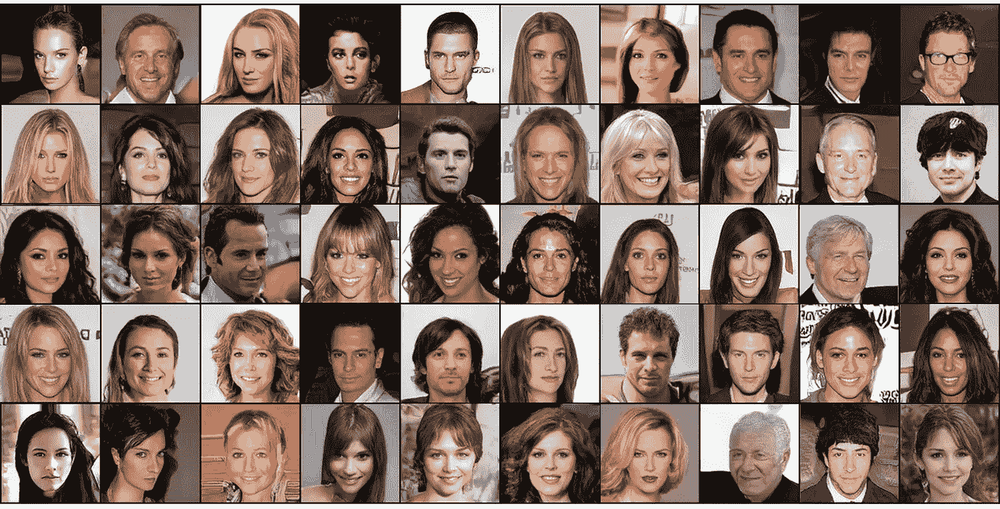

Sample output during my training of StyleGAN

生成对抗网络(GAN)是 Ian Goodfellow 和他的同事在 2014 年为生成建模推出的一种架构，它使用一个模型来生成模仿现有数据集的新样本。它由两个网络组成:产生新样本的*发生器*，以及检测假样本的*鉴别器*。发生器试图欺骗鉴别器，而鉴别器试图检测发生器合成的样本。

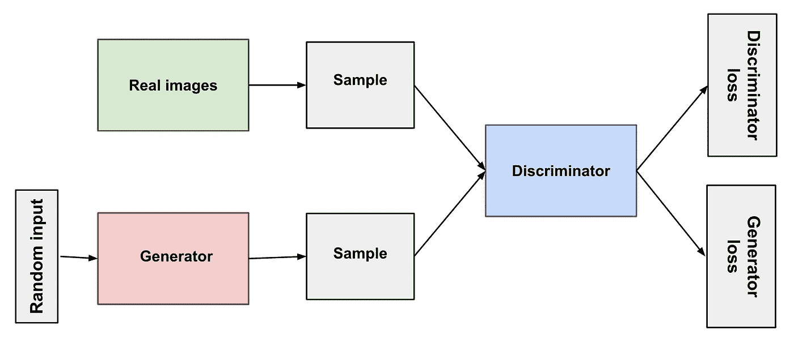

Overview of GAN structure [https://developers.google.com/machine-learning/gan/gan_structure](https://developers.google.com/machine-learning/gan/gan_structure)

一旦经过训练，该生成器可用于按需创建新样本。由于其各种有趣的应用，如风格转换、图像到图像的翻译或视频生成，GANs 迅速变得流行起来。例如，这种架构特别适合生成人脸。

今天，GAN 有各种各样的形式:DCGAN，CycleGAN，SAGAN…在这么多的 GAN 中选择，我使用 StyleGAN 生成人工名人脸。在这份报告中，我将解释什么使 StyleGAN 架构成为一个好的选择，如何训练模型，以及训练的一些结果。

# StyleGAN 模型架构

*如果你对 StyleGAN 更完整的解释感兴趣，你可以看看这篇伟大的* [*文章*](/explained-a-style-based-generator-architecture-for-gans-generating-and-tuning-realistic-6cb2be0f431) *并跳到下一节。本节将解释 StyleGAN 架构中的哪些特性使其对人脸生成如此有效。*

2018 年，英伟达在他们的论文[中提出了一种新的网络，一种基于风格的 GANs](https://arxiv.org/abs/1812.04948) 架构。以前的 GAN 模型已经显示出能够生成人脸，但一个挑战是能够控制生成的图像的一些特征，如头发颜色或姿势。StyleGAN 试图通过合并和建立渐进式训练来解决这一挑战，以单独修改每个细节层次。这样，它可以控制每个细节层次中表达的视觉特征，从姿势和脸型等粗略特征到眼睛颜色和鼻子形状等更精细的细节，而不影响其他层次。

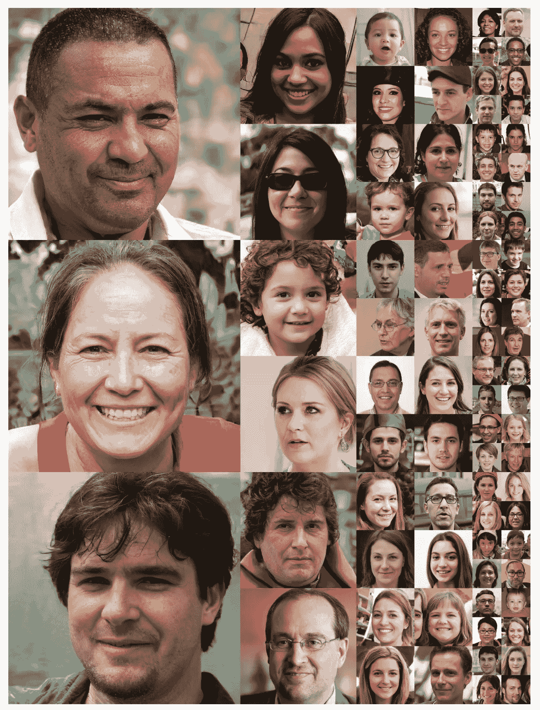

Sample outputs by the authors of StyleGAN. [https://arxiv.org/pdf/1812.04948.pdf](https://arxiv.org/pdf/1812.04948.pdf)

渐进式训练最初是在 [ProGAN](https://arxiv.org/abs/1710.10196) 架构中引入的，目的是生成高清图像。在渐进式训练中，首先在低分辨率图像(如 8×8)上训练模型，然后通过在训练期间向模型添加新的更高分辨率的层，输入图像分辨率逐渐加倍。通过这样做，模型可以在训练的早期阶段快速学习粗略的细节，并在稍后学习更精细的细节，而不是必须同时学习所有尺度的细节。

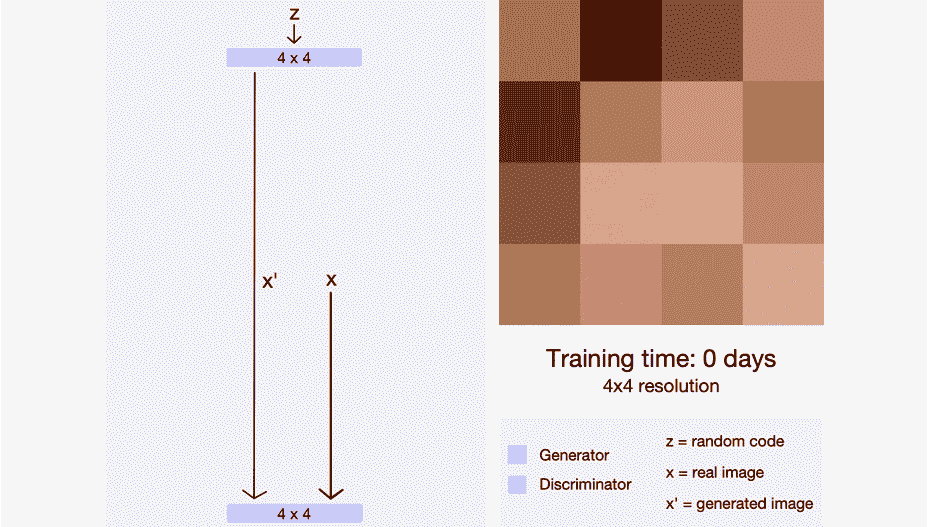

Progressive training in action [https://towardsdatascience.com/progan-how-nvidia-generated-images-of-unprecedented-quality-51c98ec2cbd2](/progan-how-nvidia-generated-images-of-unprecedented-quality-51c98ec2cbd2)

然而，ProGAN 模型控制图像特定特征的能力仍然有限。因为这些特性不是单独训练的，所以很难在不影响其他几个特性的情况下调整一个特定的特性。StyleGAN 在渐进式训练的基础上进行扩展，增加了一个*映射网络*，它将输入编码为一个特征向量，其元素控制不同的视觉特征，以及*风格模块*，它将先前的向量转换为其视觉表示。通过对每个级别使用单独的特征向量，模型能够组合多个特征:例如，从两个生成的图像，模型可以使用来自第一个的粗略级别特征，来自第二个的精细细节特征，来生成组合两者的第三个。

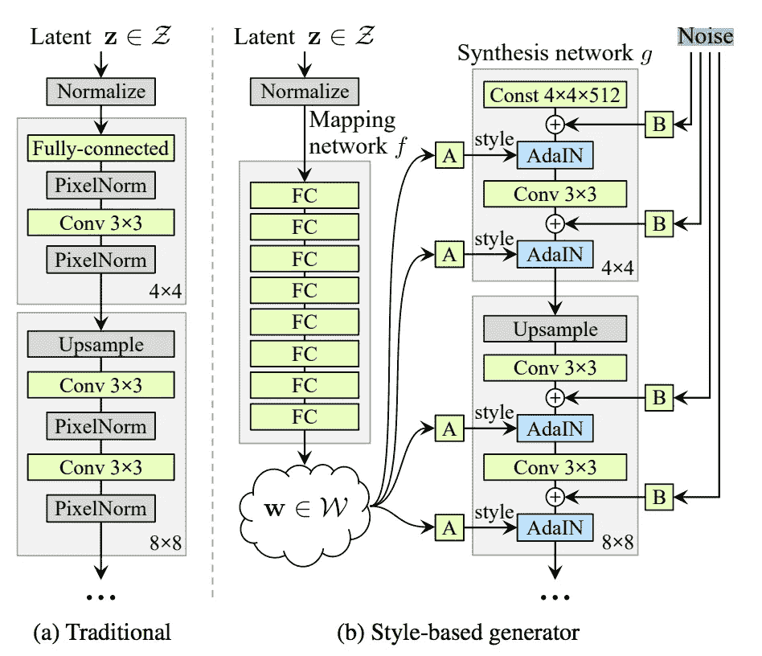

[https://arxiv.org/pdf/1812.04948.pdf](https://arxiv.org/pdf/1812.04948.pdf)

通过渐进式训练和独立的特征映射，StyleGAN 为这项任务提供了巨大的优势。与其他强大的 GAN 网络相比，该模型需要更少的训练时间来生成高质量的逼真图像。此外，在有许多不同特征的人脸生成中，每个特征有几个实例，这种架构特别适合，因为该模型能够单独学习人脸特征，而不受特征级别之间的相关性的影响，以生成具有良好多样性的图像。获得真实和多样的图像是这次挑战的两个主要目标，在这里我只有有限的资源来训练我的模型，这就是为什么 StyleGAN 成为我选择的架构。

# 数据处理

我使用 CelebA 数据集来训练我的模型。CelebA 包含了 10，177 位不同名人的 202，599 张人脸图片。原始数据集标注了二元特征，如*眼镜*或*大鼻子*，但我们将只使用图像本身来生成人脸。

Samples from CelebA dataset [http://mmlab.ie.cuhk.edu.hk/projects/CelebA.html](http://mmlab.ie.cuhk.edu.hk/projects/CelebA.html)

数据集中的图像尺寸为 178×218。因为我们想要生成正方形图像，所以我们裁剪图像。为了做到这一点，我们假设面部位于图像的中心附近，并采取中心裁剪。

我们调整图像大小以适应渐进训练，如前所述，从 8x8 到 128x128，即所选的最终输出大小。注意，这种技术能够用 1024x1024 的图像训练模型，但是这将需要一个月以上的 GPU 训练，并且至少 64x64 的分辨率已经给出了良好的视觉效果。调整每个图像的大小，使其具有尺寸为 8×8、16×16、32×32、64×64 和 128×128 的副本，从而经过训练的生成器将生成尺寸为 128×128 的图像。

我还没有使用过的其他可能的数据处理方法是检测和裁剪图像，使其更接近人脸，并删除人脸不面向前方的例子。

# 培养

为了训练我自己的模型，我在我最喜欢的机器学习框架中的 Github 上找到了一个很棒的 StyleGAN 的[实现，代码可以理解。](https://github.com/rosinality/style-based-gan-pytorch)

训练以与传统 GAN 网络相同的方式进行，增加了渐进式训练的任务。我对鉴别器和生成器都使用了学习率为 0.001 的 Adam 优化器。由于内存限制，我使用的批量大小为 16，代码大小为 512，即输入到生成器中的随机噪声向量大小为 1x512。对于损失函数，我使用 Wasserstein 损失。对于渐进式训练，在增加大小之前，每个维度大小在 600，00 0 个图像实例上训练，直到达到维度大小 128x128，在那里我继续训练模型，直到收敛。

我们可以使用三种技术来进行正则化。首先，当在训练期间加载输入图像时，以概率 0.5 执行水平翻转。通过这种方式，我不需要增加数据集的大小，这样会降低训练速度，但模型在训练过程中会遇到更多不同的输入。

第二种正则化技术是 StyleGAN 特有的。为了避免模型学习特征级别之间的相关性，模型执行风格混合。它接受两个输入，为每个输入生成特征映射向量，然后使用第一个特征向量开始训练，并随机切换到第二个特征向量。这确保了网络不依赖于级别之间的相关性。

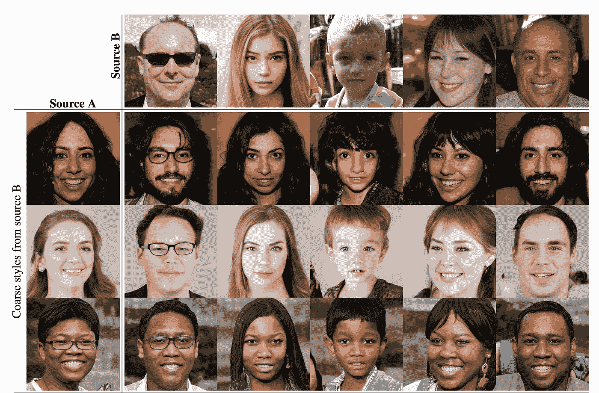

Example of style mixing. [https://arxiv.org/pdf/1812.04948.pdf](https://arxiv.org/pdf/1812.04948.pdf)

GAN 使用的另一种正则化方式是在训练期间向每个通道添加随机噪声。这允许模型增加其输出的多样性，并在生成的图像中添加随机变化(例如雀斑、头发)

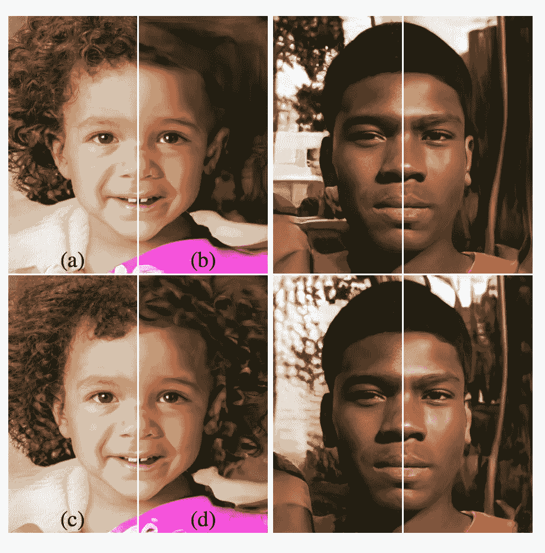

Effect of noise inputs at different layers of generator. (a) Noise is applied to all layers. (b) No noise. (c) Noise in fine layers only (642–10242 ). (d) Noise in coarse layers only (4 2–322 ). [https://arxiv.org/pdf/1812.04948.pdf](https://arxiv.org/pdf/1812.04948.pdf)

# 图象生成

我们只使用经过训练的生成器来生成图像。在训练模型之后，我们首先计算平均特征向量。这可以简单地通过使用生成器来合成几个图像来完成，在我们的例子中，我们使用 10 个图像，然后计算前面提到的在每个级别获得的图像上的特征向量的平均值。然后，在生成期间，使用的特征向量是 *v_mean + ψ(v — v_mean)* ，其中 *v* 是特征映射网络的输出， *v_mean* 是先前计算的平均特征向量， *ψ* 是控制平均特征向量的强度的常数。 *c* 越大，最终生成的图像越偏离“平均”人脸。我们甚至可以为每个级别使用不同的值 *ψ* 来控制每个特征离平均值有多远。

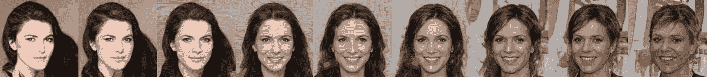

Left to right: *ψ = -1, -0.7, -0.5, -0.2, 0, 0.2, 0.5, 0.7, 1*

经过训练，也可以使用风格混合。我没有为最终的输出使用风格混合，但下面是我在训练后获得的一个例子。网格内的图像从顶部的图像中提取精细特征，从左侧的图像中提取粗糙特征。

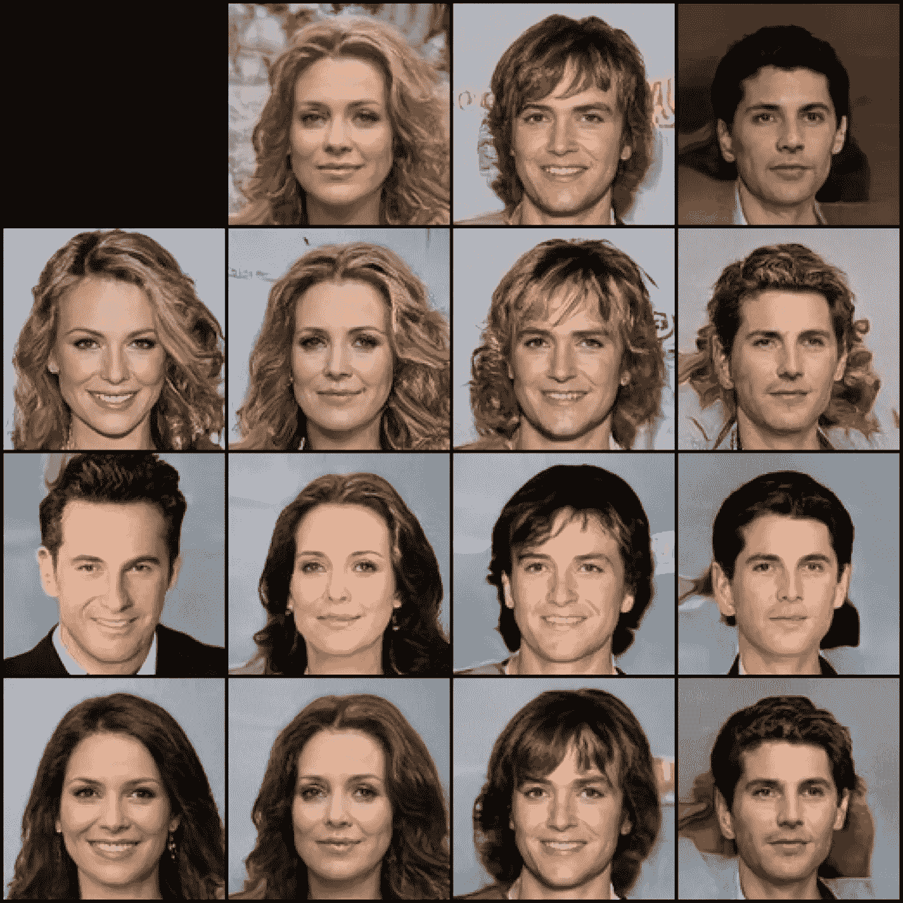

# 结果

这里是在我的 StyleGAN 最终版本的训练中获得的一些输出，在这里你也可以看到渐进式训练的效果。

迭代 100，维度 8×8

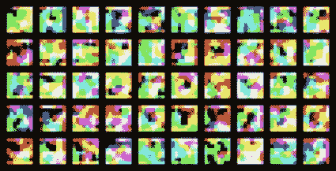

迭代 10000，维度 8×8

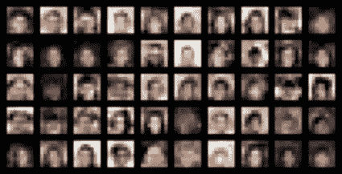

迭代 50000，维度 16x16

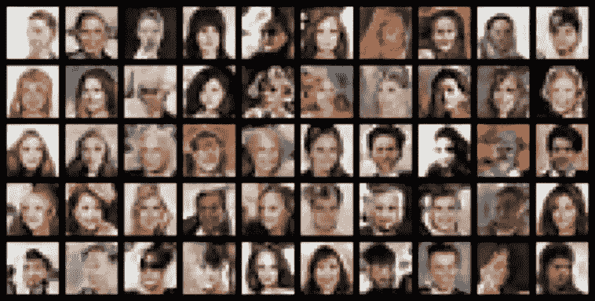

迭代 100000，维度 32x32

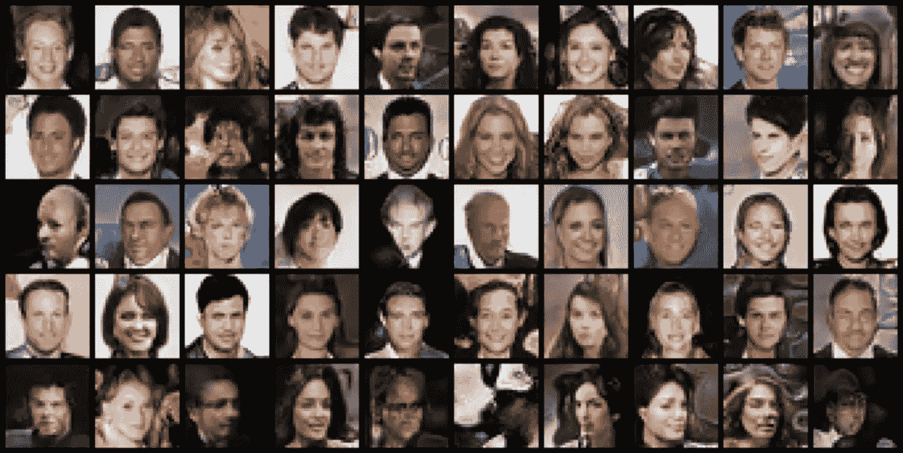

迭代 140000，尺寸 64x64

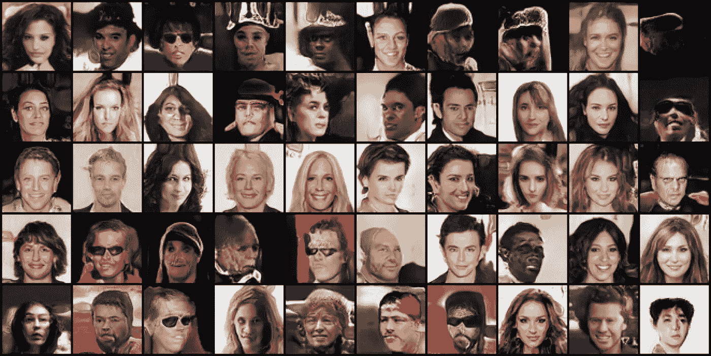

迭代 155000，维度 128x128

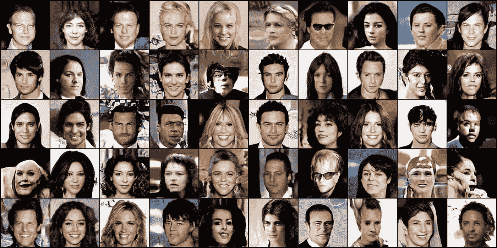

迭代 400000，维度 128x128

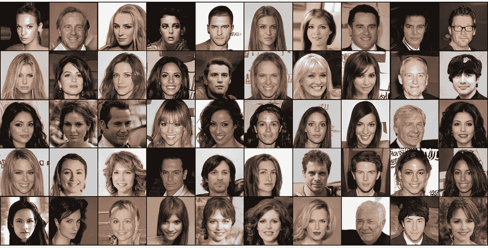

我在大约 400000 次迭代时停止了训练，因为模型似乎没有进一步改进。在我检查的每次迭代生成的 50 张人脸中，通常总有一两张看起来很不现实，但其余的结果非常令人满意。在我看来，最好的例子甚至与真实的面孔难以区分。

生成的看起来不太真实的图像通常是面部不面向前方的图像，或者是戴着太阳镜的图像。未来的改进将是在训练之前移除这样的样本，使得模型将仅生成正面人脸。

感谢阅读，我希望你喜欢这篇文章！随时让我知道你用 StyleGAN 做的任何很酷的实验:)

你可以找到我使用的全部代码，从下载 CelebA 数据集到在我的 [Github](https://github.com/kayoyin/FakeCelebs) 上使用 StyleGAN 进行训练和生成示例，但是 PyTorch 中 StyleGAN 的实现完全归功于 rosinality 。