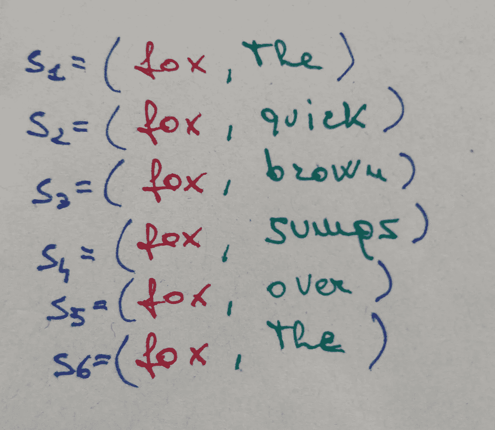
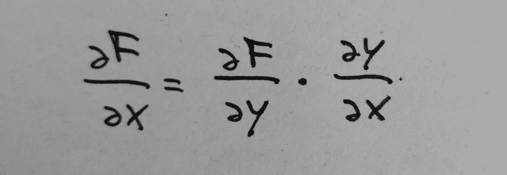
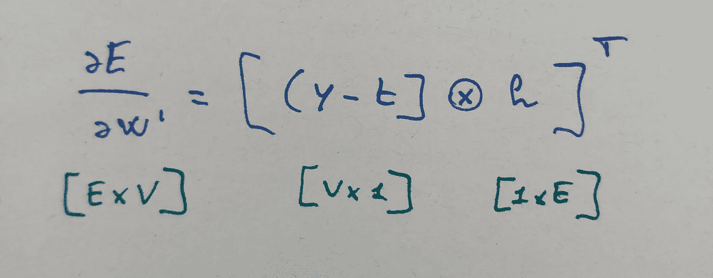

# 如何训练 word2vec 模型

> 原文：<https://towardsdatascience.com/how-to-train-the-word2vec-model-24704d842ec3?source=collection_archive---------6----------------------->

Image by Chuk Yong from Pixabay

我们已经讨论过 *word2vec* ( [此处](https://medium.com/@andrea.capitanelli/a-mathematical-introduction-to-word2vec-model-4cf0e8ba2b9))的模型，现在来看看如何实现。为了做到这一点，我们必须建立一个*浅层*神经网络并训练它。

*注:我发现在 Medium 上使用 latex 是相当不满意和讨厌的，所以我选择了使用手绘配方(和方案)。我提前为我的书法道歉。*

## 训练样本

首先要做的是生成训练数据。回到我们的文本，我们需要:

*   跳过课文中的每个单词:这是我们的中心词
*   在给定的距离内选择它的相邻单词:这些是上下文单词

Context with windows size of 3

*   生成数据对，每个样本由中心词和上下文词组成

The resulting 6 data pairs

我们还注意从我们的文本中读取的唯一单词的总数，因为这个参数将决定我们嵌入的**词汇** *的大小。*

此时，数据生成已完成，该轮到构建和训练神经网络了。

## 神经网络

用于训练模型的神经网络的结构非常简单。它是一个前馈网络，最基本的形式包括:

*   一个**输入层**。它接受一个字 *w* 并返回它的独热编码向量表示， *x* 。独热编码向量是除了*1*1 之外全为 0 的向量，它们用于指示从集合中挑选的一个成员。对于来自训练数据的每一对， *w* 是中心词。输入向量的大小是 *V* ，即词汇量的大小。这一层没有激活功能。
*   一个**隐藏层**。它是一个具有 *V* 行和 *E* 列的矩阵，为每个输入单词 *x* 分配其嵌入表示 *h* 。就像图片中一样，每个第 *i 个*行代表第 *i 个嵌入*，输出将是一个大小为 *E.* 的向量。如果不清楚为什么，可以自己尝试转置一个一键编码的向量，并将其乘以一个小矩阵。这一层也没有激活功能。
*   一个**输出层**。这一层与上一层相反。它作为一个具有 *E* 行和 *V* 列的矩阵，其中 *i-th* 列包含第 *i-th* 上下文词的嵌入。因此，给定嵌入 *h，*与这个矩阵相乘返回一个 V 大小的向量 *y* 。作为激活函数，一个 *softmax* 函数被应用于 *y.* 生成一个矢量 *z* ，在中，其中*第 k 个*元素表示*第 k 个*字在 *w* *上下文中的**概率。***

Scheme of neural network

*z* 和*y*相对于*W’*中第 j 个字的表达式分别为:

Output of W’

Output of softmax

对于每个训练对，大小为 V 的向量 *t* 是与该对相关联的基本事实。这也是一个热码编码向量，它在上下文单词处等于 *1* ，在其他地方等于 *0* 。换句话说，它是输出标签的指示器功能。

Truth vector

## 训练网络

为了训练这样的神经网络，我们遵循以下步骤:

*   我们获取一个训练样本，并生成网络的输出值
*   我们通过比较模型预测和真实输出标签来评估*损失*
*   我们通过对评估的*损失*使用[梯度下降](https://en.wikipedia.org/wiki/Gradient_descent)技术来更新网络的权重
*   然后我们取另一个样本，重新开始

这些步骤在整个训练集上重复，然后整个过程重复多次，称为*时期。*

## 做数学

为了更新神经网络的权重(矩阵 *W* 和*W’*，我们需要评估**损失**对它们的导数。导数的计算并不复杂，因为输出主要是线性函数矩阵运算的结果。当然，除了激活功能和损耗。主要缺陷在于权重指数的正确管理。

帮助我们计算的工具也很简单:链式法则。它指出，两个或多个函数的组合的导数可以计算为它们的导数的乘积。

Chain rule is applied to F, a composed function, by multiplying derivatives of its composing functions

让我们从*损失*相对于矢量 *z* 的元素的导数开始，这对于将要进行的两种计算都是有用的。我没有报告所有的步骤，但是通过利用 *softmax* 的属性可以显示:

Derivative w.r.t. z

向前移动，输出矩阵*W’*的导数为:

Derivative for output matrix weights

对于隐藏层的矩阵，还需要做一些工作。首先，让我们展开矩阵 *W* 产生的向量 *h* :

Element of vector h

然后，记住之前显示的*损失*的导数，并且 *z* 是向量 *h* 与列*W’*的乘积，我们得到:

Derivative w.r.t. j-th element of h

最后，将最后一个导数与 *h* w.r.t. *W* 的导数结合，我们得到:

Derivative for hidden layer weights

## 更新权重

一旦计算出导数，更新方程就是标准方程:

Getting the new weights

更新步骤由 *eta* 因子控制，该因子通常在训练时期随着权重接近其最佳值而减少。

## 一点矢量化

现在，我们已经定义了关于 *W* 和*W’*的元素的点导数，我们可以通过使用张量积将直接给出的定义扩展到矩阵，从而具有更简单和更紧凑的符号:

Derivative for output layer weights

Derivative for hidden layer weights

在后一种情况下， *x* 是一个独热编码向量，它只有一个元素等于 1，所有其他元素都等于 0。因此，它在这里的作用是只选择与输入单词的表示相关的行。换句话说，**在*W*中只更新输入单词的权重。**

## 负采样

正如我们在上一篇文章中看到的，在负采样的情况下，目标函数会发生变化，因此，*损失*也会发生变化，权重公式也会更新。

现在，对于由 *h* 表示的给定输入字，对于*W’*中的第 *j 个*字，模型的输出由下式给出:

New output

代替以前偏导数的新偏导数是:

第一个等式实际上保持不变，但是 *y* 在这里被替换为使用 *sigmoid* 函数的新表达式。

此外，这些等式以及用于权重更新的等式现在必须仅应用于 *K* 组单词(正样本和负样本)，而不是整个词汇表。

关于实现的更多细节，你可以看看我在 [github](https://github.com/acapitanelli/word-embedding) 上的代码。我写它主要是为了娱乐和学习，所以它远不是很快，但很容易理解。