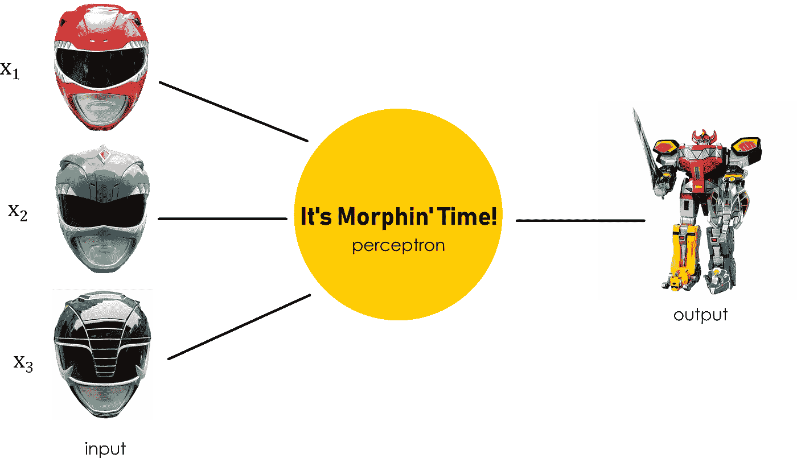
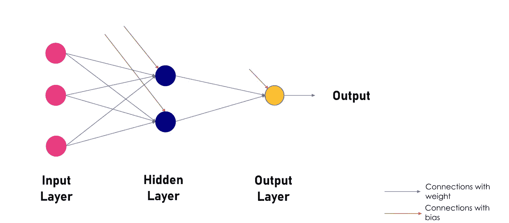

# 如何训练你的神经网络:隐藏代码

> 原文：<https://towardsdatascience.com/how-to-train-your-artificial-intelligence-the-hidden-code-20cb3a35e1d6?source=collection_archive---------7----------------------->


## 机器学习和动力游侠将如何让我们成为硅时代的龙骑士

## 诚然，人工智能不像龙那么酷。

另一方面，你在生活中遇到某种形式的人工智能的可能性远远大于你有一条龙——或者你有，谁知道呢？我不知道你的生活。

不用说，人工智能已经成为我们生活中不可或缺的一部分，从网飞算法神奇地让你的周末消失到 [Google Duplex 为你打电话](https://youtu.be/lXUQ-DdSDoE)这样你就再也不用担心通过电话预约了(人类互动？**喘息*)。*

但人工智能正在解决比以往任何时候都更大的问题，从肿瘤检测到无人驾驶汽车。世界瞬息万变，所以知道未来会如何发展很重要。毕竟，人工智能究竟是如何变得如此聪明的？

# 机器学习

*中的龙如何训练你的龙*和地球上的人类(也就是我们)有很多共同点。我们都很聪明，但我们不是那样开始的。

在成长过程中，我们从父母、朋友、老师(对于龙来说，是训练师)等那里获得了关于我们周围世界的信息。利用这些信息，我们试图为自己和他人做出一些好的选择(除非你是某种无政府主义者，在这种情况下*革命万岁*，我猜？)

有时候，我们做出的选择结果并不那么好。例如，在 2012 年 5 月不买脸书的股票。或者在 2018 年 7 月买入脸书股票。但是我们从错误中学习，并相应地调整我们的决策过程，所以我们在未来会做出更好的决定。对我们有好处！

使用一些不太复杂的数学，计算机科学家开发了一种叫做**机器学习**的过程，基本上做同样的事情。机器学习描述了向神经网络输入大量数据的方法，让它从中找到模式，然后让它根据这些模式做出选择和预测。但是就像龙一样，我们必须首先训练这些系统。

那么什么是神经网络，它到底是如何学习的呢？

# 让我们从基础开始。

神经网络是由**神经元**或奇特的*感知器*组成的系统。感知器接受多个输入值，并通过一个称为**正向传播**的整个过程产生一个单一的输出——在高层次上，想象一下权力游侠聚集在一起形成一个 Megazord。



假设*是 Morphin 时间*是对输入值执行的函数，幂游侠，它们中的每一个都有与之对应的特定值，例如:

*   x₁ = 0
*   *x₂* = 1
*   x₃= 0

现在让我们说黑人权力游侠比其他人更重要。他的意见将被赋予更大的重要性，或者说*权重。*事实上，所有的流浪者都有他们各自的*权重*:

*   w₁*= 1*
*   w₂ = 2
*   w₃3

然后，神经元被分配一个*偏置*，这使它能够在一些迭代之后改变，以更好地适应你的数据。通过将乘以各自权重的所有输入值相加，并考虑到 *b* =偏差，我们得到:

(*w₁*×*x₁*)*+*(*w₂*×*x₂*)*+*(*w₃*×*x₃*)*+(1*×*b)*

让这个神经元真正有用的是一个**激活功能**。这基本上是把我们得到的总和作为一个转换函数的自变量(或输入)，使它成为非线性的。这是通过 Sigmoid 函数或其他复杂的多项式回归模型来实现的。

由于许多数据并不总是符合线性关系，这有助于我们的神经网络模型更好地拟合数据，并且是将流浪者变成 Megazord 的特殊调料。也可能是外星科技。我不记得了。

# 团队合作让梦想成真。

一个神经元本身并没有那么有用。但是当我们一起使用它们时，我们可以形成一个神经元网络，几乎就像一个*神经网络……*:)

这些网络可以被认为是分层的，输入层是所有数据的来源，输出层为您提供预测，中间还有一些隐藏层。



一层中的所有神经元(或节点)连接回前一层中的所有神经元。它们最终通过我们一直在谈论的这种奇特的*前向传播*产生一个输出。然而，*真正的*魔力来自**反向传播**。

反向传播是确定输出端的误差或**损耗**的过程，然后返回网络，根据误差调整权重和偏差；用于实现这一点的常见算法包括**梯度下降、**，它涉及找到您的参数相对于权重的导数，并将其乘以您的学习率，这决定了您希望优化的速度**。**

本质上，我们找到损失函数的导数，并试图使其最小化，从而使误差最小化。有道理吗？

这个过程的每一轮，或*训练迭代*，被称为**时期。我知道这听起来很糟糕。对于更困难的数据集，我们需要大量的历元，就像所有不同版本的《超级游侠》(有多少，100 万种？)**

# 让我们用一些代码来尝试一下…

我们现在可以用 Python 建立一个非常简单的神经网络，它可以进行二进制分类，或者预测 1 或 0。 ***注意:*** *我用的是 Python 3.6*

当然，我们不能没有我们的好朋友 Numpy:

```
import numpy as np
```

让我们将 *X* 设置为输入数组，将 *y* 设置为输出数组:

```
X=np.array([[0,1,1,0],[0,1,1,1],[1,0,0,1]])
y=np.array([[0],[1],[1]])
```

让我们添加 Sigmoid 函数(这将是正向传播的一部分)及其导数(这将是反向传播的一部分):

```
def sigmoid ():
    return 1/(1 + np.exp(-x))def derivatives_sigmoid ():
    return x * (1-x)
```

现在让我们设置我们想要多少个历元，我们的学习速率`lr`将是多少，我们的数据集中的特征的数量(1)，隐藏层神经元的数量(3)和输出神经元的数量(1):

```
epoch=10000
lr=0.1 
inputlayer_neurons = X.shape[1] 
hiddenlayer_neurons = 3 
output_neurons = 1
```

现在我们可以设置初始权重和偏差。假设`wh`和`bh`是隐含层神经元的权重和偏差，`wout`和`bout`是输出神经元的相同权重和偏差:

```
wh=np.random.uniform(size=(inputlayer_neurons,hiddenlayer_neurons))
bh=np.random.uniform(size=(1,hiddenlayer_neurons))
wout=np.random.uniform(size=(hiddenlayer_neurons,output_neurons))
bout=np.random.uniform(size=(1,output_neurons))
```

好了，舞台已经准备好了:我们有了数据，我们的初始权重和偏差已经设置好，我们的正向和反向传播函数已经准备好像 bosses 一样进行计算了。让我们把剩下的部分放好:

**正向传播:**

*   首先，我们将得到**权重**和**输入值**的乘积。
*   接下来，我们将把**偏差**添加到产品中。
*   然后，我们使用我们的 **sigmoid 函数**来转换/激活它。
*   我们将在输出层神经元中重复这个结果。

```
hidden_layer_input1=np.dot(X,wh)
hidden_layer_input=hidden_layer_input1 + bh
hiddenlayer_activations = sigmoid(hidden_layer_input)output_layer_input1=np.dot(hiddenlayer_activations,wout)
output_layer_input= output_layer_input1+ bout
output = sigmoid(output_layer_input)
```

**反向传播:**

*   我们将计算误差，即 *y* 和输出之间的差值。
*   接下来，我们将找到输出和转换/激活的梯度。
*   现在，让我们通过将输出层的变化系数乘以误差来找出变化系数。
*   现在误差将传播回网络，所以我们必须得到第二层和第三层之间的δ和权重参数的点积。
*   我们将对隐藏层做同样的事情，然后更新权重和偏差。

```
E = y-output
slope_output_layer = derivatives_sigmoid(output)
slope_hidden_layer = derivatives_sigmoid(hiddenlayer_activations)d_output = E * slope_output_layerError_at_hidden_layer = d_output.dot(wout.T)
d_hiddenlayer = Error_at_hidden_layer * slope_hidden_layerwout += hiddenlayer_activations.T.dot(d_output) *lr
bout += np.sum(d_output, axis=0,keepdims=True) *lrwh += X.T.dot(d_hiddenlayer) *lr
bh += np.sum(d_hiddenlayer, axis=0,keepdims=True) *lr
```

我们可以通过打印输出来结束:

```
print (output)
```

它应该会返回如下内容:

```
[[0.03391414]
 [0.97065091]
 [0.9895072 ]]
```

我们原来的输出是 0，1，1，这些输出超级接近。它们不精确是好事，因为它允许其他数据的灵活性。你可以通过改变历元的数量来降低模型的准确性。

我们做到了！当然，有不同的方法来编码神经网络，你可以找到大量的文章来教你，这只是我学到的方法之一。现在，当其他人都在星巴克忙着敲他们的剧本时，你可以高兴地知道你正在骑着未来的龙。

写出来的东西比我想象的要俗气得多。)

# 所以你已经做到了…

你已经训练好了你的龙。花了 10 000 个纪元，但你做到了。但这仅仅是开始。你面前有一整个特许经营权。

今天，机器学习正以一些真正令人兴奋的方式得到应用。像 Cogito 这样的公司正在用它来帮助呼叫中心的工作人员通过分析他们的声音来判断 T2 客户对电话的兴趣。医学界正在使用人工智能来帮助诊断恶性血细胞和肿瘤。计算机视觉正在帮助**无人驾驶汽车**上路。甚至还有 AI **写整本书！**

在*如何训练你的龙中，*与龙合作让伯克的骑手改善社会和农业生活。正如我们所知，人工智能已经在改善我们的生活；它现在正在扰乱世界上的每一个行业，所以尽快加入进来是很重要的。理解神经网络是如何工作的，哪怕只是一点点，都会让你领先于潮流。

因此，理解人工智能可能不会让你变得像养龙的人一样酷，但它是革命性的、令人兴奋的，而且一定会确保你在未来的地位。

# **关键要点**

*   一个**神经元**接收多个输入并产生一个输出。输入有关联的**权重**，神经元应用自己的**偏置**。
*   神经元还包括一个**激活函数**，它使得数据图是非线性的。当我们把这些放在一起，我们就有了一个**神经网络。**
*   **反向传播**是调整权重和偏差以最小化输出误差的过程，通常使用像**梯度下降**这样的训练算法。
*   数据需要多轮训练迭代，或**历元**才能准确。
*   从医疗行业到文学，人工智能正在改变世界的工作方式。这是一辆你*希望*乘坐的颠覆性列车。

# 如果你喜欢这篇文章…

1.  看看我的另一篇文章关于我们将如何制造情感人工智能…
2.  在 LinkedIn 上与我联系！如果你想谈论 AI/ML 或龙，我很乐意连接！