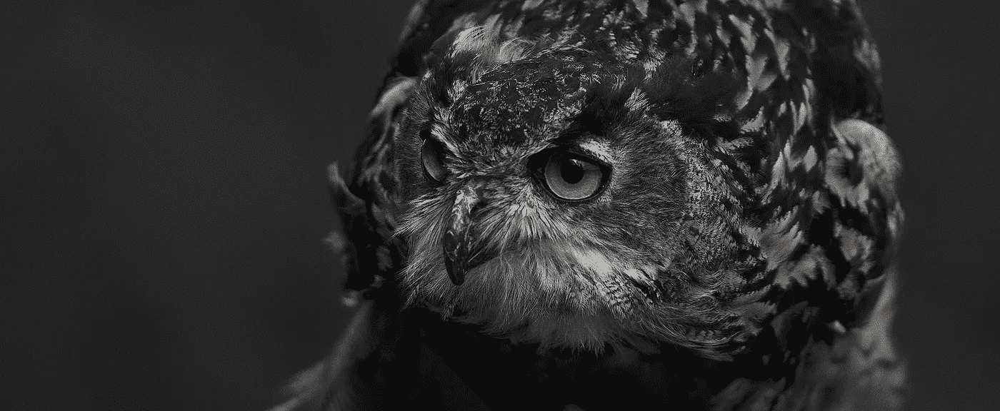
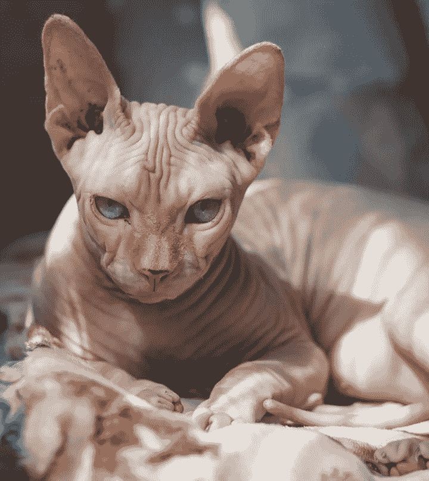
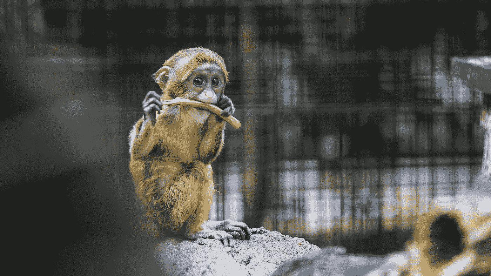
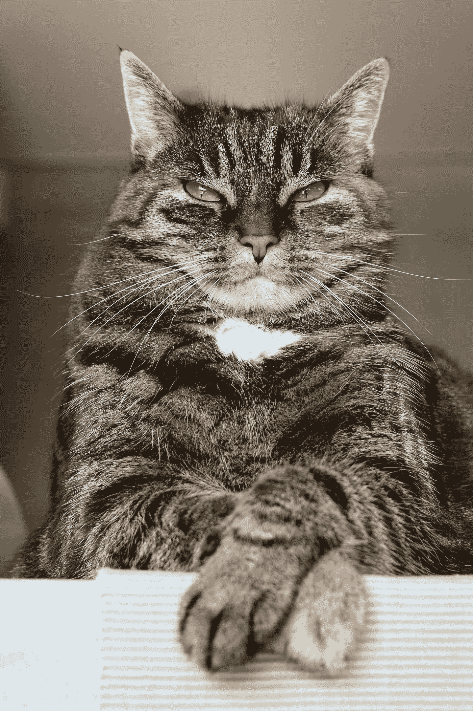
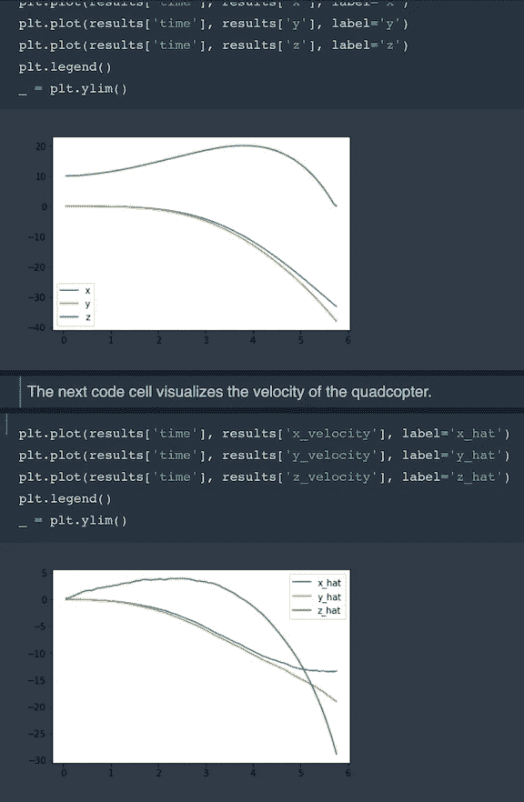
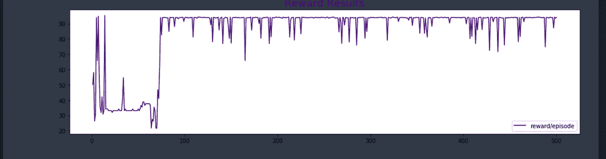
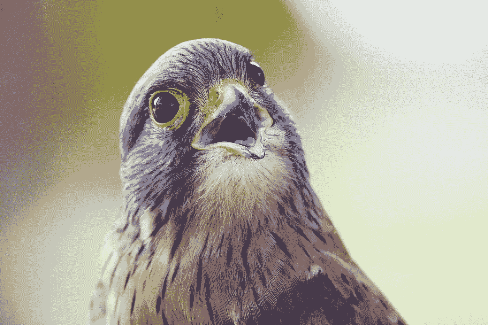

# 如何训练你的四轴飞行器

> 原文：<https://towardsdatascience.com/how-to-train-your-quadcopter-adventures-in-machine-learning-algorithms-e6ee5033fd61?source=collection_archive---------7----------------------->

## 教四轴飞行器飞行的完全初学者指南(附代码！)



Photo by [Pixaby](https://www.pexels.com/photo/animal-avian-beak-bird-416202/) via [Pexels](https://www.pexels.com/photo/animal-avian-beak-bird-416202/)

最近，我在尝试训练四轴飞行器飞行时获得了很多乐趣。

太有趣了。



Photo by [наталья семенкова](https://www.pexels.com/@366671?utm_content=attributionCopyText&utm_medium=referral&utm_source=pexels) from [Pexels](https://www.pexels.com/photo/selective-focus-photography-of-sphinx-cat-lying-on-bedspread-991831/?utm_content=attributionCopyText&utm_medium=referral&utm_source=pexels)

## 关于四轴飞行器的一切！

四轴飞行器是很神奇的东西。

它们体积小，机动性强，可以在室内和室外飞行。他们对摄影和新闻业很感兴趣。你可以用它们来送货，人道主义行动，搜索和救援，以及拍摄电影。当然，它们也有军事和执法应用。它们也非常适合研究！有了四轴飞行器，你可以测试飞行控制理论、实时系统、导航和机器人等领域的新想法。

此外，他们可以由业余爱好者建造和维护！

GIF via [GIPHY](https://media.giphy.com/media/1fkd6ZTBsxSosV4UTS)

在一个非常基本的层面上，四轴飞行器是一种由四个旋翼(大部分时间)提升和推进的直升机。他们通常使用两对相同的固定螺距螺旋桨。两个顺时针运行，两个逆时针运行。对于控制，他们使用每个转子速度的独立变化。通过改变每个转子的速度，您可以产生所需的总推力，定位推力中心(横向和纵向)，并产生所需的总扭矩。

四轴飞行器真正酷的地方在于，你可以通过使用机器学习技术训练的神经网络来控制它！

使用强化学习，你可以训练一个网络直接将状态映射到执行器命令。甚至可以用模拟训练的神经网络完全控制四轴飞行器！[如果你感兴趣的话，Jemin Hwangbo 等人写了一篇很棒的论文概述了他们的研究。](https://arxiv.org/pdf/1707.05110.pdf)

虽然大多数四轴飞行器有四个发动机提供推力(……将“四轴飞行器”中的“四轴飞行器”)，但一些实际上有 6 个或 8 个。有更多的推力点可以提高稳定性，并实现一系列酷的飞行行为。但更复杂的系统意味着手动控制每个发动机的推力几乎是不可能的。

幸运的是，您可以使用强化学习来构建能够自主学习行为的代理！



Photo by [Jimmy Chan](https://www.pexels.com/@jimbear?utm_content=attributionCopyText&utm_medium=referral&utm_source=pexels) from [Pexels](https://www.pexels.com/photo/photography-of-a-baby-monkey-eating-vegetable-1000529/?utm_content=attributionCopyText&utm_medium=referral&utm_source=pexels)

## 我为什么要这么做？

这是 [Udacity 的](http://udacity.com)机器学习工程师 Nanodegree 的必考项目之一。这是一个非常酷的项目，你可能想[看看](https://github.com/udacity/RL-Quadcopter)！你得到了一些坚实的基本代码，一些有用的文件，然后你插入你自己的代码，让它运行起来。

听起来很简单，对吧？

没有那么多。



Photo by [Pixabay via Pexels](https://www.pexels.com/photo/adorable-angry-animal-animal-portrait-208984/)

## 让我们把手弄脏吧！

要让这个东西发挥作用，你需要设计自己的强化学习任务和一个代理来完成它。为您提供了一个样例代理来开始使用，以及一个四轴飞行器模拟器。

剩下的就看你的了。

代理通过设置四个旋翼的每秒转数来控制四轴飞行器。您可以通过包含速度信息来扩展状态向量的大小。(Udacity 使用四轴飞行器的 6 维姿态来构建每个时间步的环境状态)。也可以使用姿势、速度和角速度的任意组合。

您将使用`__init__()`方法初始化几个变量，包括您的任务。如果您浏览一下代码，您会看到模拟器在这里被初始化为`physics_sim`类的一个实例。受[这篇深度确定性政策梯度论文](https://arxiv.org/abs/1509.02971)的启发，Udacity 还利用了动作重复。您将设置状态向量中的元素数量，并将目标位置指定为一个变量。

我们为您提供了一个示例代理。它使用非常简单的线性策略来直接计算动作向量，作为状态向量和权重矩阵的点积。它通过添加一些[高斯噪声](https://en.wikipedia.org/wiki/Gaussian_noise)来随机扰动参数，以产生不同的策略。根据每集获得的平均奖励，它会跟踪到目前为止找到的最佳参数集以及分数的变化情况。然后，它调整一个比例因子来扩大或收紧噪声。

他们给你安排的那个简单的不太好用…



接下来由你来指定你选择的任务。您将定义自己的代理，并为您的任务调整各种超参数和奖励函数，直到您获得一些值得骄傲的行为。

## 我们来训练一架四轴飞行器吧！

我们需要在 task.py 文件中定义我们的任务(环境)。我们还会有一个文件夹存放我们的增援特工。我们将在那里保存一个 agent.py 文件，我们在其中定义代理，并利用包含四轴飞行器模拟器的 physics_sim.py 文件。你可能想考虑创建更多的文件，比如一个定义神经网络的文件，如果你想尝试的话。

首先，我们的任务是:

## 任务. py

```
import numpy as np
from physics_sim import PhysicsSim

class Task2():
    """Task that defines the goal and provides feedback to the agent."""
    def __init__(self, init_pose=None, init_velocities=None, 
        init_angle_velocities=None, runtime=5., target_pos=None):
        """Initialize a Task object.
        Params
        ======
            init_pose: initial position of the quadcopter in (x,y,z) dimensions and the Euler angles
            init_velocities: initial velocity of the quadcopter in (x,y,z) dimensions
            init_angle_velocities: initial radians/second for each of the three Euler angles
            runtime: time limit for each episode
            target_pos: target/goal (x,y,z) position for the agent
        """
        # Simulation
        self.sim = PhysicsSim(init_pose, init_velocities, init_angle_velocities, runtime) 
        self.action_repeat = 3self.state_size = self.action_repeat * 6
        self.action_low = 0
        self.action_high = 900
        self.action_size = 4# Goal
        self.target_pos = target_pos if target_pos is not None else np.array([0., 0., 10.])def get_reward(self):
        """Uses current pose of sim to return reward."""
        #reward = 1-(0.3*(abs(self.sim.pose[:3] - self.target_pos))).sum()
        #reward = np.tanh(reward)
        reward = np.tanh(1 - 0.0005*(abs(self.sim.pose[:3] - self.target_pos)).sum())
        return rewarddef step(self, rotor_speeds):
        """Uses action to obtain next state, reward, done."""
        reward = 0
        pose_all = []
        for _ in range(self.action_repeat):
            done = self.sim.next_timestep(rotor_speeds) # update the sim pose and velocities
            reward += (self.get_reward()/2)
            #if reward > 1: reward = 1
            #if reward < -1: reward = -1
            #reward = np.tanh(0.5*reward)
            pose_all.append(self.sim.pose)
        next_state = np.concatenate(pose_all)
        return next_state, reward, donedef reset(self):
        """Reset the sim to start a new episode."""
        self.sim.reset()
        state = np.concatenate([self.sim.pose] * self.action_repeat) 
        return state
```

我们肯定需要设计代理。在浪费了大量时间和无用的浪费之后，我决定使用 actor、critical、policy search、replay buffer 和 ou_noise 文件。([你可以在这里阅读奥恩斯坦-乌伦贝克进程](https://en.wikipedia.org/wiki/Ornstein%E2%80%93Uhlenbeck_process)。)

# 显示您的代理文件夹

## agent.py

```
from agents.actor import Actor
from agents.critic import Critic
from agents.replay_buffer import ReplayBuffer
from agents.ou_noise import OUNoise
import numpy as np
import random
from collections import namedtuple, dequeclass DDGP():
    """Reinforcement Learning agent that learns using DDPG."""
    def __init__(self, task):
        self.task = task
        self.state_size = task.state_size
        self.action_size = task.action_size
        self.action_low = task.action_low
        self.action_high = task.action_high# Actor (Policy) Model
        self.actor_local = Actor(self.state_size, self.action_size, self.action_low, self.action_high)
        self.actor_target = Actor(self.state_size, self.action_size, self.action_low, self.action_high)# Critic (Value) Model
        self.critic_local = Critic(self.state_size, self.action_size)
        self.critic_target = Critic(self.state_size, self.action_size)# Initialize target model parameters with local model parameters
        self.critic_target.model.set_weights(self.critic_local.model.get_weights())
        self.actor_target.model.set_weights(self.actor_local.model.get_weights())# Noise process
        self.exploration_mu = 0
        self.exploration_theta = 0.15
        self.exploration_sigma = 0.3
        self.noise = OUNoise(self.action_size, self.exploration_mu, self.exploration_theta, self.exploration_sigma)# Replay memory
        self.buffer_size = 1000000
        self.batch_size = 64
        self.memory = ReplayBuffer(self.buffer_size, self.batch_size)# Algorithm parameters
        self.gamma = 0.99  # discount factor
        self.tau = 0.001  # for soft update of target parametersdef reset_episode(self):
        self.noise.reset()
        state = self.task.reset()
        self.last_state = state
        return statedef step(self, action, reward, next_state, done):
         # Save experience / reward
        self.memory.add(self.last_state, action, reward, next_state, done)# Learn, if enough samples are available in memory
        if len(self.memory) > self.batch_size:
            experiences = self.memory.sample()
            self.learn(experiences)# Roll over last state and action
        self.last_state = next_statedef act(self, states):
        """Returns actions for given state(s) as per current policy."""
        state = np.reshape(states, [-1, self.state_size])
        action = self.actor_local.model.predict(state)[0]
        return list(action + self.noise.sample())  # add some noise for explorationdef learn(self, experiences):
        """Update policy and value parameters using given batch of experience tuples."""
        # Convert experience tuples to separate arrays for each element (states, actions, rewards, etc.)
        states = np.vstack([e.state for e in experiences if e is not None])
        actions = np.array([e.action for e in experiences if e is not None]).astype(np.float32).reshape(-1, self.action_size)
        rewards = np.array([e.reward for e in experiences if e is not None]).astype(np.float32).reshape(-1, 1)
        dones = np.array([e.done for e in experiences if e is not None]).astype(np.uint8).reshape(-1, 1)
        next_states = np.vstack([e.next_state for e in experiences if e is not None])# Get predicted next-state actions and Q values from target models
        #     Q_targets_next = critic_target(next_state, actor_target(next_state))
        actions_next = self.actor_target.model.predict_on_batch(next_states)
        Q_targets_next = self.critic_target.model.predict_on_batch([next_states, actions_next])# Compute Q targets for current states and train critic model (local)
        Q_targets = rewards + self.gamma * Q_targets_next * (1 - dones)
        self.critic_local.model.train_on_batch(x=[states, actions], y=Q_targets)# Train actor model (local)
        action_gradients = np.reshape(self.critic_local.get_action_gradients([states, actions, 0]), (-1, self.action_size))
        self.actor_local.train_fn([states, action_gradients, 1])  # custom training function# Soft-update target models
        self.soft_update(self.critic_local.model, self.critic_target.model)
        self.soft_update(self.actor_local.model, self.actor_target.model)def soft_update(self, local_model, target_model):
        """Soft update model parameters."""
        local_weights = np.array(local_model.get_weights())
        target_weights = np.array(target_model.get_weights())assert len(local_weights) == len(target_weights), "Local and target model parameters must have the same size"new_weights = self.tau * local_weights + (1 - self.tau) * target_weights
        target_model.set_weights(new_weights)

class OUNoise:
    """Ornstein-Uhlenbeck process."""def __init__(self, size, mu, theta, sigma):
        """Initialize parameters."""
        self.mu = mu * np.ones(size)
        self.theta = theta
        self.sigma = sigma
        self.reset()def reset(self):
        """Reset the internal state mean (mu)."""
        self.state = self.mudef sample(self):
        """Update internal state and return it as a noise sample."""
        x = self.state
        dx = self.theta * (self.mu - x) + self.sigma * np.random.randn(len(x))
        self.state = x + dx
        return self.state

class ReplayBuffer:
    """Fixed-size buffer to store experience tuples."""def __init__(self, buffer_size, batch_size):
        """Initialize a ReplayBuffer object.
        Params
        ======
            buffer_size: maximum size of buffer
            batch_size: size of each training batch
        """
        self.memory = deque(maxlen=buffer_size) # internal memory (deque)
        self.batch_size = batch_size
        self.experience = namedtuple("Experience", field_names=["state", "action", "reward", "next_state", "done"])def add(self, state, action, reward, next_state, done):
        """Add a new experience to memory."""
        e = self.experience(state, action, reward, next_state, done)
        self.memory.append(e)def sample(self, batch_size=64):
        """Randomly sample a batch of experiences from memory."""
        return random.sample(self.memory, k=self.batch_size)def __len__(self):
        """Return the current size of internal memory."""
        return len(self.memory)
```

## actor.py

```
from keras import layers, models, optimizers, regularizers
from keras import backend as Kfrom keras import layers, models, optimizers, regularizers
from keras import backend as Kclass Actor:
    """Actor (Policy) Model."""def __init__(self, state_size, action_size, action_low, action_high):
        """Initialize parameters and build model.
        Params
        ======
            state_size (int): Dimension of each state
            action_size (int): Dimension of each action
            action_low (array): Min value of each action dimension
            action_high (array): Max value of each action dimension
        """
        self.state_size = state_size
        self.action_size = action_size
        self.action_low = action_low
        self.action_high = action_high
        self.action_range = self.action_high - self.action_lowself.build_model()def build_model(self):
        """Build an actor (policy) network that maps states to actions."""
        # Define states (input layer)
        states = layers.Input(shape=(self.state_size,), name='states')

        net = layers.Dense(units=512, kernel_regularizer=regularizers.l2(0.01))(states)
        net = layers.BatchNormalization()(net)
        net = layers.Activation('relu')(net)

        net = layers.Dense(units=256, kernel_regularizer=regularizers.l2(0.01))(net)
        net = layers.BatchNormalization()(net)
        net = layers.Activation('relu')(net)

        #net = layers.Dense(units=128, kernel_regularizer=regularizers.l2(0.01))(net)
        #net = layers.BatchNormalization()(net)
        #net = layers.Activation('relu')(net)# Add final output layer with sigmoid activation
        raw_actions = layers.Dense(units=self.action_size, activation='sigmoid',name='raw_actions',
                                   kernel_initializer=layers.initializers.RandomUniform(minval=-3e-3,maxval=3e-3))(net)# Scale [0, 1] output for each action dimension to proper range
        actions = layers.Lambda(lambda x: (x * self.action_range) + self.action_low,
            name='actions')(raw_actions)# Create Keras model
        self.model = models.Model(inputs=states, outputs=actions)# Define loss function using action value (Q value) gradients
        action_gradients = layers.Input(shape=(self.action_size,))
        loss = K.mean(-action_gradients * actions)# Incorporate any additional losses here (e.g. from regularizers)# Define optimizer and training function
        optimizer = optimizers.Adam(lr=0.001)
        updates_op = optimizer.get_updates(params=self.model.trainable_weights, loss=loss)
        self.train_fn = K.function(
            inputs=[self.model.input, action_gradients, K.learning_phase()],
            outputs=[],
            updates=updates_op)
```

## critic.py

```
from keras import layers, models, optimizers, regularizers
from keras import backend as Kclass Critic:
    """Critic (Value) Model."""def __init__(self, state_size, action_size):
        """Initialize parameters and build model.
        Params
        ======
            state_size (int): Dimension of each state
            action_size (int): Dimension of each action
        """
        self.state_size = state_size
        self.action_size = action_sizeself.build_model()def build_model(self):

        # Define input layers
        states = layers.Input(shape=(self.state_size,), name='states')
        actions = layers.Input(shape=(self.action_size,), name='actions')

        net_states = layers.Dense(units=512, kernel_regularizer=regularizers.l2(0.01))(states)
        net_states = layers.BatchNormalization()(net_states)
        net_states = layers.Activation('relu')(net_states)
        #net_states = layers.Dropout(0.2)(net_states)

        net_states = layers.Dense(units=256, activation='relu', kernel_regularizer=regularizers.l2(0.01))(net_states)
        #net_states = layers.BatchNormalization()(net_states)
        #net_states = layers.Activation('relu')(net_states)# Add hidden layers for action pathway

        net_actions = layers.Dense(units=256, activation='relu', kernel_regularizer=regularizers.l2(0.01))(actions)# Combine state and action pathways
        net = layers.Add()([net_states, net_actions])
        net = layers.Activation('relu')(net)# Add final output layer to produce action values (Q values)
        Q_values = layers.Dense(units=1, name='q_values',
                                kernel_initializer=layers.initializers.RandomUniform(minval=-3e-3,maxval=3e-3))(net)# Create Keras model
        self.model = models.Model(inputs=[states, actions], outputs=Q_values)# Define optimizer and compile model for training with built-in loss function
        optimizer = optimizers.Adam()
        self.model.compile(optimizer=optimizer, loss='mse')# Compute action gradients (derivative of Q values w.r.t. to actions)
        action_gradients = K.gradients(Q_values, actions)# Define an additional function to fetch action gradients (to be used by actor model)
        self.get_action_gradients = K.function(
            inputs=[*self.model.input, K.learning_phase()],
            outputs=action_gradients)
```

## 策略 _ 搜索. py

```
import numpy as np
from task import Taskclass PolicySearch_Agent():
    def __init__(self, task):
        # Task (environment) information
        self.task = task
        self.state_size = task.state_size
        self.action_size = task.action_size
        self.action_low = task.action_low
        self.action_high = task.action_high
        self.action_range = self.action_high - self.action_lowself.w = np.random.normal(
            size=(self.state_size, self.action_size),  # weights for simple linear policy: state_space x action_space
            scale=(self.action_range / (2 * self.state_size))) # start producing actions in a decent range# Score tracker and learning parameters
        self.best_w = None
        self.best_score = -np.inf
        self.noise_scale = 0.1# Episode variables
        self.reset_episode()def reset_episode(self):
        self.total_reward = 0.0
        self.count = 0
        state = self.task.reset()
        return statedef step(self, reward, done):
        # Save experience / reward
        self.total_reward += reward
        self.count += 1# Learn, if at end of episode
        if done:
            self.learn()def act(self, state):
        # Choose action based on given state and policy
        action = np.dot(state, self.w)  # simple linear policy
        return actiondef learn(self):
        # Learn by random policy search, using a reward-based score
        self.score = self.total_reward / float(self.count) if self.count else 0.0
        if self.score > self.best_score:
            self.best_score = self.score
            self.best_w = self.w
            self.noise_scale = max(0.5 * self.noise_scale, 0.01)
        else:
            self.w = self.best_w
            self.noise_scale = min(2.0 * self.noise_scale, 3.2)
        self.w = self.w + self.noise_scale * np.random.normal(size=self.w.shape)  # equal noise in all directions
```

## ou_noise.py

```
import numpy as np
from task import Taskclass PolicySearch_Agent():
    def __init__(self, task):
        # Task (environment) information
        self.task = task
        self.state_size = task.state_size
        self.action_size = task.action_size
        self.action_low = task.action_low
        self.action_high = task.action_high
        self.action_range = self.action_high - self.action_lowself.w = np.random.normal(
            size=(self.state_size, self.action_size),  # weights for simple linear policy: state_space x action_space
            scale=(self.action_range / (2 * self.state_size))) # start producing actions in a decent range# Score tracker and learning parameters
        self.best_w = None
        self.best_score = -np.inf
        self.noise_scale = 0.1# Episode variables
        self.reset_episode()def reset_episode(self):
        self.total_reward = 0.0
        self.count = 0
        state = self.task.reset()
        return statedef step(self, reward, done):
        # Save experience / reward
        self.total_reward += reward
        self.count += 1# Learn, if at end of episode
        if done:
            self.learn()def act(self, state):
        # Choose action based on given state and policy
        action = np.dot(state, self.w)  # simple linear policy
        return actiondef learn(self):
        # Learn by random policy search, using a reward-based score
        self.score = self.total_reward / float(self.count) if self.count else 0.0
        if self.score > self.best_score:
            self.best_score = self.score
            self.best_w = self.w
            self.noise_scale = max(0.5 * self.noise_scale, 0.01)
        else:
            self.w = self.best_w
            self.noise_scale = min(2.0 * self.noise_scale, 3.2)
        self.w = self.w + self.noise_scale * np.random.normal(size=self.w.shape)  # equal noise in all directions
```

## replay _ buffer.py

```
import random
from collections import namedtuple, dequeclass ReplayBuffer:
    """Fixed-size buffer to store experience tuples."""def __init__(self, buffer_size, batch_size):
        """Initialize a ReplayBuffer object.
        Params
        ======
            buffer_size: maximum size of buffer
            batch_size: size of each training batch
        """
        self.memory = deque(maxlen=buffer_size)  # internal memory (deque)
        self.batch_size = batch_size
        self.experience = namedtuple("Experience", field_names=["state", "action", "reward", "next_state", "done"])def add(self, state, action, reward, next_state, done):
        """Add a new experience to memory."""
        e = self.experience(state, action, reward, next_state, done)
        self.memory.append(e)def sample(self, batch_size=64):
        """Randomly sample a batch of experiences from memory."""
        return random.sample(self.memory, k=self.batch_size)def __len__(self):
        """Return the current size of internal memory."""
        return len(self.memory)
```

是时候训练我们的特工了！

## 我们开始吧！

首先，设置您的环境

```
conda create -n quadcop python=3.6 matplotlib numpy pandas
source activate quadcop
```

现在去你的笔记本上拿你的进口货

```
conda create -n quadcop python=3.6 matplotlib numpy pandas
source activate quadcop
```

然后继续看你的笔记本。从你的进口开始

```
import sys
import pandas as pd
from agents.agent import DDGP
from task import Task2
import csvimport matplotlib.pyplot as plt
%matplotlib inline
```

现在让我们飞吧！

```
num_episodes = 500
target_pos = np.array([0., 0., 10.])
task = Task2(target_pos=target_pos)
agent = DDGP(task) 
best_score = -1000
best_x = 0
best_y = 0
best_z = 0
data = {}
reward_log = "reward.txt"reward_labels = ['episode', 'reward']
reward_results = {x : [] for x in reward_labels}for i_episode in range(1, num_episodes+1):
    state = agent.reset_episode()
    score = 0

    while True:
        action = agent.act(state) 
        next_state, reward, done = task.step(action)
        agent.step(action, reward, next_state, done)
        state = next_state
        score += reward
        if score > best_score:
            best_x = task.sim.pose[0]
            best_y = task.sim.pose[1]
            best_z = task.sim.pose[2]
        best_score = max(score, best_score)
        data[i_episode] = {'Episode': i_episode, 'Reward':score,'Action':action,'Best_Score':best_score,
                            'Position_x':task.sim.pose[0],'Position_y':task.sim.pose[1],'Position_z':task.sim.pose[2]}
        if done:
            print("\rEpisode = {:4d}, score = {:7.3f} (best = {:7.3f}), last_position = ({:5.1f},{:5.1f},{:5.1f}), best_position = ({:5.1f},{:5.1f},{:5.1f})".format(
                i_episode, score, best_score, task.sim.pose[0], task.sim.pose[1], task.sim.pose[2], best_x, best_y, best_z), end="")
            break
    reward_results['episode'].append(i_episode)
    reward_results['reward'].append(score)
    sys.stdout.flush()**Episode =  500, score =  94.111 (best =  95.349), last_position = ( -4.6, 23.7,158.8), best_position = (-14.1, 31.0, 25.8))**
```

我们可以这样规划奖励:

```
plt.figure(figsize=(16,4))plt.plot(reward_results[‘episode’], reward_results[‘reward’], label=’reward/episode’, color=’indigo’)plt.title(‘Reward Results’, color=’indigo’, fontsize=18)plt.legend()
```



Photo by [Jean van der Meulen](https://www.pexels.com/@jvdm?utm_content=attributionCopyText&utm_medium=referral&utm_source=pexels) from [Pexels](https://www.pexels.com/photo/brown-and-gray-bird-1526410/?utm_content=attributionCopyText&utm_medium=referral&utm_source=pexels)

## 影响最大的是什么？

首先，我们可以看看奖励函数。无人机在每集的每一步都会根据其当前位置和 x、y、z 维度的目标位置之间的差异获得-1 到 1 之间的奖励。因为最初的奖励函数没有给我们好的结果，我们切换到 tanh 奖励函数。

我们从这个奖励开始:

```
reward = 1-(0.3*(abs(self.sim.pose[:3] — self.target_pos))).sum()`
```

然后，在确定提供的奖励函数不令人满意之后，我们使用了 tanh 奖励函数:

```
np.tanh(1–0.3*(abs(self.sim.pose[:3] — self.target_pos)).sum())`
```

降低“0.3”常数会得到更好的结果。经过反复试验，我决定使用:

```
reward = np.tanh(1–0.0005*(abs(self.sim.pose[:3] — self.target_pos)).sum())`
```

(除了成绩提升之外，无人机也随着这个变化学习快了很多！)

Actor 模型有两个密集层，分别包含 512 个和 256 个单元。在这两层上，我们使用了 12 个正则化，批量归一化，和 [ReLU 激活函数](https://en.wikipedia.org/wiki/Rectifier_(neural_networks))。最后一层具有四个细胞的致密层和 s 形激活函数。Adam optimizer 工作良好，学习率为 0.001。

Critic 模型类似于 Actor 模型，也有两个密集层，分别是 512 和 256 个单元。批处理规范化和 ReLU 激活函数在这里也有意义。

根据参数的随机初始化，您的代理可能会在前 20-50 集学习一项任务。但是大多数算法在 500-1000 集内学习任务。他们也有可能陷入局部极小，永远出不来(或者很久以后才出不来)。你的训练算法可能需要更长时间。这取决于你选择的学习率参数等细节。

这个代理学的很快！它的学习曲线非常陡峭。无人机获得的奖励周期性大幅增加，而不是一个渐进的学习曲线。过去 10 集的平均回报约为 93.3。

```
print("Final Performance (Mean Reward over last 10 episodes): {}".format(np.sum(reward_results['reward'][-10:])/10))**Final Performance (Mean Reward over last 10 episodes): 93.29302608958609**
```

因为我不是机器人或四轴飞行器方面的专家，这个项目很艰难！但是我在尝试把这个项目组合在一起时学到的东西是惊人的。如果你有任何兴趣，你可能想尝试一下这个项目！

[如果你想看看原来的项目，你可以在这里找到](https://github.com/udacity/RL-Quadcopter)。这是您可以找到所有原始代码和指令的地方。

如果你对我的代码感兴趣，[它在 GitHub](https://github.com/bonn0062/quadcopter2) 上！

感谢阅读！和往常一样，如果你对这些信息做了什么很酷的事情，请在下面的评论中让所有人都知道，或者联系 LinkedIn [@annebonnerdata](https://www.linkedin.com/in/annebonnerdata/) ！