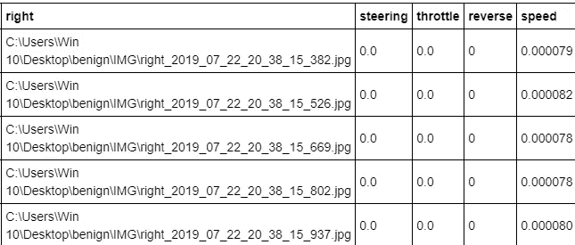

# 如何使用深度学习训练你的自动驾驶汽车

> 原文：<https://towardsdatascience.com/how-to-train-your-self-driving-car-using-deep-learning-ce8ff76119cb?source=collection_archive---------2----------------------->

## 一个端到端的指南，使用深度学习编程你的自动驾驶汽车转向

Photo by [Robin Pierre](https://unsplash.com/@robinpierre?utm_source=unsplash&utm_medium=referral&utm_content=creditCopyText) on [Unsplash](https://unsplash.com/search/photos/traffic?utm_source=unsplash&utm_medium=referral&utm_content=creditCopyText)

被困在付费墙后面？点击[这里](/how-to-train-your-self-driving-car-using-deep-learning-ce8ff76119cb?source=friends_link&sk=b7d7dc697857933a5ce3f06753df6b33)阅读完整故事与我的朋友链接！

每年，交通事故占全球死亡人数的 [2.2%。一年累积起来大约是 130 万——每天 3287。除此之外，每年约有 2000-5000 万人在与汽车相关的事故中严重受伤。这些事故的根源？人为错误。](http://asirt.org/Initiatives/Informing-Road-Users/Road-Safety-Facts/Road-Crash-Statistics)

从分心驾驶到酒后驾驶到鲁莽驾驶到粗心驾驶，一个糟糕或疏忽的决定可能是典型驾驶和危及生命的情况之间的差异。但是如果我们能从等式中消除人为错误会怎么样呢？

“自动驾驶汽车不再受制于好莱坞科幻电影”——特斯拉公司和 SpaceX 的创始人埃隆·马斯克认为，十年内，自动驾驶汽车将像电梯一样普遍。

业内专家表示，这项技术将会颠覆并彻底改变我们所知的交通运输的未来。

# 挑战

训练一个端到端的深度学习模型，让汽车在驾驶模拟器中自动驾驶。这是一个汽车转向角和汽车摄像头实时拍摄的道路图像之间的监督回归问题。

这个项目的灵感来自英伟达的端到端自动驾驶汽车论文，可以在这里找到。

# 数据收集

[High-level view of the Nvidia’s data collection system](https://images.nvidia.com/content/tegra/automotive/images/2016/solutions/pdf/end-to-end-dl-using-px.pdf)

在这个项目中，使用了 Udacity 驾驶模拟器，它有两条不同的赛道。其中一个用于收集训练数据，另一个——模型从未见过——作为测试集的替代品。

驾驶模拟器将保存三个前置“摄像机”的画面，从汽车的角度记录数据；以及各种驾驶统计数据，如油门、速度和转向角度。我们将使用相机数据作为模型输入，并期望它预测[-1，1]范围内的转向角。

# 环境和工具

1.  matplotlib
2.  克拉斯
3.  numpy
4.  熊猫
5.  sci kit-学习

Google’s self-driving car — Waymo

# 代码在哪里？

事不宜迟，让我们从代码开始吧。github 上的完整项目可以在[这里](https://github.com/abhinavsagar/Self-Driving-Car)找到。

我从加载所有需要的库和依赖项开始。

该数据集有 6 列—中间、左侧、右侧(摄像机图像路径)、转向、油门、倒车、速度(值)。我使用 pandas dataframe 来显示数据集中的前五行。

因为左、右和中心图像路径的前缀对于所有行都是相同的，所以我决定移除整个数据集中的前缀部分。

接下来，我绘制了方向盘角度值的分布。正如你所看到的，在零附近有一个巨大的尖峰，这意味着大部分时间汽车是直线行驶。

然后，我创建了一个函数，将所有图像以及方向盘角度值加载到一个 numpy 数组中。

下一步是使用 80–20 规则分割数据，这意味着使用 80%的数据进行训练，而剩余的数据用于在看不见的图像上测试模型。此外，我绘制了样本训练和验证转向角分布。

我继续做一些图像处理。我裁剪了图像以去除不必要的特征，将图像转换为 YUV 格式，使用高斯模糊，减小尺寸以便于处理，并对值进行归一化。

为了比较和可视化，我绘制了原始图像和预处理图像。

到目前为止一切顺利。接下来，我将所有图像转换成 numpy 数组。

下一步是构建模型。我已经使用 ResNet 作为预训练的权重。我已经删除了最后 4 层，使我自己的定制神经网络。

[Training the Neural Network](https://images.nvidia.com/content/tegra/automotive/images/2016/solutions/pdf/end-to-end-dl-using-px.pdf)

在沉重的 resnet 架构之上，我使用了 flatten 层来归一化权重。接下来，我使用了分别具有 100、50 和 10 个神经元的三个密集层，并将 elu 作为激活函数。此外，在这两者之间，我使用了 50%的退出率来减少对训练集的过度拟合。

最后，我用 128 的批量训练了 25 个时期的模型。此外，我绘制了训练和验证损失作为时代的函数。

Loss vs epoch

这个模型在仅仅 25 个时期内收敛得相当好。这意味着它正在学习一个相当好的策略，在看不见的道路环境中驾驶汽车。请随意使用超参数以获得更好的效果。

# 结果

我对这辆车在试车跑道上的表现感到惊讶。美国有线电视新闻网从未见过这个轨道。在训练赛道上的表现有点偏离，但我认为这没什么，因为这表明赛车不仅仅是在记忆赛道。它成功地从一些危急情况中恢复过来，尽管这些机动在训练中没有进行过。

# 结论

总的来说，这是一个非常有趣，同时又富有挑战性的项目。深度学习是一个令人兴奋的领域，我们很幸运生活在这个发明的时代。

10 年后，我们大多数人可能都不会拥有汽车。我们会向像优步这样的公司订购一些服务……我们会每月支付 149 美元，每天早上醒来，我们的车道上会有一辆车载着我们去上班。

# 参考资料/进一步阅读

 [## 自动驾驶汽车的端到端深度学习

### 在一个新的汽车应用中，我们使用卷积神经网络(CNN)来映射来自一个

devblogs.nvidia.com](https://devblogs.nvidia.com/deep-learning-self-driving-cars/)  [## 使用交互式代码实现英伟达用于自动驾驶汽车的神经网络[手动…

### 所以最近碰到这个 Quora 的问题，“用于自动驾驶汽车的神经网络有几层？”…

towardsdatascience.com](/implementing-neural-network-used-for-self-driving-cars-from-nvidia-with-interactive-code-manual-aa6780bc70f4)  [## uda city/自动驾驶汽车模拟

### 这个模拟器是为 Udacity 的自动驾驶汽车 Nanodegree 建造的，旨在教学生如何训练汽车如何导航…

github.com](https://github.com/udacity/self-driving-car-sim) 

# 在你走之前

github 上相应的项目可以在这里找到。

 [## abhinavsagar/自动驾驶汽车

### 使用 google colab 中预先训练的 ResNet50 权重进行端到端自动驾驶的转移学习。火车 a…

github.com](https://github.com/abhinavsagar/Self-Driving-Car) 

快乐阅读，快乐学习，快乐编码！

# 联系人

如果你想了解我最新的文章和项目[，请关注我的媒体](https://medium.com/@abhinav.sagar)。以下是我的一些联系人详细信息:

*   [个人网站](https://abhinavsagar.github.io)
*   [领英](https://in.linkedin.com/in/abhinavsagar4)
*   [中等轮廓](https://medium.com/@abhinav.sagar)
*   [GitHub](https://github.com/abhinavsagar)
*   [卡格尔](https://www.kaggle.com/abhinavsagar)