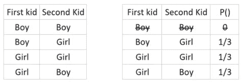
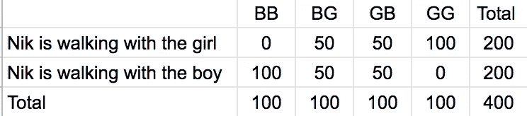
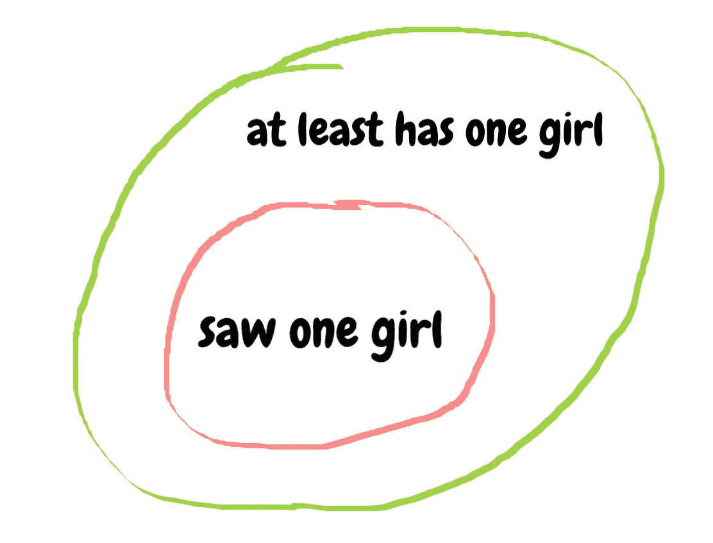
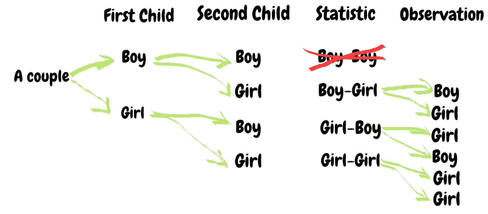

# 如何用简单的统计问题欺骗聪明的数据科学家

> 原文：<https://towardsdatascience.com/how-to-trick-a-smart-data-scientist-with-a-simple-statistical-problem-531f91e40ba5?source=collection_archive---------4----------------------->

> **“概率是人生的向导”**
> ――列纳德·蒙洛迪诺，《酒鬼的行走:随机是如何主宰我们的生活的》。
> 
> **这是我的《我们生活的算法》系列之一。参见** [**链接**](/probabilistic-thinking-the-one-critical-right-left-behind-by-most-people-2f78c2454fdf) **中另一个有趣的问题。**

首先，确保你想捉弄的人真的很聪明。

**其次**，你使用的问题应该直截了当。

事实上，随着互联网的扩散，没有太多严谨的话题仍然存在争议。(感谢谷歌和维基百科)

但是，我今天要讨论的话题已经在网上激烈争论了几年了。这也导致了科学专业人士和数据科学家之间的分歧。

事不宜迟，我们开始吧。

## 看问题

列纳德·蒙洛迪诺是一名物理学家，也是史蒂芬·霍金的合著者。他的书 [*《酒鬼之行:随机性如何主宰我们的生活》*](https://www.goodreads.com/book/show/2272880.The_Drunkard_s_Walk) *，* 谈到了随机性和导致人们错误判断周围世界的认知偏差，然后给了我们如何做出明智决定的建议。

在介绍“样本空间”概念的章节中，Mlodinow 使用了下面的例子，

> 问题 A:男孩还是女孩
> 
> 我的朋友尼克有两个孩子，他告诉你他至少有一个女孩，那么另一个孩子是女孩的概率是多少？

这似乎是一个简单的问题，直觉的回答是:我们知道一个是女孩，因此另一个是女孩的可能性应该是 50-50？

***其实不然。***

基于样本空间理论，我们可以列出所有可能的随机样本。

所以根据这个表，答案是 **1/3，又名，33.3%** 。

这个问题令人困惑的部分是上下文，Mlodinow 指出，如果我们指定第**个第**个是女孩，那么第**个第二**个女孩的概率是 50 %。

## 讨论

然而，另一个聪明人不同意 Mlodinow 的理论。

来自[波莫纳学院](https://en.wikipedia.org/wiki/Pomona_College)的经济学教授加里·史密斯。他在耶鲁大学获得了经济学博士学位，之后被聘为助理教授。

在他的书中， [*基本统计学、回归和计量经济学*](https://www.amazon.com/Essential-Statistics-Regression-Econometrics-Smith/dp/0123822211) *，*他*引用了上面* Mlodinow 的例子作为对现实世界的一个标志性误解。他用不同的方式提问。

> 问题 B:另一个孩子
> 
> 你看到我的朋友尼克和他的女儿走在街上。尼克告诉你他家里还有一个孩子。那么，另一个孩子是女孩的概率是多少？

这个问题看起来与 Mlodinow 的问题非常相似，但 Gary 有不同的答案和解释。

首先，他批评了答案“33.3%”的说法是错误的，然后他在下表中通过推理展示了他的理论。

男孩用 B 表示，因此 BB 表示第一个和第二个孩子都是男孩。

女孩用 G 表示，BG 表示第一个孩子是男孩，但第二个是女孩。

该表显示了平均分布在四个类别中的 400 个家庭。根据加里的说法，我们可以做出如下推论，

***已知事实***

*   对于 BB 的 100 个随机样本，Nik 总是和一个男孩一起散步
*   在 GG 的 100 个随机样本中，Nik 总是和一个女孩一起散步。
*   如果尼克有一个男孩和一个女孩，一个合理的假设是，他和一个男孩或女孩一起走路的概率是相同的。

***分析***

*   检查表格的第一行。当尼克和一个女孩散步时，我们可以假设有 100 个样本(GG)表明缺席的孩子也是一个女孩，而在其他 50+50 个样本(BG & GB)中，缺席的孩子是一个男孩。
*   当尼克和一个男孩散步时，可以做出同样的推断，我们只需要比较 BB 和 BG+GB 的概率(100 比 50+50)

***结论***

不管尼克现在和谁在一起。另一个孩子的“男孩或女孩”概率保持不变。(*它们是自变量*)因此答案是**的 1/2，而不是 1/3** 。

当然，还有一个更直观的解释:当你看到一个女孩时，这是一个独立的事件，因此对其他孩子的性别没有影响。

如果你现在没有感到一点困惑，你可能仍然对这个问题有肤浅的理解(或者你是一个真正的天才，等着看你是否有与下面解释相似的思维过程)。

## 深入问题…

那么，Gary 和 Mlodinow，谁是对的，谁是错的？

事实上，他们都是对的，因为他们试图解决两个不同的问题。让我们再来看看上面的问题，

*   我的朋友尼克有两个孩子，他告诉你他至少有一个女孩，另一个孩子也是女孩的概率是多少？
*   你看到我的朋友尼克带着他的女儿走在街上。尼克告诉你他家里还有一个孩子，那么，另一个孩子是女孩的可能性有多大？

“看见一个女孩”和“至少是一个女孩”有区别吗？

你怎么想呢?现在是迷惑聪明人的时候了。经济学教授加里混淆了这两种说法的不同之处。

解释这种困惑的最简单也是最优雅的方式是贝叶斯方程。但是现在，我想尝试一种不同的方式来解释这个问题。(利用全概率定律)。

“至少有一个女孩”和“看到一个女孩”不是一回事。

这两个前提之间的差异可以表示为“时间和空间”维度中的“全局关系与局部关系”。

1.  ***空间维度的“全球关系 VS .社会关系”。***

“至少有一个女孩”并不保证你能看到一个女孩。

如上图所示，“至少有一个女孩”比“看见一个女孩”的覆盖面更大，因此在某种程度上，“看见一个女孩”的信息有更多的概率描述。

2. ***时间维度的“全局与局部关系”。***

“至少有一个女孩”是鸟瞰统计结果的视图。

“看见一个女孩”是人类观察的一个视角。

下面显示了更直观的描述，

**统计**是对样本空间的总体描述。**观察**是平行宇宙中一个可能组合的实际事件(所有可能同时发生的事情)。

在理解了这两个问题之间的根本区别之后，我们可以得出结论说

*   “至少有一个孩子是女孩”是自然样本空间中一个普遍的概率问题。因此，答案应该是 1/3
*   “看见一个女孩”是要求从当前的观察中预测未知。这是贝叶斯统计。

因此，“看到一个女孩，并询问另一个孩子是女孩的概率”，等于“有两个孩子，你看到其中一个是女孩，那么这个女孩来自'女孩-女孩'家庭的概率是多少？”

对于“猜性别”这个话题就够了。

综上所述，即使是我们的系统 1 ( *快，直觉的本能，以及来自‘思考，快与慢’*的感性大脑)也没有对概率有很好的直觉。但是，我们总是可以通过提高对概率因果关系的认识来提高我们解释周围环境中的动态和不确定性的能力。

## 摘要

如何通过概率建立主观假设和客观结果之间的联系？

为什么事件的偶然性概率会受到现实世界观察的影响？

未来将要发生的事情和过去发生的事情有什么根本的区别？

最后，如果你想找到一种方法来回答这些问题，或者你想欺骗你的聪明的数据科学朋友，下面的书将是一个好的开始。

*   [酒鬼的行走:随机性如何主宰我们的生活](https://www.goodreads.com/book/show/2272880.The_Drunkard_s_Walk)
*   [*统计、回归和计量经济学*](https://www.amazon.com/Essential-Statistics-Regression-Econometrics-Smith/dp/0123822211)
*   《为什么之书:因果的新科学》

*关于我，我是*👧🏻*现居澳大利亚墨尔本。我学的是计算机科学和应用统计学。我对通用技术充满热情。在咨询公司做 AI 工程师*👩🏻‍🔬，帮助一个组织集成人工智能解决方案并利用其创新力量。在[**LinkedIn**](https://www.linkedin.com/in/catherine-wang-67547a53/)**上查看更多关于我的内容。**