# 如何对你的 Azure 数据科学项目进行审计跟踪

> 原文：<https://towardsdatascience.com/how-to-troubleshoot-your-azure-data-science-project-in-production-5382b66cbaf9?source=collection_archive---------18----------------------->

# 1.介绍

假设一个机器学习模型正在生产中运行，重要的决策都是基于它的预测。或者假设一个模型有奇怪的结果，需要进行故障排除。因此，模型的审计跟踪是必不可少的，至少可以追溯到以下内容:

*   模型预测的记录
*   模型的版本和度量
*   模型中使用的数据和算法
*   创建模型的个人/团队

在这篇博客中，定义了一个 Azure 数据科学项目，然后讨论了如何创建审计跟踪。如果你对这个项目具体是如何实施的感兴趣，可以参考我之前的[博客](/how-to-bring-your-data-science-project-in-production-b36ae4c02b46)。请注意，这篇博客是独立的，没有必要先阅读前面的博客。

# 2.Azure 数据科学项目的设置

Azure 提供了很多进行数据分析和数据科学的可能性。在这个项目中，流行的 Azure 服务的功能被组合起来，以创建一个预测端点。项目的设置可以描述如下:

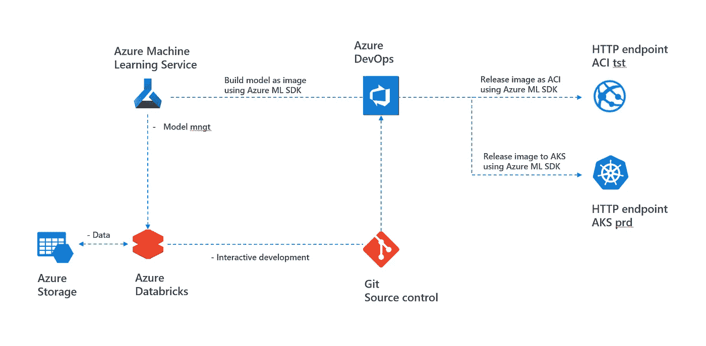

2\. Setup of Azure data science project using popular Azure services

Azure 服务及其在本项目中的使用可以描述如下:

*   **Azure Storage gen 2** 用于存储数据。数据是不可变的，并且新数据被添加到具有时间戳的单独文件夹中，使得当它被添加时是清楚的。
*   **Azure Databricks** 用于模型的交互开发和特征工程。Azure ML 服务使用 Databricks Spark 集群作为计算来训练模型。请注意，创建了 sparkml 模型，但也可能创建了 scikit-learn 模型。
*   Git 用于笔记本的源代码控制，并作为资源库链接到 Azure Devops。在这个项目中，使用了 Azure DevOps 中的 git，但也可以使用 GitHub。
*   **Azure 机器学习(ML)服务**用于跟踪模型及其指标。Azure ML Service SDK 用于创建模型的 docker 映像并将其部署到 Azure Container 容器和 Azure Kubernetes 服务。有关使用 Azure ML 服务的部署可能性的概述，请参见此处的。
*   **Azure DevOps** 用于设置构建/发布管道。在构建阶段，使用 git、Databricks Spark Clusters 和 Azure ML Service SDK 创建 docker 映像。在发布阶段，docker 映像被部署为 Azure 容器实例用于测试，然后部署到 Azure Kubernetes 服务用于生产。
*   **Azure 容器实例(ACI)** 用作测试端点，而 **Azure Kubernetes 服务(AKS)** 用于生产。AKS 具有可扩展性、安全性和容错性。将 AKS 与 Azure ML Service SDK 一起使用，许多功能都是现成的，例如[记录和评估模型数据](https://docs.microsoft.com/en-us/azure/machine-learning/service/how-to-enable-data-collection)和[监控失败率、请求率](https://docs.microsoft.com/en-us/azure/machine-learning/service/how-to-enable-data-collection)

本项目的设置可视为“同类最佳”方法，具有以下优点/缺点:

*   这种设置的优点是团队可以使用他们最喜欢和最有经验的工具。例如，使用已经用于其他 IT 项目的 Azure DevOps。或者使用已经用于公司内部其他大数据项目的 Azure Databricks。
*   缺点是保留审计线索和故障排除会变得更加复杂。这将在下一章讨论。

# 3.审查跟踪

假设一个审计员想知道为什么使用 ML 模型做出某个决定(例如，为什么这个抵押被拒绝？).然后需要使用审计线索追溯模型决策的基础。在本章的剩余部分，将对本博客第一部分中介绍的主题进行审计跟踪，如下所示:

*   3a。记录模型请求和预测
*   3b。模型、图像和 HTTP 端点的版本
*   3c。模型的度量和统计
*   3d。模型中使用的数据和源代码
*   3e。创建模型的个人/团队

## 3a。记录模型请求和预测

在数据科学项目中，该模型使用 Azure ML 服务 SDK 部署在 AKS 产品中。使用 Azure ML service SDK 和[记录和评估模型数据](https://docs.microsoft.com/en-us/azure/machine-learning/service/how-to-enable-data-collection)特性，可以记录所有的模型请求和预测。这记录在 Azure 存储帐户中，该帐户附加到/modeldata/文件夹中的 Azure ML 服务工作区，另请参见下文:

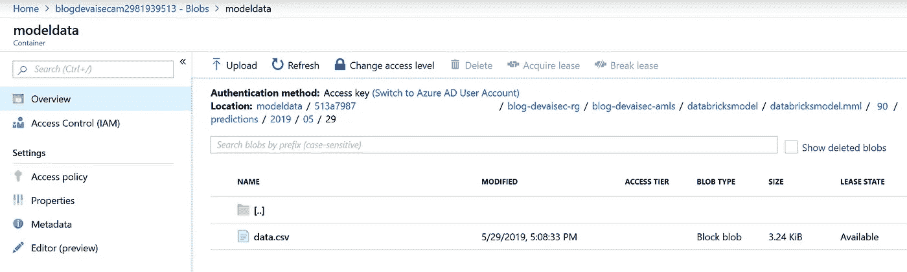

3a1\. Storage account where logging is stored

在 data.csv 中，可以找到请求的时间戳、输入数据和预测，请参见下面的示例

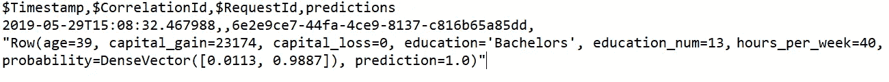

3a2\. Logging of input request and logging

## 3b。模型、docker 映像和 HTTP 端点的版本

为了链接模型、图像和 HTTP 端点，请转到 Azure portal 中的 Azure ML 服务工作区，然后转到“部署”选项卡。这里可以看到 AKS 中使用的 HTTP 端点的 IP 地址和 docker 镜像版本。

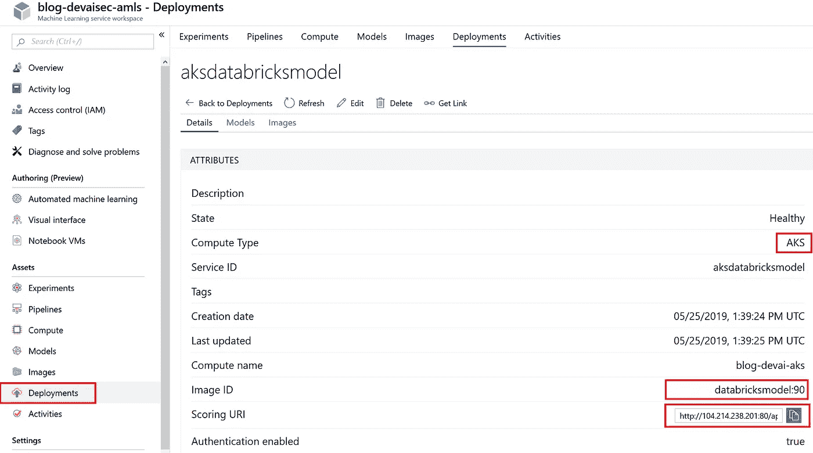

3b1\. HTTP endpoint, AKS and image

随后，可以在模型选项卡中找到模型版本。

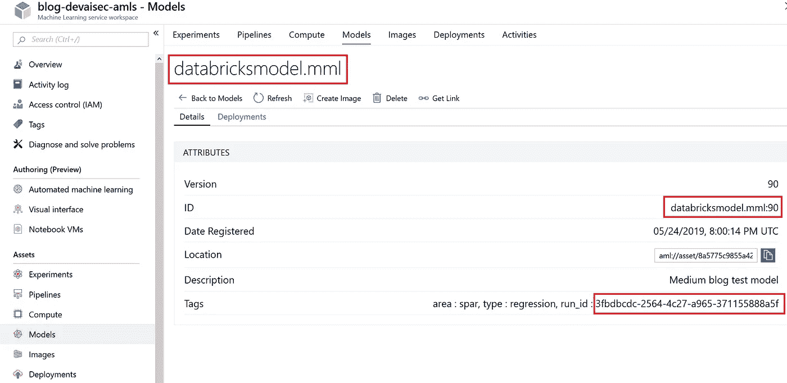

3b2\. Model used in docker image

请注意，可以在标签中找到的运行 id。这可以用于在下一部分中检索模型度量。

## 3c。模型的度量和日志记录

使用前一部分中的 run_id，您可以查找模型的度量和统计数据。转到 Experiments 并使用过滤器中的 run_id 来查找模型的指标。

3c1\. Retrieve model metrics

对于该模型，记录 roc、prc 和假/阴性阳性/阴性。此外，您还可以使用 matplotlib 创建图像。

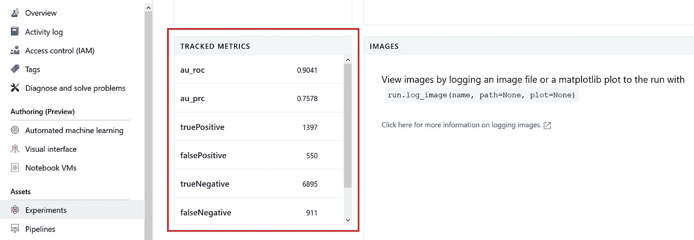

3c2\. Display metics of models

## 3d。模型中使用的数据和源代码

在这一部分中，将确定用于训练模型的数据和来源。所有源代码和数据都存储在 Azure DevOps 项目的存储库中，因此第 3b 部分中确定的模型需要链接到存储库。

首先，查找使用 Azure ML 服务 API 将图像部署为容器的发布管道。在这个项目中，创建了一个夜间构建/发布管道，因此可以查看最后一个成功的发布，如下所示

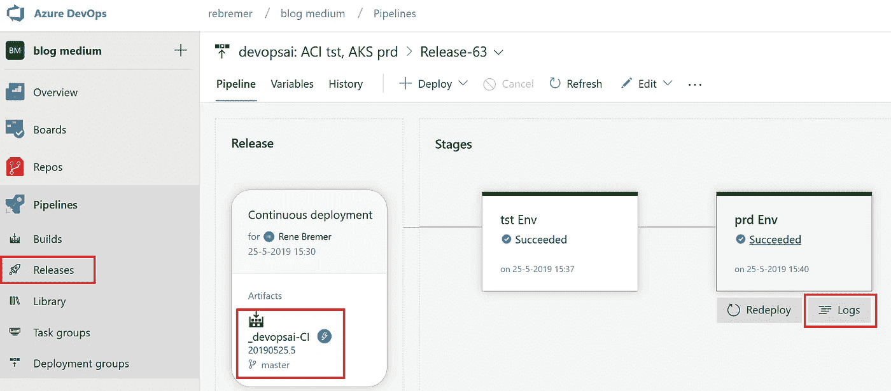

3d1\. Last succesfull build/release in Azure DevOps

在发布的日志中，可以找到发布步骤的日志。在部署步骤的日志中，可以找到对应于步骤 3b 中的 IP 和版本的 HTTP IP 地址和映像版本，见下文。

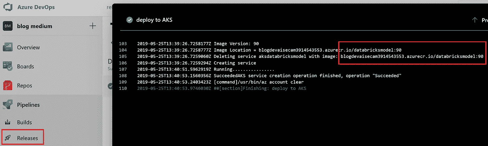

3d2\. Logging of release

随后，通过点击工件框来下载发布的所有输入。在这个下载中，可以找到所有源代码，见下文。

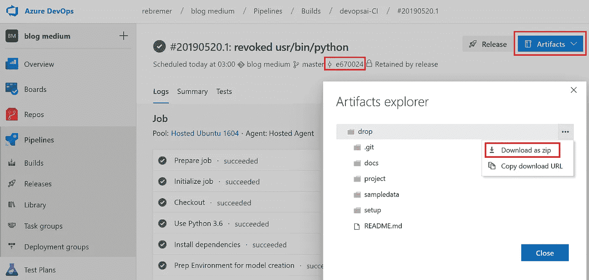

3d3\. Download build artifact

在这个项目中，数据不是版本控制的一部分，也没有存储在工件中。相反，数据存储在 Azure Storage gen 2 上，并且是不可变的。新数据被添加到带有时间戳的新文件夹中。随后，在构建管道中，记录哪些文件夹用于训练模型，从而可以清楚地知道使用了什么数据。

## 3e。创建模型的个人/团队

在上一节中，确定了用于创建模型的源代码和数据。在这一部分，追溯了是哪个人/团队更改了代码，以及这是在什么时候发生的。在步骤 3c 中下载的构建工件中，也可以找到提交 id，在本例中是 e670024。当您单击这个发布时，代码与之前的提交有所不同。此外，还可以找到变更的人员和日期，见下文。

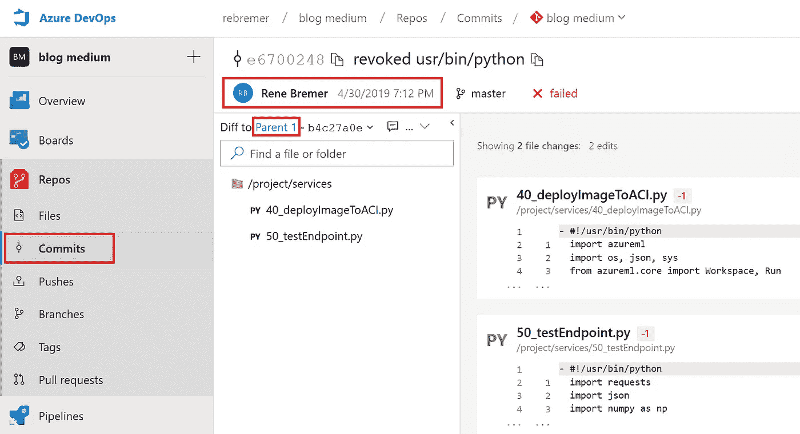

3e1\. Code compare with previous commit

通过单击 Parent 1 链接，您可以追溯到上一次提交，直到发现可疑的更改。或者，您也可以直接转到“提交”选项卡，查看最近提交的概述，并从那里开始，见下文。

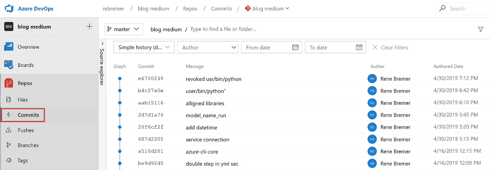

3e2\. Commit overview

最后，请注意，可以将您的 Azure Git 存储库与 Azure Databricks 连接起来，Azure Databricks 在本项目中用作交互式开发环境，请参见下面的截图以及使用此处[的解释](https://docs.azuredatabricks.net/user-guide/notebooks/azure-devops-services-version-control.html)

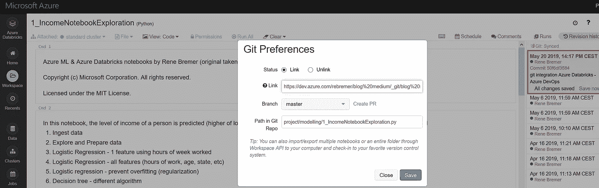

3e3\. Azure Databricks integration with Azure DevOps

# 4.结论

在这篇博客中，描述了一个数据科学项目的设置，其中结合了流行的 Azure 服务的功能。然后讨论了如何在这个项目中保留审计线索，以便可以追溯预测所基于的内容。当模型预测令人费解时，拥有一个良好的审计线索也有助于排除故障。这有助于将你的项目投入生产，参见下面的架构。

4\. Setup of Azure Data Science project