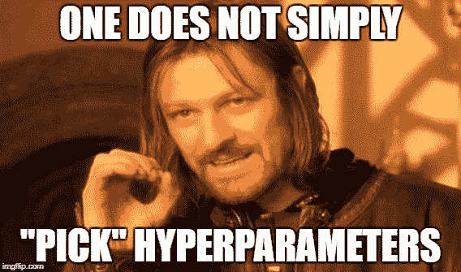
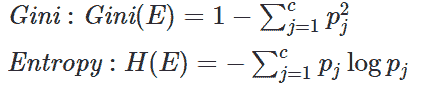

# 如何调优决策树？

> 原文：<https://towardsdatascience.com/how-to-tune-a-decision-tree-f03721801680?source=collection_archive---------0----------------------->

决策树的超参数如何影响您的模型，您如何选择要优化的超参数？


# 超参数调谐

> 超参数调优是在超参数空间中搜索一组可以优化模型架构的值。

这与调整模型参数不同，在模型参数调整中，您会搜索最能最小化成本函数的特征空间。

超参数调整也很棘手，因为没有直接的方法来计算超参数值的变化将如何减少模型的损失，所以我们通常求助于实验。首先，我们为所有超参数指定一个可能值的范围。现在，这是大多数人陷入困境的地方，我要尝试什么值，为了回答这个问题，你首先需要理解这些超参数的含义，以及改变超参数将如何影响你的模型架构，从而尝试理解你的模型性能可能如何改变。

定义值的范围后，下一步是使用超参数调整方法，有一堆，最常见和最昂贵的是网格搜索，其他如随机搜索和贝叶斯优化将提供“更智能”，更便宜的调整。这些方法并不是本文的重点，但是如果您想了解更多，请查看参考资料部分[1]。

# 决策图表

决策树是最流行和最广泛使用的机器学习算法之一，因为它对噪声的鲁棒性、对丢失信息的容忍度、对不相关的冗余预测属性值的处理、低计算成本、可解释性、快速运行时间和鲁棒预测器。我知道，这太多了😂。但是学生问我的一个常见问题是如何调整决策树。对于最大深度，我应该尝试的值的范围应该是什么，在叶节点上需要的样本的最小数量应该是什么？这些都是很好的问题，没有直接的答案，但我们可以做的是了解改变一个会如何影响你的模型。比如增加最大深度到底意味着什么，改变最小样本叶子对你的模型有什么影响。因此，在本文中，我试图向您介绍这些参数，以及它们如何影响您的模型架构，以及它对您的模型的一般意义。



让我们看看 Scikit-learn 的决策树实现，让我解释一下这些超参数是什么，以及它们如何影响您的模型。顺便说一下，我假设你对决策树有一个基本的了解。

由于决策树主要是一个分类模型，我们将研究决策树分类器。

# 决策树分类器

**条件:字符串，可选(default="gini"):**

> 衡量分割质量的函数。支持的标准是基尼杂质的“基尼”和信息增益的“熵”。

如果你想知道决策树节点是如何分裂的，那是通过使用杂质。杂质是节点上标记同质性的量度。有许多方法来实现杂质测量，其中两个 scikit-learn 已经实现的是信息增益和基尼杂质或基尼指数。

信息增益使用熵度量作为杂质度量，并且分割节点，使得它给出最大量的信息增益。而 Gini 杂质测量目标属性值的概率分布之间的差异，并分割节点以使其给出最少量的杂质。

根据论文“基尼指数和信息增益标准之间的理论比较”[3]，基尼指数和信息增益一致/不一致的频率仅占所有情况的 2%，因此对于所有意图和目的，您几乎都可以使用两者之一，但唯一的区别是熵的计算可能稍慢，因为它需要您计算对数函数:



许多研究人员指出，在大多数情况下，分裂标准的选择不会对树的性能产生太大影响。正如“没有免费的午餐”定理所表明的那样，每个标准在某些情况下是优越的，而在另一些情况下是低劣的。

***拆分器:字符串，可选(默认= "最佳")***

> 用于在每个节点选择拆分的策略。支持的策略是选择最佳分割的“最佳”和选择最佳随机分割的“随机”。

根据 scikit-learn 的“最佳”和“随机”实现[4],“最佳”分离器和“随机”分离器都使用基于 Fisher-Yates 的算法来计算特征阵列的排列。您实际上不需要担心算法，唯一的区别是，在“最佳”拆分器中，它在拆分之前使用标准评估所有拆分，而“随机”拆分器使用随机统一函数，将最小特征值、最大特征值和随机状态作为输入。我们将在下面研究这些是什么，但现在，让我们看看拆分器将如何影响模型。

假设您有数百个要素，那么“最佳”拆分器将是理想的，因为它将根据杂质测量计算要拆分的最佳要素，并使用它来拆分节点，而如果您选择“随机”,则您很有可能最终得到的要素实际上不会提供那么多信息，这将导致树更深、更不精确。

另一方面,“随机”拆分器有一些优点，特别是，由于它随机选择一组要素并进行拆分，因此它没有计算最佳拆分的计算开销。其次，它也不太容易过度拟合，因为在每次分割之前，您基本上不会计算最佳分割，额外的随机性将在这里帮助您，所以如果您的模型过度拟合，那么您可以将分割程序更改为“随机”并重新训练。

因此，对于一个没有任何过度拟合的具有很少特征的树，为了安全起见，我会选择“最好的”拆分器，这样你就可以得到最好的模型架构。

***max_depth: int 或 None，可选(默认=None)***

> 树的最大深度。如果没有，则扩展节点，直到所有叶子都是纯的，或者直到所有叶子包含少于 min_samples_split 样本。

决策树可以达到的理论最大深度比训练样本的数量少 1，但是没有算法会让你达到这一点，原因很明显，一个很大的原因是过度拟合。请注意，这是训练样本的数量，而不是特征的数量，因为数据可以在同一特征上拆分多次。

让我们先来谈谈缺省的 None 情况，如果你不指定树的深度，scikit-learn 将扩展节点直到所有叶子都是纯的，这意味着如果你为 min_samples_leaf 选择 default，叶子将只有标签，其中缺省值是 1。请注意，这些超参数中的大多数都是相互关联的，我们将很快讨论 min_samples_leaf。另一方面，如果您指定一个 min_samples_split(我们接下来将会看到),那么节点将会展开，直到所有叶子包含的样本数都少于最小样本数。Scikit-learn 将根据哪个给你的树提供最大深度来选择一个。这里有许多移动的部分，min_samples_split 和 min_samples_leaf，所以让我们单独取 max_depth，看看当您更改它时，您的模型会发生什么，这样在我们完成 min_samples_split 和 min_samples_leaf 后，我们可以更好地直观了解所有这些是如何组合在一起的。

一般来说，你允许你的树增长得越深，你的模型将变得越复杂，因为你将有更多的分裂，它捕获更多的关于数据的信息，这是决策树过度拟合的根本原因之一，因为你的模型将完全适合训练数据，并且将不能在测试集上很好地概括。因此，如果您的模型过度拟合，减少 max_depth 的数量是防止过度拟合的一种方法。

深度太低也不好，因为模型会过拟合，所以如何找到最佳值，请进行实验因为过拟合和过拟合对数据集来说都是非常主观的，没有一个值适合所有解决方案。所以我通常做的是，让模型首先决定 max_depth，然后通过比较我的训练和测试分数，我寻找过度拟合或欠拟合，并根据我减少或增加 max_depth 的程度。

***min_samples_split: int，float，optional(默认值=2)***

> 分割内部节点所需的最小样本数:

*   *如果 int，那么考虑 min_samples_split 作为最小数。*
*   *如果是 float，那么 min_samples_split 是一个分数，ceil(min _ samples _ split * n _ samples)是每次拆分的最小样本数。*

min_samples_split 和 min_samples_leaf，如果你读了它们的定义，听起来好像是一个隐含着另一个，但是你需要注意的是，leaf 是一个外部节点，min_samples_split 指的是一个内部节点，根据定义，内部节点可以进一步拆分，而根据定义，leaf 节点是一个没有任何子节点的节点。

假设您指定了一个 min_samples_split，并且产生的拆分导致一个具有 1 个样本的叶，并且您将 min_samples_leaf 指定为 2，那么您的 min_samples_split 将不被允许。换句话说，无论 min_samples_split 值是多少，min_samples_leaf 始终是有保证的。

根据该论文，关于决策树的超参数调整的实证研究[5]对于在 scikit-learn 中实现的 CART 算法，理想的 min_samples_split 值往往在 1 到 40 之间。min_samples_split 用于控制过拟合。较高的值会阻止模型学习可能高度特定于为树选择的特定样本的关系。过高的值也会导致欠拟合，因此根据欠拟合或过拟合的程度，您可以调整 min_samples_split 的值。

***【min _ samples _ leaf:int，float，optional(默认值=1)***

> 叶节点上所需的最小样本数。任何深度的分裂点只有在左和右分支的每一个中留下至少 min_samples_leaf 训练样本时才会被考虑。这可能具有平滑模型的效果，尤其是在回归中。

*   *如果 int，那么考虑 min_samples_leaf 为最小数。*
*   *如果是 float，那么 min_samples_leaf 是一个分数，ceil(min _ samples _ leaf * n _ samples)是每个节点的最小样本数。*

类似于 min_samples_split，min_samples_leaf 也用于通过定义每个叶具有多个元素来控制过拟合。从而通过为每个样本专门创建一堆小分支来确保树不会过度适应训练数据集。实际上，这实际上只是告诉树，每片叶子的杂质不一定是 0，我们将在 min _ infinity _ decrease 中进一步研究杂质。

论文《决策树超参数调优的实证研究》[5]也指出，对于 CART 算法，理想的 min_samples_leaf 值往往在 1 到 20 之间。本文还指出，根据其相对重要性分析，min_samples_split 和 min_samples_leaf 对最终树的性能影响最大[5]。

根据 scikit-learn，我们可以使用 min_samples_split 或 min_samples_leaf，通过控制将考虑哪些拆分来确保多个样本为树中的每个决策提供信息。他们还说，一个非常小的数字通常意味着树会过度适应，而一个大的数字会阻止树学习数据，这应该是有意义的。我认为一个例外是当你有一个不平衡的阶级问题时，因为少数阶级占多数的地区会很小，所以你应该用一个较低的值。

***min _ weight _ fraction _ leaf:float，可选(默认值=0。)***

> 要求位于叶节点的权重总和(所有输入样本)的最小加权分数。当未提供 sample_weight 时，样本具有相等的权重。

min_weight_fraction_leaf 是要求位于叶节点的输入样本的分数，其中权重由 sample_weight 确定，这是处理类不平衡的一种方法。类别平衡可以通过从每个类别中采样相等数量的样本来完成，或者优选地通过将每个类别的样本权重之和归一化为相同的值来完成。另请注意，min_weight_fraction_leaf 将比不知道样本权重的标准(如 min_samples_leaf)更少偏向主导类。

如果样本是加权的，那么使用基于权重的预修剪标准(例如 min_weight_fraction_leaf)来优化树结构将会更容易，这确保了叶节点包含样本权重总和的至少一部分。

***max_features: int、float、string 或 None，可选(默认=None)***

> 寻找最佳分割时要考虑的特征数量:

*   *如果 int，那么在每次分割时考虑 max_features 特性。*
*   *如果是 float，那么 max_features 是一个分数，在每次分割时考虑 int(max_features * n_features)个特征。*
*   *如果“自动”，那么 max_features=sqrt(n_features)。*
*   *如果“sqrt”，那么 max_features=sqrt(n_features)。*
*   *如果“log2”，那么 max_features=log2(n_features)。*
*   *如果没有，那么 max_features=n_features。*

*注意:直到找到节点样本的至少一个有效分区，对分割的搜索才会停止，即使它需要有效地检查多于 max_features 的特征。*

每次出现分裂时，您的算法都会查看大量特征，并使用基尼不纯度或熵选取具有最佳度量的特征，然后根据该特征创建两个分支。每次查看所有特征的计算量很大，因此您可以使用各种 max_features 选项来检查其中的一些特征。max_features 的另一个用途是限制过度拟合，通过选择数量减少的特征，我们可以增加树的稳定性，并减少方差和过度拟合。

至于在选项中选择哪一个，这将取决于您拥有的功能的数量、您想要减少的计算强度或您拥有的过度拟合的数量，因此如果您有很高的计算成本或您有很多过度拟合，您可以尝试使用“log2 ”,根据产生的结果，您可以使用 sqrt 稍微提高它，或者使用自定义浮点值进一步降低它。

***【random _ state:int，RandomState 实例或无，可选(默认=无)***

> 如果 int，random_state 是随机数生成器使用的种子；如果是 RandomState 实例，random_state 是随机数生成器；如果没有，随机数生成器就是 np.random 使用的 RandomState 实例。

哈哈臭名昭著的 random_state，大部分新手都这么问我，为什么是 1，为什么是 0，为什么是 42？42 因为那是生命的意义，咄。

random_state 并不是一个真正需要优化的超参数，您应该这样做吗😋。让我从何时以及为什么应该设置 random_state 开始。最直接的答案是，这样你就可以得到一致的结果，这在一定程度上是因为记住 splitter，它会给你的结果带来一些随机性，所以如果你重新运行决策树，你的结果会有所不同，但不应该太不同。

这就引出了我的下一个观点，我看到新学生在玩 random_state 值，他们的精度会发生变化，这是因为决策树算法是基于贪婪算法[6]的，它使用随机选择的特征(拆分器)重复多次，这种随机选择受到伪随机数发生器[7]的影响，伪随机数发生器[7]将 random_state 值作为种子值， 因此，通过改变 random_state，您可能会随机选取好的特征，但您需要认识到的是，random_state 不是一个超参数，随着 random_state 改变您的模型的准确性仅意味着您的模型有问题。 这是一个很好的暗示，在你的数据中有许多局部最小值，决策树没有很好地处理它，所以我宁愿让你设置一个 random_state 并调整你的其他参数，这样你就不会陷入局部最小值，而不是玩弄 random_state。

***min _ infinity _ decrease:float，可选(默认=0。)***

> 如果该分裂导致杂质减少大于或等于该值，则该节点将被分裂。
> 
> 加权杂质减少公式如下:

```
N_t / N * (impurity - N_t_R / N_t * right_impurity 
                    - N_t_L / N_t * left_impurity)
```

> 其中 N 是样本总数，N_t 是当前节点的样本数，N_t_L 是左子节点的样本数，N_t_R 是右子节点的样本数。
> 
> N，N_t，N_t_R，N_t_L 都是指加权和，如果传递 sample_weight。

最小杂质减少帮助我们根据杂质来控制树的生长深度。但是，这种杂质是什么，它如何影响我们的决策树？记得在标准部分，我们快速看了基尼指数和熵，它们是杂质的一种度量。杂质测量定义了多个类别的分离程度。通常，当属性值的数据被平均分割时，杂质测量值应该最大，当所有数据属于同一类时，杂质测量值应该为零。更详细的解释将需要我们进一步进入信息论，这不是本文的范围，所以我将尝试解释改变杂质值如何影响您的模型，以及如何知道何时改变这些值。

最好的方法是绘制决策树，并研究基尼指数。如果您对正在处理的数据集有领域知识，那么解释决策树应该相当容易，因为叶节点的基尼指数为 0，因为它是纯的，这意味着所有样本都属于一个类。然后，您可以查看导致基尼系数为 0 的分割，并查看是否有必要对您的类进行这样的分类，或者您是否可以减少深度，从而得到一个更概化的树，如果是这样，您可以增加 min _ infinity _ decrease 以防止进一步分割，因为现在，如果杂质没有减少您指定的数量，节点将不会进一步分割。请注意，这将影响你的整个树，所以，你必须用这些数字做实验，但上面的解释应该给你一个起点。

***class_weight:字典，字典列表，“平衡”或无，默认=无***

> 与{class_label: weight}形式的类相关联的权重。如果没有给定，所有类的权重都应该是 1。对于多输出问题，可以按照与 y 的列相同的顺序提供字典列表。

class_weight 用于为每个输出类提供权重或偏差。但这实际上意味着什么，看当算法计算熵或基尼不纯度以在节点处进行分裂时，产生的子节点由 class_weight 加权，根据您指定的类比例给出子样本权重。

当数据集不平衡时，这非常有用。通常，您可以从类的分布作为类权重开始，然后根据决策树的倾向，您可以尝试增加或减少其他类的权重，以便算法相对于其他类惩罚一个类的样本。最简单的方法是指定“平衡的”,然后从那里开始自定义权重。

请注意，这不像欠采样或过采样技术，一个类中的样本数量实际上不会改变，而是分配给它的权重会改变，您可以在打印决策树和每个节点中的值时看到这一点，它将变为

```
weight * (the number of samples from a class in the node) / (size of class)
```

***预排序:bool，可选(默认=False)***

> 是否对数据进行预排序，以加快拟合中最佳分割的查找速度。对于大型数据集上决策树的默认设置，将此设置为 true 可能会减慢训练过程。当使用较小的数据集或受限的深度时，这可以加速训练。

这个参数相当简单，如果您有一个小数据集，或者如果您将限制树的深度，并且在运行第一次迭代后，您有一个不平衡的树，其中大多数数据点仅位于叶节点的一小部分上，使用预排序将有助于您。

预排序的工作方式是，在学习之前首先对所有变量进行排序，在每个节点评估时使用排序向量，在选择最佳分割后，您将分割数据点和排序索引，以便将数据子集和排序索引子集发送到子节点。因此，你可以在递归中应用这一思想。但是，请注意，如果数据实例的数量大于输入要素的数量，则这种方法有效。

# 摘要

决策树的复杂性对其准确性有着至关重要的影响，并且它由所使用的停止标准和所采用的修剪方法来明确控制。通常，树的复杂性是通过以下度量之一来衡量的:节点总数、叶子总数、树深度和使用的属性数量[8]。max_depth、min_samples_split 和 min_samples_leaf 都是停止标准，而 min_weight_fraction_leaf 和 min _ infinity _ decrease 是修剪方法。

尽管所有这些几乎都实现了停止或修剪方法，但它在应用于模型的级别上有所不同。如果你有一个硬停止标准，你的模型可能会拟合不足，所以如果你把它改为一个宽松的停止标准，那么你的模型可能会过度拟合，这就是为什么我们有修剪方法。我们应该有一个宽松的停止标准，然后使用修剪来删除导致过度拟合的分支。但是请注意，修剪是准确性和可推广性之间的折衷，因此您的训练分数可能会降低，但是训练分数和测试分数之间的差异也会降低。

我希望您对这些参数有更好的了解，并且在优化超参数时，它们可能会如何相互作用。但是如果有不清楚的地方，请在评论中告诉我，我会很乐意进一步解释。

*随时加我上* [*领英*](https://www.linkedin.com/in/mukesh-mithrakumar/) *或者关注我上* [*脸书*](https://www.facebook.com/adhiraiyan) *。*

# 参考

[1] [机器学习模型的超参数调优。](https://www.jeremyjordan.me/hyperparameter-tuning/)

[2][sci kit-学习决策树分类器](https://scikit-learn.org/stable/modules/generated/sklearn.tree.DecisionTreeClassifier.html)

[3] Laura Elena Raileanu 和 Kilian Stoffel，“基尼指数和信息增益标准之间的理论比较”《数学和人工智能年鉴》41:77–93，2004 年。

[4] [Scikit-Learn 拆分器实现](https://github.com/scikit-learn/scikit-learn/blob/1495f69242646d239d89a5713982946b8ffcf9d9/sklearn/tree/_splitter.pyx)

[5]拉斐尔·戈梅斯·曼托瓦尼、托马什·霍瓦特、里卡多·切里、西尔维奥·巴尔邦·茹尼奥尔、华金·范舍伦、安德烈·卡洛斯·庞丝·德莱昂·费雷拉·德卡瓦略，“[决策树超参数调整的实证研究](https://arxiv.org/abs/1812.02207)”
arXiv:1812.02207

[6] [贪婪算法](https://en.wikipedia.org/wiki/Greedy_algorithm)

【7】[伪随机数发生器](https://en.wikipedia.org/wiki/Pseudorandom_number_generator)

[8] Lior Rokach，Oded Maimon，"第 9 章:决策树"