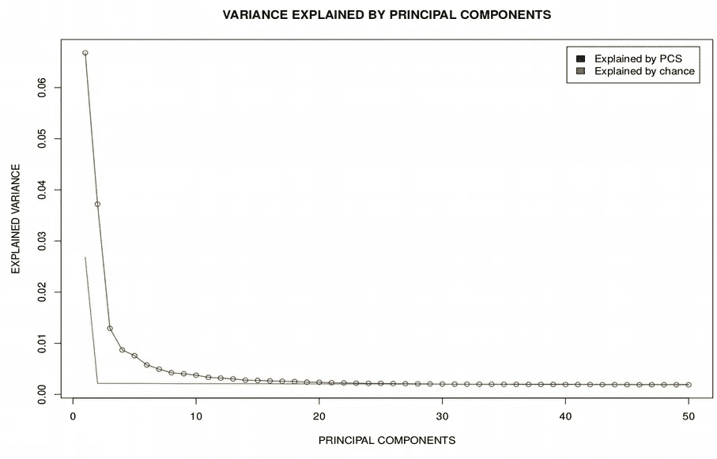

# 如何调整 tSNE 的超参数

> 原文：<https://towardsdatascience.com/how-to-tune-hyperparameters-of-tsne-7c0596a18868?source=collection_archive---------3----------------------->

## [生命科学的数理统计和机器学习](https://towardsdatascience.com/tagged/stats-ml-life-sciences)

## 三个简单的规则，使美丽的 tSNE 图

[Image source](https://satijalab.org/seurat/v1.4/pbmc3k_tutorial.html)

这是**生命科学的数理统计和机器学习**专栏的第二篇文章。在[第一篇](/do-we-have-big-data-in-life-sciences-c6c4e9f8645c)中我们讨论了在生命科学中我们是否以及在哪里有适合机器/深度学习的大数据，并强调了[单细胞](https://en.wikipedia.org/wiki/Single_cell_sequencing)是最有前景的大数据资源之一。[**t-分布式随机邻居嵌入(tSNE)**](https://en.wikipedia.org/wiki/T-distributed_stochastic_neighbor_embedding) 是一种机器学习非线性降维技术，对于单细胞数据分析来说是绝对核心的。然而，为 tSNE 选择超参数可能会让初学者感到困惑。

在这篇文章中，我将分享我对选择超参数的最佳值的建议，如**困惑度**、要保留的**主成分数**和运行 tSNE 的**迭代次数**。

# 如何有效地使用 tSNE

在教授[单细胞 RNA 测序(scRNAseq)课程](https://www.scilifelab.se/events/single-cell-rna-sequencing-data-analysis-2/)时，我不断收到关于**tSNE 对超参数**如困惑度的敏感性的问题。这些问题通常是由这篇精彩的文章激发的，这篇文章讲述了解读剧情的挑战。

A popular [tutorial](https://distill.pub/2016/misread-tsne/) on developing intuition behind tSNE

尽管我非常尊重帖子的主要信息，但我认为 scRNAseq 社区**不应该过于担心** **困惑**和其他 tSNE 超参数，因为:a)帖子中的许多例子来自抽象的数学拓扑，并不真正类似于 scRNAseq 数据，b)帖子专注于在现实世界 scRNAseq 分析中很少使用的极端 tSNE 超参数。

如果你做 scRNAseq 分析，你不会避免流行的 [**Rtsne**](https://www.rdocumentation.org/packages/Rtsne/versions/0.15/topics/Rtsne) 函数和 R 包，它是基于 [Barnes-Hut](https://github.com/lvdmaaten/bhtsne/) C++实现的[原始 tsne 算法](http://www.jmlr.org/papers/volume9/vandermaaten08a/vandermaaten08a.pdf)。Rtsne 函数有三个主要的超参数:

1.  initial_dims(默认值为 50)假设 pca=TRUE
2.  困惑(默认 30)
3.  max_iter(默认值为 1000)

在这里，我们将浏览这些超参数并解释它们的含义。显然，它们的默认值可能不适用于任意数据。在这里，我将解释**如果您不确定从哪里开始，如何为您的特定数据集**选择最佳 tSNE 超参数。

# 如何选择最佳的电脑数量？

scRNAseq 是高维数据(~20 000 维/基因)，而 **tSNE 难以处理高维数据**。因此，通常您希望使用 PCA 等线性或 Autoencoder 等非线性方法(参见此处的)将初始维数减少到 30 - 50 个潜在变量( **initial_dims** )，并将其用作输入 tSNE 的新数据集。这里为了简单起见，我们将使用 PCA 进行预降维，因为 PCA 在分离信号和噪声方面非常出色。让我们使用来自[癌症相关成纤维细胞(CAFs)](https://www.nature.com/articles/s41467-018-07582-3) 的 scRNAseq 数据，绘制由主成分(PCs)解释的方差百分比:

看起来很眼熟，不是吗？然而，我们应该保留多少个主成分(PC)来输入到 tSNE 中，即 initial_dims 应该取什么值:20、30、50 或者更多？这里我们有一个难题:1)如果我们选择太多的电脑，我们将包括“噪音”电脑从图的尾部，但是 2)如果我们选择太少的电脑，我们可能会失去信号从数据。为了做出这个决定，我们记得随机化是数据科学家的朋友，并将比较由 PCs 解释的**观察方差**和**置换方差**。为此，我们对表达式矩阵的元素进行混洗，执行 PCA，并检查置换矩阵的上图是什么样的:

第一个图中的红色曲线是 PCs 解释的置换方差的平均值，这可以被视为**“噪声区”。**换句话说，观察方差(绿色曲线)与置换方差(红色曲线)的交点决定了我们的数据中有多少**信息量**。此外，由于我们有一个置换方差的向量，因此可以计算每个 PC 的观察方差与置换方差的差异的 p 值。对于 caf 的情况，我们的结论是，应该为 tSNE 保留 30 个 PCs，其余的应该忽略，因为它们的值属于“噪声区”。

# 如何选择最佳困惑度？

困惑也许是 tSNE 最令人困惑的超参数。tSNE 的作者 **Laurens van der Maaten** ，在[FAQ](https://lvdmaaten.github.io/tsne/):**5 到 50** 之间的困惑范围的典型值。一个显而易见的问题立即浮现在我的脑海:“对于多少个数据点？如果我有 10 000 个单元格，我还应该使用介于 5 和 50 之间的困惑度吗？”。在 FAQ 的下一句中，Laurens van der Maaten 补充道:

> 粗略地说，可以说更大/更密集的数据集需要更大的困惑

这听起来很合理，但是为了捕获局部和全局数据结构，应该用什么函数形式来表示**困惑与单元数量**？为了回答这个问题，一年前我收集了当时公开可用的 43 个 scRNAseq 数据集，其中许多是从[这里](https://hemberg-lab.github.io/scRNA.seq.datasets/)下载的。 [Valentine Svensson](http://www.nxn.se/) 有另一个更全面和更新的 500 个 scRNAseq 数据集的[列表](http://www.nxn.se/single-cell-studies)。对于 43 个数据集的每一个，我做了几个 tSNE 图，复杂度从 3 到 N/3 不等(Rtsne 函数中默认的最大复杂度)，N 是细胞的数量。对于 CAFs 数据集，看起来是这样的:

接下来，我仔细查看了这些图，以选择一系列对我来说聚类看起来最透明的困惑，并绘制了这个困惑范围的平均值与每个数据集的单元格数量的关系。正常(上图)和对数标度(下图)的曲线如下:

对对数标度的依赖性看起来是线性的，拟合线性模型 I 得到**log(Perp)=-0.179+0.51 * log(N)**。请注意 log(N)前面的系数 **1/2** ，这暗示着困惑随着 **Perp ~ N^(1/2)** 而增长。后来我意识到这个幂律非常类似于在 [K -最近邻(KNN)算法](https://en.wikipedia.org/wiki/K-nearest_neighbors_algorithm)中选择最佳 K 的经验法则。事实上，在 KNN 机器学习中，人们普遍认为最优的**k~n^(1/2**。由于困惑背后的直觉是每个数据点能“感知”到多少个邻居，这就印证了上面得到的幂律。

现在让我们试着**分析推导这个幂律**。由于 tSNE 是基于最小化 [Kullback-Leibler (KL)散度](https://en.wikipedia.org/wiki/Kullback%E2%80%93Leibler_divergence)，所以也许可以从 KL 的最小值中找到最佳困惑？然而，如果我们将 KL 绘制为在其他参数固定的情况下的困惑度的函数，则它单调下降。

因此，就困惑度而言，KL 没有最小值，KL 总是更喜欢更高的困惑度，尽管我们知道太大的困惑度会导致一大堆没有任何聚类的点。因此，我们需要建立另一个**分数** **函数**，它包括 KL 和一个额外的贡献，因为太大的困惑而惩罚 KL。假设 KL 表现为 1/困惑，一个总是有最小值的简单函数将是**分数~ 1/困惑+困惑**。然而，困惑通常是一个很大的数字，因此得分函数将由第二项支配。使两个贡献处于相同数量级的一个简单技巧是将第二项归一化单元数 n，最后，为了找到分数的最小值，我们计算其关于困惑度的导数，并使其等于零。解这个方程导致困惑~ N^(1/2).

Simple [scaling](https://www.nobelprize.org/prizes/physics/1991/9905-what-do-they-look-like/) derivation of the power law Perplexity ~ N^(1/2)

尽管得出幂律的经验方法,《困惑~ N^(1/2 》,不能被认为是适当的研究，但它有助于**发展关于困惑的概念及其与细胞数量的关系的直觉**。另一方面，关于 tSNE 的许多事情都是基于纯粹的直觉和经验法则，因为与 [UMAP](https://www.nature.com/articles/nbt.4314) 相比，tSNE 没有坚实的数学背景。因此，如果你不确定对你的特定数据集使用什么样的困惑，试试 N^(1/2 ),你就不会太离谱了。

# 如何选择最优迭代次数？

当谈到 tSNE 收敛所需的迭代次数时，最简单的建议可以是**迭代次数越多越好**。然而，实际上这对于大数据集是不可行的，因为可能需要等待几天才能达到例如 10 000 次迭代。相比之下，如果使用的迭代次数太少，聚类可能不可见，通常会在 tSNE 图的中心发现大量数据点。这种情况下该怎么办？如果你仔细观察文献中可用的 tSNE 图，你会注意到数据点之间的最大距离约为 100。这个简单的经验法则表明算法达到了收敛，进一步增加迭代次数只会略微改变图形。对于 CAFs 数据集，我们可以观察到规模如何在训练开始时仅跨越几个单位，并在大量迭代(如 max_iter = 1000)时增长到约 60 个单位，这也导致更明显的聚类。

Changes in tSNE plot when increasing the number of iterations

# 摘要

在这篇文章中，我们了解到，尽管 tSNE 可能对其超参数很敏感，但有一些简单的规则可以为 scRNAseq 数据获得好看的 tSNE 图。通过表达式矩阵的**随机化**可以找到输入 tSNE 的最佳 PC 数量。根据简单的幂定律**困惑~ N^(1/2)** 可以从单元的数量计算出最佳困惑。最后，最佳迭代次数应该提供 **~100 个单位**的数据点之间的最大距离。

在下面的评论中，让我知道生命科学中的哪些分析对你来说特别神秘，我会在这个专栏中尝试解决它们。在媒体[关注我，在 Twitter @ NikolayOskolkov】关注我，在](https://towardsdatascience.com/u/8570b484f56c) [Linkedin](http://linkedin.com/in/nikolay-oskolkov-abb321186) 关注我。我打算写下一篇关于**做集群而不指定集群数量**的帖子，敬请关注。