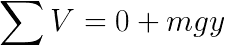

# 如何把物理变成优化问题

> 原文：<https://towardsdatascience.com/how-to-turn-physics-into-an-optimization-problem-11b3fbf83062?source=collection_archive---------6----------------------->

## [思想和理论](https://towardsdatascience.com/tagged/thoughts-and-theory)

## 如果你知道机器学习的基础，你就已经知道如何在没有意识到的情况下解决大量的物理问题。

这篇文章主要是关于一个叫做拉格朗日力学的工具，它可以让你解决物理问题，比如最优化问题。

> 在机器学习中，你最小化预测和标签之间的损失，以找到最佳预测器
> 
> 在拉格朗日力学中，你可以最小化一个系统的总作用力来寻找它的运动

# 代表权问题

拉格朗日力学比传统的牛顿力学有一个巨大的优势，因为它的表示不变，这意味着你可以自由选择最简单的表示来工作。

作为一个例子，我们将讨论最简单的一种机器人，一个二维钟摆——你的每个肢体都是一个钟摆，而你的身体是由一堆钟摆组成的。

Image by Mark Saroufim

在这种情况下，我们感兴趣的是描述弦末端的质心运动，所以在每一时刻 t，我们需要找到 3 个变量

1.  p →质量的位置
2.  v →质量速度
3.  质量的加速度

v 是 p 随时间的变化率

a 是 v 随时间的变化率

所以我们只需要预测一个变量 p。

p 是物体从开始时间 s 到结束时间的位置序列

但是我们如何准确地表示质心的位置呢？显而易见的首选是使用笛卡尔坐标 x，y。

Image by Mark Saroufim

但是现在我们面临一个两难的问题——我们应该把坐标放在球本身的中心，还是放在墙上，或者其他什么地方？有没有什么原则性的方法来决定哪个坐标更好？

我们可以用钟摆的另一种表示法:

Image by Mark Saroufim

我们可以完全描述钟摆所有可能的位置

*   θ →天花板和绳子之间的角度
*   l →绳子的长度

综合起来，你就得到极坐标。

极坐标和笛卡尔坐标是同构的(数学上是相同的)，但是极坐标在这种情况下更有优势。

在系统的演化过程中，l 从未如此有效地改变，我们可以只用一个变量θ，而不是两个变量 x 和 y，来描述整个系统的运动。

# 配置空间

θ表示更好的一个主要原因是，如果我们试图从 t 时刻开始预测球在 t + 1 时刻的位置，只有 3 个可能的解

在笛卡尔坐标中，解在 x，y 平面的某处，但是从时间 t 到 t + 1 有无限多可能的方向。

Image by Mark Saroufim

但是在极地环境中，解决方案只能有两个方向。

Image by Mark Saroufim

> 圆圈是摆问题所有可实现解决方案的集合中的**配置空间**，粒子通过该空间的特定路径描述了其实际运动，称为**配置路径**。

以这种方式研究系统的“形状”是被称为拓扑学的更大领域的一部分。拓扑学在研究物理系统的运动时非常有用，所以这里先介绍一下。

让我们来看一个更复杂的系统，一个双摆——想象第一个球是你的肘部，你可以看到它是如何代表更有趣的东西，也就是你的手臂。

Image by Mark Saroufim

你可以从两个角度来描述这个系统

如果固定第一个角度，那么第二个角度的配置空间又是一个圆，因此两个角度的新空间看起来像。

Image by Mark Saroufim

由于在较大的圆上面有无限多的小圆，我们最终得到的形状就是拓扑学中著名的圆环。

Image by Mark Saroufim

这个三维物体上的每一点都代表了双摆位置的一个可能的解决方案。我们本质上把这个系统的解描述为一个空间。

然后，一个示例摆的实际运动由该环面上的路径来描述。

Image by Mark Saroufim

如果你用牛顿力学工作，需要改变你的表示，看看什么是最好的，你需要重新推导你所有的公式，当你进入双摆领域时，涉及到一些棘手的三角学。

另一方面，拉格朗日 L 与表象无关，这意味着。

现在让我们定义什么是拉格朗日函数，看看它是如何工作的。

# 拉格朗日算符

现在我们知道，我们可以用路径来描述一个系统的运动，但是一个系统在它的构型空间中，实际上会走哪条路径呢？

> 大自然是懒惰的

所有物理过程都选择最小化**总动作**的路径。

一个著名的例子是折射，光在这里弯曲，因为它这样做更快。

Image by Mark Saroufim

系统 L 的拉格朗日量可以理解为它的“活泼性”。它的正式定义是

其中 T 是动能，V 是势能。

动能 T 总是不变的

势能取决于被描述的系统的类型，但是对我们来说，我们主要看重力势能

在哪里

m →物体的质量

g →重力常数

h →离地高度

更著名的能量守恒定律是势能和动能之和，它在剔除糟糕的物理理论方面非常可靠。

能量守恒定律告诉我们的是，没有新的能量可以创造，也没有能量可以损失。相反，我们有一个权衡，如果 T 增加，V 减少，如果 T 减少，V 增加。

Image by Mark Saroufim

系统产生的总作用记为 S，可以通过将构型空间中每个位置的所有拉格朗日量相加来计算。

# 欧拉-拉格朗日方程

那么现在我们可以推导出任何系统的拉格朗日 L，那么我们如何得到最小的 S 和产生它的路径呢？

> 从拉格朗日方程到解决方案的转换是通过欧拉-拉格朗日方程完成的，该方程将找到最小作用的**路径。**

欧拉-拉格朗日方程是

这个公式看起来比实际更复杂，通过几个例子可以更好地理解。

**落球**

我举的两个例子都深受[这个系列](https://www.youtube.com/watch?v=pVVMNsidI0g&t=156s)的启发

假设我们有一个质量为 m 的球落到地上

Image by Mark Saroufim

动能 T 只是 y 的函数，因为没有侧向运动

势能 V 是

所以拉格朗日量是

欧拉-拉格朗日方程只是 y 的函数，所以我们可以简化它

插入 L

这简化为

所以我们最终从零开始推导牛顿定律🤯

# 移动小车摆锤

最后一个例子是向你们展示拉格朗日力学是如何工作的，但这不是拉格朗日力学发光的例子。

> 当系统复杂，有许多变量，用牛顿力学很难建模时，拉格朗日力学就大放异彩。

所以我们要想象一下，我们有一辆质量为 M 的移动小车，有一个质量为 M 的摆，一想到我需要在这里建模的不同力的数量，我就头疼。

Image by Mark Saroufim

谢天谢地，拉格朗日使得求解这个系统容易得多，因为我们可以独立地对每个对象求和。

我们可以用 2 个变量来模拟球和车的位置，每个变量总共有 4 个变量，或者我们可以使用一个技巧来改变坐标系，使我们的生活更容易。

我们做了以下两个替换

有了这个变量的变化，我们就可以导出拉格朗日 l。

> 记住，自然不在乎我们如何表现它

动能很容易。小车只能在 x 方向移动，而摆锤可以在 x 和 y 方向移动。

势能

所以总拉格朗日量是

一旦有了 L，你就可以应用欧拉-拉格朗日方程，来看看这个系统是如何运行的。

对比一下牛顿力学的方法

1.  在每一个物体和每一个其他物体之间创建一个力图，以创建一组方程——可能是指数级的
2.  将这些方程代入常微分方程求解器，因为物理学中的大多数导数都没有封闭形式的解——祈祷吧

> 牛顿力学和拉格朗日力学的区别就是命令式和声明式编程的区别。像拉格朗日力学这样有效的声明性范例总是更受欢迎，因为 SQL 比 UNIX 脚本更受欢迎。

# 建模约束

拉格朗日力学的最后一个优点是，我想简单地讲一下，给系统添加约束是很容易的。

约束是这样的函数

f 可以是对最大速度的约束，也可以是对关节可以弯曲多远的约束，或者是对两个对象的碰撞应该有多柔和的约束。

您可以有任意多的约束

你所需要做的，不是把 L 代入欧拉-拉格朗日方程，而是代入，λ是权重，代表每个约束的重要性。这个技巧被称为“拉格朗日乘子”，广泛用于凸优化。

# 密码

尽管拉格朗日力学是一个强大的想法，让你大大简化实现物理引擎，据我所知，它还不是一个主流想法。如果你知道任何使用它的物理引擎，请让我知道，我会在以后的博客文章中描述它在真实的物理引擎中是如何工作的。

我第一次看到拉格朗日力学的完整实现是在那本神奇的书——[经典力学的结构与解释](https://www.amazon.com/Structure-Interpretation-Classical-Mechanics-Press/dp/0262028964/ref=sr_1_1?dchild=1&keywords=structure+and+interpretation+of+classical+mechanics&qid=1617667933&s=books&sr=1-1)。这里的实现是用 LISP 实现的，LISP 是一种很好的学习语言，但以我的经验来看，这是一种很难在大型项目中使用的语言。

因此，我建议看一看 https://github.com/MasonProtter/Symbolics.jl[项目，它提供了一个受 SICM 实现启发很大的 Julia 实现。](https://github.com/MasonProtter/Symbolics.jl)

自述文件特别谈到了谐振子，这只是一个附加在弹簧上的重物的花哨术语。

Image by Mark Saroufim

[https://github.com/MasonProtter/Symbolics.jl](https://github.com/MasonProtter/Symbolics.jl)

# 后续步骤

## **哈密顿力学**

拉格朗日力学让我们很容易计算出一个系统将要走的路径，但是它并没有给我们太多的洞察力，去了解构型空间中的点的速度。所以只有拉格朗日力学，我们不能真正描绘一个系统是如何完全进化的。

哈密顿力学是解决物理问题的第三种方法，它不是在组态空间中工作，而是在相空间中工作。

这本身是一个很大的话题，对描述动力系统非常有用，在[非线性动力学和混沌](https://www.amazon.com/Nonlinear-Dynamics-Student-Solutions-Manual/dp/0813349109/ref=sr_1_1?dchild=1&keywords=nonlinear+dynamics&qid=1617667808&sr=8-1)中被详细使用

我正计划再写一篇关于这个话题的博文，所以我会放一些图片，激发你想了解更多的想法。

phase space of simple pendulum — [CC BY-SA 4.0](https://creativecommons.org/licenses/by-sa/4.0) [Krishnavedala](https://commons.wikimedia.org/wiki/User:Krishnavedala) [https://en.wikipedia.org/wiki/Phase_portrait#/media/File:Pendulum_phase_portrait.svg](https://en.wikipedia.org/wiki/Phase_portrait#/media/File:Pendulum_phase_portrait.svg)

如果你喜欢这篇文章，我强烈推荐你看看这本由里基·罗瑟写的关于域名着色的[可观察笔记本](https://observablehq.com/@rreusser/domain-coloring-for-complex-functions?collection=@observablehq/webgl)

## **可微物理学**

一个新兴的研究领域是可微物理学。伟大论文的一个例子是这里的。

任何种类的物理预测都涉及到编写和求解许多微分方程，所以这个想法是你用一种可微分的语言编写一个物理引擎，比如 Pytorch 或 Flux.jl，然后在线性时间内计算导数。

这种方法的主要好处是，你只需要描述你的系统需要如何发展(前向传递)，并且你可以免费得到衍生产品(后向传递)。

就个人而言，我发现这是当今机器学习中最令人兴奋的研究领域。

我将在以后的博客中更多地谈论自动微分，所以这个想法很快就会变得清晰。

## 深入研究数学和物理

许多在物理学中有重大应用的数学技术正在走向机器学习和机器人技术。因此，我推荐一些参考资料来开始学习这种超越线性代数和基本微积分的新数学。我推荐这个列表中的很多书→ [我喜爱的技术书籍。](https://medium.com/@marksaroufim/technical-books-i-%EF%B8%8F-4af8f3ddd205)

特别是，在未来的博客文章中，我想更多地谈论配置空间的拓扑结构，并将向您展示如何应用这些想法来简单地描述三维机器人的运动。